# Image2.5 · Prompt-Bibliothek · Leadde.ai

[](README.md) [](README_zh.md) [](README_zh-TW.md) [](README_ja-JP.md) [](README_ko-KR.md) [](README_th-TH.md) [](README_vi-VN.md) [](README_hi-IN.md) [](README_es-ES.md) [-lightgrey)](README_es-419.md) [](README_de-DE.md) [](README_fr-FR.md) [](README_it-IT.md) [-lightgrey)](README_pt-BR.md) [](README_pt-PT.md) [](README_tr-TR.md)

**Best for:** Image 2.5 prompts for commercial visuals, layouts, keyframes, and image-to-video source assets.

For PDF, PPT, SOP, training, and multilingual video workflows:
[Awesome Document-to-Video](https://github.com/LeaddeOpenLab/awesome-document-to-video)

> **Hochwertige Prompts, täglich kuratiert**

Entdecke vollständige Prompts für KI-Bilder, Videos und 3D. Stöbere nach Stil, lies mehrsprachige Fassungen und finde die ursprünglichen Urheber und Quellen.

[Leadde.ai entdecken →](https://leadde.ai/?utm_source=github&utm_medium=readme&utm_campaign=prompt-library&utm_content=image2.5)

## Leadde.ai kennenlernen

Leadde.ai hilft Teams, Dokumente, Folien und Texte in KI-Geschäftsvideos für Schulungen, Onboarding und Marketing umzuwandeln.

Gib diesem Repository einen Stern, um unsere tägliche Prompt-Auswahl und neue kreative Ideen zu verfolgen.

**57** Prompts · Zuletzt hinzugefügt: **2026-09-10**

<a name="catalog"></a>

## Nach Kategorie durchsuchen

[Fotografie](#category-photography) · [Kinematisch / Filmstill](#category-cinematic-film-still) · [Anime / Manga](#category-anime-manga) · [Illustration](#category-illustration) · [Skizze / Strichzeichnung](#category-sketch-line-art) · [3D-Rendering](#category-3d-render) · [Pixel-Art](#category-pixel-art) · [Aquarell](#category-watercolor) · [Retro / Vintage](#category-retro-vintage) · [Minimalismus](#category-minimalism) · [Sonstige](#category-other)

<a name="all-prompts"></a>

<a name="category-photography"></a>

## Fotografie

<a name="prompt-2097532595814940683"></a>

### Prompt für ein realistisches Reisefoto einer jungen ostasiatischen Frau an der Küste des Mont-Saint-Michel.

Autor：[@saniaspeaks\_](https://x.com/saniaspeaks_) · [Originalbeitrag](https://x.com/saniaspeaks_/status/2097532595814940683)

Fotografie · Porträt / Selfie · Charakter · Veröffentlicht

**Zusammenfassung:** Prompt für ein realistisches Reisefoto einer jungen ostasiatischen Frau an der Küste des Mont-Saint-Michel.


**Prompt**

```text
Ein fotorealistisches, ungestelltes Reiseporträt einer jungen ostasiatischen Frau, die an einer ruhigen Sandküste neben großen moosbedeckten Felsen steht, während sich hinter ihr auf einer felsigen Insel eine prächtige historische Steinabtei und eine mittelalterliche, schlossähnliche Architektur dramatisch erhebt. Sie hat langes, glattes, dunkelbraunes Haar, das natürlich über eine Schulter fällt, weiche jugendliche Gesichtszüge und ein sanftes, warmes Lächeln, während sie direkt in die Kamera blickt.

Sie trägt einen langen, übergroßen schwarzen Mantel, die Hände lässig in den Taschen vergraben, über einem hellen Outfit. Ein großer, weicher, cremeweißer Schal ist wärmend um ihren Hals gewickelt und hängt nach vorne herab, mit einem kleinen schwarzen Designer-Emblem nahe dem Ende. Eine zarte Kettenumhängetasche ist teilweise sichtbar.

Die Komposition fängt sie im Vordergrund ein, während die gewaltige historische Abtei den Hintergrund dominiert, umgeben von alten Steinmauern, felsigen Klippen, sandigen Wattflächen und einer ruhigen Küstenatmosphäre. Einige wenige kleine, entfernte Fahrzeuge und Menschen verleihen der Szene einen realistischen Maßstab. Weiches, natürliches Abendlicht und ein klarer, blassblauer Himmel erzeugen eine friedliche europäische Reisestimmung.

Ultrarealistische Fotografie, authentisches Schnappschuss-Reisefoto, natürliche Hautstruktur, realistische Stoffdetails, weiche filmische Beleuchtung, subtile Smartphone-Kamera-Ästhetik, leicht verträumte Farbgebung, natürliche Proportionen, detaillierte Architektur, friedliche Küstenatmosphäre, vertikale Komposition, Seitenverhältnis 3:4.
```

[↑ Zurück zu Kategorien](#catalog)

---

<a name="prompt-2097411028510179759"></a>

### Prompt für ein hochauflösendes Landschaftsfoto einer Waldlichtung mit üppiger grüner Vegetation.

Autor：[@mark\_k](https://x.com/mark_k) · [Originalbeitrag](https://x.com/mark_k/status/2097411028510179759)

Fotografie · Landschaft / Natur · Veröffentlicht

**Zusammenfassung:** Prompt für ein hochauflösendes Landschaftsfoto einer Waldlichtung mit üppiger grüner Vegetation.


**Prompt**

```text
Foto einer Waldlichtung mit viel grünem Blattwerk, sehr detailliert
```

[↑ Zurück zu Kategorien](#catalog)

---

<a name="prompt-2097585546973614232"></a>

### Übersetzung läuft

Autor：[@CyberTotal2026](https://x.com/CyberTotal2026) · [Originalbeitrag](https://x.com/CyberTotal2026/status/2097585546973614232)

Fotografie · Charakter · Veröffentlicht

**Zusammenfassung:** Übersetzung läuft


**Prompt**

```text
Übersetzung läuft
```

[↑ Zurück zu Kategorien](#catalog)

---

<a name="prompt-2097534208541442338"></a>

### Prompt für einen iPhone-Frontkamera-Schnappschuss als Nahaufnahme einer jungen ostasiatischen Frau mit kühlem weißem Hautton, grau-weißem Plüschhintergrund und mehreren Posenoptionen zum Gesichtstützen und Träumen.

Autor：[@AIVideoHub\_](https://x.com/AIVideoHub_) · [Originalbeitrag](https://x.com/AIVideoHub_/status/2097534208541442338)

Profil / Avatar · Fotografie · Porträt / Selfie · Charakter · Zusammenfassung / Hintergrund · Veröffentlicht

**Zusammenfassung:** Prompt für einen iPhone-Frontkamera-Schnappschuss als Nahaufnahme einer jungen ostasiatischen Frau mit kühlem weißem Hautton, grau-weißem Plüschhintergrund und mehreren Posenoptionen zum Gesichtstützen und Träumen.


**Prompt**

```text
📱 Schnappschuss mit der iPhone-Frontkamera, 9:16; wunderschöne ostasiatische Frau im Alter von 18–22 Jahren, eindeutig volljährig, ca. 1,75 m groß, zarte Gesichtszüge, kühle und durchscheinende weiße Haut, schlanke und hochgewachsene Modelfigur, optisch natürlich wirkende E-Körbchen-Brust. Dunkles, geschmeidiges, voluminöses, langes Haar mit großen Wellen, helles, figurbetontes Spaghettiträger-Top mit tiefem V-Ausschnitt, das makellose Schultern und die Halslinie betont, runde Augenform, sanfte gerade Augenbrauen, tiefschwarze, klare Augen, zartrosa Rouge und hydratisierte Lippen mit Rosaton, träge und ruhig.

🩶 Sehr nahes Porträt-Nahaufnahme in gedämpft beleuchtetem Innenraum, verschwommener Hintergrund aus grau-weißem Plüschgewebe, kühles schwaches Licht, geringe Belichtung, entsättigter grau-weißer Filter, geringer Kontrast, leichte Schärfe, weichgezeichnete dunstige Körnung, ungezwungen und entspannt, sauber und edel, mit einer leicht melancholischen, kühlen Atmosphäre.

Zufälliger Posen-Pool:

🤍 Das Gesicht mit einer Hand stützend, die Handfläche liegt an Wange und Kiefer, ruhig in die Kamera blickend
🫧 Der Ellbogen stützt die Wange, der Kopf leicht geneigt und gedankenverloren
🌙 Das halbe Gesicht in die Handfläche vergraben, verträumter und leerer Blick
💭 Die Finger liegen sanft an Kinn und Gesichtswange, den Kopf leicht gesenkt und dann langsam die Augen hebend
🪞 Nah an der Kamera, die Hand stützt das Gesicht, langes Wellenhaar fällt über die Schultern
☁️ Die Wange an den Handrücken geschmiegt, der Blick aus dem Bild gerichtet
💤 Hand stützt die Wange, Schultern leicht zusammengezogen, wie müde überrascht geknipst
✨ Das Gesicht gestützt nahe an einem Plüschkissen, mit einem ganz leichten Lächeln auf den Lippen

🎲 Variiere Selfie-Distanz, Art des Gesichtstützens, Blick, Haarsträhnen, schwaches Licht, Unschärfe und Körnigkeit frei nach verschiedenen Posen, wobei der Fokus auf der sehr nahen Porträt-Nahaufnahme, dem kühlen grau-weißen Farbton und der authentischen iPhone-Frontkamera-Schnappschuss-Qualität liegt, um ein Dreamcore-Zuhause-Gefühl × melancholische Stimmung × elegantes, minimalistisches Porträt zu erzielen.

Erstelle ein zusammenfassendes Vorschaubild, das verschiedene Aktionen enthält, damit ich daraus auswählen kann.
```

[↑ Zurück zu Kategorien](#catalog)

---

<a name="prompt-2096909970398941572"></a>

### Fotorealistisches 9:16-Spiegel-Selfie einer sportlichen brasilianischen Frau in einem terrakotta-orangen Body in einem gehobenen Fitnessstudio.

Autor：[@MrDasOnX](https://x.com/MrDasOnX) · [Originalbeitrag](https://x.com/MrDasOnX/status/2096909970398941572)

Fotografie · Porträt / Selfie · Charakter · Veröffentlicht

**Zusammenfassung:** Fotorealistisches 9:16-Spiegel-Selfie einer sportlichen brasilianischen Frau in einem terrakotta-orangen Body in einem gehobenen Fitnessstudio.


**Prompt**

```text
Fotorealistisches Spiegel-Selfie in einem luxuriösen Indoor-Fitnessstudio, vertikal 9:16, eine junge erwachsene brasilianische Frau in einer entspannten Kontrapost-Pose, die ein Smartphone-Selfie aufnimmt. Die Kamera fängt die Szene durch einen großen, bodentiefen Spiegel mit einem Smartphone-Weitwinkelobjektiv ein, das 28–35 mm entspricht. Die Person steht etwa 1 Meter vom Spiegel entfernt. Der gesamte Körper von Kopf bis zu den Turnschuhen ist sichtbar. Sie befindet sich in der linken Bildmitte. Ein warmer Holzboden, schwarze Gummimatten sowie Reihen von Kettlebells und Seilzuggeräten sind rechts und im Hintergrund zu sehen. Die Person ist eine junge erwachsene brasilianische Frau mit einem kompakten, athletisch-kurvigen Körperbau: mäßig breite Schultern, definierte, aber nicht wuchtige Arme, voller Busen, schmale Taille, runde Hüften und natürlich kräftige Oberschenkel. Die Proportionen wirken geerdet und echt, statt modelhaft-dünn oder übertrieben. Warme, goldbraune Haut mit sichtbaren Poren und subtilen Nuancen. Weiches, natürliches Licht, keine künstliche Plastikhaut. Sie steht mit dem Gewicht auf dem rechten Bein, das linke Knie leicht gebeugt und nach außen gedreht, die Hüften zum Spiegel angewinkelt. Der Oberkörper dreht sich sanft, sodass ihre linke Schulter dem Glas näher ist. Die linke Hand ruht auf ihrer Hüfte; die rechte Hand hält ein dunkles Smartphone auf Wangenhöhe nah an ihr Gesicht. Der Kopf ist über die linke Schulter zum Smartphone gedreht, das Kinn leicht gesenkt, der Gesichtsausdruck ruhig und dezent selbstbewusst mit einem kleinen Lächeln bei geschlossenem Mund. Die Augen blicken auf den Bildschirm. Das Haar ist dunkelbraun mit warmen Karamell-Highlights, schulterlang, getragen in einem lockeren, tiefen Pferdeschwanz mit Strähnen, die das Gesicht umrahmen. Das Gesicht ist oval mit hohen Wangenknochen, vollen Lippen in einem natürlichen Nude-Rosa-Ton und dunkelbraunen, mandelförmigen Augen. Das Outfit ist ein hochgeschlossener, tief terrakotta-oranger Sport-Einteiler mit dünnen Trägern, moderater Bedeckung und einem hoch geschnittenen, aber dennoch dezenten Beinausschnitt. Mattes Stretchmaterial, keine Logos. Weiße Turnschuhe mit sauberen Sohlen. Die Umgebung ist ein modernes High-End-Fitnessstudio mit großen Spiegeln, freiliegendem Backstein an einer Wand, warmen Pendelleuchten gemischt mit kühlen Decken-LEDs und einigen anderen Personen, die im Hintergrund sanft unscharf trainieren. Realistisches Smartphone-HDR, natürliche Körnung, präzise Reflexionen und glaubwürdige Schatten.
```

[↑ Zurück zu Kategorien](#catalog)

---

<a name="prompt-2096901566985068734"></a>

### Prompt für Porträtschnappschüsse einer japanischen Flugbegleiterin in Uniform vor der Flugzeugtür mit integriertem Pool zufälliger Aktionen.

Autor：[@AIVideoHub\_](https://x.com/AIVideoHub_) · [Originalbeitrag](https://x.com/AIVideoHub_/status/2096901566985068734)

Fotografie · Porträt / Selfie · Charakter · Zusammenfassung / Hintergrund · Veröffentlicht

**Zusammenfassung:** Prompt für Porträtschnappschüsse einer japanischen Flugbegleiterin in Uniform vor der Flugzeugtür mit integriertem Pool zufälliger Aktionen.


**Prompt**

```text
📱 Beiläufiger japanischer Airline-Schnappschuss, 3:4; wunderschöne ostasiatische Frau im Alter von 18–22 Jahren, eindeutig erwachsen, ca. 1,75 m groß, feine und süße Gesichtszüge, kühles weißes Porzellanhautbild, hochgewachsene schlanke Modelfigur, visuelle Oberweite ca. natürliches E-Körbchen. Elegante Hochsteckfrisur, weiße Bluse mit tiefem V-Ausschnitt × dunkelblaue Flugbegleiterinnen-Weste × blau-weiß gestreifter kurzer Rock, gelbes Seidentuch, schwarze Pumps mit mittelhohem Absatz und schwarze Strumpfhose.

✈️ Bereich der Flugzeugtür, Klappsitz, Türgriff, Warnschilder und Gepäckablagen natürlich im Bildausschnitt. Kühles Grau mit niedriger Sättigung, schräge Handheld-Smartphone-Komposition, diffuses Deckenlicht, leichte Überbelichtung, Bildrauschen und Unschärfe an den Rändern, transparenter No-Makeup-Look im Pfirsichton, echte Amateurschnappschuss-Atmosphäre.

Zufälliger Posen-Pool:

💺 Auf dem Klappsitz sitzend, ein Bein angewinkelt, die Hand hebend, um die Hochsteckfrisur zu richten
✈️ Seitlich neben der Flugzeugtür sitzend, sich umdrehend mit einem süßen Lächeln
🧣 Den Kopf senkend, um das Seidentuch zu richten, plötzlich den Blick zur Kamera hebend
👜 Vornübergebeugt in der Handtasche kramend, im Moment der Bewegung erfasst
🙆🏻‍♀️ An die Rückenlehne gelehnt sich räkelnd, natürliche und entspannte Haltung
🪞 Aufstehend, um Weste und Rocksaum zu richten, sich seitlich zur Kamera drehend
💬 Sitzend das Kinn aufstützend und tagträumend, Beine natürlich versetzt
🚪 Sich am Rand der Flugzeugtür festhaltend aufstehend, sich umdrehend und lächelnd

🎲 Nach Auswahl der Pose freies Spiel mit Kameraposition, Kabinendetails, Mimik, Handheld-Neigung und Unschärfeeffekten, mit dem Ziel: Flugbegleiterinnen-Uniform × japanisches Lifestyle-Porträt × zufälliger Handy-Schnappschuss-Look.

Erstelle ein kombiniertes Vorschaubild mit verschiedenen Posen, aus denen ich wählen kann.
```

[↑ Zurück zu Kategorien](#catalog)

---

<a name="prompt-2097249218507461093"></a>

### Fotorealistisches Nahaufnahme-Innenporträt einer asiatischen Frau im Sonnenlicht

Autor：[@Aqsahere\_](https://x.com/Aqsahere_) · [Originalbeitrag](https://x.com/Aqsahere_/status/2097249218507461093)

Fotografie · Porträt / Selfie · Charakter · Veröffentlicht

**Zusammenfassung:** Fotorealistisches Nahaufnahme-Innenporträt einer asiatischen Frau im Sonnenlicht


**Prompt**

```text
Ein fotorealistisches Nahaufnahme-Innenporträt einer jungen Frau, die bequem in einem geflochtenen Rattanstuhl in der Nähe eines hellen Fensters sitzt. Sie hat langes, natürlich zerzaustes dunkelbraunes Haar mit warmen braunen Strähnchen, das nahe der Mitte gescheitelt ist, wobei lose Strähnen ihr Gesicht sanft umrahmen und teilweise bedecken. Sie blickt mit einem ruhigen, leicht verträumten Ausdruck und natürlichen, sanft getönten Lippen direkt in die Kamera. Eine Hand ist sanft vor ihr Gesicht gehoben, wobei ihre Fingerspitzen zart um ihre Lippen und ihre Wange ruhen, was eine intime, ungezwungene Pose erzeugt. Ihre Finger sind schlank und natürlich positioniert. Sie trägt ein einfaches, übergroßes, cremeweißes/hellbeiges Oberteil mit weicher Stofftextur. Starkes, warmes Sonnenlicht strömt von der oberen Seite durch das Fenster herein und erzeugt wunderschöne gestreifte Schatten und Glanzlichter auf ihrem Haar, ihrer Stirn, ihrer Wange und ihrer Kleidung. Die Beleuchtung ist natürlich, golden und stellenweise leicht überbelichtet, was dem Foto eine warme, gemütliche Atmosphäre verleiht. Hinter ihr befindet sich ein großer weißer Flecht-/Rattanstuhl mit geschwungenen, kreisförmigen Details. Im Hintergrund ist eine dunkelgrüne Wand oder Fensterscheibe mit eleganten weißen botanischen/Blattmustern sichtbar, zusammen mit einem einfachen dunklen vertikalen Rahmen. Die Umgebung wirkt wie ein gemütliches, modernes Zuhause oder Café. Komposition: vertikales Nahaufnahme-Porträt, Bildformat ca. 4:5, Kamera sehr nah am Motiv, Gesicht nimmt den mittleren bis rechten Teil des Bildausschnitts ein, leicht tiefer und intimer Kamerawinkel, Schultern und oberer Torso sichtbar, natürlicher Bildausschnitt. Fotostil: ultrarealistische Smartphone-Selfie-Fotografie, sanfte koreanische/asiatische Lifestyle-Ästhetik, natürliche Hauttextur, realistische Poren, einzelne Haarsträhnen, subtile Unvollkommenheiten, warmes Sonnenlicht, authentische Schatten, sanfter Kontrast, leichte Filmkörnung, geringe Schärfentiefe, ungezwungenes, ungestelltes Gefühl, hoher Detailgrad, 4K.
```

[↑ Zurück zu Kategorien](#catalog)

---

<a name="prompt-2096805553339342932"></a>

### Nächtliches Straßenporträt einer lächelnden jungen Frau in einer cremefarbenen strukturierten Jacke und einem Faltenrock.

Autor：[@Aqsahere\_](https://x.com/Aqsahere_) · [Originalbeitrag](https://x.com/Aqsahere_/status/2096805553339342932)

Fotografie · Porträt / Selfie · Charakter · Stadtbild / Straße · Veröffentlicht

**Zusammenfassung:** Nächtliches Straßenporträt einer lächelnden jungen Frau in einer cremefarbenen strukturierten Jacke und einem Faltenrock.


**Prompt**

```text
Ein fotorealistisches nächtliches Straßenporträt einer jungen Frau, die auf einer belebten Straße der Stadt steht und eine zarte, cremefarbene, strukturierte Jacke mit winzigen floralen Details, dekorativen Schleifen, dunklen Paspeln und perlenartigen Knöpfen trägt, kombiniert mit einem passenden Faltenrock. Sie hat langes, glattes, dunkelbraunes Haar und ein natürliches, sanftes Make-up, lächelt sanft in die Kamera und macht dabei eine verspielte Handgeste nahe ihrem Gesicht. Eine kleine schwarze Handtasche hängt an ihrem Arm. Warme Straßenlaternen, leuchtende Schaufenster, vorbeifahrende Autos und ein Radfahrer schaffen im Hintergrund eine lebendige urbane Nachtatmosphäre. Leichte Bewegungsunschärfe im Hintergrund, sanftes Umgebungslicht, spontane Smartphone-Fotografie, natürliche Hauttextur, geringe Schärfentiefe, gemütliche und elegante Ästhetik, realistische Details, vertikale Komposition, hohe Auflösung.
```

[↑ Zurück zu Kategorien](#catalog)

---

<a name="prompt-2096982628541100464"></a>

### Doppelporträt-Prompt, der ein aufeinander abgestimmtes Paar von Porträts eines Mannes und einer Frau im tiefblauen kosmischen Galaxie-Fantasy-Stil erstellt.

Autor：[@sha\_zdiii](https://x.com/sha_zdiii) · [Originalbeitrag](https://x.com/sha_zdiii/status/2096982628541100464)

Fotografie · Porträt / Selfie · Charakter · Veröffentlicht

**Zusammenfassung:** Doppelporträt-Prompt, der ein aufeinander abgestimmtes Paar von Porträts eines Mannes und einer Frau im tiefblauen kosmischen Galaxie-Fantasy-Stil erstellt.


**Prompt**

```text
Erstelle zwei separate, hochdetaillierte, filmische Fantasy-Porträts aus einem Prompt, die beide genau dasselbe tiefblaue kosmische Galaxienthema und denselben visuellen Stil verwenden.

BILD 1 — FRAU:
Erstelle eine wunderschöne, eindeutig erwachsene Frau mit langem, wallendem schwarzem Haar, leuchtender, glatter Haut, glamourösem himmlischem Augen-Make-up in Blau und Silber, glänzenden Lippen und funkelnden sternenartigen Details auf ihrem Gesicht. Füge eleganten Schmuck mit Mondsichel- und Sternenmotiven, dezente Kristallakzente und leuchtende kosmische Partikel um sie herum hinzu. Ihr Ausdruck ist selbstbewusst, geheimnisvoll und attraktiv. Umgib sie mit tiefblauen Nebelwolken, leuchtenden Sternen, großen Planeten, Monden, kosmischem Staub und elektrisch-blauem Licht. Die Energie der Galaxie sollte sich natürlich um ihr Gesicht, ihr Haar, ihre Schulter und ihre Kleidung einfügen.

BILD 2 — MANN:
Erstelle einen gutaussehenden, eindeutig erwachsenen Mann im exakt selben blauen kosmischen Thema. Er hat dichtes, leicht zerzaustes schwarzes Haar, einen gepflegten dunklen Bart, markante Gesichtszüge, intensiv leuchtende blaue Augen und einen selbstbewussten, geheimnisvollen Ausdruck. Füge dezente galaxieartige Leuchtmuster und winzige Sterne auf einer Seite seines Gesichts hinzu. Seine Hand befindet sich in einer stilvollen Modepose mit einem eleganten dunkelmetallischen Ring nahe seinem Kinn. Umgib ihn mit denselben tiefblauen Nebelwolken, leuchtenden Planeten, Monden, Sternen, kosmischem Staub und elektrisch-blauer Energie.

WICHTIG:
Generiere die Frau und den Mann als zwei separate Bilder, nicht zusammen in einem Einzelbild. Behalte dieselbe Beleuchtung, dieselbe blaue Galaxie-Farbpalette, denselben erstklassigen Fantasy-Modestil, denselben Detaillierungsgrad und eine passende visuelle Identität bei, sodass beide Bilder wie ein abgestimmtes Paar wirken.

Ultrarealistisch, erstklassige filmische Beleuchtung, hoher Kontrast, glänzender Luxus-Fantasy-Look, scharfer Fokus, detaillierte Haut und Haare, magisches blaues Leuchten, kein Text, kein Wasserzeichen.

Vertikale Porträtkomposition, 9:16 für beide Bilder.
```

[↑ Zurück zu Kategorien](#catalog)

---

<a name="prompt-2097269715966230876"></a>

### Fotografischer Porträt-Prompt einer Frau, die in der Abenddämmerung im seichten Wasser steht und in ein nasses, durchscheinendes weißes Tuch gehüllt ist.

Autor：[@CyberTotal2026](https://x.com/CyberTotal2026) · [Originalbeitrag](https://x.com/CyberTotal2026/status/2097269715966230876)

Fotografie · Porträt / Selfie · Charakter · Veröffentlicht

**Zusammenfassung:** Fotografischer Porträt-Prompt einer Frau, die in der Abenddämmerung im seichten Wasser steht und in ein nasses, durchscheinendes weißes Tuch gehüllt ist.


**Prompt**

```text
Thema:
Das durchscheinende Weiß des Abendmonds

Motiv:
Ein vertikales Ganzkörperfoto in den seichten felsigen Gewässern der Abenddämmerung, mit einer erwachsenen Frau, die in der Bildmitte steht und von der Brust bis zu den Füßen in einen nassen, durchscheinenden weißen Stoff gehüllt ist.

Person und Gesichtsausdruck:
Das Gesicht ist zur unteren rechten Bildseite geneigt, der Blick ist ebenfalls auf die Hand gesenkt, die den Stoff hält, mit einem ruhigen, fast profilartigen Ausdruck. Zarte ovale Gesichtsform, gesenkte, längliche Augen, ein feiner Nasenrücken und leicht geöffnete, blasse Lippen. Nasses, dunkelbraunes Haar, das über die Schultern reicht, mit Seitenscheitel und dünnen Strähnen, die an Wangen und Hals kleben.

Kleidung und Pose:
Ein dünner, weißer Stoff ist wie ein langes, trägerloses Kleid ab der Brust um den Körper gewickelt, wobei sich diagonale Drapierungen über Torso und Beine legen. Barfuß im seichten Wasser stehend, lässt sie ihren rechten Arm seitlich am Körper herabhängen, greift mit der linken Hand vor der Hüfte nach dem Stoff und stellt ein Bein leicht nach vorne.

Hintergrund und Licht:
Eine feine Mondsichel am blauvioletten Himmel oben links im Bild, ein orangefarbener Sonnenuntergang am rechten Horizont und in der unteren Hälfte die Meeresoberfläche und schwarze Felsen. Die tief stehende Abendsonne hinten rechts im Bild säumt den nassen Stoff und den Körper golden ein, während die Vorderseite von sanftem, blauem Dämmerungslicht erhellt wird.

Komposition und Kamera:
3:4-Hochformat, Ganzkörperaufnahme schräg von vorne mit einer Kamera, die knapp unterhalb der Hüfthöhe positioniert ist. Die Person steht groß in der Mitte, die obere Hälfte zeigt den Abendhimmel und die Mondsichel, der untere Rand fängt den nassen Saum und die Füße ein. Schärfefokus auf Person und durchscheinenden Stoff, ferner Hintergrund leicht unscharf.

Textur und Stil:
Fotorealistisches Echtfoto. Fängt den dünnen, nassen Stoff, der sich an die Haut schmiegt, winzige Wassertropfen, Reflexionen auf Felsen und Wasseroberfläche sowie die Farbverläufe der Abenddämmerung in Orange und Blauviolett detailgetreu ein.

Negativ:
Den weißen Stoff nicht undurchsichtig machen; Mondsichel und Sonnenuntergang nicht weglassen
```

[↑ Zurück zu Kategorien](#catalog)

---

<a name="prompt-2096809673378967588"></a>

### Fotorealistisches 9:16-Porträt einer stilvollen Frau, die vor einem schwarzen BMW posiert.

Autor：[@Lianaalane](https://x.com/Lianaalane) · [Originalbeitrag](https://x.com/Lianaalane/status/2096809673378967588)

Fotografie · Porträt / Selfie · Charakter · Veröffentlicht

**Zusammenfassung:** Fotorealistisches 9:16-Porträt einer stilvollen Frau, die vor einem schwarzen BMW posiert.


**Prompt**

```text
Erstelle ein fotorealistisches 9:16-Bild einer stilvollen jungen Frau, die selbstbewusst vor einem luxuriösen schwarzen BMW auf einer modernen Stadtstraße posiert. Sie hat langes, glattes, glänzendes schwarzes Haar mit einem sauberen, koreanisch inspirierten Mittelscheitel und sanften Strähnen, die ihr Gesicht umrahmen. Ihr Gesicht sollte natürlich und unverändert bleiben, mit frischem Make-up im koreanischen Stil, taufrischer Haut, sanftem Rouge, dezentem Eyeliner und glänzenden nuderosafarbenen Lippen. Sie trägt ein modisches rot-weiß kariertes Gingham-Oberteil mit Puffärmeln und eine weiße Hose mit hoher Taille für einen edlen, modernen Look. Ersetze die schwarzen Armreifen durch eine elegante Luxus-Armbanduhr für eine raffinierte Note. Eine Hand ruht natürlich auf der Motorhaube des Autos, während die andere in der Hosentasche steckt. Der Hintergrund zeigt verschwommene Stadtgebäude, Grünflächen, Verkehr, Straßenabsperrungen und sanftes Tageslicht. Behalte die gleiche selbstbewusste Pose, realistische Proportionen, filmische Tiefenschärfe, erstklassigen Fashion-Editorial-Stil, ultrarealistische Details und natürliche Fotoqualität bei.
```

[↑ Zurück zu Kategorien](#catalog)

---

<a name="prompt-2096601368114937969"></a>

### Ultrarealistisches Luxus-Fashion-Editorial mit einem blonden Model in einem elfenbeinfarbenen Umhang-Outfit, das mit einem reinweißen Pferd in einem warmen beigen Studio posiert.

Autor：[@sha\_zdiii](https://x.com/sha_zdiii) · [Originalbeitrag](https://x.com/sha_zdiii/status/2096601368114937969)

Fotografie · Modeartikel · Veröffentlicht

**Zusammenfassung:** Ultrarealistisches Luxus-Fashion-Editorial mit einem blonden Model in einem elfenbeinfarbenen Umhang-Outfit, das mit einem reinweißen Pferd in einem warmen beigen Studio posiert.


**Prompt**

```text
Ultrarealistisches Luxus-Fashion-Editorial in einem minimalistischen, warmen beigen Studio. Ein glamouröses erwachsenes blondes weibliches Model mit langem, sanft gewelltem Haar posiert elegant neben einem majestätischen, ausgewachsenen, reinweißen Pferd, das eine realistische schwarze Ledertrense mit dezenten goldenen Beschlägen trägt. Das Model trägt ein anspruchsvolles, elfenbeinweißes, ärmelloses, maßgeschneidertes Outfit mit weitem Bein, einem langen, fließenden Umhang, eleganten High Heels und raffiniertem Schmuck. Erstellen Sie einen erstklassigen High-Fashion-Kampagnen-Look mit eleganten Posen des Models, teils neben dem Pferd stehend und die Zügel haltend, teils anmutig auf geometrischen cremefarbenen Blöcken sitzend, während das Pferd ruhig hinter oder neben ihr steht. Nahtloser warmer beiger Hintergrund und Boden, weiche gerichtete Studiobeleuchtung, realistische Hautstruktur, realistische Pferdeanatomie und Fell, natürliche Schatten, fließender Stoff, raffinierte neutrale Farbpalette, fotorealistisch, luxuriöse redaktionelle Ästhetik, Ganzkörperkomposition, hoher Detailgrad, vertikal 2:3.
```

[↑ Zurück zu Kategorien](#catalog)

---

<a name="prompt-2096631729410986083"></a>

### 以古风夜色暖阁为背景的东方贵女梳妆近景肖像，包含妆容、发饰及服饰细节描述。

Autor：[@liyue\_ai](https://x.com/liyue_ai) · [Originalbeitrag](https://x.com/liyue_ai/status/2096631729410986083)

Fotografie · Porträt / Selfie · Charakter · Modeartikel · Zusammenfassung / Hintergrund · Veröffentlicht

Originalbeitrag：[@liyue\_ai](https://x.com/liyue_ai) · [Originalbeitrag](https://x.com/liyue_ai/status/2096269909076623535)

**Zusammenfassung:** 以古风夜色暖阁为背景的东方贵女梳妆近景肖像，包含妆容、发饰及服饰细节描述。


**Prompt**

```text
9:16 Hochformat, nächtliches Beauty-Porträt im traditionellen chinesischen Stil, klassisches Porträt einer orientalischen Adligen, Nahaufnahme (Büste), frontale Perspektive, die Person sitzt aufrecht vor einem Frisiertisch, der Körper der Kamera zugewandt, der Kopf natürlich gerade gerichtet, sanfter und gefühlvoller Blick, schaut ruhig in die Kamera, zurückhaltender, weicher und gefühlvoller Ausdruck, mit einer geheimnisvollen, zögerlichen nächtlichen Stimmung. Die Gesamtausstrahlung ist die einer hochgeborenen Adligen: sanft, prachtvoll, erlesen, zurückhaltend und anmutig, wie eine adelige Dame, die soeben in der Nacht mit dem Frisieren und Schminken fertig geworden ist.

Die Person ist eine junge orientalische Frau mit einem sichtbaren Alter von etwa 20–28 Jahren, eindeutig erwachsen, mit strahlenden Augen und vollen Lippen, einem weichen ovalen Gesicht, einer natürlich vollen Stirn, einer prallen und dreidimensionalen Gesichtsmitte und einer weichen, fließenden Kinnlinie. Die Augenbrauen sind fein gezeichnet und geschwungen, die Augen klar und ausdrucksstark, von natürlich länglicher Form, die äußeren Augenwinkel sanft und unaufdringlich nach oben geschwungen, der Blick weich und lieblich; ein zierlicher, ebenmäßiger Nasenrücken, eine feine, abgerundete Nasenspitze; weiche und volle Lippen mit einem natürlich definierten Lippenherz. Die Gesichtszüge sind insgesamt fein und symmetrisch, fesselnd in der Nahaufnahme, weder kindlich noch im typischen Influencer-Stil.

Das Make-up ist ein sanft-strahlendes Granatapfelblüten-Make-up im Laternenschein. Die Grundierung ist transparent und fein, der Hautton makellos hell und geschmeidig, mit erhaltener natürlicher, feiner Hauttextur. Das Augen-Make-up verwendet Schattierungen von Granatapfelrot, rötlichem Tee, warmem Braun und einem Hauch von warmgoldenem Feinglanz im sanften Verlauf, das äußere Oberlid und die äußeren Augenwinkel leicht vertieft, die untere Augenpartie (Aegyo Sal / Tränensäcke) mit zartem warmgoldenem Perlmuttschimmer veredelt, der Eyeliner fein und präzise, die Wimpern geschwungen und definiert. Gesichtsmitte und Wangenknochen tragen ein zartes, natürliches warmes Rosen-Rouge für einen warmen Teint. Nasenrücken, Nasenspitze, Gesichtsmitte und Amorbogen sind mit feinem, transparentem Highlighter akzentuiert, ohne das gesamte Gesicht ölig wirken zu lassen. Das Lippen-Make-up ist ein granatapfelroter Gloss-Look mit frischer, weicher Farbbrillanz und leichtem Glaseffekt. Das Gesamtbild des Make-ups wirkt sanft, anmutig-leuchtend, zurückhaltend und nobel, durchdrungen von der nächtlichen Kerzenschein-Stimmung einer Adligen.

Die Frisur ist eine locker hochgesteckte Hochfrisur aus schwarzem Haar, die Hochfrisur voll und rund geformt, der Oberkopf natürlich voluminös, das Haar tiefschwarz und seidig glatt. Im Haar stecken granatapfelrote Perlenhaarnadeln, zarte goldene Haarketten, goldene Blütenzweig-Elemente, kleine rote Edelsteine, Perlenverzierungen und mehrlagige Quastenanhänger; der Haarschmuck ist insgesamt erlesen und prachtvoll, reich an Details, ohne das Gesicht zu überladen. Als Ohrschmuck dienen Perlenquasten-Ohrringe, kombiniert mit roten Jadeperlen und feinen hellgoldenen Kettchen, die sanft an den Seiten herabhängen und den noblen Charakter unterstreichen.

Die Kleidung besteht aus einem granatapfelroten Oberteil mit durchgehender vorderer Knopfleiste (Duijin Ru), dessen Stoff reich mit Goldfaden-Blumenstickereien und feinen Webmustern verziert ist, kombiniert mit einem langen Rock in dunklem Gold mit Jacquard-Muster sowie einer elfenbeinweißen Schleierdrapierung (Pibo). Ausschnitt und Brustbereich weisen eine feine traditionelle Miederschicht auf, die Brust voll und natürlich, die Oberkörperproportionen harmonisch und üppig, wobei eine sanfte Dekolletélinie und der Großteil der Brustkontur gut erkennbar sind, jedoch stets vollständig von Kleidung bedeckt bleiben – insgesamt elegant und schicklich, keineswegs vulgär oder wie ein modernes Abendkleid. Die Farbpalette der Kleidung wird von Granatapfelrot, dunklem Gold, Elfenbeinweiß und warmem Gold dominiert – prächtig, leuchtend und dabei von klassischer Erlesenheit.

Die Szene ist ein warmer Pavillon mit Palastlaternen / Perlenvorhängen / Frisiertisch mit Bronzespiegel / flackerndem Kerzenschein. Die Person sitzt vor einem traditionellen Frisiertisch, links ist ein runder, geschnitzter Bronzespiegel zu sehen, im Vordergrund und an den Seiten hängen mehrlagige Perlenvorhänge herab, auf dem Frisiertisch stehen rot-goldene Schmuckschatullen, Perlenketten, kleine Schmuckstücke und ein Kerzenleuchter. Im Hintergrund sind warmgelbe Palastlaternen, ein dunkles Holzgemach und in der Ferne die unscharfen Lichter nächtlicher Pavillons zu erkennen; die gesamte Umgebung ist prachtvoll, der Hintergrund jedoch sanft weichgezeichnet, um nicht vom Hauptmotiv abzulenken.

Die Beleuchtung kombiniert warmweißes, ins Goldene übergehendes Kerzenlicht mit dem sanften Schein von Palastlaternen, wobei das Gesicht der Person durch ein separates, weiches Aufhelllicht akzentuiert wird, um sicherzustellen, dass Augen, Lidschatten, Rouge, Lippen-Make-up, Haarschmuck, Stickereien und Hautdetails kristallklar sichtbar sind. Die Gesamtstimmung ist warm und lichtdurchflutet mit nächtlicher Atmosphäre, jedoch weder zu dunkel, noch stichig gelb oder fahlgrau. Flache Schärfentiefe mit weichgezeichnetem Hintergrund, sodass Gesicht und Make-up der Person stets das unangefochtene visuelle Zentrum bilden.

85-mm-Porträtobjektiv, authentische fotografische Textur, vollendetes traditionelles Beauty-Porträt einer edlen Dame, präziser Fokus auf die Augen, klares Make-up, feiner Perlenschmuck und exquisite Goldfadenstickerei, ein Bild von prachtvoller, zart leuchtender und sanfter Schönheit mit klassischer nächtlicher Kinoästhetik.
```

[↑ Zurück zu Kategorien](#catalog)

---

<a name="prompt-2096555489073279173"></a>

### Kommerzielle Food-Fotografie-Szene in einer hellen modernen Küche mit gestapelten Gläsern rosa Beerensmoothie, einem Glas Bio-Erdnussbutter und gerösteten Erdnüssen auf einem Servierbrett aus Holz.

Autor：[@DuaFatimaAi](https://x.com/DuaFatimaAi) · [Originalbeitrag](https://x.com/DuaFatimaAi/status/2096555489073279173)

Fotografie · Essen / Trinken · Veröffentlicht

**Zusammenfassung:** Kommerzielle Food-Fotografie-Szene in einer hellen modernen Küche mit gestapelten Gläsern rosa Beerensmoothie, einem Glas Bio-Erdnussbutter und gerösteten Erdnüssen auf einem Servierbrett aus Holz.


**Prompt**

```text
Erstelle eine ultra-realistische High-End-Food-Fotografie-Szene in einer hellen, gemütlichen modernen Küche. Ein leuchtender, dickflüssiger rosa Beerensmoothie wird in einem Stapel aus drei kleinen transparenten Gläsern serviert, die vertikal auf der linken Seite eines sauberen weißen runden Tisches angeordnet sind. Der Smoothie hat eine reichhaltige cremige Textur mit dezenten Beerensprenkeln und glänzenden Glanzlichtern.

Platziere rechts ein durchsichtiges Glas Bio-Erdnussbutter mit grünem Deckel, gefüllt mit goldbrauner cremiger Erdnussbutter. Bewahre die Produktverpackung, die Platzierung des Etiketts, die Farben und die Proportionen präzise. Streue ganz natürlich ein paar ganze Erdnüsse neben das Glas.

Füge im Vordergrund eine kleine Keramikschale mit gemischten gerösteten Erdnüssen und einen beigen Keramikteller hinzu, auf dem ein Löffel mit einem großzügigen Löffel voll cremiger Erdnussbutter liegt. Platziere ein paar zarte grüne Kräuterzweige in der Nähe des Smoothies.

Hintergrund: saubere weiße U-Bahn-Fliesen-Küchenwand, weiches natürliches Sonnenlicht von der Seite, subtile Schatten, warme, gemütliche Atmosphäre. Platziere die Lebensmittel auf einem kleinen hölzernen Servierbrett mit einem Blatt bedrucktem Vintage-Papier darunter.

Füge im oberen linken Bereich eleganten weißen Text im Handschriftstil hinzu, auf dem „Smoothies“ steht, darunter kleinerer kursiver Text mit „Tingi Kalori.

Vertikale 9:16-Komposition, erstklassige kommerzielle Food-Fotografie, realistische Texturen, natürliches Tageslicht, geringe Schärfentiefe, sanftes Bokeh, gestochen scharfe Produktdetails, ausgewogene Komposition, warme Lifestyle-Ästhetik, fotorealistisch, hohe Auflösung, keine Menschen
```

[↑ Zurück zu Kategorien](#catalog)

---

<a name="prompt-2097159277937115208"></a>

### Doppel-Element-Porträt eines südasiatischen Mannes, geteilt mit hervorbrechenden Wasserspritzern auf der einen Seite und glühendem Feuer auf der anderen.

Autor：[@Aiwithamirr1](https://x.com/Aiwithamirr1) · [Originalbeitrag](https://x.com/Aiwithamirr1/status/2097159277937115208)

Fotografie · Porträt / Selfie · Charakter · Veröffentlicht

**Zusammenfassung:** Doppel-Element-Porträt eines südasiatischen Mannes, geteilt mit hervorbrechenden Wasserspritzern auf der einen Seite und glühendem Feuer auf der anderen.


**Prompt**

```text
Verwendung des hochgeladenen Gesichts als Referenz. 
Hochauflösendes Porträt eines 23-jährigen südasiatischen Mannes mit geschlossenen Augen und nach hinten geneigtem Kopf in einem gelassenen Ausdruck, unordentlichem schwarzem Haar, hochgeladenem Bart als Referenz. Dramatischer geteilter Elementareffekt: Die linke Seite seines Gesichts und Körpers birst vor dynamischen Wasserspritzern, flüssiger Gischt und schwebenden Wassertropfen; die rechte Seite ist von glühenden orangefarbenen Flammen, wilden Feuersträngen und brennenden Glutpartikeln umhüllt. Trägt ein dunkles, eng anliegendes T-Shirt. Surrealistische Doppel-Element-Ästhetik, filmische Beleuchtung, kontrastreiche monochrome und feurige Farbpalette, Studiobeleuchtung, hyperrealistische Details, gedeckter hellgrauer Hintergrund, aufgenommen mit einem 85-mm-Porträtobjektiv, 8k-Auflösung, fotorealistisches Meisterwerk.
```

[↑ Zurück zu Kategorien](#catalog)

---

<a name="category-cinematic-film-still"></a>

## Kinematisch / Filmstill

<a name="prompt-2097716825668702388"></a>

### Verwandle die beiden Referenzbilder in eine atemberaubende, ultrarealistische cineastische Reiselandschaft mit einer nahtlosen Sonnenuntergangs-Animationsschleife, die Elemente aus Istanbul und einem alpinen europäischen Seedorf vereint.

Autor：[@KrishnaBio1](https://x.com/KrishnaBio1) · [Originalbeitrag](https://x.com/KrishnaBio1/status/2097716825668702388)

Kinematisch / Filmstill · Landschaft / Natur · Veröffentlicht

**Zusammenfassung:** Verwandle die beiden Referenzbilder in eine atemberaubende, ultrarealistische cineastische Reiselandschaft mit einer nahtlosen Sonnenuntergangs-Animationsschleife, die Elemente aus Istanbul und einem alpinen europäischen Seedorf vereint.

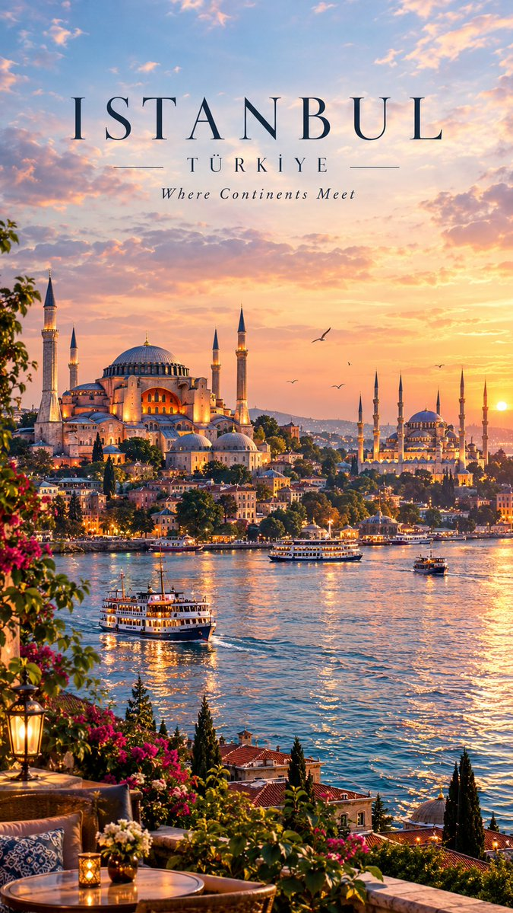

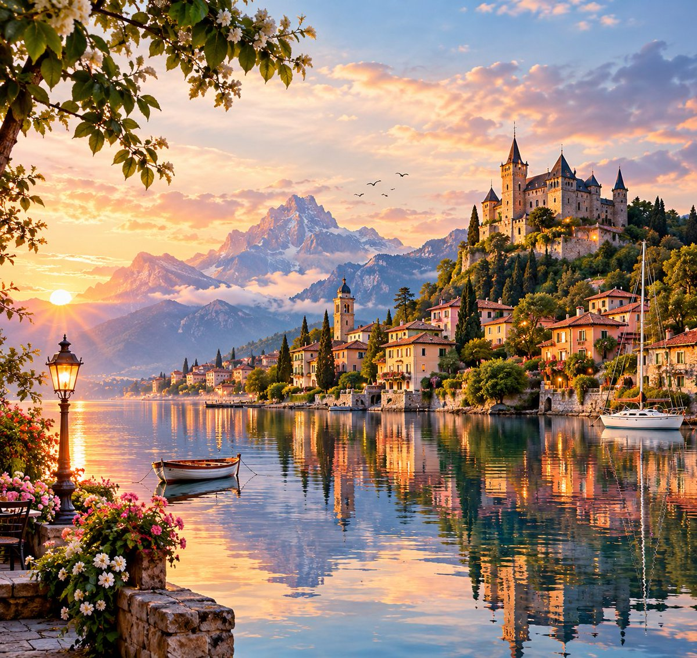

**Prompt**

```text
Verwandle die beiden Referenzbilder in eine atemberaubende, ultrarealistische cineastische Reiselandschaft mit einer nahtlosen Sonnenuntergangs-Animationsschleife.

SZENE
Kombiniere die Schlüsselelemente beider Bilder zu einem natürlich wirkenden Reiseziel. Binde die grandiose Moschee im osmanischen Stil mit mehreren Minaretten und Kuppeln, die Uferpromenade im Istanbul-Stil und die Boote aus dem ersten Bild ein, zusammen mit dem friedlichen Alpensee, dem farbenfrohen europäischen Dorf, den dramatischen schneebedeckten Bergen und der wunderschönen Steinburg auf dem Hügel aus dem zweiten Bild.

Erstelle eine weite, malerische Uferansicht mit historischer Architektur auf der einen Seite sowie der Burg und den Bergen auf der anderen Seite. Füge im Vordergrund farbenfrohe Blumen, grüne Bäume, mediterrane Pflanzen, eine Vintage-Laterne und eine elegante Terrasse mit einem kleinen Cafétisch hinzu.

SONNENUNTERGANG & BELEUCHTUNG
Wunderschöner Sonnenuntergang zur goldenen Stunde mit pastellblauen, rosa-, pfirsich- und orangefarbenen Wolken. Warmes Sonnenlicht erhellt die Moschee, die Burg, das Dorf, die Berge und die Boote. Der See spiegelt den Sonnenuntergang, die Gebäude und die Berge mit realistischen sanften Wellen und goldenen Reflexionen wider.

ANIMATION
Erstelle 16 aufeinanderfolgende Einzelbilder einer weichen, nahtlosen Schleife. Animiere nur subtile Umweltbewegungen: langsam ziehende Wolken, sanfte Wasserwellen, sich leicht bewegende Boote, in der Ferne fliegende Vögel, sich sanft in der Brise wiegende Blumen und Baumblätter sowie dezentes Flackern von Kerzen/Laternen.

Halte die Kamera vollkommen fixiert. Halte die Moschee, die Burg, die Berge, die Häuser und alle wichtigen Objekte über jedes Bild hinweg vollkommen konsistent. Bild 16 muss nahtlos wieder in Bild 1 übergehen.

STIL
Ultrarealistische cineastische Reisefotografie, luxuriöse Tourismuswerbung, atemberaubende Goldene-Stunde-Atmosphäre, realistische Architektur, detaillierte Berge, natürliche Vegetation, wunderschöne Wasserreflexionen, atmosphärische Tiefe, hoher Dynamikumfang, satte, aber natürliche Farben, professionelle Fotografie, fotorealistische 8K-Qualität.

KAMERA
Weite cineastische Landschaftsansicht, 24-mm-Objektiv, stabile, fest arretierte Kamera, natürliche Perspektive, realistische Schärfentiefe, konsistenter Bildausschnitt und Beleuchtung über alle Bilder hinweg.

ANIMATIONSEINSTELLUNGEN
16 Bilder, etwa 2,2 Sekunden lange vollständige Schleife, flüssige, kontinuierliche GIF-Animation, keine Kamerabewegung, kein Flackern.

NEGATIVER PROMPT
Cartoon, Anime, Gemälde, CGI, 3D-Render, geringe Qualität, verzerrte Gebäude, verzogene Moschee, krumme Minarette, missgebildete Burg, verzerrte Berge, duplizierte Boote, schwebende Objekte, unrealistische Reflexionen, unechtes Wasser, übermäßiger Nebel, übersättigte Farben, extremes HDR, unscharfes Bild, Bewegungsunschärfe, Kamerawackeln, Zoom, Flackern, morphende Gebäude, wechselnde Architektur, verschwindende Objekte, duplizierte Vögel, unnatürliche Wolken, Bildnähte, sichtbare Collage, Text, Logo, Wasserzeichen, Rahmen, schwarze Balken, Artefakte.
```

[↑ Zurück zu Kategorien](#catalog)

---

<a name="prompt-2097676144141312095"></a>

### Dunkler filmischer Porträt-Prompt im Stil eines Psychohorror-Videospiels, der eine Frau mit geheimnisvollen Runen im Gesicht, Staub und Kratzern darstellt.

Autor：[@her19845](https://x.com/her19845) · [Originalbeitrag](https://x.com/her19845/status/2097676144141312095)

Kinematisch / Filmstill · Porträt / Selfie · Charakter · Veröffentlicht

**Zusammenfassung:** Dunkler filmischer Porträt-Prompt im Stil eines Psychohorror-Videospiels, der eine Frau mit geheimnisvollen Runen im Gesicht, Staub und Kratzern darstellt.

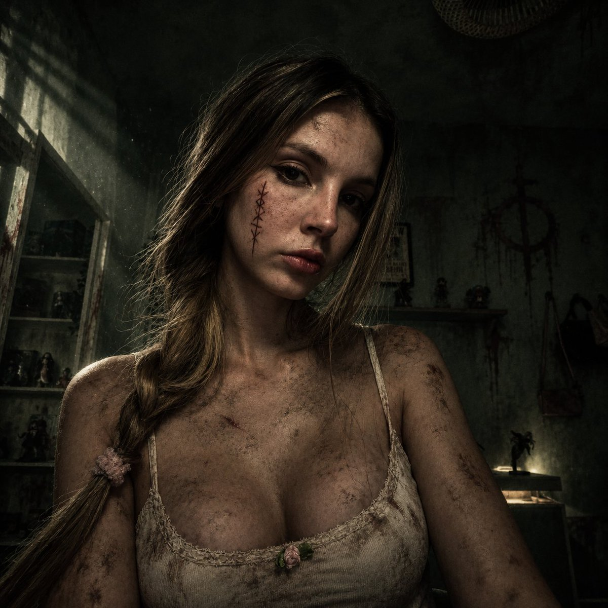

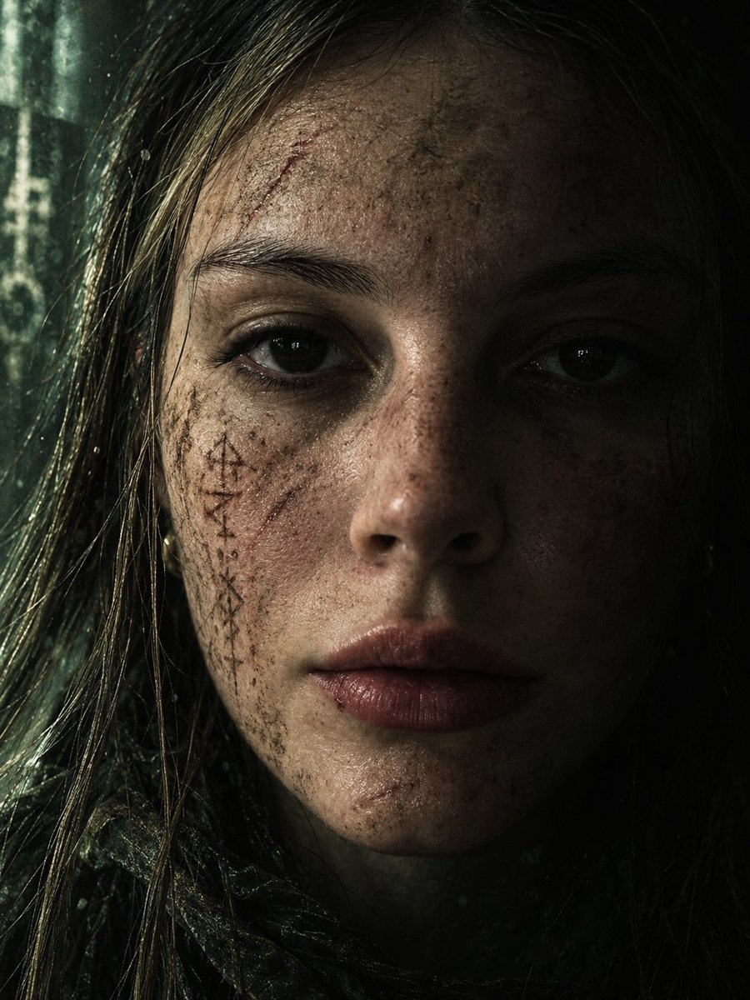

**Prompt**

```text
**Stil:** Dunkle und dramatische Filmfotografie mit der Ästhetik eines hochklassigen Psychohorror-Videospiels.

**Motiv:** Das in der Bildererweiterung enthaltene Model. Ihre Haut zeigt detaillierte Texturen von Schmutz, Staub und feinen Kratzern. Auf ihrer Wange sind feine eingeritzte Spuren oder geheimnisvolle vertikale Runen sichtbar.

**Beleuchtung und Farbe:** Eine monochromatische und düstere Farbpalette, dominiert von dunklem Smaragdgrün, Olivgrün und tiefen Schatten. Seitenlicht formt das Gesicht und lässt die Hälfte der Szene in Dunkelheit gehüllt.

**Texturen:** Ausgeprägtes analoges Filmkorn, detaillierte Poren, eine staubige, unheimliche und klaustrophobische Atmosphäre.
```

[↑ Zurück zu Kategorien](#catalog)

---

<a name="prompt-2097222942438649948"></a>

### Prompt-Vorlage für eine handgehaltene Reisekarte, die eine Miniatur-3D-Landschaft eines Reiseziels präsentiert.

Autor：[@Goodmanprotocol](https://x.com/Goodmanprotocol) · [Originalbeitrag](https://x.com/Goodmanprotocol/status/2097222942438649948)

Kinematisch / Filmstill · 3D-Rendering · Landschaft / Natur · Veröffentlicht

**Zusammenfassung:** Prompt-Vorlage für eine handgehaltene Reisekarte, die eine Miniatur-3D-Landschaft eines Reiseziels präsentiert.


**Prompt**

```text
Erstelle ein ultra-realistisches, filmisches, vertikales 4:5-Reisefoto einer eleganten, minimalistischen Reisekarte, die natürlich in einer Hand vor einem weiten Himmel gehalten wird.

Verwende [LÄNDERNAME] als kreativen Mittelpunkt. Verwandle die Karte in ein lebendiges Fenster zum Reiseziel, aus dessen Oberfläche nahtlos eine atemberaubende Miniatur-Luftbildwelt hervorgeht. Zeige das berühmteste Wahrzeichen des Landes, umgeben von authentischen Landschaften, Architektur, Atmosphäre und subtilen Details, die für das Reiseziel einzigartig sind.

Gestalte den Übergang zwischen der physischen Karte und der Miniaturwelt nahtlos, magisch und physikalisch glaubwürdig, so als ob das gesamte Reiseziel innerhalb der Karte existierte.

Integriere [LÄNDERNAME] in eleganter, fetter Großbuchstaben-Typografie als Teil des Kartendesigns.

Nutze filmisches natürliches Licht, realistische Texturen, atmosphärische Tiefe, subtile Reflexionen, dramatische Perspektive, sanften Objektivabfall und die Ästhetik erstklassiger redaktioneller Reisefotografie.

Ultra-fotorealistisch, 8K-Detail, filmisches Color Grading, realistische Haut und Materialien, physikalisch akkurate Beleuchtung, luxuriös, emotional, erstrebenswert, universell schön. Kein Cartoon, keine Illustration, kein künstlicher CGI-Look.
```

[↑ Zurück zu Kategorien](#catalog)

---

<a name="prompt-2096808538534514913"></a>

### Filmisches Porträt eines Mannes im beigen Pullover mit warmem goldenem Streiflicht vor einem stimmungsvollen Hintergrund.

Autor：[@iamsofiaijaz](https://x.com/iamsofiaijaz) · [Originalbeitrag](https://x.com/iamsofiaijaz/status/2096808538534514913)

Kinematisch / Filmstill · Porträt / Selfie · Charakter · Zusammenfassung / Hintergrund · Veröffentlicht

**Zusammenfassung:** Filmisches Porträt eines Mannes im beigen Pullover mit warmem goldenem Streiflicht vor einem stimmungsvollen Hintergrund.


**Prompt**

```text
Fotorealistisches, filmisches Porträt eines gutaussehenden erwachsenen Mannes mit zerzaustem, mittellangem braunem Haar und einem gepflegten Bart, der einen weichen, beigen Strickpullover mit Rundhalsausschnitt trägt. Er blickt mit einem ruhigen, selbstbewussten und leicht nachdenklichen Ausdruck in die Kamera. Warmes, goldenes Streiflicht erzeugt einen leuchtenden Heiligenschein um sein Haar und seine Schultern, während ein starkes, weiches Hauptlicht sein Gesicht erhellt. Dunkler, stimmungsvoller Hintergrund mit dezentem bernsteinfarbenem Dunst und atmosphärischem Rauch, dramatische Beleuchtung mit hohem Kontrast, natürliche Hauttextur, scharfe Augen, realistische Gesichtsdetails, geringe Schärfentiefe, professionelle Studiofotografie, 85-mm-Porträtobjektiv, f/1.8, cremiges Bokeh, warme filmische Farbkorrektur, luxuriöse redaktionelle Ästhetik, extrem detailliert, fotorealistisch, 8K.
```

[↑ Zurück zu Kategorien](#catalog)

---

<a name="category-anime-manga"></a>

## Anime / Manga

<a name="prompt-2097834253748949105"></a>

### Ein Prompt, um Chiikawa und Usagi im dramatischen Gekiga-Stil von JoJo zu zeichnen.

Autor：[@namatorihamu](https://x.com/namatorihamu) · [Originalbeitrag](https://x.com/namatorihamu/status/2097834253748949105)

Anime / Manga · Illustration · Veröffentlicht

**Zusammenfassung:** Ein Prompt, um Chiikawa und Usagi im dramatischen Gekiga-Stil von JoJo zu zeichnen.

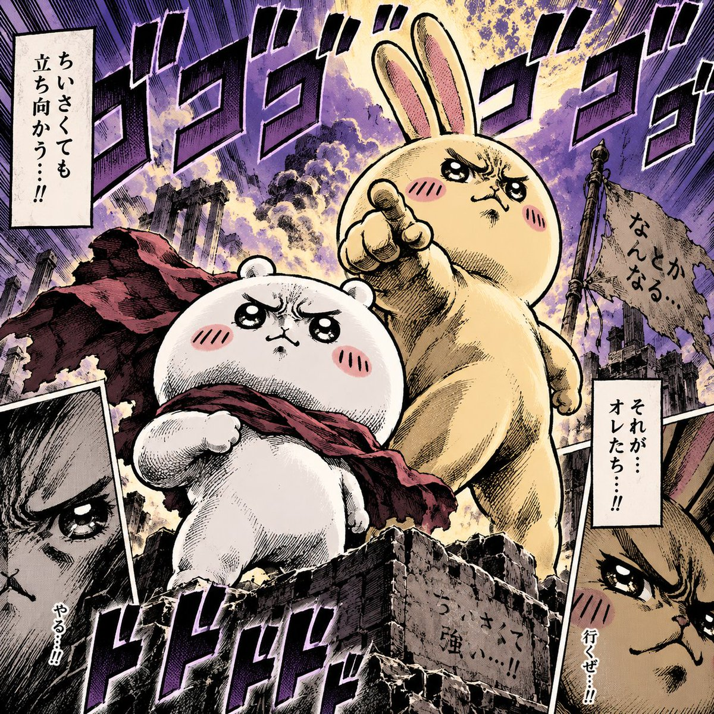

**Prompt**

```text
Zeige Chiikawa und Usagi im JoJo-Stil
```

[↑ Zurück zu Kategorien](#catalog)

---

<a name="category-illustration"></a>

## Illustration

<a name="prompt-2097713691433070629"></a>

### ChatGPT auffordern, ein Selbstporträt mit einem Typenschild zu zeichnen, das seine Versionsnummer angibt.

Autor：[@Tz\_2022](https://x.com/Tz_2022) · [Originalbeitrag](https://x.com/Tz_2022/status/2097713691433070629)

Illustration · Porträt / Selfie · Veröffentlicht

**Zusammenfassung:** ChatGPT auffordern, ein Selbstporträt mit einem Typenschild zu zeichnen, das seine Versionsnummer angibt.


**Prompt**

```text
Zeichne ein Selbstporträt von dir selbst, mit einem Namensschild, und auf dem Namensschild soll deine Versionsnummer stehen
```

[↑ Zurück zu Kategorien](#catalog)

---

<a name="prompt-2097521286436065680"></a>

### Erstellung einer reich bebilderten Prüfungsarbeit im Layout des englischen CET-4, deren Prüfungsfragen mit Inhalten von Prüfungen für den öffentlichen Dienst kombiniert sind.

Autor：[@Tz\_2022](https://x.com/Tz_2022) · [Originalbeitrag](https://x.com/Tz_2022/status/2097521286436065680)

Illustration · Text / Typografie · Veröffentlicht

Originalbeitrag：[@Lonely\_\_MH](https://x.com/Lonely__MH) · [Originalbeitrag](https://x.com/Lonely__MH/status/2097494755752202574)

**Zusammenfassung:** Erstellung einer reich bebilderten Prüfungsarbeit im Layout des englischen CET-4, deren Prüfungsfragen mit Inhalten von Prüfungen für den öffentlichen Dienst kombiniert sind.


**Prompt**

```text
Erstelle eine Prüfungsarbeit im Layout des englischen CET-4, bei der jedoch alle Fragen aus Prüfungen für den öffentlichen Dienst stammen, reich bebildert und mit Text versehen
```

[↑ Zurück zu Kategorien](#catalog)

---

<a name="category-sketch-line-art"></a>

## Skizze / Strichzeichnung

<a name="prompt-2097284686448046135"></a>

### Prompt zum Generieren minimalistischer, handgezeichneter Reisetagebuch-Architekturskizzen auf elfenbeinfarbenem Papier.

Autor：[@Naiknelofar788](https://x.com/Naiknelofar788) · [Originalbeitrag](https://x.com/Naiknelofar788/status/2097284686448046135)

Skizze / Strichzeichnung · Architektur / Interieur · Veröffentlicht

**Zusammenfassung:** Prompt zum Generieren minimalistischer, handgezeichneter Reisetagebuch-Architekturskizzen auf elfenbeinfarbenem Papier.


**Prompt**

```text
Erstelle ein minimalistisches, handgezeichnetes architektonisches Kunstwerk von [STRUCTURE] auf warmem elfenbeinfarbenem Papier. Stelle die Struktur als einfache, elegante Tuschskizze mit sauberen, unvollkommenen Linien, subtilen Bleistiftschattierungen, winzigen handschriftlichen Anmerkungen und einigen zarten architektonischen Details dar. Halte die Komposition luftig mit viel Weißraum, gedämpften Erdtönen, weicher Papiertextur und dem authentischen, handgemachten Gefühl eines Reisetagebuchs. Kein Fotorealismus, keine schweren Details, keine Unordnung – einfach, künstlerisch und raffiniert.
```

[↑ Zurück zu Kategorien](#catalog)

---

<a name="prompt-2096902953110299096"></a>

### Prompt verwandelt ein Referenzfoto in ein vertikales 50/50-Poster, das das Originalfoto oben mit einer Buntstift-Aquarell-Skizze unten kombiniert.

Autor：[@MissDelulu9](https://x.com/MissDelulu9) · [Originalbeitrag](https://x.com/MissDelulu9/status/2096902953110299096)

Plakat / Flyer · Skizze / Strichzeichnung · Aquarell · Veröffentlicht

**Zusammenfassung:** Prompt verwandelt ein Referenzfoto in ein vertikales 50/50-Poster, das das Originalfoto oben mit einer Buntstift-Aquarell-Skizze unten kombiniert.


**Prompt**

```text
Erstelle ein erstklassiges vertikales Reisetagebuch-Poster in einer exakten 50/50-Teilung.

Obere 50 %: Behalte das originale Referenzfoto völlig echt und unverändert bei – dieselbe Komposition, Architektur, Personen, Farben, Beleuchtung, Perspektive und Details.

Untere 50 %: Verwandle dasselbe Foto in eine zarte, handgezeichnete Buntstift- und Aquarellskizze auf warmem cremefarbenem Papier, mit sichtbaren Bleistiftstrichen, sanften Lavierungen, feiner Papierkörnung, unvollkommenen Konturen und sanften Schraffuren. Halte jedes Motiv erkennbar.

Füge eleganten handschriftlichen Text hinzu: “A Beautiful Day” oben und “Memories to Keep” unten. Minimalistische, nostalgische, anspruchsvolle Reisemagazin-Ästhetik. Keine zusätzlichen Objekte, kein Fotorealismus in der unteren Hälfte, exaktes 50/50-Layout.
```

[↑ Zurück zu Kategorien](#catalog)

---

<a name="prompt-2097176979497791899"></a>

### Prompt transformiert Fotos in ein redaktionelles Kunstplakat mit Mixed-Media-Skizzenstil und minimalistischem Layout.

Autor：[@saniaspeaks\_](https://x.com/saniaspeaks_) · [Originalbeitrag](https://x.com/saniaspeaks_/status/2097176979497791899)

Plakat / Flyer · Skizze / Strichzeichnung · Veröffentlicht

**Zusammenfassung:** Prompt transformiert Fotos in ein redaktionelles Kunstplakat mit Mixed-Media-Skizzenstil und minimalistischem Layout.


**Prompt**

```text
Erstelle für jedes hochgeladene Foto ein erstklassiges redaktionelles Kunstplakat, behandle jedes Bild als seine eigene unabhängige Komposition und führe niemals mehrere Fotos zusammen. Verwende ein striktes vertikales 3:4-Format, bei dem die Leinwand in zwei vollkommen gleiche horizontale Hälften geteilt ist: Die obere Hälfte soll eine originalgetreue, fotorealistische Darstellung des Originalbildes bleiben, wobei die exakte Identität des Motivs, Gesichtszüge, Proportionen, Pose, Kleidung, Objekte, Komposition, Beleuchtung, Schatten, Stimmung und natürliche Farben erhalten bleiben, nur aufgewertet durch ein anspruchsvolles redaktionelles Color Grading und nahtlose Umgebungserweiterung, wo nötig; die untere Hälfte soll die visuelle Geschichte in eine völlig andere künstlerische Interpretation verwandeln – ein winziges, sorgfältig komponiertes, handgefertigtes Mixed-Media-Kunstwerk, zentriert in einem weitläufigen warmen elfenbeinfarbenen Negativraum, das nicht mehr als 10–20 % des unteren Abschnitts einnimmt, unter Verwendung von ausdrucksstarken Tuschzeichnungen, geschichteten gouacheartigen Farbflächen, subtilen Collage-Texturen, gerissenen Papierkanten, unvollkommenen Pinselstrichen, sichtbaren Fasern, sanften Pigmentvariationen und bezaubernden menschlichen Unvollkommenheiten, während die am besten wiedererkennbare Silhouette, Geste, Objekte und die emotionale Erzählung des Originalfotos beibehalten werden. Extrahiere bis zu vier dominante harmonische Farben aus jedem Foto und reinterpretiere sie in einer gedeckten, anspruchsvollen Farbpalette. Füge nur gelegentlich dezente redaktionelle Typografie hinzu, wenn sie die Komposition wirklich bereichert, wie etwa einen poetischen Titel, Ort, Datum oder ein einzelnes Wort. Das Gesamtergebnis sollte wie das Titelblatt einer sammelwürdigen Publikation zeitgenössischer Kunst wirken – minimalistisch, poetisch, haptisch, elegant, emotional ruhig, visuell unverwechselbar und unverkennbar mit dem Originalfoto verbunden.
```

[↑ Zurück zu Kategorien](#catalog)

---

<a name="category-3d-render"></a>

## 3D-Rendering

<a name="prompt-2097646788258021837"></a>

### Prompt für ein handgefertigtes 3D-Miniatur-Reisediorama mit ikonischen Wahrzeichen von Städten auf strukturiertem Papier.

Autor：[@Naiknelofar788](https://x.com/Naiknelofar788) · [Originalbeitrag](https://x.com/Naiknelofar788/status/2097646788258021837)

3D-Rendering · Veröffentlicht

**Zusammenfassung:** Prompt für ein handgefertigtes 3D-Miniatur-Reisediorama mit ikonischen Wahrzeichen von Städten auf strukturiertem Papier.


**Prompt**

```text
Erstelle eine bezaubernde, handgefertigte Miniatur-Reiseszene mit [IKONISCHES BAUWERK] als zentralem Blickfang.
Zeige das Wahrzeichen als wunderschön modelliertes, winziges 3D-Modell mit weichen, abgerundeten Details, handgemachten Texturen, zarten Unvollkommenheiten und einer verspielten Bilderbuch-Atmosphäre. Umgib es mit wenigen dezenten Elementen, die seinen Standort repräsentieren – wie winzigen Bäumen, Blumen, Straßen, Booten, Bergen, Wolken oder lokalen Gegenständen –, ohne die Szene zu überladen.

Platziere alles auf einem sauberen, warmweißen Papierhintergrund mit Textur und reichlich elegantem Negativraum. Füge eine kleine, geschmackvolle Reiseplakette aus Holz oder Papier hinzu, die Folgendes enthält:

[NAME DES BAUWERKS]
[STADT, LAND]
Berühmt für: [KURZE BESONDERE TATSACHE]

Verwende sanftes natürliches Licht, weiche Schatten, pastellige und dennoch realistische Farben, Miniatur-Diorama-Tiefe, handgefertigte Ton-/Papiertexturen und eine hochwertige, niedliche Reisetagebuch-Ästhetik. Zentrierte Komposition, detailreiches Wahrzeichen, bezaubernd und dennoch raffiniert, klares Design im Stil einer sammelbaren Reisekarte, keine fotorealistischen Menschen, keine Unordnung.
```

[↑ Zurück zu Kategorien](#catalog)

---

<a name="prompt-2097580884098764800"></a>

### Erstelle ein hochwertiges, niedliches 3D-Miniatur-Diorama eines Wahrzeichens mit Souvenirplakettentext.

Autor：[@Naiknelofar788](https://x.com/Naiknelofar788) · [Originalbeitrag](https://x.com/Naiknelofar788/status/2097580884098764800)

3D-Rendering · Architektur / Interieur · Veröffentlicht

**Zusammenfassung:** Erstelle ein hochwertiges, niedliches 3D-Miniatur-Diorama eines Wahrzeichens mit Souvenirplakettentext.


**Prompt**

```text
Erstelle ein hochwertiges, niedliches 3D-Miniatur-Diorama von [NAME DES BAUWERKS], [STADT, LAND]. Gestalte das Wahrzeichen wiedererkennbar, elegant und charmant, mit einer klaren Komposition, sanften Pastelltönen, dezenten handgefertigten Details, sanftem natürlichem Licht und einer raffinierten Reise-Souvenir-Ästhetik.\n\nFüge dezenten, geschmackvollen Text ein:\n[NAME DES BAUWERKS]\n[STADT, LAND]\nBekannt für: [KURZE BESCHREIBUNG]
```

[↑ Zurück zu Kategorien](#catalog)

---

<a name="prompt-2097587863139537262"></a>

### Fiktiver First-Person-Game-Screenshot eines 3D-Romance-RPGs am Strand, inklusive Morrigan Aensland und vollständiger HUD-Interaktions-UI des Spiels.

Autor：[@underwoodxie96](https://x.com/underwoodxie96) · [Originalbeitrag](https://x.com/underwoodxie96/status/2097587863139537262)

App- / Webdesign · 3D-Rendering · Charakter · Veröffentlicht

Originalbeitrag：[@underwoodxie96](https://x.com/underwoodxie96) · [Originalbeitrag](https://x.com/underwoodxie96/status/2097554154554314891)

**Zusammenfassung:** Fiktiver First-Person-Game-Screenshot eines 3D-Romance-RPGs am Strand, inklusive Morrigan Aensland und vollständiger HUD-Interaktions-UI des Spiels.


**Prompt**

```text
Bitte erstelle einen realistischen Screenshot aus einem fiktiven 3D-Open-World-Romantik-RPG der nächsten Generation, dargestellt aus der First-Person-Perspektive des männlichen Protagonisten. Am Strand lädt Morrigan Aensland aus Darkstalkers den Protagonisten ein, ihr beim Eincremen mit Sonnencreme zu helfen. Der visuelle Gesamtstil muss hochwertige, im Cartoon-Stil gerenderte 3D-Charaktere kombiniert mit Grafiken auf Unreal-Engine-5-Niveau aufweisen und visuelle AAA-Qualitätstreue erreichen. Er sollte ein ultra-detailliertes Charakter-Modeling, realistisches Skin-Shading, filmische Beleuchtung, PBR-Materialien, hochpräzise Kleidungstexturen und fein gerenderte Klassenzimmer-Umgebungen enthalten. Das finale Bild muss wie ein tatsächlicher spielbarer Game-Screenshot aussehen, einschließlich einer vollständigen Spiel-Benutzeroberfläche: Minimap, Quest-Anzeige, Charakter-Statusleisten, Interaktionsaufforderungen, Dialoguntertitel, HUD-Elemente und mehr.
```

[↑ Zurück zu Kategorien](#catalog)

---

<a name="prompt-2097704623952035841"></a>

### Prompt-Vorlage zur Generierung sammelbarer 3D-Miniatur-Souvenirkarten von Ländern mit Hervorhebung bestimmter Städte und Sehenswürdigkeiten.

Autor：[@Naiknelofar788](https://x.com/Naiknelofar788) · [Originalbeitrag](https://x.com/Naiknelofar788/status/2097704623952035841)

3D-Rendering · Veröffentlicht

**Zusammenfassung:** Prompt-Vorlage zur Generierung sammelbarer 3D-Miniatur-Souvenirkarten von Ländern mit Hervorhebung bestimmter Städte und Sehenswürdigkeiten.

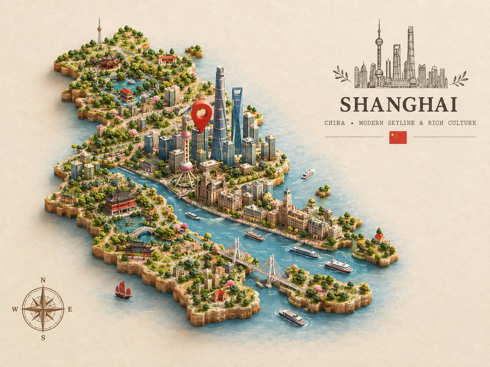

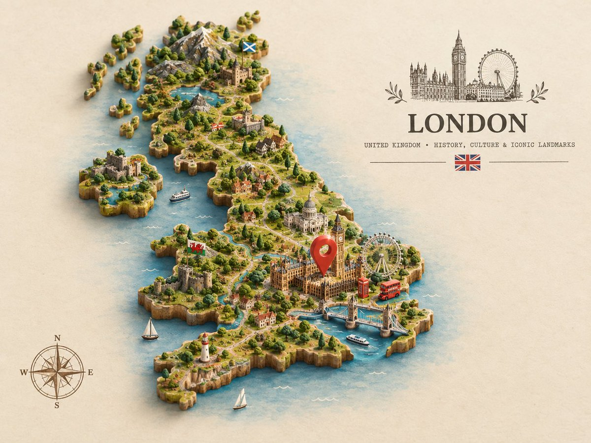

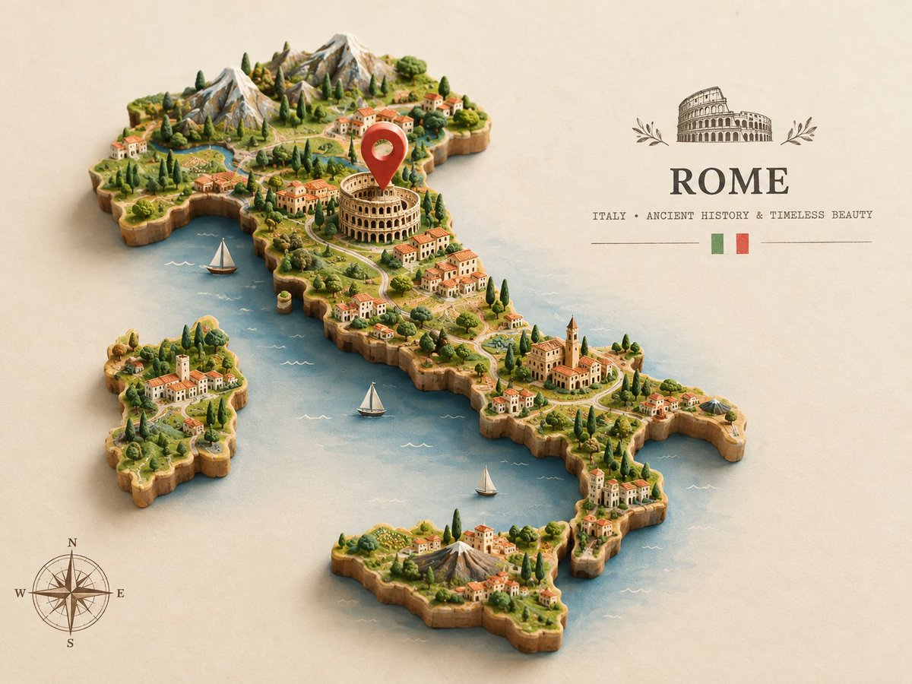

**Prompt**

```text
Erstelle eine charmante 3D-Miniaturkarte von [COUNTRY] mit klar umrissenen und präzise geformten Landesgrenzen. Platziere eine große, elegante Stecknadel exakt auf [CITY], wobei sich [ICONIC LANDMARK] an der Position der Stecknadel von der Karte erhebt. Füge winzige Straßen, Berge, Flüsse, Gebäude, Bäume und subtile kulturelle Details innerhalb des Landes hinzu. Gestalte die Karte leicht erhaben und skulptural, mit geschichtetem Terrain, weichen Schatten, abgerundeten Kanten und handgefertigten Miniaturtexturen. Verwende eine raffinierte, von [COUNTRY] inspirierte Farbpalette, einen warmen elfenbeinfarbenen Hintergrund, sanfte Studiobeleuchtung und eine saubere Premium-Komposition. Füge eleganten Text hinzu: „[CITY]“ und darunter „[COUNTRY] • [FAMOUS FOR]“. Niedliche, raffinierte, hochgradig wiedererkennbare Ästhetik eines sammelbaren 3D-Reisesouvenirs.
```

[↑ Zurück zu Kategorien](#catalog)

---

<a name="category-pixel-art"></a>

## Pixel-Art

<a name="prompt-2097574111518375970"></a>

### Prompt zur Erstellung eines Pixel-Art-Sprite-Sheets basierend auf dem beigefügten Charakter mit 4 Bewegungen \(Rennen, Springen, Wirbelangriff, Umfallen\) à 4 Frames.

Autor：[@npaka123](https://x.com/npaka123) · [Originalbeitrag](https://x.com/npaka123/status/2097574111518375970)

Pixel-Art · Charakter · Veröffentlicht

**Zusammenfassung:** Prompt zur Erstellung eines Pixel-Art-Sprite-Sheets basierend auf dem beigefügten Charakter mit 4 Bewegungen \(Rennen, Springen, Wirbelangriff, Umfallen\) à 4 Frames.


**Prompt**

```text
Halte Gesicht, Frisur, Outfit, Farbpalette und Körperbau des beigefügten Charakters einheitlich und erstelle 4 Arten von Pixel-Art-Bewegungen, die im Spiel gut zur Geltung kommen, mit jeweils maximal 4 Frames auf einem einzigen Sprite-Sheet-Bild. Die Größe jedes Frames beträgt 256x256 px.
・Rennen: Den Körper nach vorne beugen und Arme und Beine weit und abwechselnd bewegen.
・Springen: In die Hocke gehen → hochspringen → Arme und Beine in der Luft ausbreiten → landen.
・Wirbelangriff: Frontalansicht → Seitenansicht → Rückenansicht → entgegengesetzte Seitenansicht, um eine vollständige 360-Grad-Drehung des Körpers auszuführen.
・Umfallen: Taumeln → zur Seite neigen → flach hinlegen → die Augen schließen und regungslos verharren.
Ordne jede Bewegung in einer horizontalen Reihe an und halte Zellengröße, Fußlinie, Ausrichtung zur Mitte und Maßstab für alle Zellen einheitlich. Der Hintergrund muss vollständig einfarbig sein; verwende keine Schatten, Texte, Rahmen, Nummern, UI-Elemente, Unschärfen, Halbtransparenzen, Farbverläufe oder Antialiasing. Looping-Animationen sollten nahtlos und natürlich zwischen Anfang und Ende übergehen.
```

[↑ Zurück zu Kategorien](#catalog)

---

<a name="prompt-2097573967955730524"></a>

### Anweisung zur Generierung eines Sprite-Sheets basierend auf einem Referenzbild, das 4 Arten von Pixel-Art-Aktionen für Spiele \(Laufen, Springen, Drehangriff, Umfallen\) mit jeweils 4 Frames anordnet.

Autor：[@npaka123](https://x.com/npaka123) · [Originalbeitrag](https://x.com/npaka123/status/2097573967955730524)

Pixel-Art · Charakter · Veröffentlicht

**Zusammenfassung:** Anweisung zur Generierung eines Sprite-Sheets basierend auf einem Referenzbild, das 4 Arten von Pixel-Art-Aktionen für Spiele \(Laufen, Springen, Drehangriff, Umfallen\) mit jeweils 4 Frames anordnet.


**Prompt**

```text
Vereinheitliche Gesicht, Frisur, Kleidung, Farbschema und Statur des beigefügten Charakters und generiere ein einzelnes Sprite-Sheet-Bild mit 4 Arten von Pixel-Art-Bewegungen, die im Spiel gut zur Geltung kommen, mit jeweils bis zu 4 Frames. Die Größe eines Frames beträgt 256x256 px.
・Laufen: Den Körper nach vorne neigen und Arme und Beine weit und abwechselnd bewegen.
・Springen: In die Hocke gehen → nach oben abspringen → Arme und Beine in der Luft ausbreiten → landen.
・Drehangriff: Frontalansicht → Seitenansicht → Rückenansicht → entgegengesetzte Seitenansicht, eine vollständige Drehung des gesamten Körpers.
・Umfallen: Taumeln → zur Seite neigen → auf den Boden legen → die Augen schließen und bewegungslos bleiben.
Platziere eine Aktion pro Zeile in einer horizontalen Reihe und passe die Größe aller Zellen, den Bodenkontakt der Füße, die Zentrierung und den Maßstab einheitlich an. Der Hintergrund muss vollständig einfarbig sein, ohne Schatten, Text, Rahmen, Nummern, UI, Unschärfe, Halbtransparenz, Farbverläufe oder Anti-Aliasing. Looping-Aktionen müssen am Anfang und Ende nahtlos ineinander übergehen.
```

[↑ Zurück zu Kategorien](#catalog)

---

<a name="prompt-2097559943075533257"></a>

### Anweisung für eine 16-Frame-Sprite-Sheet-Animationsschleife eines männlichen Goblins im Pixel-Art-Stil, der mit einem Bogen schießt.

Autor：[@Fomsky\_Wei](https://x.com/Fomsky_Wei) · [Originalbeitrag](https://x.com/Fomsky_Wei/status/2097559943075533257)

Pixel-Art · Veröffentlicht

**Zusammenfassung:** Anweisung für eine 16-Frame-Sprite-Sheet-Animationsschleife eines männlichen Goblins im Pixel-Art-Stil, der mit einem Bogen schießt.


**Prompt**

```text
Verwende keine Fähigkeiten, erstelle ein Sprite-Sheet
Dieses Bild enthält den Ablauf, wie ein männlicher Goblin im Pixel-Art-Stil einen Bogen spannt und einen Pfeil abschießt
Insgesamt 16 Frames.
Schneide dieses Bild anschließend aus und erstelle daraus ein Endlos-GIF
```

[↑ Zurück zu Kategorien](#catalog)

---

<a name="category-watercolor"></a>

## Aquarell

<a name="prompt-2097637962137895058"></a>

### Prompt zur Umwandlung eines Fotos in eine handgezeichnete Retro-Reisetagebuch-Illustration mit Buntstiften und Aquarell

Autor：[@tataemugc](https://x.com/tataemugc) · [Originalbeitrag](https://x.com/tataemugc/status/2097637962137895058)

Illustration · Aquarell · Retro / Vintage · Veröffentlicht

Originalbeitrag：[@Crypto\_QianXun](https://x.com/Crypto_QianXun) · [Originalbeitrag](https://x.com/Crypto_QianXun/status/2097174853707284785)

**Zusammenfassung:** Prompt zur Umwandlung eines Fotos in eine handgezeichnete Retro-Reisetagebuch-Illustration mit Buntstiften und Aquarell


**Prompt**

```text
Verwandeln Sie das Foto in den handgezeichneten Stil eines Reisetagebuchs mit Buntstiften und Aquarell. Behalten Sie die ursprüngliche Komposition, Gebäude, Personen, Bäume, Rasenflächen, Straßen und die Perspektive unverändert bei. Verwenden Sie warmes, beigefarbenes, gealtertes Papier, um ein handgezeichnetes Gefühl mit sichtbaren Federstrichen und Aquarellverläufen auszudrücken. Vereinfachen Sie die Gebäude zu ausdrucksstarken Formen und fügen Sie lockere Konturen, feine Kreuzschraffuren und leicht unvollkommene Ränder hinzu. Bewahren Sie die Atmosphäre eines klaren Sommertages, einen sanften blauen Himmel, warmbeige Gebäude, grünen Rasen sowie verstreute, entspannte Personen und Bänke. Verwenden Sie verblasste Töne einer Vintage-Reiseskizze. Platzieren Sie die Illustration in der unteren Hälfte der Seite und lassen Sie oben einen breiten beigen Freiraum. Schreiben Sie oben handschriftlich '맑은 날씨' und unten '— 소중한 순간 —'. Gestalten Sie es im nostalgischen Kunst-Reisemagazin-Stil, der sich wie persönliche Skizzenbuch-Erinnerungen anfühlt, ohne jeglichen fotografischen Eindruck.
```

[↑ Zurück zu Kategorien](#catalog)

---

<a name="category-retro-vintage"></a>

## Retro / Vintage

<a name="prompt-2097628670143954978"></a>

### Zweigeteiltes Reisetagebuch-Poster erstellen: oben realistische Straßenszene, unten Vintage-Illustrationsstil bei gleicher Komposition, mit Typografie.

Autor：[@Alina\_with\_Ai](https://x.com/Alina_with_Ai) · [Originalbeitrag](https://x.com/Alina_with_Ai/status/2097628670143954978)

Plakat / Flyer · Fotografie · Illustration · Retro / Vintage · Stadtbild / Straße · Text / Typografie · Veröffentlicht

**Zusammenfassung:** Zweigeteiltes Reisetagebuch-Poster erstellen: oben realistische Straßenszene, unten Vintage-Illustrationsstil bei gleicher Komposition, mit Typografie.


**Prompt**

```text
Erstelle ein realistisches zweigeteiltes redaktionelles Reisetagebuch-Poster, wobei das erste Bild als exakte Komposition/Referenz und das zweite hochgeladene Bild als Gesichtsreferenz verwendet wird.

Ersetze die Frau im Originalposter durch die Frau aus meinem Referenzfoto. Bewahre meine Gesichtsidentität und wiedererkennbaren Gesichtszüge präzise—Gesichtsform, Augen, Augenbrauen, Nase, Lippen, Hautton und natürliche Proportionen. Verschönere, verändere oder gestalte mein Gesicht nicht neu.

OBERES PANEL

Stelle die ursprüngliche Straßenszene exakt nach:

Schmale europäische Kopfsteinpflasterstraße

Historische cremefarbene Gebäude

Café-Schilder, Fenster, Balkone, Straßenlaternen und Poller

Gleicher Kamerawinkel, Bildausschnitt, Perspektive und Komposition

Gleiche sitzende/angelehnte Pose und Körperhaltung

Gleicher schwarzer strukturierter Pullover/Mantel

Natürliches langes dunkles Haar

Weiches kinoreifes Tageslicht

Fotorealistische Hauttextur und realistische Beleuchtung

Integriere mein Gesicht natürlich in die Originalpose, den Kopfwinkel und die Beleuchtung

UNTERES PANEL

Erstelle die passende handgezeichnete/gedruckte Illustrationsversion derselben Szene.

Behalte die gleiche Pose, Kleidung, Frisur und Gesichtsidentität bei

Wandle das Foto in eine strukturierte Vintage-Editorial-Illustration um

Tuschpalette aus Blau, Creme und gedecktem warmem Orange

Sichtbare Papierkörnung und unvollkommene Tuschtextur

Halte meine Gesichtszüge wiedererkennbar, während sie dem illustrierten Stil angepasst werden

Bewahre die Straße, Gebäude, Pflanzen, Autos und Perspektive des Originals

TYPOGRAFIE & LAYOUT

Behalte das ursprüngliche Poster-Layout und den typografischen Stil bei:

Großer handgeschriebener Titel: „By the Street“

Kleiner englischer Tagebuchtext

Chinesischer Text oben links

Datum: 2026.08.29

Kleine Tagebuchnummer/Details

Rechtsseitiger Satz: „GOOD THINGS ALWAYS HAPPEN IN QUIET MOMENTS.“

Am wichtigsten: Mein Gesicht sollte die einzige verwendete Gesichtsidentität sein. Kopiere nicht das Gesicht der ursprünglichen Frau. Halte die Gesamtkomposition des Posters, Pose, Kleidung, Hintergrund und künstlerischen Stil so nah wie möglich an der Referenz. Hochwertige, natürliche, nahtlose Gesichtsintegration, fotorealistisches oberes Panel und authentische gedruckte Illustration im unteren Panel.
```

[↑ Zurück zu Kategorien](#catalog)

---

<a name="prompt-2097185580224491672"></a>

### 90er-Jahre Retro-Streetwear-Porträtaufnahme, Mann lehnt an einem US-Oldtimer, im Hintergrund eine verwitterte Wand in Oakland.

Autor：[@harboriis](https://x.com/harboriis) · [Originalbeitrag](https://x.com/harboriis/status/2097185580224491672)

Fotografie · Retro / Vintage · Porträt / Selfie · Charakter · Modeartikel · Fahrzeug · Stadtbild / Straße · Zusammenfassung / Hintergrund · Veröffentlicht

**Zusammenfassung:** 90er-Jahre Retro-Streetwear-Porträtaufnahme, Mann lehnt an einem US-Oldtimer, im Hintergrund eine verwitterte Wand in Oakland.


**Prompt**

```text
Erstelle ein ultra-realistisches vertikales 9:16 Editorial-Streetwear-Foto eines jungen Mannes mit dichtem, lockigem dunklem Haar, der eine schwarze Sonnenbrille trägt, ein cremefarbenes und schwarzes Oversized-Poloshirt mit auffälliger College-Schrift „OAKLAND“ und kleinerem sportlichem Text darunter, eine weite schwarze Cargohose, weiße Sneaker und eine klassische Metallarmbanduhr. Er lehnt lässig an der Front eines amerikanischen Oldtimers, die Hände in den Taschen und ein Bein über das andere geschlagen.
Platziere die Szene in einer rauen urbanen Straße mit einem alten, verwitterten Gebäude im Hintergrund. Füge eine große, verblasste Wandtypografie mit der Aufschrift „OAKLAND“ hinzu, darunter „CALIFORNIA“ und „EST. 1852“. Warmes spätnachmittägliches Sonnenlicht, gedeckte braune und beige Farbpalette, feines Filmkorn, weiche Schatten, nostalgische Streetwear-Ästhetik der 1990er Jahre, realistische Hautstruktur, natürliche Pose, filmische Tiefenschärfe, detaillierter Oldtimer, authentische Editorial-Fotografie.
Ganzkörperkomposition, Kamera auf niedriger Augenhöhe, 35mm-Objektiv, warme filmische Beleuchtung, fotorealistisch, detailreich, 4K.
```

[↑ Zurück zu Kategorien](#catalog)

---

<a name="category-minimalism"></a>

## Minimalismus

<a name="prompt-2097628383362597075"></a>

### Eine Infografik als Leitfaden zur Handlesekunst im cremeweißen, minimalistischen Magazinstil erstellen.

Autor：[@hahazwei](https://x.com/hahazwei) · [Originalbeitrag](https://x.com/hahazwei/status/2097628383362597075)

Infografik / Edu Visual · Minimalismus · Veröffentlicht

**Zusammenfassung:** Eine Infografik als Leitfaden zur Handlesekunst im cremeweißen, minimalistischen Magazinstil erstellen.


**Prompt**

```text
Verwende dieses Bild, um eine vollständige Infografik als Leitfaden zur Handlesekunst zu erstellen. Achte auf die Linien auf der Handfläche, beschrifte die wichtigsten Handlinien, führe eine detaillierte Handlese-Analyse durch und präsentiere die Deutungen auf einem cremeweißen Hintergrund in einem sauberen, minimalistischen und luxuriösen Magazin-Editorial-Stil. Verwende feine Linien, abgerundete Karten und wohlüberlegten Leerraum, um eine edle, hochwertige Ästhetik zu schaffen. Hebe die Deutung der Handlesekunst selbst hervor.
```

[↑ Zurück zu Kategorien](#catalog)

---

<a name="prompt-2097622528340668736"></a>

### Authentisches Porträt aus der Aufsicht einer jungen ostasiatischen Frau im rosa Bikini vor minimalistischem grauem Hintergrund.

Autor：[@catgirlcozy](https://x.com/catgirlcozy) · [Originalbeitrag](https://x.com/catgirlcozy/status/2097622528340668736)

Minimalismus · Porträt / Selfie · Charakter · Zusammenfassung / Hintergrund · Veröffentlicht

**Zusammenfassung:** Authentisches Porträt aus der Aufsicht einer jungen ostasiatischen Frau im rosa Bikini vor minimalistischem grauem Hintergrund.


**Prompt**

```text
Vogelperspektive/Aufsicht im 35-Grad-Winkel, eine junge, authentische ostasiatische Frau mit rötlich-braunem Haar, die in die Kamera blickt, die Hände hinter dem Kopf verschränkt, die Ellbogen weit nach außen gerichtet, mit einem strahlenden, aufrichtigen Lächeln mit Zähnen, die Hände am Kopf. Sie trägt einen rosa Schnürbikini und eine zarte Goldkette und steht barfuß vor einem minimalistischen grauen Betonhintergrund. Weiches natürliches Innenlicht, authentisch strukturierter Lifestyle-Porträt-Schnappschuss-Stil.
```

[↑ Zurück zu Kategorien](#catalog)

---

<a name="prompt-2097204639863287913"></a>

### Prompt für ein Poster-Hintergrundbild mit einer Frau am Gitterfenster im orientalischen Zen- und neuen chinesischen Stil, abgestimmt in Jadegrün, Magentarot und Warmweiß.

Autor：[@liyue\_ai](https://x.com/liyue_ai) · [Originalbeitrag](https://x.com/liyue_ai/status/2097204639863287913)

Plakat / Flyer · Minimalismus · Charakter · Zusammenfassung / Hintergrund · Veröffentlicht

Originalbeitrag：[@liyue\_ai](https://x.com/liyue_ai) · [Originalbeitrag](https://x.com/liyue_ai/status/2096838519918596234)

**Zusammenfassung:** Prompt für ein Poster-Hintergrundbild mit einer Frau am Gitterfenster im orientalischen Zen- und neuen chinesischen Stil, abgestimmt in Jadegrün, Magentarot und Warmweiß.


**Prompt**

```text
Themenrichtung: Minimalistisches Cover-Poster im orientalischen Zen-Stil
Stilrichtung: Neues chinesisches Design mit femininer Ästhetik
Hauptinhalt: Eine traditionell gekleidete chinesische Frau steht vor einem floralen Gitterfenster, in ruhiger und zurückhaltender Haltung
Stimmungsmotiv: Elegant, anmutig, dezenter Luxus
Szene und Bildsprache: Jadegrünes Gitterfenster, magentarote Blumenschatten, warmweiße Wand, Frau, dezente Details in hellem Gold
Komposition und Raum: Vertikale 9:16-Komposition, das Gitterfenster im oberen Mittelbereich, die Figur im unteren Mittelbereich, oben ein sauberer Bereich für Titelzeilen freigehalten
Farbsteuerung: Warmweiß als helle Basis, Jadegrün für das Gitterfenster und minimale Hintergrundstrukturen, Magentarot für Blumenschatten und Akzente, helles Gold nur für ganz wenige Schmuck-Highlights, Kleidung der Figur in Perlweiß oder zartem Rosaweiß; vermeiden, dass das gesamte Bild jadegrün oder magentarot wird
Licht und Textur: Weiches natürliches Licht, lebendige und klare Farben, saubere grafische Plakatästhetik
Bildseitenverhältnis: 9:16
Zusatzanforderung: Das Gesamtbild soll das Flair eines optisch ansprechenden Buch- oder Magazin-Covers im neuen chinesischen Stil vermitteln, exquisit, aber nicht überladen dekoriert
```

[↑ Zurück zu Kategorien](#catalog)

---

<a name="prompt-2096807576168169628"></a>

### Erstelle basierend auf hochgeladenen Fotos ein zweigeteiltes 3:4-Editorial-Poster: Die obere Hälfte bewahrt das Originalfoto originalgetreu, die untere Hälfte wird zu einer kleinen, minimalistischen, handgezeichneten Illustration.

Autor：[@Sairah\_0](https://x.com/Sairah_0) · [Originalbeitrag](https://x.com/Sairah_0/status/2096807576168169628)

Plakat / Flyer · Illustration · Minimalismus · Veröffentlicht

**Zusammenfassung:** Erstelle basierend auf hochgeladenen Fotos ein zweigeteiltes 3:4-Editorial-Poster: Die obere Hälfte bewahrt das Originalfoto originalgetreu, die untere Hälfte wird zu einer kleinen, minimalistischen, handgezeichneten Illustration.


**Prompt**

```text
Erstelle EIN eigenständiges High-End-Editorial-Poster für JEDES hochgeladene Foto. Fotos niemals kombinieren. Jedes Foto muss ein separates Poster werden.

FORMAT
Striktes 3:4-Hochformat. Teile die Leinwand in zwei exakt gleiche 50%-horizontale Abschnitte.

OBERE 50% — ORIGINALFOTO
Bewahre das Foto originalgetreu: Identität, Gesicht, Körperproportionen, Pose, Kleidung, Objekte, Komposition, Beleuchtung, Schatten, Atmosphäre und Farben. Halte es fotorealistisch mit dezentem, hochwertigem redaktionellem Color-Grading. Erweitere den Hintergrund bei Bedarf nahtlos; verzerre oder verändere das Motiv niemals.

UNTERE 50% — MINIMALISTISCHE ILLUSTRATION
Reinterpretiere die am besten wiedererkennbaren Elemente als kleine, zentrierte, handgezeichnete Papierillustration, die nur 10–20% der unteren Hälfte einnimmt. Bewahre das Hauptmotiv, die Silhouette, die Pose, die Objekte und die Narration.

Verwende zarte, unvollkommene Linien, kräftige, flächige Formen im Acrylstil, raue Papierkörnung, handgemachte Pinselspuren und organische Kanten. Halte den Hintergrund in warmem Weiß/Cremeweiß mit großzügigem Negativraum.

FARBE
Extrahiere die dominanten Farben aus dem Originalfoto und reduziere sie auf maximal 4 zurückhaltende, harmonische Farben.

TYPOGRAFIE
Optionaler minimaler Editorial-Text wie ein kurzer Titel, Ort, Jahr oder Schlüsselwort. Erzwinge keinen Text, wenn er nicht notwendig ist.

STIL
Ruhig, poetisch, raffiniert, minimalistisch, unschuldig, künstlerisch, nachdenklich, erstklassig und mit hohem Wiedererkennungswert – wie ein zeitgenössisches Kunstbuch oder das Cover eines unabhängigen Editorial-Magazins.
```

[↑ Zurück zu Kategorien](#catalog)

---

<a name="category-other"></a>

## Sonstige

<a name="prompt-2097784050660376617"></a>

### Ein durchscheinendes, leuchtendes Ahornblatt schwebt über ruhigem Wasser, in dessen Innerem rosa Blüten blühen, während sein Stiel die Wasseroberfläche sanft berührt und konzentrische Wellen erzeugt.

Autor：[@churvikv](https://x.com/churvikv) · [Originalbeitrag](https://x.com/churvikv/status/2097784050660376617)

Sonstige · Veröffentlicht

**Zusammenfassung:** Ein durchscheinendes, leuchtendes Ahornblatt schwebt über ruhigem Wasser, in dessen Innerem rosa Blüten blühen, während sein Stiel die Wasseroberfläche sanft berührt und konzentrische Wellen erzeugt.

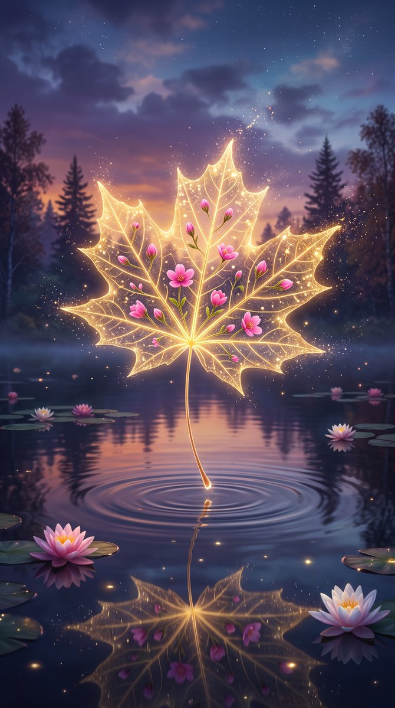

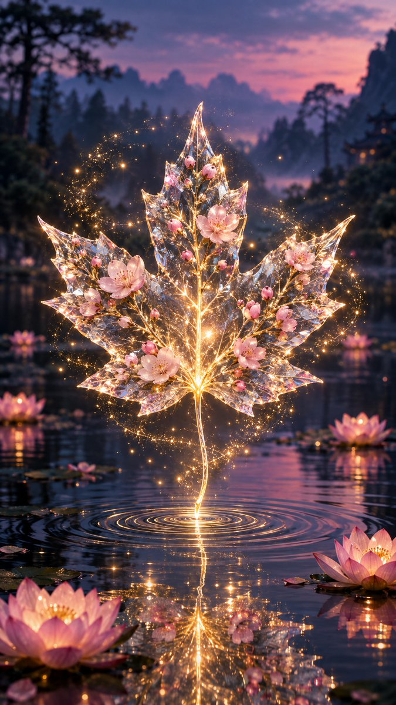

**Prompt**

```text
Prompt 1:
Ein bezauberndes und surreales digitales Kunstwerk mit einem durchscheinenden, goldenen Ahornblatt, das magisch über der Oberfläche ruhigen, dunklen Wassers schwebt. Das Blatt leuchtet von innen heraus in einem warmen, ätherischen Licht, wobei seine zarten Blattadern deutlich sichtbar sind. In die durchscheinende Struktur des Blattes sind winzige, leuchtend rosa Blüten und geschlossene Knospen eingebettet, die scheinbar direkt in seinen Adern erblühen. Die Blattspitzen sind mit funkelndem, goldenem Glitzer gesäumt, der wie Feenstaub durch die Luft treibt. Der Stiel des Blattes ragt nach unten und berührt gerade eben die Wasseroberfläche, wodurch konzentrische Wellen entstehen, die sich nach außen ausbreiten. Unter dem Wasser ist das Spiegelbild des leuchtenden Blattes und des Stiels schwach zu erkennen. Der Hintergrund zeigt einen verträumten Dämmerungswald mit silhouettierten Kiefern vor einem weichen Farbverlaufshimmel aus Lila, Orange und Blau. Mehrere rosa Seerosen treiben auf dem dunklen Wasser und verstärken die heitere und magische Atmosphäre.

Prompt 2:
Ein majestätisches, ätherisches Ahornblatt aus durchscheinendem, kristallinem Material schwebt zart über einem ruhigen, dunklen Teich. Das Blatt ist detailreich mit leuchtenden Adern ausgearbeitet und mit kleinen, zartrosa Kirschblüten und Knospen besetzt, die direkt aus seiner Struktur zu wachsen scheinen. Goldene, schimmernde magische Staubpartikel wirbeln um das Blatt und werfen ein warmes, strahlendes Leuchten. Die Spitze des Blattstiels berührt sanft die Wasseroberfläche und erzeugt perfekte konzentrische Wellen, die das Licht reflektieren. Der Hintergrund zeigt eine verträumte, unscharfe Waldlandschaft in der Abenddämmerung mit angedeuteten Baumkronen im Scherenschnitt und einem weichen Verlaufshimmel, der von tiefem Dämmerungsblau bis hin zu zartem Rosa reicht. Schwimmende rosa Lotusblüten ruhen im Vorder- und Mittelgrund auf der ruhigen Wasseroberfläche. Die Beleuchtung ist sanft, filmreif und magisch und betont die glasartigen Texturen sowie die biolumineszierende Qualität der Szene. Die Komposition ist zentriert, vertikal und symmetrisch, strahlt ein Gefühl von Ruhe, mystischer Natur und märchenhafter Schönheit aus und ist mit hyperrealistischer digitaler Präzision gerendert.
```

[↑ Zurück zu Kategorien](#catalog)

---

<a name="prompt-2097780695414530375"></a>

### Generierung einer Webseiten-Oberfläche mit Chrome-Rahmen, die einen ChatGPT-Dialog zur Erstellung eines Streamer-Screenshots zeigt.

Autor：[@XChatScout](https://x.com/XChatScout) · [Originalbeitrag](https://x.com/XChatScout/status/2097780695414530375)

App- / Webdesign · Veröffentlicht

**Zusammenfassung:** Generierung einer Webseiten-Oberfläche mit Chrome-Rahmen, die einen ChatGPT-Dialog zur Erstellung eines Streamer-Screenshots zeigt.

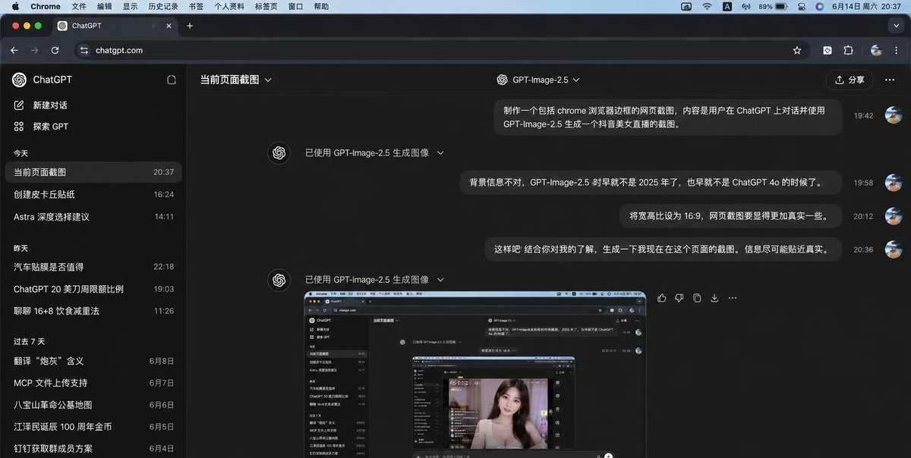

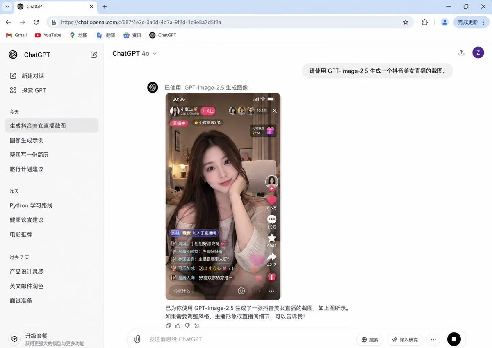

**Prompt**

```text
Erstelle einen Webseiten-Screenshot inklusive Chrome-Browserrahmen, dessen Inhalt zeigt, wie ein Benutzer auf ChatGPT chattet und mit GPT-Image-2.5 den Screenshot eines Livestreams einer Streamerin generiert.
```

[↑ Zurück zu Kategorien](#catalog)

---

<a name="prompt-2097715653981667777"></a>

### Prompt für das Porträt einer schüchternen Hofdame im antiken Stil, halb hinter einem Vorhang verborgen.

Autor：[@DeepBlueX0](https://x.com/DeepBlueX0) · [Originalbeitrag](https://x.com/DeepBlueX0/status/2097715653981667777)

Porträt / Selfie · Veröffentlicht

Originalbeitrag：[@DeepBlueX0](https://x.com/DeepBlueX0) · [Originalbeitrag](https://x.com/DeepBlueX0/status/2097367159085420949)

**Zusammenfassung:** Prompt für das Porträt einer schüchternen Hofdame im antiken Stil, halb hinter einem Vorhang verborgen.

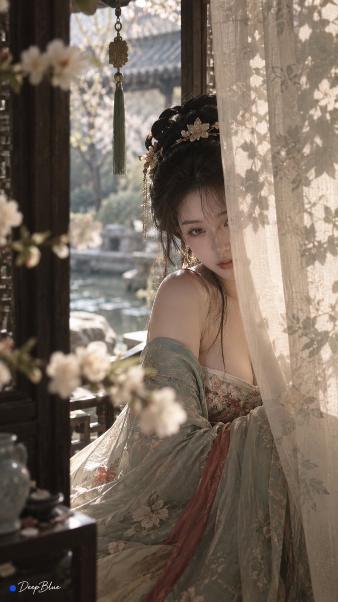

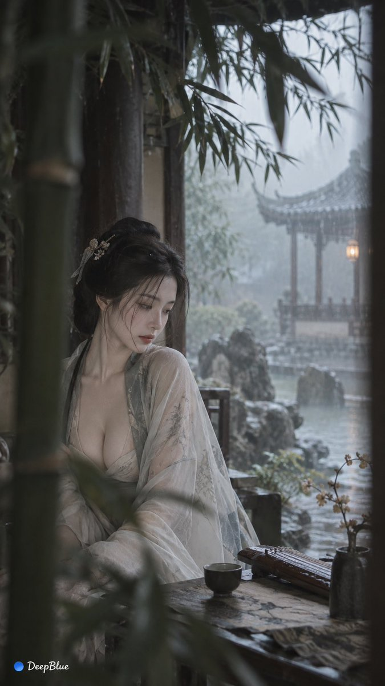

**Prompt**

```text
Reine Eleganz voller Zärtlichkeit; verschwommene Blumenschatten; Vorhangschatten, die halb verhüllen; sprechen wollen und doch schweigen; schüchterne schöne Dame; atemberaubende Anmut, die Konventionen bricht
```

[↑ Zurück zu Kategorien](#catalog)

---

<a name="prompt-2097672457582985315"></a>

### Text-zu-Bild-Prompt zur Erstellung einer Reiseguide-Grafik für eine 5-tägige Reiseroute nach Rizhao, Qingdao und Yantai.

Autor：[@MrGafish](https://x.com/MrGafish) · [Originalbeitrag](https://x.com/MrGafish/status/2097672457582985315)

Infografik / Edu Visual · Veröffentlicht

**Zusammenfassung:** Text-zu-Bild-Prompt zur Erstellung einer Reiseguide-Grafik für eine 5-tägige Reiseroute nach Rizhao, Qingdao und Yantai.

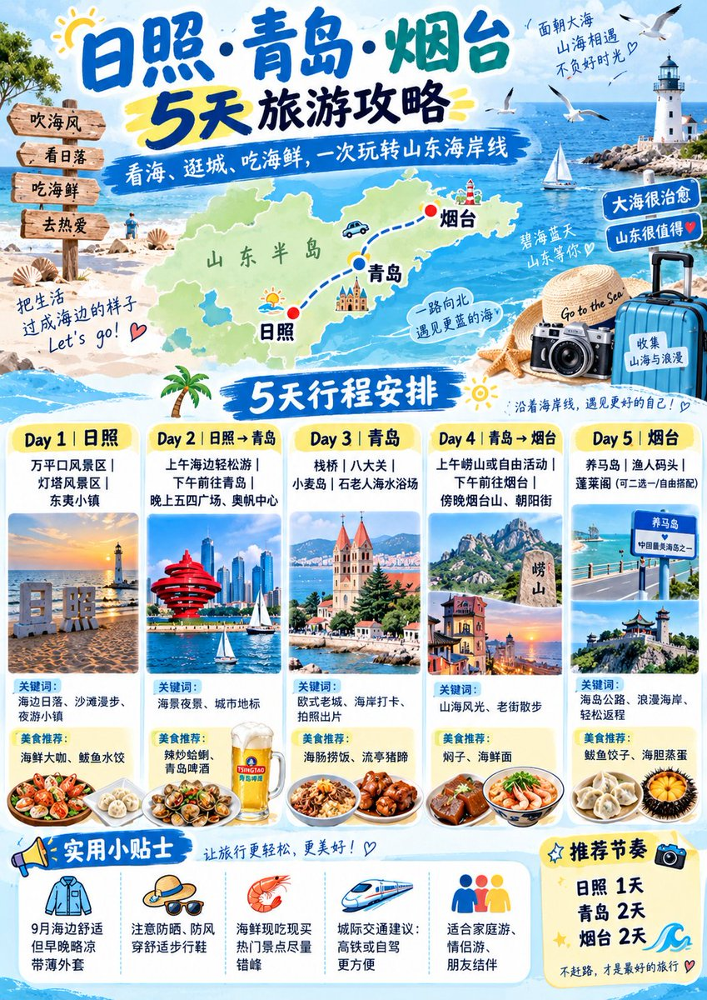

**Prompt**

```text
Diesen Monat reise ich für 5 Tage nach Rizhao, Qingdao und Yantai; erstelle eine Reiseguide-Grafik.
```

[↑ Zurück zu Kategorien](#catalog)

---

<a name="prompt-2097710368542146635"></a>

### Poster zum Thema des Qingming-Solarabschnitts erstellen.

Autor：[@shitunote](https://x.com/shitunote) · [Originalbeitrag](https://x.com/shitunote/status/2097710368542146635)

Plakat / Flyer · Veröffentlicht

Originalbeitrag：[@shitunote](https://x.com/shitunote) · [Originalbeitrag](https://x.com/shitunote/status/2096740511612797206)

**Zusammenfassung:** Poster zum Thema des Qingming-Solarabschnitts erstellen.


**Prompt**

```text
Erstelle ein Poster für den Qingming-Solarabschnitt
```

[↑ Zurück zu Kategorien](#catalog)

---

<a name="prompt-2097665256424349855"></a>

### Übersetzung läuft

Autor：[@cnyzgkc](https://x.com/cnyzgkc) · [Originalbeitrag](https://x.com/cnyzgkc/status/2097665256424349855)

Infografik / Edu Visual · Diagramm / Grafik · Veröffentlicht

**Zusammenfassung:** Übersetzung läuft


**Prompt**

```text
Übersetzung läuft
```

[↑ Zurück zu Kategorien](#catalog)

---

<a name="prompt-2097611216139235779"></a>

### Generierung eines 3x3-Rasters mit 9 verschiedenen chinesischen und englischen Emoji-Ausdrücken basierend auf einem Personen-Referenzbild.

Autor：[@DeepBlueX0](https://x.com/DeepBlueX0) · [Originalbeitrag](https://x.com/DeepBlueX0/status/2097611216139235779)

Charakter · Veröffentlicht

Originalbeitrag：[@DeepBlueX0](https://x.com/DeepBlueX0) · [Originalbeitrag](https://x.com/DeepBlueX0/status/2097258933928796451)

**Zusammenfassung:** Generierung eines 3x3-Rasters mit 9 verschiedenen chinesischen und englischen Emoji-Ausdrücken basierend auf einem Personen-Referenzbild.


**Prompt**

```text
Beziehe dich auf die Person im Bild und erstelle ein 3*3-Raster mit insgesamt 9 verschiedenen Emoji-/Meme-Ausdrücken, chinesischer und englischer Text darf vorkommen, heller Farbverlaufshintergrund
```

[↑ Zurück zu Kategorien](#catalog)

---

<a name="prompt-2097631043004273061"></a>

### Animation von Cristiano Ronaldo, der Shawarma isst.

Autor：[@royalpinto007](https://x.com/royalpinto007) · [Originalbeitrag](https://x.com/royalpinto007/status/2097631043004273061)

Sonstige · Veröffentlicht

Originalbeitrag：[@gabrielchua](https://x.com/gabrielchua) · [Originalbeitrag](https://x.com/gabrielchua/status/2097546354373603554)

**Zusammenfassung:** Animation von Cristiano Ronaldo, der Shawarma isst.


**Prompt**

```text
Cristiano Ronaldo isst Shawarma
```

[↑ Zurück zu Kategorien](#catalog)

---

<a name="prompt-2097582500273115191"></a>

### Übersetzung läuft

Autor：[@ky6001481673691](https://x.com/ky6001481673691) · [Originalbeitrag](https://x.com/ky6001481673691/status/2097582500273115191)

Porträt / Selfie · Charakter · Modeartikel · Veröffentlicht

**Zusammenfassung:** Übersetzung läuft


**Prompt**

```text
Übersetzung läuft
```

[↑ Zurück zu Kategorien](#catalog)

---

<a name="prompt-2097558679956664521"></a>

### Kybernetisches Horror-Porträt mit einem hageren Humanoiden mit rissiger Porzellanmaske, Kopfkabeln und kontrastreicher monochromer Beleuchtung.

Autor：[@meng\_dagg695](https://x.com/meng_dagg695) · [Originalbeitrag](https://x.com/meng_dagg695/status/2097558679956664521)

Porträt / Selfie · Veröffentlicht

**Zusammenfassung:** Kybernetisches Horror-Porträt mit einem hageren Humanoiden mit rissiger Porzellanmaske, Kopfkabeln und kontrastreicher monochromer Beleuchtung.


**Prompt**

```text
Kybernetisches Horror-Porträt, hagerer humanoider Körper mit rissiger, porzellanweißer, totenkopfähnlicher Maske, ungleiche hohle Augenhöhlen (eine eingesunkene Leere, ein vertiefter Metallring), zackige freiliegende Zähne, umgeben von einem chaotischen Gewirr dicker schwarzer Kabel und industrieller Spulenaufsätze, die in den Kopf verdrahtet sind, zerlumptes Oberteil aus dunklem Stoff, dramatische Low-Key-Beleuchtung, tiefschwarzer Hintergrund, kontrastreiches Monochrom, Horror-Fotografie, filmisch, hyperdetaillierte Textur, 85mm-Objektiv, geringe Schärfentiefe.
```

[↑ Zurück zu Kategorien](#catalog)

---

<a name="prompt-2097519422407872858"></a>

### Studio-Drehteller-Video eines geschnitzten Holz-Schachspringers, der sich sanft um 360 Grad dreht.

Autor：[@higgsfield](https://x.com/higgsfield) · [Originalbeitrag](https://x.com/higgsfield/status/2097519422407872858)

Produkt · Veröffentlicht

**Zusammenfassung:** Studio-Drehteller-Video eines geschnitzten Holz-Schachspringers, der sich sanft um 360 Grad dreht.


**Prompt**

```text
Erstelle ein fotorealistisches Studio-Drehteller-Video eines polierten Schachspringers aus Holz.

Der Springer hat eine minimalistisch geschnitzte Pferdesilhouette: breite, flache Seiten, eine abgerundete, längliche Schnauze, ein winziges dunkles Auge, ein kantiges Ohr und einen sanft geschwungenen Hals. Ein glatter, dunkelbrauner Einsatz folgt der Mähne entlang des Rückens. Die Figur steht auf einem breiten, kreisförmigen Holzsockel mit mehreren konzentrischen, gestuften Ringen.

Verwende warmes braunes Holz mit deutlich sichtbarer vertikaler Maserung, sanft abgerundeten Kanten und einem glänzenden Lackfinish. Behalte die exakte Form, die Proportionen, die Holzmaserung und den dunklen Mähneneinsatz während des gesamten Videos bei.

Die gesamte Schachfigur, einschließlich ihres Sockels, dreht sich mit konstanter Geschwindigkeit gleichmäßig um eine vollständige 360-Grad-Drehung um ihre vertikale Achse. Sie bleibt perfekt zentriert und fest auf der Oberfläche. Das erste und das letzte Einzelbild stimmen für eine nahtlose Schleife überein.

Halte die Kamera völlig unbeweglich, leicht nach unten auf die Figur gerichtet. Zeige das gesamte Objekt mit einem kleinen Rand oben und unten. Verwende einen nahtlosen hellgrauen Studiohintergrund und -boden, weiches diffuses Licht, sanfte Glanzlichter auf dem Lack und einen dezenten Kontaktschatten unter dem Sockel.

Dauer: 3 Sekunden. Bildrate: 30 fps. Quadratische 1:1-Komposition.

Keine Kamerabewegung, kein Zoom, keine Schnitte, kein Wackeln, kein Schweben, keine Verformung, keine wechselnden Proportionen, keine rutschenden Holztexturen, kein Flackern, keine zusätzlichen Objekte, kein Text oder Logos.
```

[↑ Zurück zu Kategorien](#catalog)

---

<a name="prompt-2097513469172129825"></a>

### Porträt einer schlanken Frau im geblümten Qipao aus der Vogelperspektive mit traumhaft weichem Licht und zartem Make-up.

Autor：[@BubbleBrain](https://x.com/BubbleBrain) · [Originalbeitrag](https://x.com/BubbleBrain/status/2097513469172129825)

Porträt / Selfie · Charakter · Veröffentlicht

**Zusammenfassung:** Porträt einer schlanken Frau im geblümten Qipao aus der Vogelperspektive mit traumhaft weichem Licht und zartem Make-up.


**Prompt**

```text
9:16, trägt ein Qipao, weicher Lichtschein, verträumte Unschärfe, Aufnahme aus der Vogelperspektive mit Blick nach unten, große schlanke Modelfigur, raffiniertes Make-up, fuchsartiges Schönheitsgesicht
```

[↑ Zurück zu Kategorien](#catalog)

---

<a name="prompt-2097486896750338125"></a>

### Bild-zu-Bild-Befehlsvorlage zur Beibehaltung von Licht und Schatten, Textur und Komposition basierend auf einem Referenzbild bei gleichzeitiger Neugestaltung des Charakterthemas.

Autor：[@nanyuan0412](https://x.com/nanyuan0412) · [Originalbeitrag](https://x.com/nanyuan0412/status/2097486896750338125)

Charakter · Veröffentlicht

**Zusammenfassung:** Bild-zu-Bild-Befehlsvorlage zur Beibehaltung von Licht und Schatten, Textur und Komposition basierend auf einem Referenzbild bei gleichzeitiger Neugestaltung des Charakterthemas.


**Prompt**

```text
Verwende das beigefügte Bild als Referenz für das Fotokonzept. Behalte das Belichtungsverhältnis, die Lichtrichtung, die Textur der Kleidung und den Kompositionsrhythmus bei; entwirf die Figur und das thematische Farbschema neu. Die Person ist ein Erwachsener; kopiere nicht das Gesicht der Referenzperson. Nach der Generierung im Vergleich zum Originalbild prüfen: Wurde eigenmächtig die Beleuchtung verändert, die Kleidung dicker gemacht oder die Haut übermäßig glatt retuschiert?
```

[↑ Zurück zu Kategorien](#catalog)

---

<a name="prompt-2097765578161418569"></a>

### Generierungs-Prompt für eine Körpertausch-Szene zwischen einem Oberschüler und einer Oberschülerin.

Autor：[@irekawarimaniax](https://x.com/irekawarimaniax) · [Originalbeitrag](https://x.com/irekawarimaniax/status/2097765578161418569)

Charakter · Veröffentlicht

**Zusammenfassung:** Generierungs-Prompt für eine Körpertausch-Szene zwischen einem Oberschüler und einer Oberschülerin.

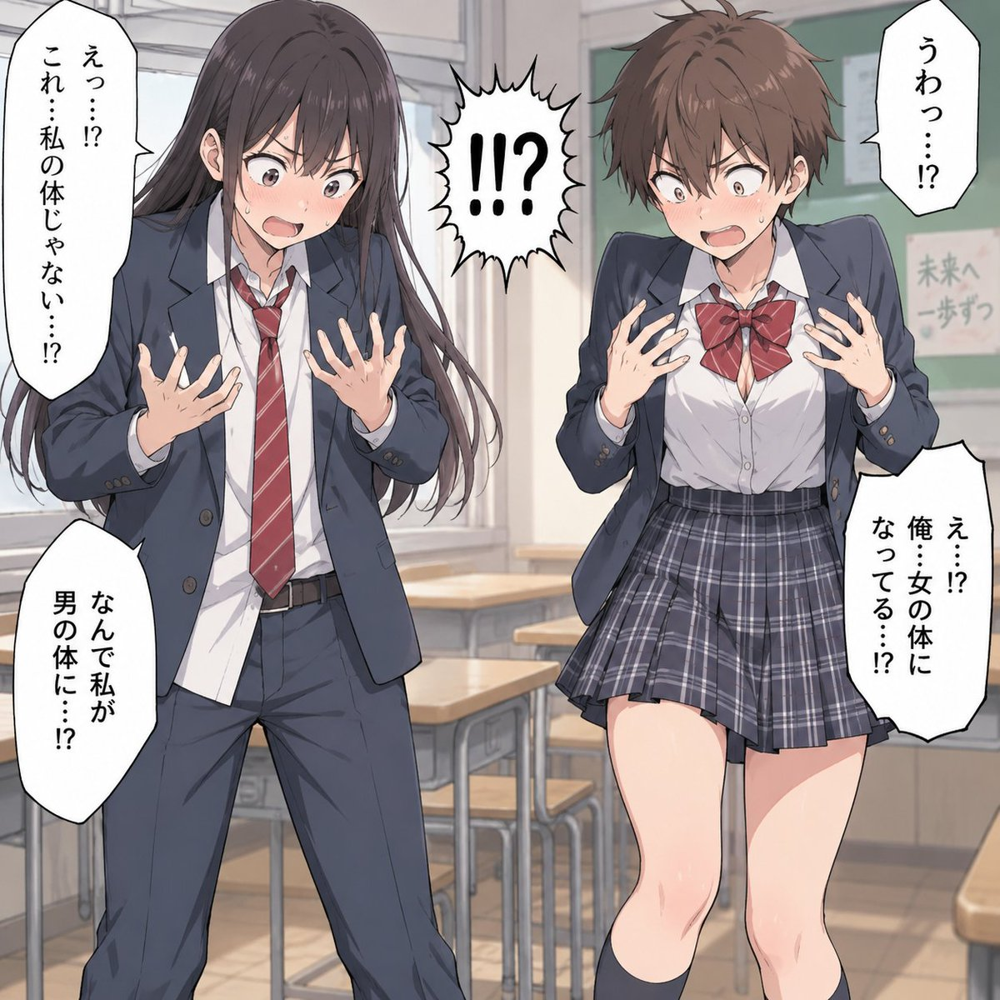

**Prompt**

```text
Zeichne ein Manga-Panel über den Körpertausch zwischen einem Oberschüler und einer Oberschülerin
```

[↑ Zurück zu Kategorien](#catalog)

---

<a name="prompt-2097533103376081383"></a>

### Modeporträt eines stilvollen jungen Mannes mit Sonnenbrille und Jeansjacke, der vor einer Grunge-Wand eine 'Shh'-Geste macht.

Autor：[@Aiwithamirr1](https://x.com/Aiwithamirr1) · [Originalbeitrag](https://x.com/Aiwithamirr1/status/2097533103376081383)

Porträt / Selfie · Charakter · Modeartikel · Veröffentlicht

**Zusammenfassung:** Modeporträt eines stilvollen jungen Mannes mit Sonnenbrille und Jeansjacke, der vor einer Grunge-Wand eine 'Shh'-Geste macht.


**Prompt**

```text
Erstelle ein filmisches, ultrarealistisches Modeporträt eines stilvollen jungen Mannes mit dichtem, voluminösem dunklem Haar und einem sauber gestutzten Bart, der eine schwarze Sonnenbrille mit rotem Rahmen, ein schwarzes T-Shirt, eine abgewetzte schwarze Jeansjacke und eine Dog-Tag-Halskette aus Metall trägt. Er hält einen Finger vertikal an seine Lippen in einer selbstbewussten „Shh“-Geste. Dramatische, warme Studiobeleuchtung, scharfe Gesichtsdetails, starker Kontrast, raue Streetwear-Ästhetik. Der Hintergrund zeigt eine abgenutzte Vintage-Wand mit kräftigen vertikalen Farbabschnitten in Blaugrün, Creme und Rot, starker Grunge-Textur, Farbspritzern und herablaufender schwarzer Farbe. Zentrierte Komposition, Porträt von der Taille aufwärts, redaktionelle Modefotografie, hoher Detailgrad, realistische Hauttextur, geringe Schärfentiefe, 4K, stimmungsvoll und stilvoll, Posterqualität.
```

[↑ Zurück zu Kategorien](#catalog)

---

<a name="prompt-2097543193651007508"></a>

### Ein detaillierter Prompt zur Erstellung einer professionellen Infografik im 9:16-Format im Stil eines koreanischen Beauty-Magazins mit dem Titel 'Makeup Analysis Guide', basierend auf einem Referenzporträt, mit Nahaufnahmen zur Gesichtsanalyse, Farbmustern und strukturierten Make-up-Schritten.

Autor：[@ayzalnooor24521](https://x.com/ayzalnooor24521) · [Originalbeitrag](https://x.com/ayzalnooor24521/status/2097543193651007508)

Infografik / Edu Visual · Porträt / Selfie · Veröffentlicht

**Zusammenfassung:** Ein detaillierter Prompt zur Erstellung einer professionellen Infografik im 9:16-Format im Stil eines koreanischen Beauty-Magazins mit dem Titel 'Makeup Analysis Guide', basierend auf einem Referenzporträt, mit Nahaufnahmen zur Gesichtsanalyse, Farbmustern und strukturierten Make-up-Schritten.


**Prompt**

```text
Wunderschönes koreanisches Mädchen mit weichen, natürlichen Gesichtszügen, gekleidet in ein schwarzes Outfit und mit klarer Brille, gestylt in einem sauberen, modernen Beauty-Editorial-Look. Erstelle eine professionelle Infografik mit dem Titel „MAKEUP ANALYSIS GUIDE“ unter Verwendung des hochgeladenen Porträts als wichtigste visuelle Referenz. Bewahre die ursprünglichen Gesichtszüge, die Frisur, die Hauttextur, die Brille und den natürlichen Wiedererkennungswert ohne übermäßige Retusche. Hebe Augen, Brauen, Nase, Wangen und glänzende rosa Lippen mit eleganten Nahaufnahme-Detailfeldern und dezenten Hinweislinien hervor. Füge eine raffinierte Make-up-Farbpalette aus warmen Neutralltönen, Rosépink und sanftem Braun mit kleinen Beauty-Swatches hinzu. Binde prägnante Abschnitte für Makeup Steps, Best Makeup Looks, Key Products und Quick Tips mit minimalem, gut lesbarem Text ein. Verwende eine erstklassige koreanische Beauty-Magazin-Ästhetik mit klarer Typografie, sanften Beige-Akzenten, dunklem redaktionellem Hintergrund und ausgewogenen Abständen. Gestalte die endgültige Komposition makellos, anspruchsvoll, fotorealistisch und im vertikalen 9:16-Format mit dem Gesamteindruck von „Same You, Just More Polished“.
```

[↑ Zurück zu Kategorien](#catalog)

---

<a name="prompt-2096914920915001598"></a>

### Spontanes Smartphone-Foto einer jungen ostasiatischen Frau im grauen Sweatshirt und Jeans, die auf einer sonnigen Balkongartenterrasse sitzt.

Autor：[@Aqsahere\_](https://x.com/Aqsahere_) · [Originalbeitrag](https://x.com/Aqsahere_/status/2096914920915001598)

Charakter · Veröffentlicht

**Zusammenfassung:** Spontanes Smartphone-Foto einer jungen ostasiatischen Frau im grauen Sweatshirt und Jeans, die auf einer sonnigen Balkongartenterrasse sitzt.


**Prompt**

```text
Ein völlig natürliches, fotorealistisches, spontanes Smartphone-Foto einer jungen ostasiatischen Frau, die bequem im Schneidersitz auf einer Balkongartenterrasse sitzt. Sie hat langes, natürlich gewelltes, dunkelbraunes Haar, das locker über ihre Schultern und an der Vorderseite ihres Körpers herabfällt, wobei sich feine einzelne Strähnen ganz natürlich bewegen. Ihre Gesichtszüge sind zart und realistisch, mit dezentem, natürlichem Make-up und authentischer Hauttextur.
Sie trägt ein gemütliches Oversized-Sweatshirt in Hellgrau und locker sitzende hellblaue Jeans. Lässig und ungezwungen sitzend, stützt sie sanft eine Hand an ihre Wange, während sie nach oben und leicht zur Seite blickt. Ihr Gesichtsausdruck wirkt aufrichtig niedlich und nachdenklich, mit einem dezenten, leicht schmollenden Blick, so als sei das Foto in einem ruhigen, ungestellten Moment aufgenommen worden.
Sie sitzt auf einer hellen Außenterrassenoberfläche, umgeben von üppig grünen Pflanzen, belaubtem Topfpflanzengrün und kleinen blühenden rosa Blumen. Ein schlichtes Balkongeländer aus schwarzem Metall verläuft hinter ihr, während dichte Bäume und natürliches Grün den Hintergrund füllen. Die Umgebung wirkt friedlich, privat und wie ein echter alltäglicher Gartenbalkon.
Sanftes, warmes natürliches Tageslicht fällt sacht über ihr Gesicht und ihre Kleidung und erzeugt realistische, dezente Schatten. Natürliche Hautporen, authentische Haarstruktur, realistischer Sweatshirt-Stoff und glaubhafte Denim-Details sind deutlich sichtbar. Nichts wirkt übermäßig poliert oder künstlich gestellt.
Aufgenommen wie ein authentisches, beiläufiges Smartphone-Foto aus einer natürlichen Perspektive auf Augenhöhe. Ganzkörper-Sitzkomposition, vertikaler Bildausschnitt, wobei die Person leicht im unteren mittleren Bereich des Rahmens positioniert ist. Der Hintergrund weist eine sanfte natürliche Schärfentiefe auf – weich gezeichnet, bleibt jedoch klar erkennbar.
Ultrarealistische Fotografie, natürliche Proportionen, spontaner alltäglicher Moment, koreanisch inspirierte Casual-Fashion-Ästhetik, gedämpfte sanfte Farben, feines Filmkorn, realistische Beleuchtung, leicht unvollkommene Smartphone-Kamera-Details, 4K-Realismus, kein Beauty-Filter-Effekt, keine übermäßige Retusche.
Negative prompt: cartoon, anime, illustration, CGI, artificial-looking skin, plastic skin, excessive makeup, distorted facial features, extra fingers, malformed hands, extra limbs, incorrect anatomy, unnatural body proportions, stiff pose, oversaturated colors, dramatic studio lighting, blurry face, low resolution, watermark, text, logo.
```

[↑ Zurück zu Kategorien](#catalog)

---

<a name="prompt-2097157373936935051"></a>

### Eine koreanische Frau und ein junges Mädchen im Hidschab genießen während der goldenen Stunde Kaffee in einem Straßencafé, verziert mit handgezeichneten Doodles.

Autor：[@Lianaalane](https://x.com/Lianaalane) · [Originalbeitrag](https://x.com/Lianaalane/status/2097157373936935051)

Porträt / Selfie · Charakter · Essen / Trinken · Veröffentlicht

**Zusammenfassung:** Eine koreanische Frau und ein junges Mädchen im Hidschab genießen während der goldenen Stunde Kaffee in einem Straßencafé, verziert mit handgezeichneten Doodles.


**Prompt**

```text
Ein koreanisches Mädchen mit langem, weichem, dunkelbraunem Haar sitzt während der warmen goldenen Stunde in einem gemütlichen Straßencafé und hält sanft eine Keramiktasse Kaffee an ihre Lippen. Sie trägt eine elegante cremefarbene gerippte Strickjacke mit figurbetontem eckigem Ausschnitt und dazu passende cremefarbene Hosen mit hoher Taille, was für einen sanften und edlen Look sorgt. Eine kleine cremefarbene Umhängetasche hängt ganz natürlich an ihrer Schulter, während sie bequem auf einem wunderschönen geflochtenen Rattanstuhl sitzt. Neben ihr sitzt ein süßes kleines Mädchen mit einem beigen Hidschab, einer dezenten cremefarbenen Bluse mit zarten Spitzendetails und einem fließenden braunen Rock. Das kleine Mädchen hält ebenfalls eine warme Tasse und blickt die koreanische junge Frau glücklich an. Vor ihnen steht ein runder Marmorcafétisch mit einer Tasse Kaffee, einem frisch gebackenen Gebäckstück und einer kleinen Glasvase voller zarter weißer Blumen. Der Hintergrund zeigt üppig grüne Bäume, eine bezaubernde Café-Fassade, warmes Sonnenlicht und ein wunderschönes filmisches Bokeh. Füge dezente, weiße, handgezeichnete Herzen, Funkeln und eine lachende Sonne um sie herum hinzu, um eine niedliche, verträumte Atmosphäre zu schaffen, mit hochdetaillierten Gesichtern, natürlichen Gesichtsausdrücken, sanfter Beleuchtung, fotorealistischer Qualität und einer gemütlichen Ästhetik.
```

[↑ Zurück zu Kategorien](#catalog)

---

[Leadde.ai entdecken →](https://leadde.ai/?utm_source=github&utm_medium=readme&utm_campaign=prompt-library&utm_content=image2.5)
