# Image2.5 · Biblioteca de prompts · Leadde.ai

[](README.md) [](README_zh.md) [](README_zh-TW.md) [](README_ja-JP.md) [](README_ko-KR.md) [](README_th-TH.md) [](README_vi-VN.md) [](README_hi-IN.md) [](README_es-ES.md) [-brightgreen)](README_es-419.md) [](README_de-DE.md) [](README_fr-FR.md) [](README_it-IT.md) [-lightgrey)](README_pt-BR.md) [](README_pt-PT.md) [](README_tr-TR.md)

**Best for:** Image 2.5 prompts for commercial visuals, layouts, keyframes, and image-to-video source assets.

For PDF, PPT, SOP, training, and multilingual video workflows:
[Awesome Document-to-Video](https://github.com/LeaddeOpenLab/awesome-document-to-video)

> **Prompts de calidad seleccionados cada día**

Descubre prompts completos para crear imágenes, videos y 3D con IA. Explora por estilo, consulta versiones multilingües y encuentra a los autores originales.

[Explora Leadde.ai →](https://leadde.ai/?utm_source=github&utm_medium=readme&utm_campaign=prompt-library&utm_content=image2.5)

## Conoce Leadde.ai

Leadde.ai ayuda a los equipos a convertir documentos, diapositivas y texto en videos empresariales con IA para capacitación, incorporación y marketing.

Dale una estrella a este repositorio para seguir nuestra selección diaria y descubrir nuevas ideas creativas.

**47** Prompts · Última incorporación: **2026-09-09**

<a name="catalog"></a>

## Explorar por categoría

[Fotografía](#category-photography) · [Cine / Fotograma](#category-cinematic-film-still) · [Ilustración](#category-illustration) · [Boceto / Arte lineal](#category-sketch-line-art) · [Renderizado 3D](#category-3d-render) · [Pixel Art](#category-pixel-art) · [Acuarela](#category-watercolor) · [Retro / Vintage](#category-retro-vintage) · [Minimalismo](#category-minimalism) · [Otros](#category-other)

<a name="all-prompts"></a>

<a name="category-photography"></a>

## Fotografía

<a name="prompt-2097532595814940683"></a>

### Prompt de retrato de viaje fotorrealista de una joven mujer de Asia oriental en la costa del monte Saint-Michel.

Autor：[@saniaspeaks\_](https://x.com/saniaspeaks_) · [Publicación original](https://x.com/saniaspeaks_/status/2097532595814940683)

Fotografía · Retrato / Selfie · Personaje · Publicado

**Resumen:** Prompt de retrato de viaje fotorrealista de una joven mujer de Asia oriental en la costa del monte Saint-Michel.


**Prompt**

```text
Un retrato de viaje espontáneo y fotorrealista de una joven mujer de Asia oriental de pie en una tranquila costa arenosa junto a grandes rocas cubiertas de musgo, con una magnífica abadía de piedra histórica y una arquitectura medieval similar a un castillo que se alza dramáticamente sobre una isla rocosa detrás de ella. Tiene el cabello castaño oscuro, largo y lacio, que cae de forma natural sobre un hombro, rasgos faciales suaves y juveniles, y una sonrisa cálida y apacible mientras mira directamente a la cámara.

Lleva un abrigo negro largo y holgado con las manos casualmente metidas dentro de los bolsillos, superpuesto sobre un atuendo de color claro. Una bufanda grande y suave de color blanco crema está envuelta con calidez alrededor de su cuello, colgando hacia el frente con un pequeño emblema negro de estilo de diseñador cerca del extremo. Se aprecia parcialmente un bolso de hombro con una delicada cadena.

La composición la captura en primer plano mientras la vasta abadía histórica domina el fondo, rodeada por antiguos muros de piedra, acantilados rocosos, llanuras de marea arenosas y una tranquila atmósfera costera. Unos pocos vehículos y personas pequeñas en la distancia añaden una escala realista a la escena. La suave luz natural del atardecer y un cielo azul pálido y despejado crean un pacífico ambiente de viaje europeo.

Fotografía ultrarrealista, auténtica foto de viaje espontánea, textura de piel natural, detalles de tela realistas, iluminación cinematográfica suave, sutil estética de cámara de teléfono inteligente, gradación de color ligeramente de ensueño, proporciones naturales, arquitectura detallada, atmósfera costera pacífica, composición vertical, relación de aspecto 3:4.
```

[↑ Volver a categorías](#catalog)

---

<a name="prompt-2097411028510179759"></a>

### Prompt para foto de paisaje en alta definición de un claro en el bosque con densa vegetación verde.

Autor：[@mark\_k](https://x.com/mark_k) · [Publicación original](https://x.com/mark_k/status/2097411028510179759)

Fotografía · Paisaje / Naturaleza · Publicado

**Resumen:** Prompt para foto de paisaje en alta definición de un claro en el bosque con densa vegetación verde.


**Prompt**

```text
Foto de un claro en el bosque con mucho follaje verde, muy detallada
```

[↑ Volver a categorías](#catalog)

---

<a name="prompt-2097585546973614232"></a>

### Traducción en curso

Autor：[@CyberTotal2026](https://x.com/CyberTotal2026) · [Publicación original](https://x.com/CyberTotal2026/status/2097585546973614232)

Fotografía · Personaje · Publicado

**Resumen:** Traducción en curso


**Prompt**

```text
Traducción en curso
```

[↑ Volver a categorías](#catalog)

---

<a name="prompt-2097534208541442338"></a>

### Prompt para primer plano espontáneo con cámara frontal de iPhone de una joven de Asia oriental de piel fría y blanca, con fondo afelpado grisáceo y varias opciones de poses sosteniendo la cara y soñando despierta.

Autor：[@AIVideoHub\_](https://x.com/AIVideoHub_) · [Publicación original](https://x.com/AIVideoHub_/status/2097534208541442338)

Perfil / Avatar · Fotografía · Retrato / Selfie · Personaje · Resumen / Antecedentes · Publicado

**Resumen:** Prompt para primer plano espontáneo con cámara frontal de iPhone de una joven de Asia oriental de piel fría y blanca, con fondo afelpado grisáceo y varias opciones de poses sosteniendo la cara y soñando despierta.


**Prompt**

```text
📱 Foto espontánea tomada con la cámara frontal del iPhone, 9:16; mujer de Asia oriental hermosa, de 18 a 22 años, claramente mayor de edad, de aproximadamente 1.75 m, facciones delicadas, piel fría y translúcida, figura de modelo alta y esbelta, busto visualmente alrededor de una copa E natural. Cabello oscuro, suave, voluminoso con ondas largas y grandes, top de tirantes finos en color claro, ajustado y con escote en V profundo, mostrando hombros lisos y la línea del cuello, forma de ojos redondeada, cejas rectas y suaves, ojos negros y brillantes, rubor rosa pálido y labios rosados e hidratados, perezosa y tranquila.

🩶 Primer plano cerrado de retrato en interior tenue, fondo desenfocado de tela afelpada gris y blanca, luz tenue de tono frío, baja exposición, filtro desaturado grisáceo, bajo contraste, nitidez ligera, granulado suave y desenfocado con sensación brumosa, casual y relajada, limpia y sofisticada, con un toque de atmósfera melancólica y fría.

Grupo de poses aleatorias:

🤍 Sosteniendo la cara con una mano, la palma pegada a la mejilla y la mandíbula, mirando tranquilamente a la cámara
🫧 Codo apoyando el costado del rostro, con la cabeza ligeramente ladeada mirando a la nada
🌙 Mitad del rostro hundida en la palma, mirada perezosa y ausente
💭 Dedos apoyados suavemente en la barbilla y al lado del rostro, inclinando la cabeza y luego levantando la mirada lentamente
🪞 Cerca de la cámara, sosteniendo la cara con la palma, con el cabello largo y ondulado cayendo sobre los hombros
☁️ El costado del rostro apoyado contra el dorso de la mano, la mirada dirigida hacia fuera del encuadre
💤 Mano sosteniendo la mejilla encogiéndose ligeramente de hombros, como si la hubieran capturado con sueño
✨ Apoyando la cara cerca de un cojín afelpado, con una leve sonrisa en la comisura de los labios

🎲 Varía libremente la distancia de la selfie, la forma de sostener la cara, la mirada, los mechones de cabello, la luz tenue, el desenfoque y el grano alrededor de las diferentes acciones, enfocándote en mantener el primer plano cerrado, el tono frío grisáceo y la textura de foto espontánea con la cámara frontal del iPhone, buscando una estética hogareña de ensueño (dreamcore) × atmósfera melancólica × retrato minimalista sofisticado.

Genera una imagen de vista previa combinada que contenga diferentes acciones para que pueda elegir.
```

[↑ Volver a categorías](#catalog)

---

<a name="prompt-2096909970398941572"></a>

### Selfie fotorrealista 9:16 frente al espejo de una mujer atlética brasileña en un enterizo naranja terracota dentro de un gimnasio exclusivo.

Autor：[@MrDasOnX](https://x.com/MrDasOnX) · [Publicación original](https://x.com/MrDasOnX/status/2096909970398941572)

Fotografía · Retrato / Selfie · Personaje · Publicado

**Resumen:** Selfie fotorrealista 9:16 frente al espejo de una mujer atlética brasileña en un enterizo naranja terracota dentro de un gimnasio exclusivo.


**Prompt**

```text
Selfie fotorrealista frente al espejo en un gimnasio interior de lujo, vertical 9:16, una mujer brasileña adulta joven de pie en una relajada pose de contrapposto tomándose una selfie con un teléfono inteligente. La cámara captura la escena a través de un gran espejo de piso a techo usando una lente gran angular de teléfono equivalente a 28–35 mm. El sujeto se encuentra a aproximadamente 1 metro del espejo. El cuerpo entero, de pies a cabeza con tenis, es visible. Ocupa el centro-izquierda del encuadre. Piso de madera cálida, tapetes de goma negra y filas de pesas rusas y máquinas de poleas aparecen a la derecha y en el fondo. El sujeto es una mujer brasileña adulta joven con una contextura compacta, atlética y con curvas: hombros moderadamente anchos, brazos definidos pero no voluminosos, busto lleno, cintura ceñida, caderas redondeadas y muslos naturalmente gruesos. Las proporciones se sienten realistas y con los pies en la tierra, en lugar de delgadas de modelo o exageradas. Piel cálida de tono bronceado dorado con poros visibles y sutil variación. Iluminación natural suave, sin piel plástica. Está de pie con el peso sobre la pierna derecha, la rodilla izquierda ligeramente flexionada y girada hacia afuera, y las caderas en ángulo hacia el espejo. El torso gira suavemente para que su hombro izquierdo esté más cerca del vidrio. La mano izquierda descansa sobre la cadera; la mano derecha sostiene un teléfono inteligente oscuro cerca de su rostro a la altura de la mejilla. La cabeza está girada sobre su hombro izquierdo hacia el teléfono, la barbilla ligeramente hacia abajo, con una expresión tranquila y sutilmente segura, con una pequeña sonrisa de boca cerrada. Los ojos miran a la pantalla. El cabello es castaño oscuro con reflejos cálidos de color caramelo, hasta los hombros, recogido en una coleta baja y suelta con mechones que enmarcan el rostro. El rostro es ovalado con pómulos altos, labios carnosos en un tono rosa nude natural y ojos rasgados de color marrón oscuro. El atuendo es un enterizo deportivo de cuello alto en color naranja terracota profundo con tirantes delgados, cobertura moderada y una línea de pierna de corte alto pero aún modesta. Tejido elástico mate, sin logotipos. Tenis blancos con suelas limpias. El entorno es un estudio de fitness contemporáneo de alta gama con grandes espejos, ladrillo visto en una pared, luces colgantes cálidas combinadas con luces LED frías en el techo, y algunas otras personas entrenando suavemente desenfocadas en el fondo. HDR realista de teléfono, grano natural, reflejos precisos y sombras creíbles.
```

[↑ Volver a categorías](#catalog)

---

<a name="prompt-2096901566985068734"></a>

### Prompt para instantáneas de retratos fotográficos de azafata con uniforme japonés frente a la puerta de la cabina, con banco de poses aleatorias integrado.

Autor：[@AIVideoHub\_](https://x.com/AIVideoHub_) · [Publicación original](https://x.com/AIVideoHub_/status/2096901566985068734)

Fotografía · Retrato / Selfie · Personaje · Resumen / Antecedentes · Publicado

**Resumen:** Prompt para instantáneas de retratos fotográficos de azafata con uniforme japonés frente a la puerta de la cabina, con banco de poses aleatorias integrado.


**Prompt**

```text
📱 Instantánea casual estilo japonés de aerolínea, 3:4; hermosa mujer del este de Asia de 18 a 22 años, claramente adulta, de aproximadamente 1.75 m, facciones delicadas y dulces, piel de porcelana blanca fría, figura de modelo alta y esbelta, tamaño de busto visualmente alrededor de una copa E natural. Peinado recogido elegante, camisa blanca con escote en V profundo × chaleco de azafata azul marino × falda corta a rayas azules y blancas, pañuelo de seda amarillo, zapatos negros de tacón medio y medias negras.

✈️ Área de la puerta de la cabina del avión, con asiento plegable, manija de la puerta de la cabina, señales de advertencia y compartimentos superiores encuadrados de forma natural. Tonos gris frío de baja saturación, composición inclinada tomada a mano con teléfono móvil, luz difusa de techo, ligera sobreexposición, ruido y desenfoque en los bordes, maquillaje no-makeup estilo durazno blanco translúcido, auténtica sensación de instantánea amateur.

Banco de poses aleatorias:

💺 Sentada en el asiento plegable, una pierna flexionada, levantando la mano para acomodarse el peinado recogido
✈️ Sentada de lado junto a la puerta de la cabina, volteando hacia atrás con una dulce sonrisa
🧣 Bajando la cabeza para acomodarse el pañuelo de seda, levantando repentinamente la mirada hacia la cámara
👜 Inclinándose para buscar en su bolso de mano, capturando el instante del movimiento
🙆🏻‍♀️ Apoyada contra el respaldo del asiento estirándose perezosamente, postura natural y relajada
🪞 Poniéndose de pie para acomodarse el chaleco y la falda, de perfil mirando a la cámara
💬 Sentada apoyando la barbilla en la mano soñando despierta, piernas naturalmente cruzadas/desfasadas
🚪 Sosteniéndose del borde de la puerta de la cabina para levantarse, volteando hacia atrás y sonriendo

🎲 Tras seleccionar una pose, juega libremente con el ángulo de cámara, los detalles de la cabina, la expresión, la inclinación de la toma a mano y los efectos de desenfoque, buscando la combinación de uniforme de azafata × fotografía de retrato de estilo de vida japonés × sensación de instantánea casual de teléfono móvil.

Genera una imagen de vista previa combinada que contenga diferentes poses para que pueda elegir.
```

[↑ Volver a categorías](#catalog)

---

<a name="prompt-2097249218507461093"></a>

### Retrato fotorrealista en primer plano en interiores de una mujer asiática bajo la luz solar

Autor：[@Aqsahere\_](https://x.com/Aqsahere_) · [Publicación original](https://x.com/Aqsahere_/status/2097249218507461093)

Fotografía · Retrato / Selfie · Personaje · Publicado

**Resumen:** Retrato fotorrealista en primer plano en interiores de una mujer asiática bajo la luz solar


**Prompt**

```text
Un retrato fotorrealista en primer plano en interiores de una mujer joven sentada cómodamente en una silla de ratán tejido cerca de una ventana brillante. Tiene el cabello largo, castaño oscuro, naturalmente despeinado con reflejos castaños cálidos, con raya casi al medio y mechones sueltos que enmarcan suavemente y cubren de forma parcial su rostro. Mira directamente a la cámara con una expresión tranquila y ligeramente soñadora, y labios naturales suavemente teñidos. Tiene una mano levantada suavemente frente a su rostro, con las yemas de los dedos apoyadas delicadamente alrededor de sus labios y mejilla, creando una pose espontánea e íntima. Sus dedos son delgados y están posicionados de manera natural. Viste una prenda superior sencilla y holgada de color blanco hueso o beige claro con textura de tela suave. Una intensa y cálida luz solar entra a través de la ventana desde la parte superior lateral, creando hermosas sombras y luces a rayas a través de su cabello, frente, mejilla y ropa. La iluminación es natural, dorada y ligeramente sobreexpuesta en algunas zonas, otorgando a la fotografía una atmósfera cálida y acogedora. Detrás de ella hay una gran silla de ratán/tejido blanco con detalles circulares curvos. En el fondo se aprecia una pared verde oscuro o panel de ventana con elegantes patrones botánicos/hojas blancas, junto con un marco vertical oscuro y simple. El entorno se siente como un hogar o café moderno y acogedor. Composición: retrato vertical en primer plano, relación de aspecto aproximada de 4:5, cámara muy cerca del sujeto, el rostro ocupa la porción central-derecha del encuadre, ángulo de cámara ligeramente bajo e íntimo, hombros y torso superior visibles, encuadre natural. Estilo fotográfico: fotografía de selfi con teléfono inteligente ultrarrealista, estética suave de estilo de vida coreano/asiático, textura natural de la piel, poros realistas, hebras de cabello individuales, imperfecciones sutiles, luz solar cálida, sombras auténticas, contraste suave, ligero grano de película, baja profundidad de campo, sensación espontánea sin posar, alto detalle, 4K.
```

[↑ Volver a categorías](#catalog)

---

<a name="prompt-2096805553339342932"></a>

### Retrato callejero nocturno de una mujer joven sonriente con una chaqueta texturizada de color crema y falda plisada.

Autor：[@Aqsahere\_](https://x.com/Aqsahere_) · [Publicación original](https://x.com/Aqsahere_/status/2096805553339342932)

Fotografía · Retrato / Selfie · Personaje · Paisaje urbano / Calle · Publicado

**Resumen:** Retrato callejero nocturno de una mujer joven sonriente con una chaqueta texturizada de color crema y falda plisada.


**Prompt**

```text
Un retrato callejero nocturno y fotorrealista de una mujer joven de pie en una animada calle de la ciudad, vestida con una delicada chaqueta texturizada de color crema con pequeños detalles florales, lazos decorativos, ribetes oscuros y botones tipo perla, combinada con una falda plisada a juego. Tiene el pelo largo, liso y de color castaño oscuro, y un maquillaje suave y natural, sonriendo suavemente a la cámara mientras hace un gesto juguetón con la mano cerca de su rostro. Un pequeño bolso negro cuelga de su brazo. Cálidas farolas, escaparates iluminados, autos que pasan y un ciclista crean una vibrante atmósfera nocturna urbana en el fondo. Ligero desenfoque de movimiento en el fondo, iluminación ambiental suave, fotografía espontánea con smartphone, textura de piel natural, profundidad de campo reducida, estética acogedora y elegante, detalles realistas, composición vertical, alta resolución.
```

[↑ Volver a categorías](#catalog)

---

<a name="prompt-2096982628541100464"></a>

### Prompt de doble retrato que crea una pareja coordinada de retratos de hombre y mujer en un estilo de fantasía de galaxia cósmica azul profundo.

Autor：[@sha\_zdiii](https://x.com/sha_zdiii) · [Publicación original](https://x.com/sha_zdiii/status/2096982628541100464)

Fotografía · Retrato / Selfie · Personaje · Publicado

**Resumen:** Prompt de doble retrato que crea una pareja coordinada de retratos de hombre y mujer en un estilo de fantasía de galaxia cósmica azul profundo.


**Prompt**

```text
Crea dos retratos cinematográficos de fantasía ultradetallados y separados a partir de un solo prompt, ambos utilizando exactamente el mismo tema de galaxia cósmica azul profundo y estilo visual.

IMAGEN 1 — MUJER:
Crea a una hermosa mujer claramente adulta con cabello negro largo y suelto, piel suave y luminosa, glamoroso maquillaje de ojos celestial en azul y plateado, labios brillantes y relucientes detalles en forma de estrellas por todo su rostro. Añade elegantes joyas de luna creciente y estrellas, sutiles toques de cristal y partículas cósmicas brillantes a su alrededor. Su expresión es segura, misteriosa y atractiva. Rodéala de nubes de nebulosa azul profundo, estrellas resplandecientes, grandes planetas, lunas, polvo cósmico y luz azul eléctrica. La energía de la galaxia debe integrarse de forma natural alrededor de su rostro, cabello, hombro y ropa.

IMAGEN 2 — HOMBRE:
Crea a un hombre atractivo y claramente adulto con exactamente el mismo tema cósmico azul. Tiene el cabello negro, grueso y ligeramente despeinado, una barba oscura y prolija, rasgos faciales marcados, intensos ojos azules brillantes y una expresión confiada y misteriosa. Añade sutiles patrones brillantes de tipo galaxia y diminutas estrellas a lo largo de un lado de su rostro. Su mano está cerca de su barbilla en una elegante pose de moda con un elegante anillo metálico oscuro. Rodéalo de las mismas nubes de nebulosa azul profundo, planetas resplandecientes, lunas, estrellas, polvo cósmico y energía azul eléctrica.

IMPORTANTE:
Genera a la mujer y al hombre como dos imágenes separadas, no juntos en el mismo encuadre. Mantén la misma iluminación, la misma paleta de colores de galaxia azul, el mismo estilo de moda de fantasía premium, el mismo nivel de detalle y una identidad visual a juego para que ambas imágenes parezcan un par coordinado.

Ultrarrealista, iluminación cinematográfica premium, alto contraste, aspecto brillante de fantasía de lujo, enfoque nítido, piel y cabello detallados, brillo mágico azul, sin texto, sin marcas de agua.

Composición de retrato vertical, 9:16 para ambas imágenes.
```

[↑ Volver a categorías](#catalog)

---

<a name="prompt-2097269715966230876"></a>

### Prompt de retrato fotográfico de una mujer de pie en aguas poco profundas al atardecer, envuelta en una tela blanca húmeda y translúcida.

Autor：[@CyberTotal2026](https://x.com/CyberTotal2026) · [Publicación original](https://x.com/CyberTotal2026/status/2097269715966230876)

Fotografía · Retrato / Selfie · Personaje · Publicado

**Resumen:** Prompt de retrato fotográfico de una mujer de pie en aguas poco profundas al atardecer, envuelta en una tela blanca húmeda y translúcida.


**Prompt**

```text
Tema:
El blanco translúcido de la luna vespertina

Sujeto:
Fotografía vertical de cuerpo entero en los bajíos rocosos al atardecer, con una mujer adulta de pie en el centro del encuadre, envuelta desde el pecho hasta los pies en una tela blanca húmeda y translúcida.

Persona y expresión:
Rostro inclinado hacia la parte inferior derecha de la pantalla, con la mirada también baja hacia la mano que sostiene la tela, con una expresión tranquila casi de perfil. Contorno facial ovalado y delgado, ojos rasgados que miran hacia abajo, puente nasal fino y labios pálidos ligeramente entreabiertos. Cabello castaño oscuro húmedo que cae por debajo de los hombros con raya al lado, con finos mechones adheridos a las mejillas y al cuello.

Vestimenta y pose:
Envuelve su cuerpo desde el pecho con una tela fina y blanca en forma de vestido largo sin tirantes, con drapeados diagonales superpuestos en el torso y las piernas. De pie descalza en las aguas poco profundas, baja su mano derecha a un costado del cuerpo, pellizca con la mano izquierda la tela frente a la cadera y adelanta ligeramente una pierna.

Fondo e iluminación:
En el cielo azul violáceo en la parte superior izquierda de la pantalla se ve una fina luna creciente; en el horizonte derecho, un atardecer anaranjado; y en la mitad inferior, la superficie marina y rocas negras. El sol poniente, bajo y detrás a la derecha del encuadre, perfila la tela húmeda y el cuerpo con un borde dorado, mientras que el frente recibe una suave luz azul crepuscular.

Composición y cámara:
Composición vertical 3:4, fotografía de cuerpo entero tomada en ángulo frontal oblicuo con la cámara situada ligeramente por debajo del nivel de la cintura. El sujeto ocupa un tamaño destacado en el centro, con el cielo del atardecer y la luna creciente en la mitad superior, y el dobladillo húmedo y los pies en el borde inferior. Enfoque nítido en el sujeto y la tela translúcida, con el fondo lejano ligeramente desenfocado.

Textura y estilo:
Fotografía fotorrealista de acción real. Representa con precisión la tela fina y húmeda adherida a la piel, gotas de agua diminutas, reflejos en las rocas y la superficie del agua, y las gradaciones del atardecer en naranja y azul violáceo.

Negativo:
No hacer opaca la tela blanca; no omitir la luna creciente ni el atardecer
```

[↑ Volver a categorías](#catalog)

---

<a name="prompt-2096809673378967588"></a>

### Retrato fotorrealista 9:16 de una mujer elegante posando frente a un BMW negro.

Autor：[@Lianaalane](https://x.com/Lianaalane) · [Publicación original](https://x.com/Lianaalane/status/2096809673378967588)

Fotografía · Retrato / Selfie · Personaje · Publicado

**Resumen:** Retrato fotorrealista 9:16 de una mujer elegante posando frente a un BMW negro.


**Prompt**

```text
Crea una imagen fotorrealista en formato 9:16 de una joven elegante posando con seguridad frente a un lujoso BMW negro en una moderna calle urbana. Tiene el cabello largo, liso, negro y brillante, con una raya al medio limpia de inspiración coreana y mechones suaves que enmarcan su rostro. Su rostro debe permanecer natural y sin cambios, con un maquillaje fresco de estilo coreano, piel fresca y radiante, rubor suave, delineador de ojos sutil y labios rosa nude con brillo. Lleva un moderno top de cuadros vichy rojos y blancos con mangas abullonadas y pantalones blancos de tiro alto para un look sofisticado y moderno. Reemplaza los brazaletes negros por un elegante reloj de pulsera de lujo para un toque sofisticado. Una mano descansa naturalmente sobre el capó del auto mientras la otra está dentro del bolsillo del pantalón. El fondo presenta edificios de la ciudad difuminados, vegetación, tráfico, barreras viales y luz natural suave. Mantén la misma pose segura, proporciones realistas, profundidad de campo cinematográfica, estilo editorial de moda premium, detalles ultrarrealistas y calidad fotográfica natural.
```

[↑ Volver a categorías](#catalog)

---

<a name="prompt-2096601368114937969"></a>

### Editorial de moda de lujo ultrarrealista con una modelo rubia vestida con un conjunto de capa color marfil posando junto a un caballo blanco puro en un estudio beige cálido.

Autor：[@sha\_zdiii](https://x.com/sha_zdiii) · [Publicación original](https://x.com/sha_zdiii/status/2096601368114937969)

Fotografía · Artículo de moda · Publicado

**Resumen:** Editorial de moda de lujo ultrarrealista con una modelo rubia vestida con un conjunto de capa color marfil posando junto a un caballo blanco puro en un estudio beige cálido.


**Prompt**

```text
Editorial de moda de lujo ultrarrealista en un estudio minimalista de color beige cálido. Una glamorosa modelo femenina adulta y rubia con cabello largo, suave y ondulado posa con elegancia junto a un majestuoso caballo de tamaño real, blanco puro, que lleva una brida de cuero negro realista con sutiles herrajes dorados. La modelo viste un sofisticado atuendo sastre blanco marfil sin mangas de pierna ancha con una capa larga y fluida, tacones elegantes y joyas refinadas. Crea una apariencia de campaña de alta costura de primera categoría con poses elegantes de la modelo, a veces de pie junto al caballo sosteniendo las riendas y a veces sentada con gracia sobre bloques geométricos color crema mientras el caballo permanece tranquilo detrás o junto a ella. Fondo y piso continuos de color beige cálido, iluminación de estudio suave y direccional, textura de piel realista, anatomía y pelaje del caballo realistas, sombras naturales, tela fluida, paleta de colores neutros refinada, fotorrealista, estética editorial lujosa, composición de cuerpo entero, alto nivel de detalle, vertical 2:3.
```

[↑ Volver a categorías](#catalog)

---

<a name="prompt-2096631729410986083"></a>

### 以古风夜色暖阁为背景的东方贵女梳妆近景肖像，包含妆容、发饰及服饰细节描述。

Autor：[@liyue\_ai](https://x.com/liyue_ai) · [Publicación original](https://x.com/liyue_ai/status/2096631729410986083)

Fotografía · Retrato / Selfie · Personaje · Artículo de moda · Resumen / Antecedentes · Publicado

Publicación original：[@liyue\_ai](https://x.com/liyue_ai) · [Publicación original](https://x.com/liyue_ai/status/2096269909076623535)

**Resumen:** 以古风夜色暖阁为背景的东方贵女梳妆近景肖像，包含妆容、发饰及服饰细节描述。


**Prompt**

```text
Formato vertical 9:16, sesión de belleza nocturna de estilo tradicional oriental, retrato de una mujer noble clásica oriental, plano medio corto / busto en primer plano, ángulo frontal, la figura sentada erguida frente a un tocador, cuerpo de frente a la cámara, cabeza colocada de manera natural y recta, mirada suave y llena de afecto, mirando en silencio a la cámara, expresión sutil, delicada, con emociones contenidas y un toque melancólico de confidencia nocturna. El porte general es el de una dama noble de alta alcurnia, tierna, suntuosa, refinada, reservada y llena de gracia, como una dama de la nobleza que acaba de terminar de arreglarse al caer la noche.

La protagonista es una joven mujer oriental con una edad visual de entre 20 y 28 años, claramente adulta, con ojos brillantes y labios carnosos, rostro ovalado suave, frente natural y despejada, zona media del rostro con volumen tridimensional y línea mandibular suave y fluida. Cejas delicadas y estilizadas, ojos limpios y expresivos, de forma naturalmente alargada con el rabillo ligeramente elevado pero sin exageración, mirada cálida y llena de ternura; puente nasal fino y armónico, punta de la nariz refinada y redondeada; labios suaves y rellenos con el arco de cupido bien definido. Facciones exquisitas y simétricas, cautivadoras en primer plano, sin rasgos infantiles ni aspecto artificial de influencer.

El maquillaje es un estilo glamoroso y suave en tonos granada bajo la luz de las lámparas. Base de maquillaje traslúcida y delicada, tez clara, tersa e hidratada, conservando la textura natural de la piel. Maquillaje de ojos difuminado en degradé con tonos rojo granada, té rojizo, marrón cálido y sutiles destellos dorados cálidos; la esquina exterior del párpado superior ligeramente oscurecida, bolsas bajo los ojos (aegyo sal) con fino brillo nacarado oro cálido, delineado delgado y nítido, pestañas rizadas y bien definidas. Mejillas y pómulos con un rubor rosa cálido suave y natural que aporta un tono saludable. Iluminador fino y translúcido en el puente y la punta de la nariz, el centro del rostro y el arco de cupido, sin crear un aspecto grasoso en toda la cara. Labios con efecto glaseado en rojo granada, color fresco, hidratado y luminoso, con un sutil acabado de cristal. El maquillaje en conjunto evoca una presencia tierna, seductora, discreta y fastuosa, transmitiendo la atmósfera emotiva de una noble a la luz de las velas nocturnas.

Peinado de moño alto recogido holgadamente en cabello negro azabache, el moño es voluminoso y redondeado, con la parte superior de la cabeza con volumen natural, mechones oscuros y sedosos. Entre el cabello lleva horquillas de perlas rojo granada, cadenillas de oro pálido, estructuras doradas en forma de ramas florales, pequeñas gemas rojas, detalles de perlas y colgantes de borlas de múltiples capas; los adornos para el cabello son exquisitos y lujosos, con ricos niveles pero sin sobrecargar el rostro. Los pendientes son aretes largos de borlas de perlas combinados con cuentas de jade rojo y finas cadenas de oro pálido, cayendo delicadamente a los lados de las orejas para realzar el porte aristocrático.

Vestimenta compuesta por una chaqueta tradicional (ru) abierta al frente en color rojo granada, con abundantes bordados florales en hilo dorado y sutiles patrones en relieve, combinada con una falda larga en brocado de oro oscuro y un chal de gasa ligera blanco marfil. El escote y el pecho muestran una refinada prenda interior tipo corpiño tradicional (moxiong), busto lleno y natural, proporciones del torso generosas y armoniosas, donde se aprecia con claridad la suave curva y la mayor parte del contorno del busto pero manteniéndose completamente cubierto por la prenda, con una elegancia impecable, sin caer en la vulgaridad ni parecer un vestido de fiesta moderno. La paleta de colores del atuendo se basa en rojo granada, oro oscuro, blanco marfil y oro cálido, deslumbrante y viva, conservando la delicadeza clásica.

Escenario: cálido pabellón con linternas de palacio / cortinas de cuentas / tocador con espejo de bronce / luz de velas vacilantes. La mujer está sentada frente al tocador clásico; a la izquierda se distingue un espejo redondo de bronce con grabados antiguos, y en el primer plano y a los costados caen múltiples hileras de cortinas de perlas. Sobre el tocador hay joyeros en rojo y dorado, collares de perlas, pequeñas joyas y candelabros. Al fondo se aprecian linternas palaciegas de luz cálida, una habitación de madera oscura y las siluetas difusas e iluminadas de pabellones nocturnos a lo lejos; el espacio general es suntuoso pero con un fondo suavemente desenfocado para no robar protagonismo.

La iluminación combina la luz de velas blanco cálido con matices dorados y la suave luminosidad de las linternas de palacio, con una luz de relleno suave e independiente en el rostro que asegura que los ojos, las sombras, el rubor, los labios, los adornos para el cabello, los bordados y la textura de la piel se vean nítidos y detallados. La imagen es cálida y luminosa en su totalidad, con una atmósfera nocturna pero sin ser demasiado oscura, amarillenta ni opaca. Fondo con profundidad de campo reducida y desenfoque suave; el rostro y el maquillaje de la dama se mantienen como el punto focal absoluto.

Lente para retrato de 85 mm, textura de fotografía real, sesión de belleza de dama noble clásica de alta factura, enfoque preciso en los ojos, maquillaje nítido, joyería y bordados en hilo de oro extremadamente minuciosos y finos, estética fastuosa, delicadamente seductora, cálida y con una atmósfera cinematográfica de noche clásica.
```

[↑ Volver a categorías](#catalog)

---

<a name="prompt-2096555489073279173"></a>

### Escena de fotografía gastronómica comercial en una cocina moderna y luminosa que presenta frascos apilados de batido de frutos rojos rosa, un frasco de mantequilla de maní orgánica y maníes tostados sobre una tabla de madera para servir.

Autor：[@DuaFatimaAi](https://x.com/DuaFatimaAi) · [Publicación original](https://x.com/DuaFatimaAi/status/2096555489073279173)

Fotografía · Comida y bebida · Publicado

**Resumen:** Escena de fotografía gastronómica comercial en una cocina moderna y luminosa que presenta frascos apilados de batido de frutos rojos rosa, un frasco de mantequilla de maní orgánica y maníes tostados sobre una tabla de madera para servir.


**Prompt**

```text
Crea una escena de fotografía gastronómica de alta gama y ultrarrealista en una cocina moderna, luminosa y acogedora. Un batido espeso y vibrante de frutos rojos de color rosa se sirve en una pila de tres frascos pequeños de vidrio transparente, colocados verticalmente en el lado izquierdo de una mesa redonda blanca y limpia. El batido tiene una textura rica y cremosa con sutiles motas de frutos rojos y reflejos brillantes.

A la derecha, coloca un frasco transparente de mantequilla de maní orgánica con tapa verde, lleno de mantequilla de maní cremosa de color marrón dorado. Conserva con precisión el empaque del producto, la ubicación de la etiqueta, los colores y las proporciones. Esparce algunos maníes enteros de forma natural junto al frasco.

En primer plano, incluye un tazón pequeño de cerámica lleno de una mezcla de maníes tostados y un plato de cerámica beige que sostenga una cuchara con una porción generosa de mantequilla de maní cremosa. Agrega unas delicadas ramitas de hierbas verdes cerca del batido.

Fondo: pared de cocina de azulejos tipo metro blancos y limpios, luz solar natural suave proveniente del lateral, sombras sutiles, ambiente cálido y acogedor. Coloca los alimentos sobre una pequeña tabla de madera para servir con una hoja de papel vintage impreso debajo.

Agrega un elegante texto blanco de estilo manuscrito en la parte superior izquierda que diga “Smoothies”, con un texto cursivo más pequeño debajo que diga “Tingi Kalori.

Composición vertical 9:16, fotografía gastronómica comercial premium, texturas realistas, luz de día natural, poca profundidad de campo, efecto bokeh suave, detalles nítidos del producto, composición equilibrada, estética cálida de estilo de vida, fotorrealista, alta resolución, sin personas
```

[↑ Volver a categorías](#catalog)

---

<a name="prompt-2097159277937115208"></a>

### Retrato de doble elemento de un hombre del sur de Asia dividido con salpicaduras de agua que estallan en un lado y fuego resplandeciente en el otro.

Autor：[@Aiwithamirr1](https://x.com/Aiwithamirr1) · [Publicación original](https://x.com/Aiwithamirr1/status/2097159277937115208)

Fotografía · Retrato / Selfie · Personaje · Publicado

**Resumen:** Retrato de doble elemento de un hombre del sur de Asia dividido con salpicaduras de agua que estallan en un lado y fuego resplandeciente en el otro.


**Prompt**

```text
Usando el rostro subido como referencia. 
Retrato de alta resolución de un hombre del sur de Asia de 23 años con los ojos cerrados y la cabeza inclinada hacia atrás con una expresión serena, cabello negro desordenado, barba subida como referencia. Efecto elemental dividido dramático: el lado izquierdo de su rostro y cuerpo estalla con dinámicas salpicaduras de agua, rocío fluido y gotas de agua flotantes; el lado derecho está envuelto en brillantes llamas naranjas, feroces hebras de fuego y partículas de brasas encendidas. Vistiendo una playera oscura ajustada. Estética surrealista de doble elemento, iluminación cinematográfica, paleta de colores de alto contraste monocromática y de fuego, iluminación de estudio, detalles hiperrealistas, fondo gris claro apagado, tomada con lente de retrato de 85 mm, resolución 8k, obra maestra fotorrealista.
```

[↑ Volver a categorías](#catalog)

---

<a name="category-cinematic-film-still"></a>

## Cine / Fotograma

<a name="prompt-2097222942438649948"></a>

### Plantilla de prompt para una tarjeta de viaje sostenida en la mano que muestra un paisaje de destino en 3D en miniatura.

Autor：[@Goodmanprotocol](https://x.com/Goodmanprotocol) · [Publicación original](https://x.com/Goodmanprotocol/status/2097222942438649948)

Cine / Fotograma · Renderizado 3D · Paisaje / Naturaleza · Publicado

**Resumen:** Plantilla de prompt para una tarjeta de viaje sostenida en la mano que muestra un paisaje de destino en 3D en miniatura.


**Prompt**

```text
Crea una fotografía de viaje vertical 4:5 cinemática y ultrarrealista de una tarjeta de viaje elegante y minimalista sostenida de forma natural en una mano contra un cielo expansivo.

Usa [NOMBRE DEL PAÍS] como el enfoque creativo. Transforma la tarjeta en una ventana viva hacia el destino, con un impresionante mundo aéreo en miniatura que emerge a la perfección desde su superficie. Muestra el monumento más emblemático del país, rodeado de paisajes auténticos, arquitectura, atmósfera y detalles sutiles exclusivos del destino.

Haz que la transición entre la tarjeta física y el mundo en miniatura sea perfecta, mágica y físicamente creíble, como si todo el destino existiera dentro de la tarjeta.

Integra [NOMBRE DEL PAÍS] en una tipografía elegante y en mayúsculas audaces como parte del diseño de la tarjeta.

Utiliza luz natural cinematográfica, texturas realistas, profundidad atmosférica, reflejos sutiles, perspectiva dramática, suave desenfoque de lente y una estética de fotografía de viajes editorial de primera calidad.

Ultrafotorrealista, detalle 8K, gradación de color cinematográfica, piel y materiales realistas, iluminación físicamente precisa, lujoso, emotivo, aspiracional, universalmente hermoso. Sin caricaturas, sin ilustraciones, sin apariencia de CGI artificial.
```

[↑ Volver a categorías](#catalog)

---

<a name="prompt-2096808538534514913"></a>

### Retrato cinematográfico de un hombre con un suéter beige con cálida luz dorada de borde contra un fondo sombrío.

Autor：[@iamsofiaijaz](https://x.com/iamsofiaijaz) · [Publicación original](https://x.com/iamsofiaijaz/status/2096808538534514913)

Cine / Fotograma · Retrato / Selfie · Personaje · Resumen / Antecedentes · Publicado

**Resumen:** Retrato cinematográfico de un hombre con un suéter beige con cálida luz dorada de borde contra un fondo sombrío.


**Prompt**

```text
Retrato cinematográfico fotorrealista de un hombre adulto atractivo con cabello castaño despeinado de longitud media y una barba bien recortada, vistiendo un suave suéter de punto beige de cuello redondo. Mira hacia la cámara con una expresión tranquila, segura y ligeramente contemplativa. Una cálida iluminación dorada de borde crea un halo brillante alrededor de su cabello y hombros, con una fuerte luz principal suave que ilumina su rostro. Fondo oscuro y temperamental con una sutil bruma ámbar y humo atmosférico, iluminación dramática de alto contraste, textura de piel natural, ojos nítidos, detalles faciales realistas, profundidad de campo baja, fotografía de estudio profesional, lente de retrato de 85 mm, f/1.8, bokeh cremoso, gradación de color cinematográfica cálida, estética editorial de lujo, ultradetallado, fotorrealista, 8K.
```

[↑ Volver a categorías](#catalog)

---

<a name="category-illustration"></a>

## Ilustración

<a name="prompt-2097521286436065680"></a>

### Generar un examen maquetado al estilo del CET-4 de inglés, ilustrado con textos e imágenes, cuyo contenido de preguntas esté combinado con temas del examen de la función pública.

Autor：[@Tz\_2022](https://x.com/Tz_2022) · [Publicación original](https://x.com/Tz_2022/status/2097521286436065680)

Ilustración · Texto / Tipografía · Publicado

Publicación original：[@Lonely\_\_MH](https://x.com/Lonely__MH) · [Publicación original](https://x.com/Lonely__MH/status/2097494755752202574)

**Resumen:** Generar un examen maquetado al estilo del CET-4 de inglés, ilustrado con textos e imágenes, cuyo contenido de preguntas esté combinado con temas del examen de la función pública.


**Prompt**

```text
Diseña un examen con el formato del CET-4 de inglés, pero donde todas las preguntas sean de exámenes de la función pública (oposiciones), profusamente ilustrado con textos e imágenes
```

[↑ Volver a categorías](#catalog)

---

<a name="category-sketch-line-art"></a>

## Boceto / Arte lineal

<a name="prompt-2097284686448046135"></a>

### Prompt para generar bocetos arquitectónicos minimalistas dibujados a mano de diario de viaje sobre papel marfil.

Autor：[@Naiknelofar788](https://x.com/Naiknelofar788) · [Publicación original](https://x.com/Naiknelofar788/status/2097284686448046135)

Boceto / Arte lineal · Arquitectura / Interiores · Publicado

**Resumen:** Prompt para generar bocetos arquitectónicos minimalistas dibujados a mano de diario de viaje sobre papel marfil.


**Prompt**

```text
Crea una obra arquitectónica minimalista dibujada a mano de [STRUCTURE] sobre papel marfil cálido. Muestra la estructura como un boceto en tinta simple y elegante con líneas limpias e imperfectas, sombreado sutil a lápiz, pequeñas anotaciones manuscritas y algunos delicados detalles arquitectónicos. Mantén la composición aireada con abundante espacio en blanco, tonos tierra apagados, suave textura de papel y una auténtica sensación artesanal de diario de viaje. Sin fotorrealismo, sin detalles pesados, sin saturación: simple, artístico y refinado.
```

[↑ Volver a categorías](#catalog)

---

<a name="prompt-2096902953110299096"></a>

### El prompt transforma una foto de referencia en un póster vertical 50/50, combinando la foto original arriba con un boceto a lápiz de color y acuarela abajo.

Autor：[@MissDelulu9](https://x.com/MissDelulu9) · [Publicación original](https://x.com/MissDelulu9/status/2096902953110299096)

Póster / Volante · Boceto / Arte lineal · Acuarela · Publicado

**Resumen:** El prompt transforma una foto de referencia en un póster vertical 50/50, combinando la foto original arriba con un boceto a lápiz de color y acuarela abajo.


**Prompt**

```text
Crea un póster vertical premium de diario de viajes con una división exacta de 50/50.

50% superior: Mantén la foto de referencia original completamente real y sin cambios, con la misma composición, arquitectura, personas, colores, iluminación, perspectiva y detalles.

50% inferior: Transforma la misma foto en un delicado boceto a mano con lápices de colores y acuarela sobre papel crema cálido, con trazos visibles de lápiz, aguadas suaves, textura sutil de papel, contornos imperfectos y un suave tramado cruzado. Mantén reconocible cada sujeto.

Agrega un elegante texto manuscrito: “A Beautiful Day” arriba y “Memories to Keep” abajo. Estética minimalista, nostálgica y sofisticada de revista de viajes. Sin objetos adicionales, sin fotorrealismo en la mitad inferior, diseño exacto de 50/50.
```

[↑ Volver a categorías](#catalog)

---

<a name="prompt-2097176979497791899"></a>

### El prompt transforma fotos en un póster de arte editorial con estilo de boceto en técnica mixta y diseño minimalista.

Autor：[@saniaspeaks\_](https://x.com/saniaspeaks_) · [Publicación original](https://x.com/saniaspeaks_/status/2097176979497791899)

Póster / Volante · Boceto / Arte lineal · Publicado

**Resumen:** El prompt transforma fotos en un póster de arte editorial con estilo de boceto en técnica mixta y diseño minimalista.


**Prompt**

```text
Crea un póster de arte editorial prémium para cada fotografía subida, tratando cada imagen como su propia composición independiente y sin fusionar nunca varias fotos entre sí. Utiliza un estricto formato vertical de 3:4 con el lienzo dividido en dos mitades horizontales perfectamente iguales: la mitad superior debe seguir siendo una presentación fiel y fotorrealista de la imagen original, conservando la identidad exacta del sujeto, los rasgos faciales, las proporciones, la pose, la vestimenta, los objetos, la composición, la iluminación, las sombras, el ambiente y los colores naturales, mejorada únicamente con una sofisticada gradación de color editorial y una extensión ambiental fluida donde sea necesario; la mitad inferior debe transformar la historia visual en una interpretación artística completamente diferente: una pequeña obra de arte hecha a mano en técnica mixta cuidadosamente compuesta y centrada dentro de un amplio espacio negativo de color marfil cálido, que no ocupe más del 10 al 20 % de la sección inferior, utilizando un boceto a tinta expresivo, campos de color estratificados similares al gouache, texturas sutiles de collage, bordes de papel rasgado, pinceladas imperfectas, fibras visibles, suaves variaciones de pigmento y encantadoras imperfecciones humanas, mientras conserva la silueta, el gesto, los objetos y la narrativa emocional más reconocibles de la foto original. Extrae hasta cuatro colores dominantes y armoniosos de cada fotografía y reinterprétalos en una paleta apagada y sofisticada. Añade solo tipografía editorial sutil ocasional cuando realmente mejore la composición, como un título poético, lugar, fecha o una sola palabra. El resultado general debe sentirse como la portada coleccionable de una publicación de arte contemporáneo: minimalista, poética, táctil, elegante, emocionalmente serena, visualmente distintiva e inconfundiblemente conectada con su fotografía original.
```

[↑ Volver a categorías](#catalog)

---

<a name="category-3d-render"></a>

## Renderizado 3D

<a name="prompt-2097646788258021837"></a>

### Prompt de diorama de viaje en 3D en miniatura hecho a mano con monumentos urbanos icónicos sobre papel texturizado.

Autor：[@Naiknelofar788](https://x.com/Naiknelofar788) · [Publicación original](https://x.com/Naiknelofar788/status/2097646788258021837)

Renderizado 3D · Publicado

**Resumen:** Prompt de diorama de viaje en 3D en miniatura hecho a mano con monumentos urbanos icónicos sobre papel texturizado.

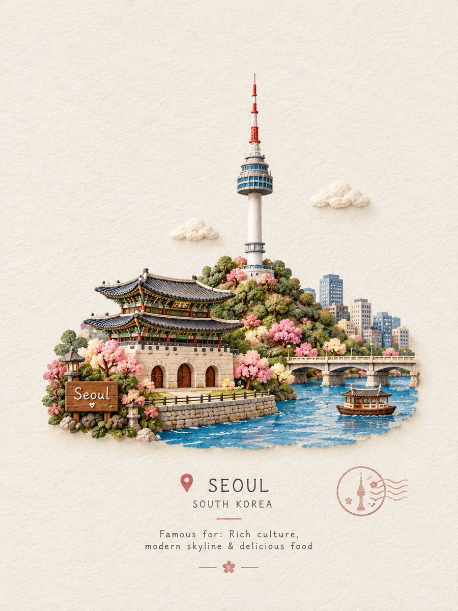

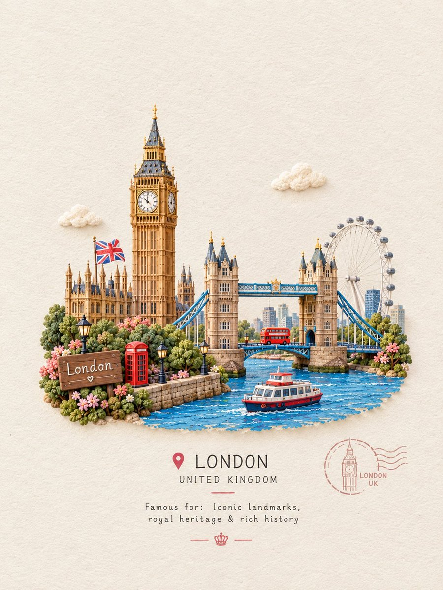

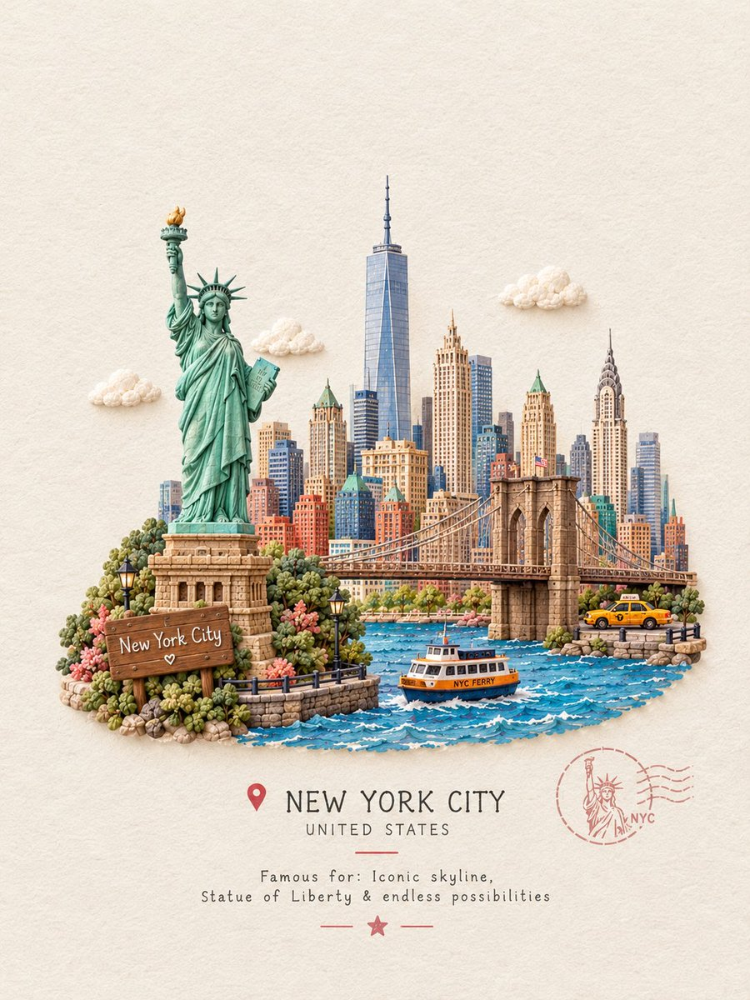

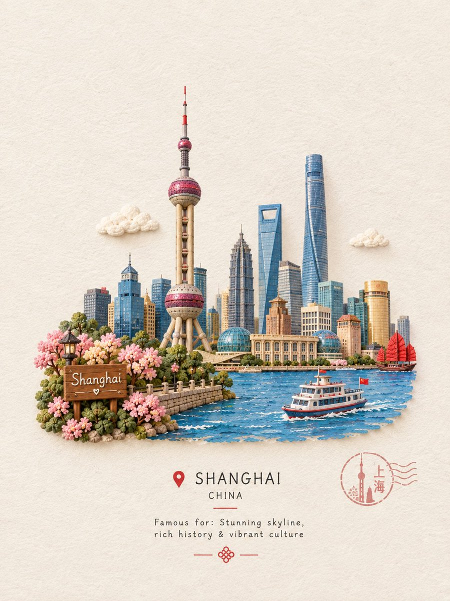

**Prompt**

```text
Crea una encantadora escena de viaje en miniatura hecha a mano que tenga a [ESTRUCTURA ICÓNICA] como punto focal principal.
Muestra el monumento como un diminuto modelo 3D hermosamente esculpido, con detalles suaves y redondeados, texturas artesanales, delicadas imperfecciones y una atmósfera caprichosa de cuento de hadas. Rodéalo de unos pocos elementos sutiles que representen su ubicación, tales como diminutos árboles, flores, calles, barcos, montañas, nubes u objetos locales, sin sobrecargar la escena.

Coloca todo sobre un fondo limpio de papel texturizado de color blanco cálido, con abundante y elegante espacio negativo. Añade una pequeña y elegante placa de viaje de madera o papel que contenga:

[NOMBRE DE LA ESTRUCTURA]
[CIUDAD, PAÍS]
Famoso por: [BREVE DATO ÚNICO]

Utiliza iluminación natural suave, sombras tenues, colores pastel pero realistas, profundidad de diorama en miniatura, texturas artesanales de arcilla/papel y una estética prémium y tierna de diario de viaje. Composición centrada, monumento con gran nivel de detalle, adorable pero sofisticado, diseño limpio y coleccionable de tarjeta de viaje, sin personas fotorrealistas, sin desorden.
```

[↑ Volver a categorías](#catalog)

---

<a name="prompt-2097580884098764800"></a>

### Crea un diorama 3D en miniatura tierno y de primera calidad de un monumento con texto de placa de recuerdo.

Autor：[@Naiknelofar788](https://x.com/Naiknelofar788) · [Publicación original](https://x.com/Naiknelofar788/status/2097580884098764800)

Renderizado 3D · Arquitectura / Interiores · Publicado

**Resumen:** Crea un diorama 3D en miniatura tierno y de primera calidad de un monumento con texto de placa de recuerdo.


**Prompt**

```text
Crea un diorama 3D en miniatura tierno y de primera calidad de [NOMBRE DE LA ESTRUCTURA], [CIUDAD, PAÍS]. Mantén el monumento reconocible, elegante y encantador, con una composición limpia, tonos pastel suaves, sutiles detalles artesanales, iluminación natural suave y una refinada estética de recuerdo de viaje.\n\nIncluye texto minimalista y de buen gusto:\n[NOMBRE DE LA ESTRUCTURA]\n[CIUDAD, PAÍS]\nFamoso por: [DESCRIPCIÓN CORTA]
```

[↑ Volver a categorías](#catalog)

---

<a name="prompt-2097587863139537262"></a>

### Captura de pantalla de juego en primera persona en la playa de un RPG romántico en 3D ficticio, que incluye a Morrigan Aensland y una interfaz de usuario HUD de juego completa.

Autor：[@underwoodxie96](https://x.com/underwoodxie96) · [Publicación original](https://x.com/underwoodxie96/status/2097587863139537262)

Diseño de aplicaciones / web · Renderizado 3D · Personaje · Publicado

Publicación original：[@underwoodxie96](https://x.com/underwoodxie96) · [Publicación original](https://x.com/underwoodxie96/status/2097554154554314891)

**Resumen:** Captura de pantalla de juego en primera persona en la playa de un RPG romántico en 3D ficticio, que incluye a Morrigan Aensland y una interfaz de usuario HUD de juego completa.


**Prompt**

```text
Por favor, captura una captura de pantalla realista de un juego de rol romántico de mundo abierto en 3D de próxima generación ficticio, presentado desde la perspectiva en primera persona del protagonista masculino. En la playa, Morrigan Aensland de Darkstalkers invita al protagonista a ayudarla a aplicarse protector solar. El estilo visual general debe presentar personajes en 3D renderizados con sombreado de estilo caricatura de alta calidad combinados con gráficos al nivel de Unreal Engine 5, logrando una fidelidad visual con calidad AAA. Debe incluir un modelado de personajes ultra detallado, sombreado de piel realista, iluminación cinematográfica, materiales PBR, texturas de ropa de alta precisión y entornos de aula finamente renderizados. La imagen final debe parecer una captura de pantalla real de un juego jugable, incluyendo una interfaz de usuario completa del juego: minimapa, visualización de misiones, barras de estado de los personajes, avisos de interacción, subtítulos de diálogo, elementos del HUD y más.
```

[↑ Volver a categorías](#catalog)

---

<a name="category-pixel-art"></a>

## Pixel Art

<a name="prompt-2097574111518375970"></a>

### Prompt para generar una hoja de sprites en pixel art basada en el personaje adjunto, que ilustra 4 acciones \(correr, saltar, ataque giratorio y caer\) con 4 fotogramas cada una.

Autor：[@npaka123](https://x.com/npaka123) · [Publicación original](https://x.com/npaka123/status/2097574111518375970)

Pixel Art · Personaje · Publicado

**Resumen:** Prompt para generar una hoja de sprites en pixel art basada en el personaje adjunto, que ilustra 4 acciones \(correr, saltar, ataque giratorio y caer\) con 4 fotogramas cada una.


**Prompt**

```text
Mantén consistentes la cara, el peinado, el atuendo, la paleta de colores y la contextura física del personaje adjunto, y genera 4 tipos de movimientos en pixel art que se vean bien en un juego, con un máximo de 4 fotogramas cada uno, en una sola imagen de hoja de sprites (sprite sheet). El tamaño de cada fotograma es de 256x256 px.
・Correr: inclina el cuerpo hacia adelante y mueve brazos y piernas alternadamente con amplitud.
・Saltar: agacharse → elevarse de un salto → abrir brazos y piernas en el aire → aterrizar.
・Ataque giratorio: frente → perfil → espalda → perfil opuesto, completando un giro entero de todo el cuerpo.
・Caer / ser derrotado: tambalearse → inclinarse hacia un lado → caer al suelo tendido → cerrar los ojos y quedar inmóvil.
Coloca cada acción en una fila horizontal, y alinea el tamaño de todas las celdas, la posición de los pies en el suelo, el centro y la escala. El fondo debe ser de un color completamente sólido, y no utilices sombras, texto, marcos, números, elementos de interfaz de usuario (UI), desenfoque, semitransparencias, degradados ni suavizado de bordes (antialiasing). Las animaciones en bucle deben conectarse de manera fluida y natural entre el inicio y el final.
```

[↑ Volver a categorías](#catalog)

---

<a name="prompt-2097573967955730524"></a>

### Instrucción para generar una hoja de sprites basada en una imagen de referencia, con 4 tipos de acciones de pixel art para videojuegos \(correr, saltar, ataque giratorio y caer\) organizadas en 4 fotogramas cada una.

Autor：[@npaka123](https://x.com/npaka123) · [Publicación original](https://x.com/npaka123/status/2097573967955730524)

Pixel Art · Personaje · Publicado

**Resumen:** Instrucción para generar una hoja de sprites basada en una imagen de referencia, con 4 tipos de acciones de pixel art para videojuegos \(correr, saltar, ataque giratorio y caer\) organizadas en 4 fotogramas cada una.


**Prompt**

```text
Manteniendo la uniformidad en el rostro, peinado, atuendo, paleta de colores y contextura del personaje adjunto, genera una sola imagen de hoja de sprites con 4 tipos de movimientos en pixel art ideales para videojuegos, cada uno de hasta 4 fotogramas. El tamaño de cada fotograma es de 256x256 px.
・Correr: inclina el cuerpo hacia adelante y mueve brazos y piernas alternadamente de forma amplia.
・Saltar: agacharse → saltar hacia arriba → extender brazos y piernas en el aire → aterrizar.
・Ataque giratorio: frente → perfil → espalda → perfil opuesto, completando un giro entero del cuerpo.
・Caer / ser derrotado: tambalearse → inclinarse hacia un lado → caer al suelo → cerrar los ojos y quedarse inmóvil.
Organiza una acción por fila en una sola línea horizontal, alineando el tamaño de todas las celdas, el nivel de los pies, el centro y la escala. El fondo debe ser de un color completamente sólido, sin sombras, texto, marcos, números, interfaz de usuario (UI), desenfoques, semitransparencias, degradados ni suavizado de bordes (anti-aliasing). Las animaciones en bucle deben conectar de manera natural el inicio y el final.
```

[↑ Volver a categorías](#catalog)

---

<a name="prompt-2097559943075533257"></a>

### Instrucción de bucle de animación de hoja de sprites de 16 fotogramas de un duende masculino en pixel art disparando un arco.

Autor：[@Fomsky\_Wei](https://x.com/Fomsky_Wei) · [Publicación original](https://x.com/Fomsky_Wei/status/2097559943075533257)

Pixel Art · Publicado

**Resumen:** Instrucción de bucle de animación de hoja de sprites de 16 fotogramas de un duende masculino en pixel art disparando un arco.


**Prompt**

```text
No uses habilidades, crea una hoja de sprites
Esta imagen contiene el proceso de un duende masculino en estilo pixel art tensando un arco y disparando una flecha
En total 16 fotogramas.
Luego corta esta imagen y conviértela en un gif en bucle infinito
```

[↑ Volver a categorías](#catalog)

---

<a name="category-watercolor"></a>

## Acuarela

<a name="prompt-2097637962137895058"></a>

### Prompt para transformar una foto al estilo de ilustración de diario de viaje hecho a mano con lápices de colores y acuarela retro

Autor：[@tataemugc](https://x.com/tataemugc) · [Publicación original](https://x.com/tataemugc/status/2097637962137895058)

Ilustración · Acuarela · Retro / Vintage · Publicado

Publicación original：[@Crypto\_QianXun](https://x.com/Crypto_QianXun) · [Publicación original](https://x.com/Crypto_QianXun/status/2097174853707284785)

**Resumen:** Prompt para transformar una foto al estilo de ilustración de diario de viaje hecho a mano con lápices de colores y acuarela retro


**Prompt**

```text
Transforma la foto en un estilo de diario de viaje dibujado a mano con lápices de colores y acuarela. Mantén la composición original, los edificios, las personas, los árboles, el pasto, el camino y la perspectiva intactos. Usa un papel envejecido de color beige cálido para dar una sensación de dibujo a mano donde se noten los trazos de pluma y el sangrado de la acuarela. Simplifica los edificios en formas expresivas, añadiendo contornos sueltos, tramas cruzadas detalladas y bordes ligeramente imperfectos. Conserva la atmósfera de un día claro de verano, un cielo azul suave, edificios de color beige cálido, pasto verde y personas y bancas dispersas y relajadas. Usa tonos de boceto de viaje vintage desteñido. Coloca la ilustración en la mitad inferior de la página y deja un amplio espacio beige en la parte superior. Escribe a mano en la parte superior '맑은 날씨' y en la parte inferior '— 소중한 순간 —'. Con un estilo de revista de viajes artística y nostálgica, como el recuerdo de un cuaderno de bocetos personal, sin ningún aspecto fotográfico.
```

[↑ Volver a categorías](#catalog)

---

<a name="category-retro-vintage"></a>

## Retro / Vintage

<a name="prompt-2097628670143954978"></a>

### Crear póster de diario de viaje de dos paneles: escena callejera realista arriba, estilo de ilustración vintage con la misma composición abajo, con tipografía.

Autor：[@Alina\_with\_Ai](https://x.com/Alina_with_Ai) · [Publicación original](https://x.com/Alina_with_Ai/status/2097628670143954978)

Póster / Volante · Fotografía · Ilustración · Retro / Vintage · Paisaje urbano / Calle · Texto / Tipografía · Publicado

**Resumen:** Crear póster de diario de viaje de dos paneles: escena callejera realista arriba, estilo de ilustración vintage con la misma composición abajo, con tipografía.

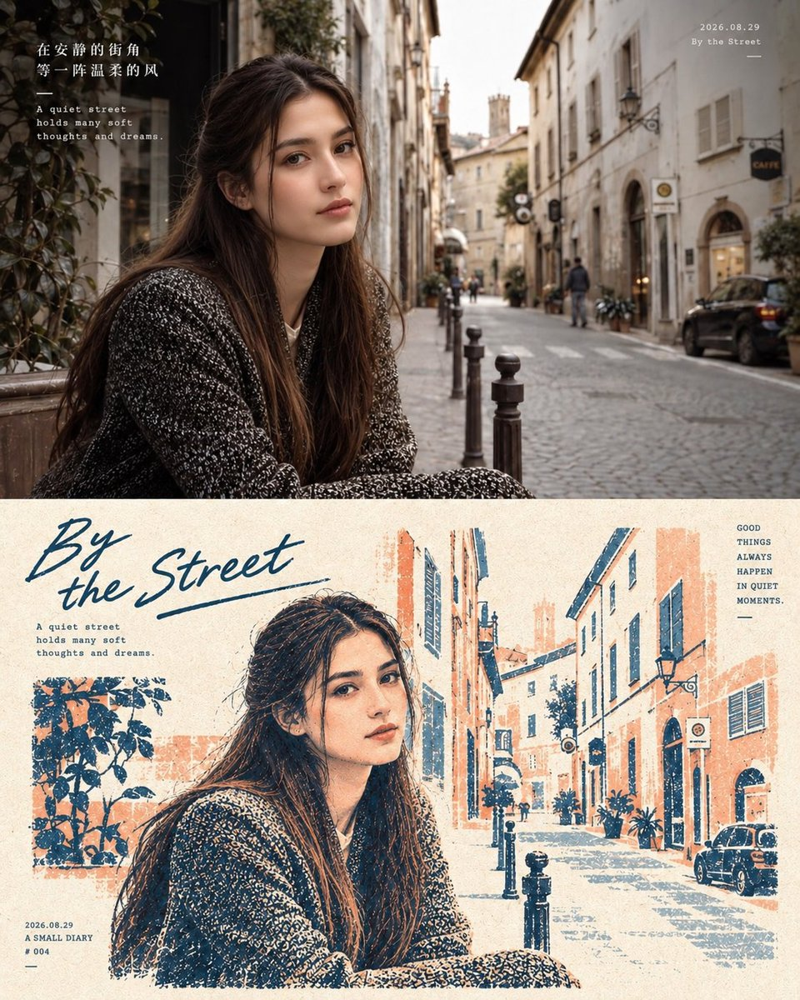

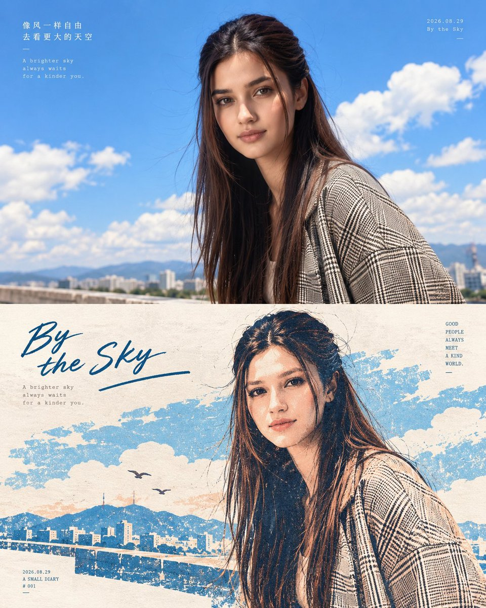

**Prompt**

```text
Crea un póster realista de diario de viaje editorial de dos paneles utilizando la primera imagen como la composición/referencia exacta y la segunda imagen subida como referencia facial.

Reemplaza a la mujer del póster original con la mujer de mi foto de referencia. Conserva mi identidad facial y mis rasgos faciales reconocibles con precisión: forma del rostro, ojos, cejas, nariz, labios, tono de piel y proporciones naturales. No embellezcas, alteres ni rediseñes mi rostro.

PANEL SUPERIOR

Recrea la escena callejera original exactamente:

Calle estrecha de adoquines de estilo europeo

Edificios históricos de color crema

Letreros de cafeterías, ventanas, balcones, farolas y bolardos

El mismo ángulo de cámara, encuadre, perspectiva y composición

La misma pose sentada/inclinada y posición corporal

El mismo suéter/abrigo texturizado negro

Cabello largo y oscuro natural

Luz diurna cinemática y suave

Textura de piel fotorrealista e iluminación realista

Integra mi rostro de forma natural con la pose original, el ángulo de la cabeza y la iluminación

PANEL INFERIOR

Crea la versión de ilustración a juego dibujada a mano/impresa de la misma escena.

Mantén la misma pose, ropa, peinado e identidad facial

Convierte la fotografía en una ilustración editorial vintage con textura

Paleta de tinta en azul, crema y naranja cálido apagado

Grano de papel visible y textura de tinta imperfecta

Mantén mis rasgos faciales reconocibles mientras se adaptan al estilo ilustrado

Conserva la calle, los edificios, las plantas, los autos y la perspectiva del original

TIPOGRAFÍA Y DISEÑO

Conserva el diseño del póster original y el estilo tipográfico:

Título grande escrito a mano: “By the Street”

Texto pequeño de diario en inglés

Texto en chino en la parte superior izquierda

Fecha: 2026.08.29

Número/detalles pequeños de diario

Frase del lado derecho: “GOOD THINGS ALWAYS HAPPEN IN QUIET MOMENTS.”

Lo más importante: Mi rostro debe ser la única identidad facial utilizada. No copies el rostro de la mujer original. Mantén la composición general del póster, la pose, la ropa, el fondo y el estilo artístico lo más cerca posible de la referencia. Integración facial de alta calidad, natural y fluida, panel superior fotorrealista y panel inferior de ilustración impresa auténtica.
```

[↑ Volver a categorías](#catalog)

---

<a name="prompt-2097185580224491672"></a>

### Retrato editorial retro de moda urbana de los 90, hombre recargado en un auto clásico americano, con una pared urbana desgastada de Oakland de fondo.

Autor：[@harboriis](https://x.com/harboriis) · [Publicación original](https://x.com/harboriis/status/2097185580224491672)

Fotografía · Retro / Vintage · Retrato / Selfie · Personaje · Artículo de moda · Vehículo · Paisaje urbano / Calle · Resumen / Antecedentes · Publicado

**Resumen:** Retrato editorial retro de moda urbana de los 90, hombre recargado en un auto clásico americano, con una pared urbana desgastada de Oakland de fondo.


**Prompt**

```text
Crea una fotografía editorial de moda urbana vertical 9:16 ultrarrealista de un hombre joven con cabello oscuro, rizado y grueso, usando lentes de sol negros, una playera polo oversize en tonos crema y negro con letras universitarias en negrita «OAKLAND» y texto deportivo más pequeño abajo, pantalones holgados tipo cargo negros, tenis blancos y un reloj de pulsera de metal clásico. Está recargado casualmente contra la parte delantera de un auto clásico americano con las manos en los bolsillos y una pierna cruzada sobre la otra.
Ambienta la escena en una calle urbana rústica con un edificio viejo y desgastado detrás de él. Agrega una gran tipografía descolorida en la pared que diga «OAKLAND», con «CALIFORNIA» y «EST. 1852» abajo. Luz cálida de atardecer, paleta de colores tenues en marrón y beige, grano de película sutil, sombras suaves, estética nostálgica de moda urbana de los años 90, textura de piel realista, pose natural, profundidad de campo cinematográfica, auto clásico detallado, auténtica fotografía editorial.
Composición de cuerpo completo, cámara a nivel de los ojos en ángulo bajo, lente de 35 mm, iluminación cinematográfica cálida, fotorrealista, alto detalle, 4K.
```

[↑ Volver a categorías](#catalog)

---

<a name="category-minimalism"></a>

## Minimalismo

<a name="prompt-2097628383362597075"></a>

### Generar una infografía de guía de quiromancia en un estilo de revista minimalista en color blanco hueso.

Autor：[@hahazwei](https://x.com/hahazwei) · [Publicación original](https://x.com/hahazwei/status/2097628383362597075)

Infografía / Visual educativo · Minimalismo · Publicado

**Resumen:** Generar una infografía de guía de quiromancia en un estilo de revista minimalista en color blanco hueso.

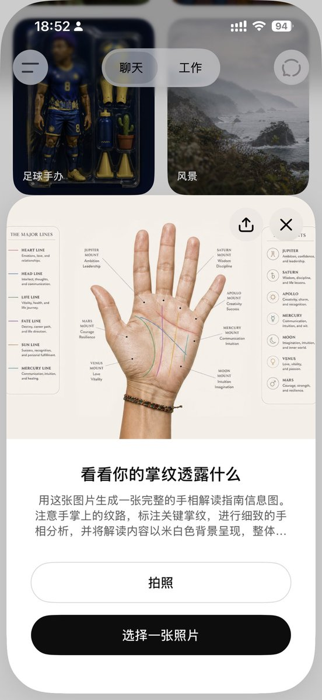

**Prompt**

```text
Usa esta imagen para generar una infografía completa de guía de lectura de quiromancia. Presta atención a las líneas de la palma, etiqueta las líneas clave, realiza un análisis quiromántico detallado y presenta las interpretaciones sobre un fondo color blanco hueso, con un estilo editorial de revista limpio, minimalista y lujoso en general. Utiliza líneas finas, tarjetas con esquinas redondeadas y un espacio en blanco refinado para crear una textura sofisticada y de alta gama. Enfócate principalmente en la lectura quiromántica en sí.
```

[↑ Volver a categorías](#catalog)

---

<a name="prompt-2097622528340668736"></a>

### Retrato realista en ángulo picado de una joven mujer del este de Asia en bikini rosa frente a un fondo gris minimalista.

Autor：[@catgirlcozy](https://x.com/catgirlcozy) · [Publicación original](https://x.com/catgirlcozy/status/2097622528340668736)

Minimalismo · Retrato / Selfie · Personaje · Resumen / Antecedentes · Publicado

**Resumen:** Retrato realista en ángulo picado de una joven mujer del este de Asia en bikini rosa frente a un fondo gris minimalista.

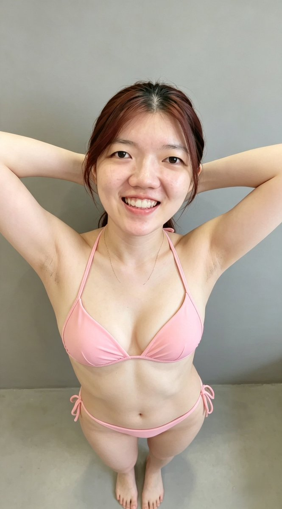

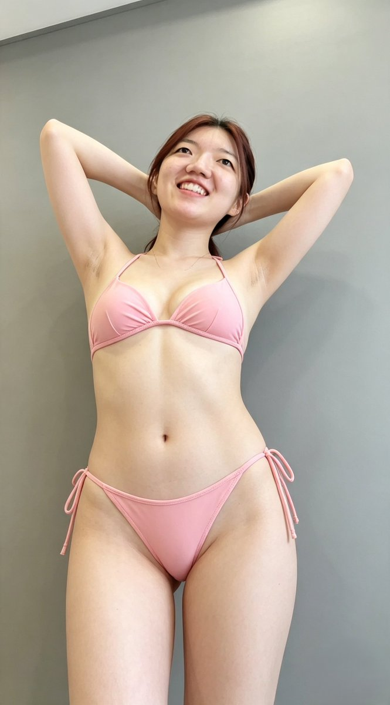

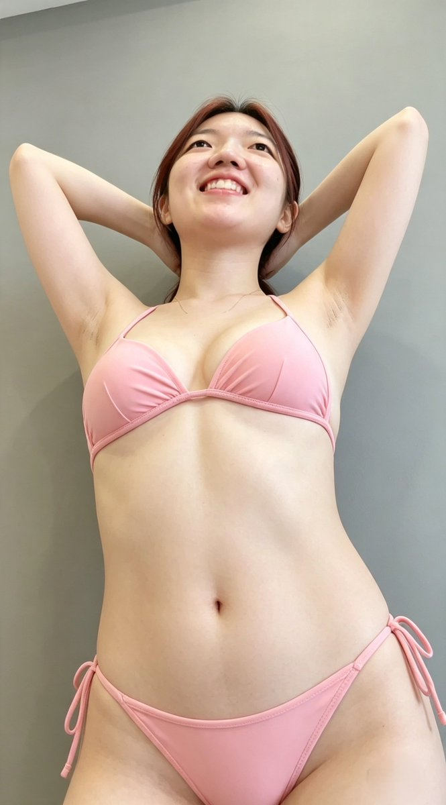

**Prompt**

```text
Toma en ángulo picado de 35 grados, una joven y auténtica mujer del este de Asia con cabello castaño rojizo, mirando a la cámara, con las manos detrás de la cabeza, los codos abiertos hacia los lados, mostrando una sonrisa amplia, radiante y sincera mostrando los dientes, con las manos en la cabeza. Viste un bikini de tiras rosa y un fino collar de oro, descalza frente a un fondo minimalista de concreto gris. Luz natural interior suave, estilo de instantánea de retrato de estilo de vida con textura auténtica.
```

[↑ Volver a categorías](#catalog)

---

<a name="prompt-2097204639863287913"></a>

### Prompt de fondo de pantalla y póster de mujer frente a ventana en celosía con nuevo estilo chino y zen oriental, combinando tonos verde jade celadón, magenta y blanco cálido.

Autor：[@liyue\_ai](https://x.com/liyue_ai) · [Publicación original](https://x.com/liyue_ai/status/2097204639863287913)

Póster / Volante · Minimalismo · Personaje · Resumen / Antecedentes · Publicado

Publicación original：[@liyue\_ai](https://x.com/liyue_ai) · [Publicación original](https://x.com/liyue_ai/status/2096838519918596234)

**Resumen:** Prompt de fondo de pantalla y póster de mujer frente a ventana en celosía con nuevo estilo chino y zen oriental, combinando tonos verde jade celadón, magenta y blanco cálido.


**Prompt**

```text
Dirección temática: Póster de portada minimalista de estilo zen oriental
Rama estilística: Nuevo estilo chino con estética femenina
Contenido principal: Una mujer de estilo tradicional chino de pie frente a una ventana en celosía floral, con una postura serena y reservada
Motivo emocional: Elegante, suave, sensación de lujo sutil
Escena e imaginería: Ventana en celosía de color verde jade celadón, sombras de flores color magenta rojizo, pared blanco cálido, mujer, mínimos detalles en dorado claro
Composición y espacio: Composición vertical 9:16, la ventana en celosía se ubica en la parte media superior, la figura en la parte media inferior, manteniendo una zona de título limpia en la parte superior
Control de color: Blanco cálido como base luminosa, verde jade celadón para la celosía y pequeñas estructuras de fondo, magenta rojizo para sombras florales y acentos específicos, dorado claro solo para brillos mínimos de adornos, vestimenta del personaje en blanco perla o blanco rosáceo pálido; evitar que toda la imagen sea solo verde jade o toda magenta
Luz y textura: Luz natural suave, colores vivos y translúcidos, estética limpia de póster gráfico plano
Relación de aspecto: 9:16
Requisitos adicionales: El conjunto debe transmitir la sensación de una portada del nuevo estilo chino de alta belleza visual, refinada pero sin exceso de ornamentación
```

[↑ Volver a categorías](#catalog)

---

<a name="prompt-2096807576168169628"></a>

### Genera un póster editorial díptico 3:4 a partir de las fotos subidas: la mitad superior conserva la foto original y la mitad inferior se transforma en una pequeña ilustración minimalista dibujada a mano.

Autor：[@Sairah\_0](https://x.com/Sairah_0) · [Publicación original](https://x.com/Sairah_0/status/2096807576168169628)

Póster / Volante · Ilustración · Minimalismo · Publicado

**Resumen:** Genera un póster editorial díptico 3:4 a partir de las fotos subidas: la mitad superior conserva la foto original y la mitad inferior se transforma en una pequeña ilustración minimalista dibujada a mano.


**Prompt**

```text
Crea UN póster editorial independiente de alta gama para CADA foto subida. Nunca combines fotos. Cada foto debe convertirse en un póster independiente.

FORMATO
Estrictamente vertical 3:4. Divide el lienzo en dos secciones horizontales exactamente iguales del 50%.

50% SUPERIOR — FOTO ORIGINAL
Conserva la foto fielmente: identidad, rostro, proporciones corporales, pose, ropa, objetos, composición, iluminación, sombras, atmósfera y colores. Mantenla fotorrealista con una sutil gradación de color editorial prémium. Extiende el fondo de manera fluida si es necesario; nunca distorsiones ni alteres al sujeto.

50% INFERIOR — ILUSTRACIÓN MÍNIMA
Reinterpreta los elementos más reconocibles como una ilustración en papel pequeña, centrada y dibujada a mano que ocupe solo del 10 al 20% de la mitad inferior. Conserva el sujeto clave, la silueta, la pose, los objetos y la narrativa.

Usa líneas delicadas e imperfectas, formas planas y llamativas de estilo acrílico, grano de papel rugoso, trazos de pincel hechos a mano y bordes orgánicos. Mantén el fondo en blanco cálido/blanco roto con un generoso espacio negativo.

COLOR
Extrae los colores dominantes de la foto original y redúcelos a un máximo de 4 colores sobrios y armoniosos.

TIPOGRAFÍA
Texto editorial mínimo opcional, como un título corto, ubicación, año o palabra clave. No fuerces el texto si no es necesario.

ESTILO
Tranquilo, poético, refinado, minimalista, inocente, artístico, reflexivo, prémium y altamente reconocible, como el de un libro de arte contemporáneo o la portada de una publicación editorial independiente.
```

[↑ Volver a categorías](#catalog)

---

<a name="category-other"></a>

## Otros

<a name="prompt-2097710368542146635"></a>

### Traducción en curso

Autor：[@shitunote](https://x.com/shitunote) · [Publicación original](https://x.com/shitunote/status/2097710368542146635)

Póster / Volante · Publicado

Publicación original：[@shitunote](https://x.com/shitunote) · [Publicación original](https://x.com/shitunote/status/2096740511612797206)

**Resumen:** Traducción en curso


**Prompt**

```text
Traducción en curso
```

[↑ Volver a categorías](#catalog)

---

<a name="prompt-2097665256424349855"></a>

### Traducción en curso

Autor：[@cnyzgkc](https://x.com/cnyzgkc) · [Publicación original](https://x.com/cnyzgkc/status/2097665256424349855)

Infografía / Visual educativo · Diagrama / Gráfico · Publicado

**Resumen:** Traducción en curso

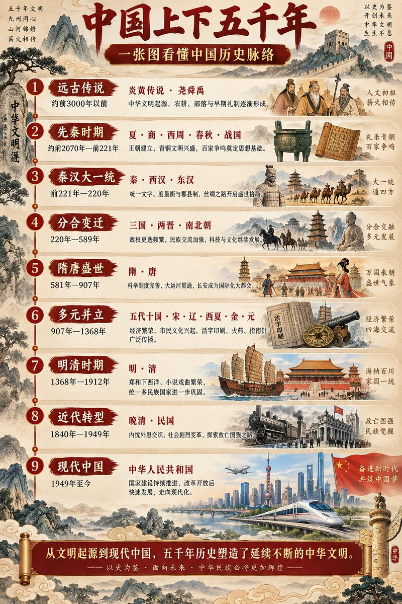

**Prompt**

```text
Traducción en curso
```

[↑ Volver a categorías](#catalog)

---

<a name="prompt-2097611216139235779"></a>

### Generación de cuadrícula de 3x3 con 9 emojis de expresiones múltiples en chino e inglés basada en una imagen de referencia de personaje.

Autor：[@DeepBlueX0](https://x.com/DeepBlueX0) · [Publicación original](https://x.com/DeepBlueX0/status/2097611216139235779)

Personaje · Publicado

Publicación original：[@DeepBlueX0](https://x.com/DeepBlueX0) · [Publicación original](https://x.com/DeepBlueX0/status/2097258933928796451)

**Resumen:** Generación de cuadrícula de 3x3 con 9 emojis de expresiones múltiples en chino e inglés basada en una imagen de referencia de personaje.

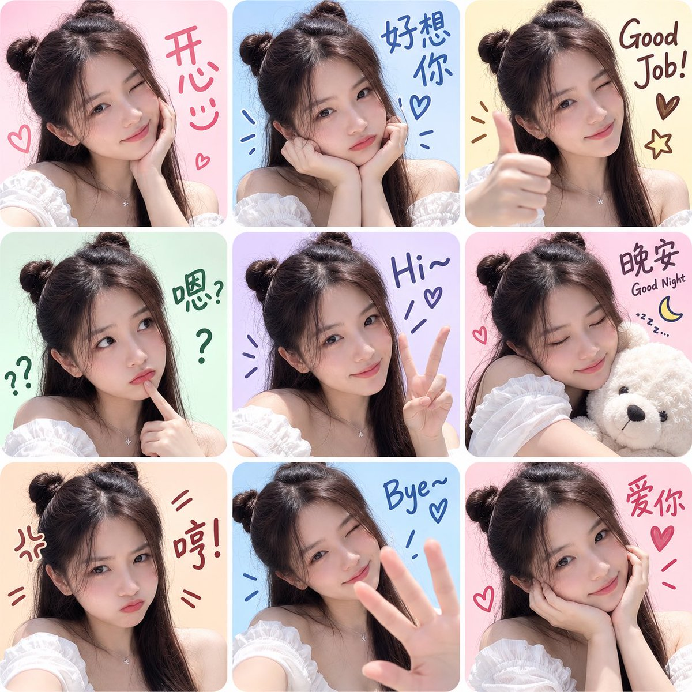

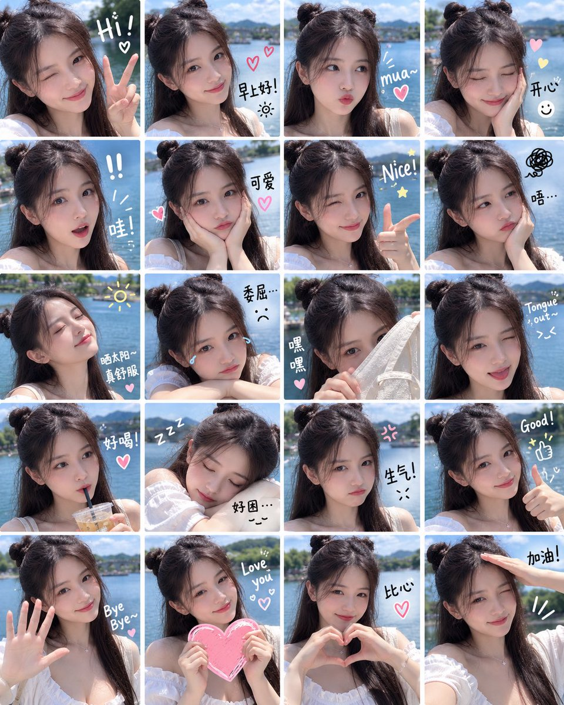

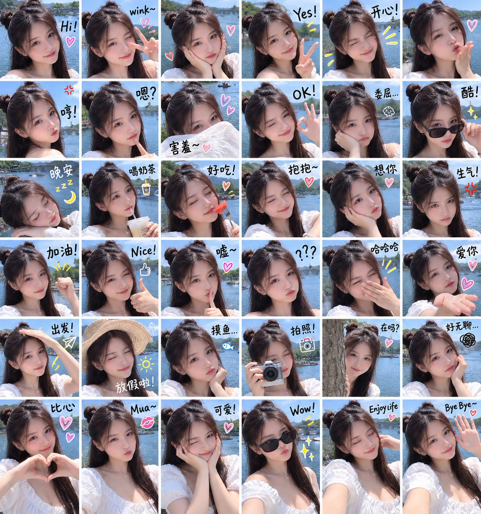

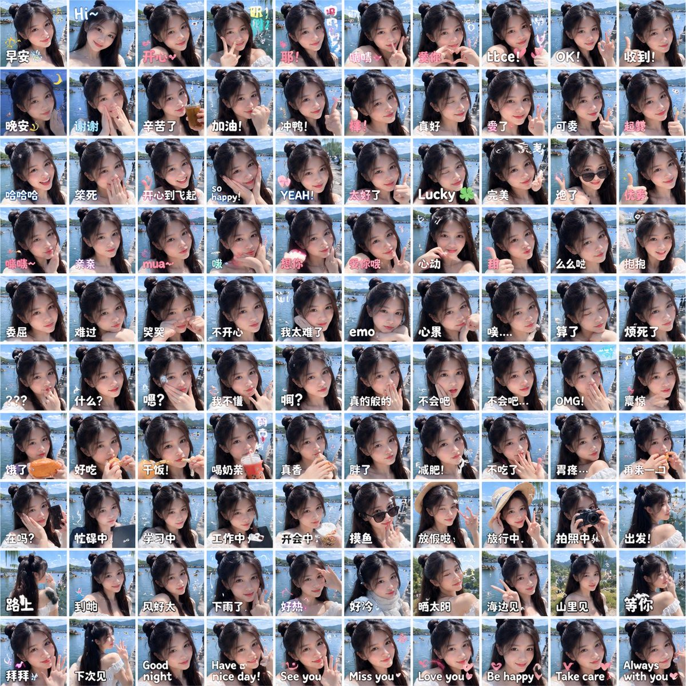

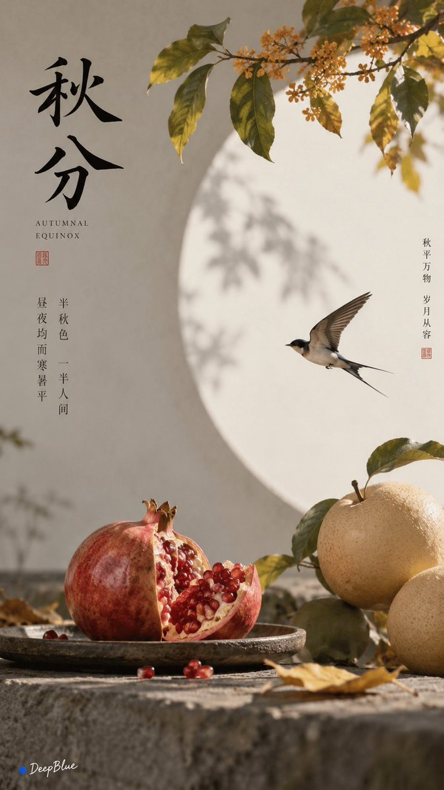

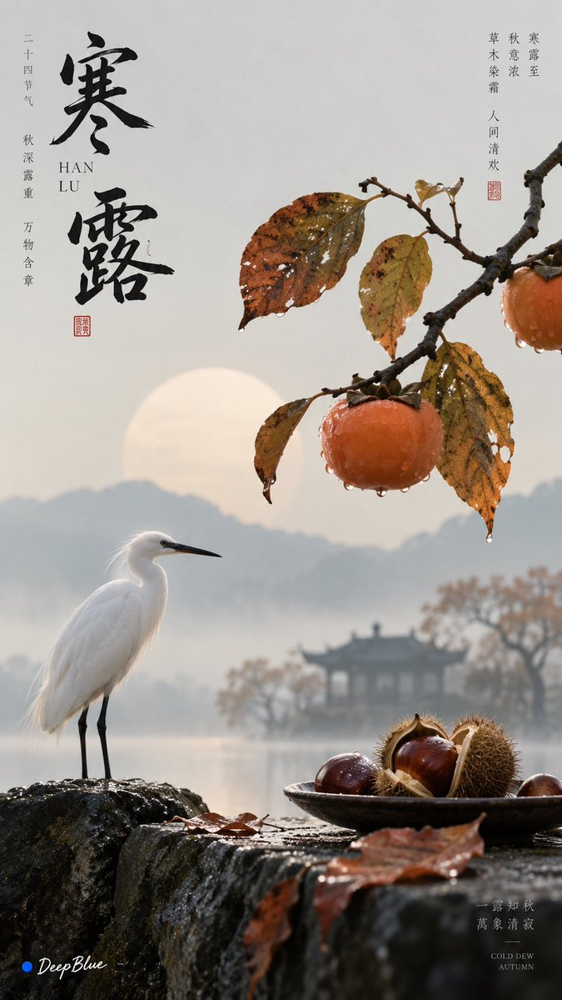

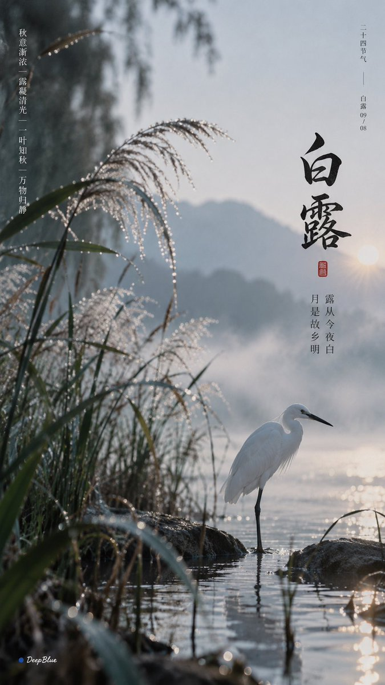

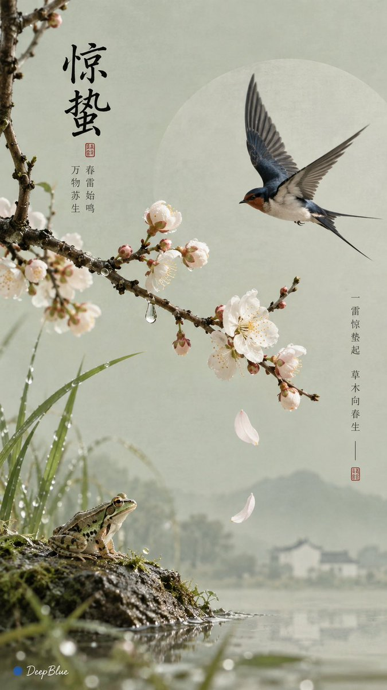

**Prompt**

```text
Haciendo referencia al personaje de la imagen, genera una cuadrícula de 3*3 con un total de 9 emojis/stickers de expresiones diferentes, puede incluir texto en chino e inglés, fondo degradado claro
```

[↑ Volver a categorías](#catalog)

---

<a name="prompt-2097631043004273061"></a>

### Animación de Cristiano Ronaldo comiendo shawarma.

Autor：[@royalpinto007](https://x.com/royalpinto007) · [Publicación original](https://x.com/royalpinto007/status/2097631043004273061)

Otros · Publicado

Publicación original：[@gabrielchua](https://x.com/gabrielchua) · [Publicación original](https://x.com/gabrielchua/status/2097546354373603554)

**Resumen:** Animación de Cristiano Ronaldo comiendo shawarma.

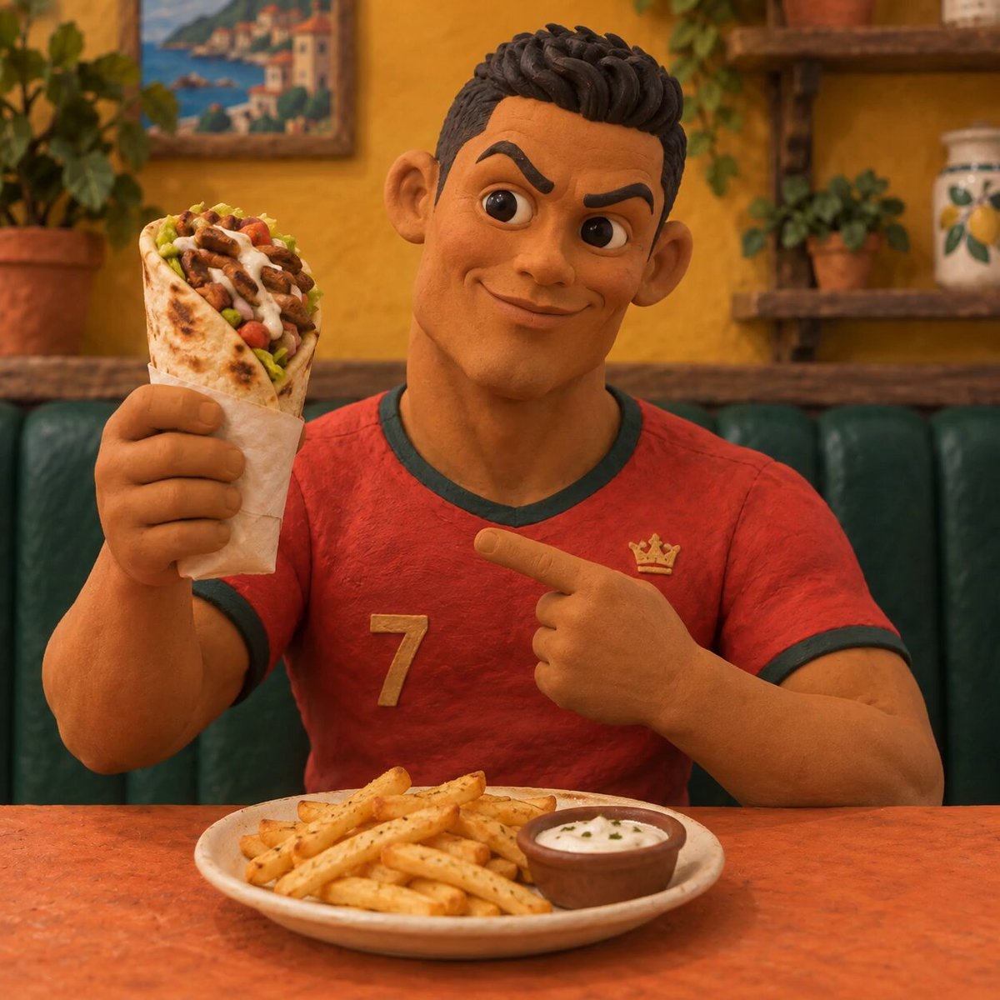

**Prompt**

```text
Cristiano Ronaldo comiendo shawarma
```

[↑ Volver a categorías](#catalog)

---

<a name="prompt-2097582500273115191"></a>

### Traducción en curso

Autor：[@ky6001481673691](https://x.com/ky6001481673691) · [Publicación original](https://x.com/ky6001481673691/status/2097582500273115191)

Retrato / Selfie · Personaje · Artículo de moda · Publicado

**Resumen:** Traducción en curso


**Prompt**

```text
Traducción en curso
```

[↑ Volver a categorías](#catalog)

---

<a name="prompt-2097558679956664521"></a>

### Retrato de terror cibernético que presenta a un humanoide demacrado con una máscara de porcelana agrietada, cables en la cabeza e iluminación monocromática de alto contraste.

Autor：[@meng\_dagg695](https://x.com/meng_dagg695) · [Publicación original](https://x.com/meng_dagg695/status/2097558679956664521)

Retrato / Selfie · Publicado

**Resumen:** Retrato de terror cibernético que presenta a un humanoide demacrado con una máscara de porcelana agrietada, cables en la cabeza e iluminación monocromática de alto contraste.


**Prompt**

```text
Retrato de terror cibernético, figura humanoide demacrada con máscara agrietada similar a una calavera de porcelana blanca, cuencas oculares huecas y asimétricas (un vacío hundido, un anillo metálico empotrado), dientes expuestos e irregulares, rodeada por una caótica maraña de cables negros gruesos y accesorios de bobinas industriales cableados a la cabeza, prenda superior de tela oscura y andrajosa, iluminación dramática en clave baja, fondo negro profundo, monocromo de alto contraste, fotografía de terror, cinemático, textura hiperdetallada, lente de 85 mm, profundidad de campo reducida.
```

[↑ Volver a categorías](#catalog)

---

<a name="prompt-2097519422407872858"></a>

### Video de estudio en plataforma giratoria de un caballo de ajedrez de madera tallada que gira suavemente 360 grados.

Autor：[@higgsfield](https://x.com/higgsfield) · [Publicación original](https://x.com/higgsfield/status/2097519422407872858)

Producto · Publicado

**Resumen:** Video de estudio en plataforma giratoria de un caballo de ajedrez de madera tallada que gira suavemente 360 grados.


**Prompt**

```text
Crea un video fotorrealista de estudio estilo plataforma giratoria de un caballo de ajedrez de madera pulida.

El caballo tiene una silueta de caballo tallada minimalista: lados anchos y planos, un hocico alargado y redondeado, un diminuto ojo oscuro, una oreja angular y un cuello suavemente curvado. Una inserción lisa de color marrón oscuro sigue la crin a lo largo del lomo. La figura se apoya sobre una amplia base circular de madera con varios anillos concéntricos escalonados.

Usa madera marrón cálida con vetas verticales claramente visibles, bordes suavemente redondeados y un acabado de laca brillante. Conserva la forma exacta, las proporciones, las vetas de la madera y la inserción oscura de la crin durante todo el video.

Toda la pieza de ajedrez, incluida su base, gira suavemente a través de un giro completo de 360 grados alrededor de su eje vertical a una velocidad constante. Se mantiene perfectamente centrada y firme sobre la superficie. El primer y el último fotograma coinciden para crear un bucle perfecto.

Mantén la cámara completamente fija, mirando ligeramente hacia abajo a la pieza. Muestra todo el objeto con un pequeño margen arriba y abajo. Usa un fondo y suelo de estudio gris claro continuo, iluminación suave y difusa, reflejos tenues en la laca y una sutil sombra de contacto debajo de la base.

Duración: 3 segundos. Velocidad de fotogramas: 30 fps. Composición cuadrada 1:1.

Sin movimiento de cámara, zoom, cortes, oscilaciones, flotación, deformación, proporciones cambiantes, texturas de madera deslizantes, parpadeos, objetos adicionales, texto o logotipos.
```

[↑ Volver a categorías](#catalog)

---

<a name="prompt-2097513469172129825"></a>

### Retrato en ángulo picado de una mujer esbelta que viste un qipao floral con una iluminación suave y de ensueño y un maquillaje delicado.

Autor：[@BubbleBrain](https://x.com/BubbleBrain) · [Publicación original](https://x.com/BubbleBrain/status/2097513469172129825)

Retrato / Selfie · Personaje · Publicado

**Resumen:** Retrato en ángulo picado de una mujer esbelta que viste un qipao floral con una iluminación suave y de ensueño y un maquillaje delicado.


**Prompt**

```text
9:16, vistiendo un qipao, suave resplandor de luz, desenfoque de ensueño, toma en ángulo picado mirando hacia abajo, figura de modelo alta y esbelta, maquillaje refinado, rostro de belleza simiesca y felina parecida a un zorro
```

[↑ Volver a categorías](#catalog)

---

<a name="prompt-2097486896750338125"></a>

### Plantilla de instrucciones imagen a imagen para mantener la iluminación, la textura y la composición a partir de una imagen de referencia, rediseñando el personaje y la temática.

Autor：[@nanyuan0412](https://x.com/nanyuan0412) · [Publicación original](https://x.com/nanyuan0412/status/2097486896750338125)

Personaje · Publicado

**Resumen:** Plantilla de instrucciones imagen a imagen para mantener la iluminación, la textura y la composición a partir de una imagen de referencia, rediseñando el personaje y la temática.


**Prompt**

```text
Usa la imagen adjunta como referencia del esquema fotográfico. Mantén su relación de exposición, dirección de la luz, textura de las telas y ritmo de composición; rediseña el personaje y la paleta de colores temática. El personaje debe ser un adulto, sin copiar el rostro de la persona de referencia. Tras la generación, compárala con la imagen original para verificar: ¿se cambió arbitrariamente la iluminación, se hizo la ropa más gruesa o se suavizó la piel en exceso?
```

[↑ Volver a categorías](#catalog)

---

<a name="prompt-2097533103376081383"></a>

### Retrato de moda de un joven elegante con gafas de sol y chamarra de mezclilla haciendo el gesto de 'shh' frente a una pared grunge.

Autor：[@Aiwithamirr1](https://x.com/Aiwithamirr1) · [Publicación original](https://x.com/Aiwithamirr1/status/2097533103376081383)

Retrato / Selfie · Personaje · Artículo de moda · Publicado

**Resumen:** Retrato de moda de un joven elegante con gafas de sol y chamarra de mezclilla haciendo el gesto de 'shh' frente a una pared grunge.


**Prompt**

```text
Crea un retrato de moda cinematográfico y ultrarrealista de un joven elegante con cabello oscuro, grueso y voluminoso, y una barba prolijamente recortada, que lleva gafas de sol negras con armazón rojo, una camiseta negra, una chamarra de mezclilla negra desgastada y un collar de placa de identificación militar de metal. Sostiene un dedo verticalmente contra sus labios en un gesto confiado de "shh". Iluminación de estudio cálida y dramática, detalles faciales nítidos, fuerte contraste, estética de moda urbana ruda. El fondo presenta una pared vintage desgastada con secciones verticales de pintura en verde azulado intenso, crema y rojo, textura grunge pesada, salpicaduras de pintura y pintura negra goteando. Composición centrada, retrato de cintura para arriba, fotografía de moda editorial, alto detalle, textura de piel realista, poca profundidad de campo, 4K, melancólico y elegante, calidad de póster.
```

[↑ Volver a categorías](#catalog)

---

<a name="prompt-2097543193651007508"></a>

### Un prompt detallado para crear una infografía profesional en formato 9:16 al estilo de una revista de belleza coreana titulada 'Makeup Analysis Guide' basada en un retrato de referencia, que incluye análisis facial en primer plano, muestras de color y pasos de maquillaje estructurados.

Autor：[@ayzalnooor24521](https://x.com/ayzalnooor24521) · [Publicación original](https://x.com/ayzalnooor24521/status/2097543193651007508)

Infografía / Visual educativo · Retrato / Selfie · Publicado

**Resumen:** Un prompt detallado para crear una infografía profesional en formato 9:16 al estilo de una revista de belleza coreana titulada 'Makeup Analysis Guide' basada en un retrato de referencia, que incluye análisis facial en primer plano, muestras de color y pasos de maquillaje estructurados.


**Prompt**

```text
Hermosa chica coreana con rasgos suaves y naturales, vestida con un atuendo negro y gafas transparentes, con un estilo limpio y moderno de editorial de belleza. Crea una infografía profesional titulada “MAKEUP ANALYSIS GUIDE” utilizando el retrato subido como referencia visual principal. Conserva los rasgos faciales originales, el peinado, la textura de la piel, las gafas y la reconocibilidad natural sin retoques excesivos. Destaca los ojos, las cejas, la nariz, las mejillas y los labios rosas brillantes con elegantes paneles de detalles en primer plano y sutiles líneas señaladoras. Agrega una paleta refinada de colores de maquillaje en tonos neutros cálidos, rosa suave y marrón tenue con pequeñas muestras de color de belleza. Incluye secciones concisas para Makeup Steps, Best Makeup Looks, Key Products y Quick Tips con texto mínimo y legible. Utiliza una estética prémium de revista de belleza coreana con tipografía limpia, detalles en beige suave, fondo editorial oscuro y un espaciado equilibrado. Haz que la composición final sea pulida, sofisticada, fotorrealista y en formato vertical 9:16, con la sensación general de “Same You, Just More Polished”.
```

[↑ Volver a categorías](#catalog)

---

<a name="prompt-2096914920915001598"></a>

### Foto espontánea de teléfono inteligente de una joven mujer de Asia oriental con una sudadera gris y jeans sentada en la terraza con jardín soleada de un balcón.

Autor：[@Aqsahere\_](https://x.com/Aqsahere_) · [Publicación original](https://x.com/Aqsahere_/status/2096914920915001598)

Personaje · Publicado

**Resumen:** Foto espontánea de teléfono inteligente de una joven mujer de Asia oriental con una sudadera gris y jeans sentada en la terraza con jardín soleada de un balcón.


**Prompt**

```text
Una foto espontánea de teléfono inteligente completamente natural y fotorrealista de una joven mujer de Asia oriental sentada cómodamente con las piernas cruzadas en la terraza con jardín de un balcón. Tiene el cabello largo, naturalmente ondulado y castaño oscuro que cae suelto sobre sus hombros y por la parte delantera de su cuerpo, con mechones individuales suaves moviéndose de manera natural. Sus rasgos son delicados y realistas, con un maquillaje natural sutil y una textura de piel auténtica.
Lleva una sudadera holgada y acogedora de color gris claro con jeans celestes de corte relajado. Sentada de manera casual y natural, apoya suavemente una mano contra su mejilla mientras mira hacia arriba y ligeramente hacia un lado. Su expresión se siente genuinamente tierna y pensativa, con un puchero sutil y ligero, como si la foto hubiera sido capturada durante un momento tranquilo y sin poses.
Está sentada sobre la superficie de tono claro de una terraza al aire libre, rodeada de exuberantes plantas verdes, follaje frondoso en macetas y pequeñas flores rosadas en flor. Una barandilla de balcón simple de metal negro pasa detrás de ella, con árboles densos y vegetación natural llenando el fondo. El entorno se siente pacífico, privado y como el balcón con jardín real de todos los días.
Una luz diurna natural, suave y cálida cae suavemente sobre su rostro y su ropa, creando sombras sutiles y realistas. Los poros naturales de la piel, la textura auténtica del cabello, la tela realista de la sudadera y los detalles creíbles de la mezclilla son claramente visibles. Nada parece excesivamente pulido ni artificialmente posado.
Tomada como una auténtica fotografía casual de teléfono inteligente con una perspectiva natural a la altura de los ojos. Composición de cuerpo entero sentada, encuadre vertical, con el sujeto posicionado ligeramente hacia la parte media inferior del encuadre. El fondo tiene una suave profundidad de campo natural: desenfocado con suavidad mientras sigue siendo claramente reconocible.
Fotografía ultrarrealista, proporciones naturales, momento espontáneo cotidiano, estética de moda casual de inspiración coreana, colores apagados y suaves, grano de película sutil, iluminación realista, detalles de cámara de teléfono inteligente ligeramente imperfectos, realismo 4K, sin efecto de filtro de belleza, sin retoque excesivo.
Negative prompt: cartoon, anime, illustration, CGI, artificial-looking skin, plastic skin, excessive makeup, distorted facial features, extra fingers, malformed hands, extra limbs, incorrect anatomy, unnatural body proportions, stiff pose, oversaturated colors, dramatic studio lighting, blurry face, low resolution, watermark, text, logo.
```

[↑ Volver a categorías](#catalog)

---

<a name="prompt-2097157373936935051"></a>

### Una mujer coreana y una niña con hiyab disfrutan de un café en una terraza durante la hora dorada, decorada con garabatos dibujados a mano.

Autor：[@Lianaalane](https://x.com/Lianaalane) · [Publicación original](https://x.com/Lianaalane/status/2097157373936935051)

Retrato / Selfie · Personaje · Comida y bebida · Publicado

**Resumen:** Una mujer coreana y una niña con hiyab disfrutan de un café en una terraza durante la hora dorada, decorada con garabatos dibujados a mano.


**Prompt**

```text
Una chica coreana con cabello castaño oscuro, largo y suave está sentada en un acogedor café al aire libre durante la cálida hora dorada, sosteniendo suavemente una taza de café de cerámica cerca de sus labios. Lleva un elegante cárdigan acanalado color crema con un escote cuadrado ajustado y pantalones de tiro alto a juego color crema, creando un look suave y elegante. Un pequeño bolso de hombro color crema cuelga de manera natural de su hombro mientras se sienta cómodamente en una hermosa silla de ratán tejido. A su lado se sienta una linda niña pequeña que lleva un hiyab beige, una blusa recatada color crema con delicados detalles de encaje y una falda fluida de color marrón. La pequeña también sostiene una taza tibia y mira alegremente hacia la chica coreana. Frente a ellas hay una mesa de café redonda de mármol con una taza de café, un panecillo recién horneado y un pequeño florero de vidrio lleno de delicadas flores blancas. El fondo presenta frondosos árboles verdes, el encantador exterior del café, cálida luz solar y un hermoso bokeh cinematográfico. Agrega sutiles corazones blancos dibujados a mano, destellos y un sol sonriente a su alrededor para lograr una atmósfera tierna y soñadora, con rostros altamente detallados, expresiones naturales, iluminación suave, calidad fotorrealista y una estética acogedora.
```

[↑ Volver a categorías](#catalog)

---

[Explora Leadde.ai →](https://leadde.ai/?utm_source=github&utm_medium=readme&utm_campaign=prompt-library&utm_content=image2.5)
