# Image2.5 · プロンプト集 · Leadde.ai

[](README.md) [](README_zh.md) [](README_zh-TW.md) [](README_ja-JP.md) [](README_ko-KR.md) [](README_th-TH.md) [](README_vi-VN.md) [](README_hi-IN.md) [](README_es-ES.md) [-lightgrey)](README_es-419.md) [](README_de-DE.md) [](README_fr-FR.md) [](README_it-IT.md) [-lightgrey)](README_pt-BR.md) [](README_pt-PT.md) [](README_tr-TR.md)

**Best for:** Image 2.5 prompts for commercial visuals, layouts, keyframes, and image-to-video source assets.

For PDF, PPT, SOP, training, and multilingual video workflows:
[Awesome Document-to-Video](https://github.com/LeaddeOpenLab/awesome-document-to-video)

> **高品質なプロンプトを毎日厳選**

AI画像・動画・3D制作の完全なプロンプトを紹介します。スタイル別に探し、多言語版と原作者の出典を確認できます。

[Leadde.ai を見る →](https://leadde.ai/?utm_source=github&utm_medium=readme&utm_campaign=prompt-library&utm_content=image2.5)

## Leadde.ai について

Leadde.ai は文書、スライド、テキストから、研修、新入社員教育、マーケティング向けのAIビジネス動画を作成するチームを支援します。

リポジトリにスターを付けて、毎日の厳選プロンプトから新しい創作のアイデアを見つけましょう。

**39** 件 · 最新の追加: **2026-09-09**

<a name="catalog"></a>

## カテゴリから探す

[写真撮影](#category-photography) · [シネマティック / フィルムスチル](#category-cinematic-film-still) · [イラスト](#category-illustration) · [スケッチ / 線画](#category-sketch-line-art) · [3D レンダリング](#category-3d-render) · [ピクセルアート](#category-pixel-art) · [水彩](#category-watercolor) · [レトロ / ヴィンテージ](#category-retro-vintage) · [ミニマリズム](#category-minimalism) · [その他](#category-other)

<a name="all-prompts"></a>

<a name="category-photography"></a>

## 写真撮影

<a name="prompt-2097532595814940683"></a>

### モン・サン・ミッシェルの海岸辺に佇む若い東アジア人女性のリアルな旅行ポートレートプロンプト。

作者：[@saniaspeaks\_](https://x.com/saniaspeaks_) · [元の投稿](https://x.com/saniaspeaks_/status/2097532595814940683)

写真撮影 · ポートレート / セルフィー · キャラクター · 配信済み

**概要:** モン・サン・ミッシェルの海岸辺に佇む若い東アジア人女性のリアルな旅行ポートレートプロンプト。


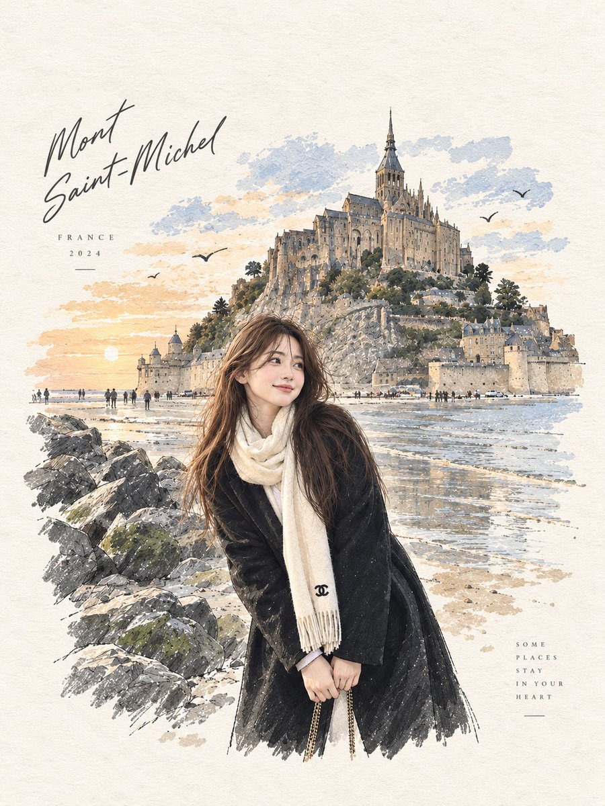

**プロンプト**

```text
苔に覆われた大きな岩のそば、静かな砂浜に佇む若い東アジア人女性のフォトリアリスティックなスナップ旅行ポートレート。彼女の後ろには、岩の島に劇的にそびえ立つ壮大な歴史ある石造りの修道院と中世の城のような建築がそびえ立っています。片方の肩に自然に流れるダークブラウンの長いストレートヘア、若々しく柔らかな顔立ち、そしてカメラをまっすぐに見つめながら浮かべる優しく温かい微笑み。

彼女はオーバーサイズのロング丈ブラックコートを着て、ポケットに何気なく両手を入れ、下には明るい色の服を重ね着しています。大きくて柔らかいクリームホワイトのマフラーが首元を暖かく包み込み、胸元に垂れ下がった端には小さな黒いデザイナーズ風のエンブレムがあしらわれています。華奢なチェーンショルダーバッグが少し見えています。

前景に彼女を捉え、背景には広大で歴史的な修道院がそびえ立ち、古代の石壁、岩だらけの崖、砂浜の干潟、穏やかな海岸の雰囲気に囲まれた構図です。遠くに見える少数の車や人々が、風景にリアルなスケール感を与えています。柔らかな自然の夕暮れの光と淡く澄んだ青空が、穏やかなヨーロッパ旅行の情緒を醸し出しています。

超リアルな写真、自然なスナップ旅行写真、リアルな肌の質感、リアルな布地のディテール、柔らかく映画のようなライティング、さりげないスマートフォンカメラのエステティック、ほのかに幻想的なカラーグレーディング、自然なプロポーション、詳細な建築、平和な海岸の雰囲気、縦構図、3:4のアスペクト比。
```

[↑ カテゴリに戻る](#catalog)

---

<a name="prompt-2097411028510179759"></a>

### 森の空き地と青々とした緑の草木の高解像度風景写真プロンプト。

作者：[@mark\_k](https://x.com/mark_k) · [元の投稿](https://x.com/mark_k/status/2097411028510179759)

写真撮影 · 風景 / 自然 · 配信済み

**概要:** 森の空き地と青々とした緑の草木の高解像度風景写真プロンプト。

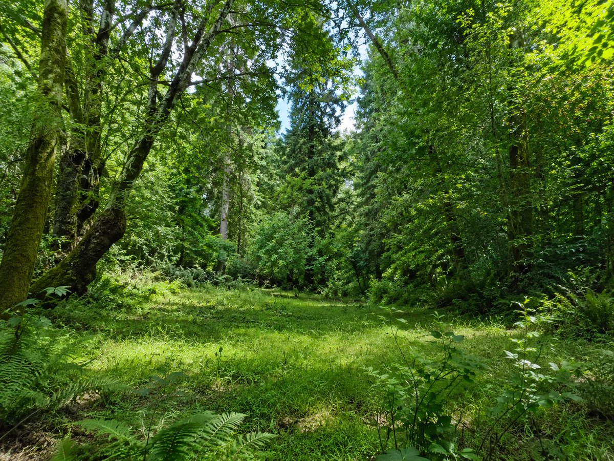

**プロンプト**

```text
豊かな緑の葉が生い茂る森の空き地の写真、極めて詳細
```

[↑ カテゴリに戻る](#catalog)

---

<a name="prompt-2097585546973614232"></a>

### オレンジのテニスコートで、ネット越しに振り返るマスタード色のトップスとプリーツスカートを着た女性の写真風プロンプト。

作者：[@CyberTotal2026](https://x.com/CyberTotal2026) · [元の投稿](https://x.com/CyberTotal2026/status/2097585546973614232)

写真撮影 · キャラクター · 配信済み

**概要:** オレンジのテニスコートで、ネット越しに振り返るマスタード色のトップスとプリーツスカートを着た女性の写真風プロンプト。

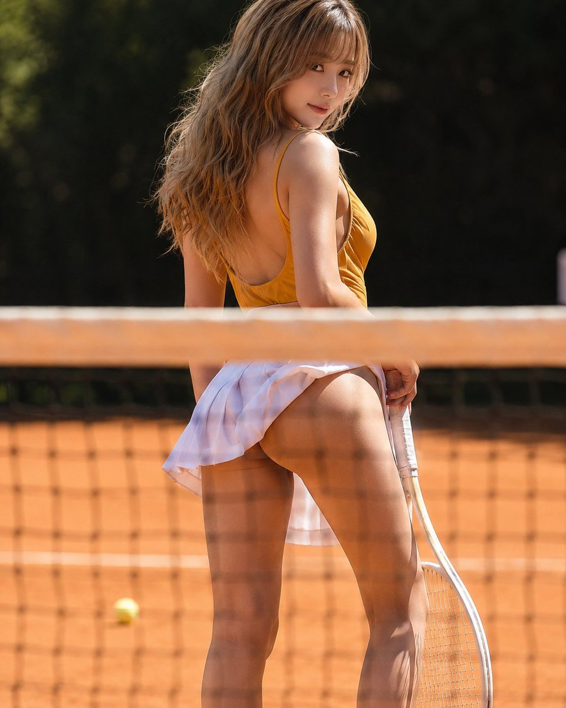

**プロンプト**

```text
主題：
橙コートの振り向き

主体：
晴れた屋外テニスコートで、成人女性が画面中央に背を向けて立ち、肩越しに振り返る縦位置写真。

人物・表情：
顔だけを人物自身の右肩越しにカメラへ向け、唇を閉じた穏やかな表情。細い卵形輪郭、小さな顎、横長の茶色い目、自然な細眉、小ぶりな鼻、淡い桃色の唇。明るい茶色の長いウェーブ髪が背中へ広がる。

服装・ポーズ：
マスタード色の袖なしトップは背中が深く開き、白いプリーツの短いテニススカート。体重を片脚に置いて腰をわずかにひねり、人物自身の右手で白いラケットを右下へ下げ、左腕は自然に体側へ添える。

背景・光：
前景に腰の高さを横切る黒いネット、背景にオレンジ色のコート、緑のフェンス、木立と青空。画面左上から硬い昼の直射光が髪と肩を照らし、コートへ短い影を落とす。

構図・カメラ：
4:5の縦構図、カメラを腰の高さに置いた背面斜めの膝上写真。人物を中央に大きく収め、ネットを前景の水平線、ラケットを右下に置く。顔と背中に焦点、背景は軽くぼかし、頭頂とスカート裾を画面内に収める。

質感・スタイル：
フォトリアルな実写写真。髪の細い光沢、トップの伸縮生地、スカートのプリーツ、ネットの編み目と乾いたコート面を明瞭に写す。

ネガティブ：
正面向きにしない；腰前を横切るネットと右下のラケットを省かない
```

[↑ カテゴリに戻る](#catalog)

---

<a name="prompt-2097534208541442338"></a>

### 色白肌の東アジア若い女性によるiPhoneインカメスナップ顔寄り特写プロンプト、灰白色ファー背景と頬杖・ぼんやりポーズ各種。

作者：[@AIVideoHub\_](https://x.com/AIVideoHub_) · [元の投稿](https://x.com/AIVideoHub_/status/2097534208541442338)

プロフィール / アバター · 写真撮影 · ポートレート / セルフィー · キャラクター · 要旨 / 背景 · 配信済み

**概要:** 色白肌の東アジア若い女性によるiPhoneインカメスナップ顔寄り特写プロンプト、灰白色ファー背景と頬杖・ぼんやりポーズ各種。

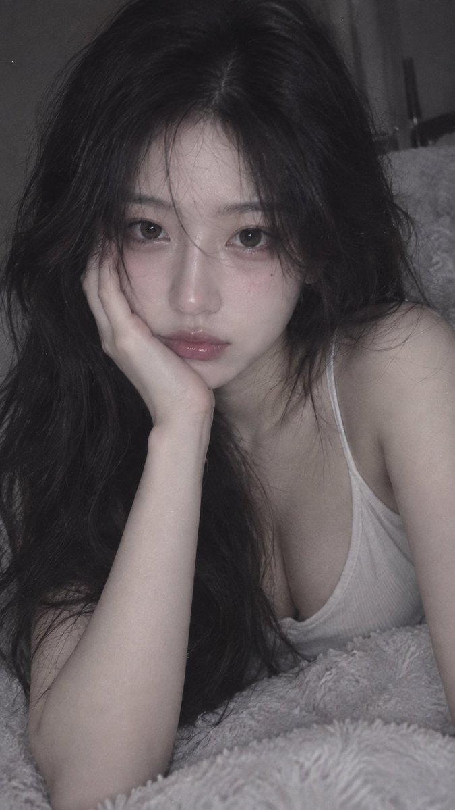

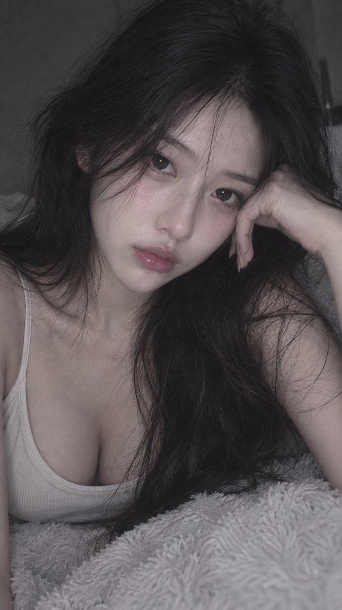

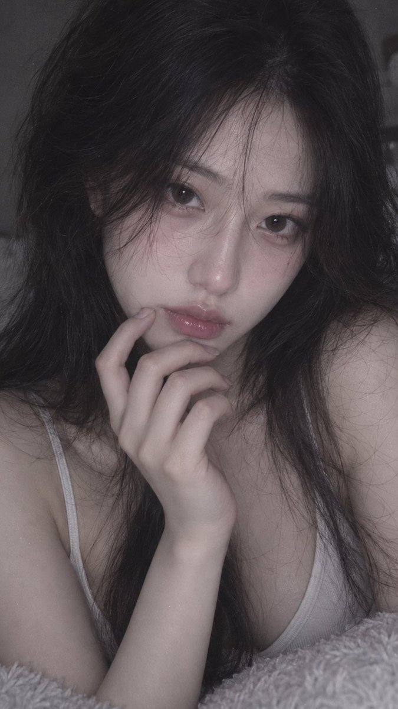

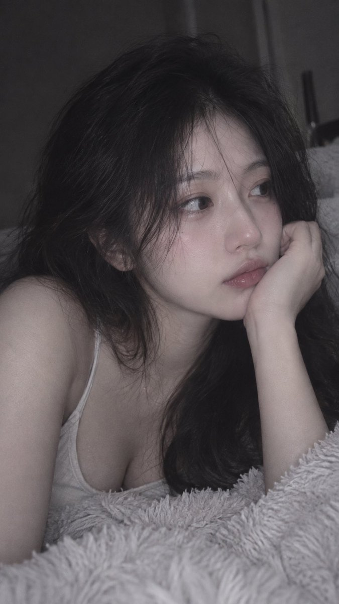

**プロンプト**

```text
📱 iPhoneのインカメラによるスナップ写真、9:16。18〜22歳の明らかに成人した美しい東アジア人女性、身長約1.75m、整った顔立ち、透き通るような色白の肌（ブルーベース白肌）、スラリと細身なモデル体型、自然なEカップ相当のバスト。ダークトーンのしなやかでふんわりとしたロングウェーブヘア、淡い色合いのタイトな深Vネックキャミソール、なめらかな首筋とデコルテ、肩のライン。丸みのある目元、柔らかな平行眉、黒く澄んだ瞳、淡いピンクのチークとうるおいのあるピンク系の唇、物憂げで静かな表情。

🩶 薄暗い室内でのクローズアップ顔寄りポートレート、ボケ感のあるオフホワイトのファー／モヘア織物の背景、寒色系の微光、低露出、低彩度のグレイスケール／モノトーン調フィルター、低コントラスト、わずかなシャープネス、柔らかなフォーカスの微粒子ノイズ感、自然体で脱力感があり、クリーンで高級感のある、少しアンニュイで冷ややかな雰囲気。

ランダムポーズ候補：

🤍 片手で頬杖をつき、手のひらを頬と顎に当てて静かにカメラを見つめる
🫧 肘をついて顔の横を支え、首を少し傾げてぼーっとする
🌙 顔の半分を手のひらに埋め、気だるげに視線を漂わせる
💭 指先を顎とフェイスラインに軽く添え、うつむいてからゆっくりと視線を上げる
🪞 カメラに近づき、手のひらで顔を支え、ロングウェーブヘアが肩の前に垂れる
☁️ 手の甲に横顔をあて、視線はフレームの外へ外す
💤 頬に手を当て少し肩をすくめ、眠気のある瞬間にふと撮られたような姿
✨ 顔を支えながらふわふわのクッションに寄り添い、口元にかすかな微笑みを浮かべる

🎲 さまざまなポーズに合わせて、自撮りの距離感、頬杖のつき方、視線、髪の毛の流れ、薄暗い光、ピンボケや粒子感を自由に表現。顔寄りのクローズアップ特写、冷ややかなグレイッシュトーン、そしてiPhoneのインカメラで撮ったような自然なスナップの質感を重視し、おうちドリームコア × 憂鬱なアンニュイ感 × 上質でミニマルなポートレート感を追求する。

複数のポーズを含んだ総合プレビュー画像を1枚生成し、そこから選べるようにしてください。
```

[↑ カテゴリに戻る](#catalog)

---

<a name="prompt-2096909970398941572"></a>

### 高級ジムでテラコッタオレンジのボディスーツを着た筋肉質なブラジル人女性のリアルな9:16ミラーセルフィー。

作者：[@MrDasOnX](https://x.com/MrDasOnX) · [元の投稿](https://x.com/MrDasOnX/status/2096909970398941572)

写真撮影 · ポートレート / セルフィー · キャラクター · 配信済み

**概要:** 高級ジムでテラコッタオレンジのボディスーツを着た筋肉質なブラジル人女性のリアルな9:16ミラーセルフィー。

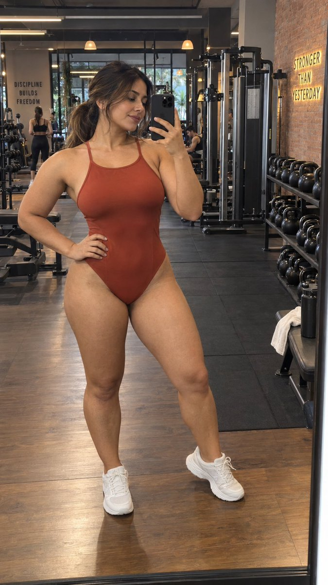

**プロンプト**

```text
リアルな高級フィットネススタジオの鏡越し自撮り写真、縦向き 9:16、リラックスしたコントラポストのポーズで立ち、スマートフォンで自撮りをする若い成人のブラジル人女性。カメラは床から天井までの大型ミラー越しに、スマートフォンの28〜35mm相当の広角レンズでシーンを捉えている。被写体は鏡から約1メートルの位置に立っている。頭からスニーカーまでの全身が写っている。彼女はフレームの中央左寄りに位置している。温かみのあるフローリング、黒いラバーマット、そして右側と背景にはケトルベルの列やケーブルマシンが見える。
被写体は、引き締まったカーヴィー体型の若い成人のブラジル人女性：ほどよく広い肩幅、引き締まっているが太すぎない腕、豊かなバスト、くびれたウエスト、丸みのあるヒップ、自然に太めの太もも。モデルのような細さや過度な誇張はなく、リアルで地に足のついたプロポーション。毛穴や微妙な色ムラが見える温かみのあるゴールデンタンの肌。柔らかい自然光、プラスチック感のない肌の質感。
彼女は右足に重心を置き、左膝を少し曲げて外側に向け、ヒップを鏡に向けて立っている。胴体をわずかにひねり、左肩が鏡に近づくようにしている。左手は腰に当て、右手は頬の高さでダークカラーのスマートフォンを構えている。頭は左肩越しにスマートフォンに向けられ、顎をわずかに引き、控えめに口を閉じた笑みを浮かべた落ち着いて少し自信に満ちた表情。目は画面を見つめている。
髪は温かみのあるキャラメルハイライトが入ったダークブラウン、肩までの長さで、顔まわりに後れ毛を残したゆるいローポニーテール。顔立ちは卵型で高い頬骨、ナチュラルなヌードローズトーンのふっくらとした唇、ダークブラウンのアーモンドアイ。
衣装はディープテラコッタオレンジのハイネックアスレチックワンピース（細いストラップ付き）、適度なカバー力、露出度が高すぎず品のあるハイレグカットライン。マットな伸縮性素材、ロゴなし。底のきれいな白スニーカー。
ロケーションは大きな鏡のある洗練された現代的なフィットネススタジオで、壁の一面はむき出しのレンガ、温かみのあるペンダントライトとクールな天井LEDが混ざり合い、背景には軽くボケた状態でトレーニングしている他の数名が写っている。リアルなスマホHDR、自然な粒子感、正確な反射、そして説得力のある影。
```

[↑ カテゴリに戻る](#catalog)

---

<a name="prompt-2096901566985068734"></a>

### 航空機のドアを背景にした日本のCA制服ポートレートスナップ写真プロンプト。複数のランダムアクションプールを内蔵。

作者：[@AIVideoHub\_](https://x.com/AIVideoHub_) · [元の投稿](https://x.com/AIVideoHub_/status/2096901566985068734)

写真撮影 · ポートレート / セルフィー · キャラクター · 要旨 / 背景 · 配信済み

**概要:** 航空機のドアを背景にした日本のCA制服ポートレートスナップ写真プロンプト。複数のランダムアクションプールを内蔵。

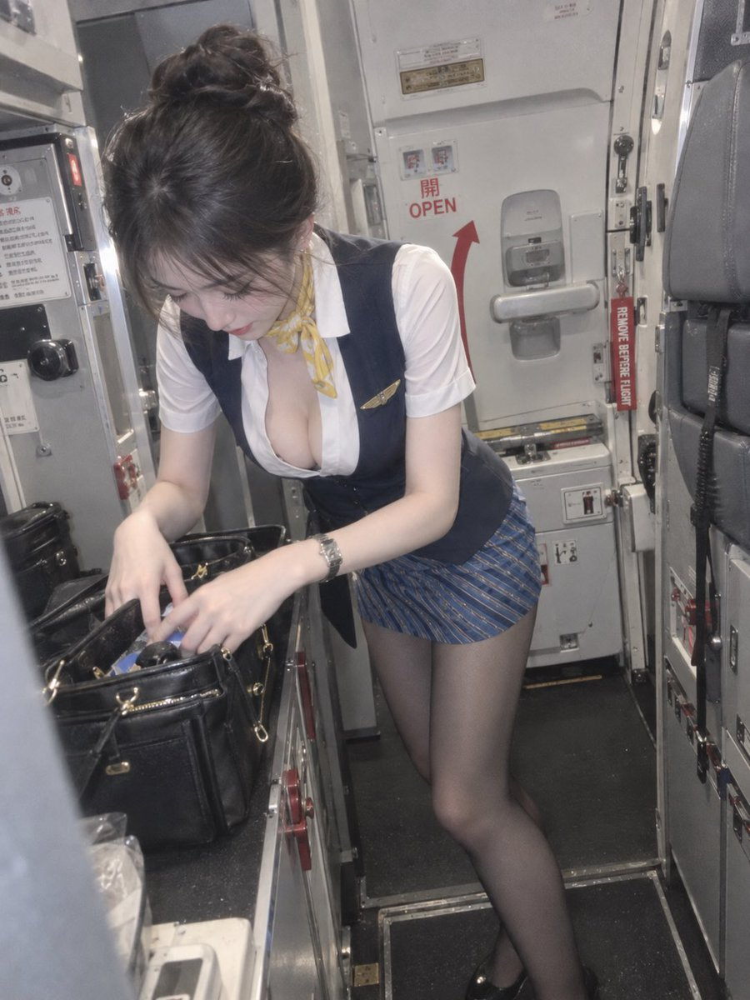

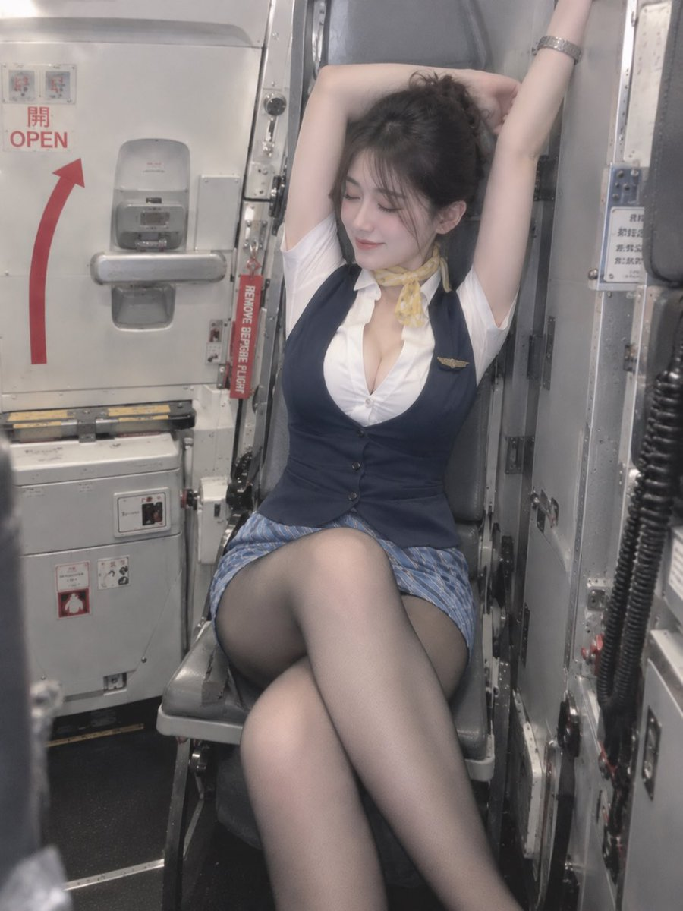

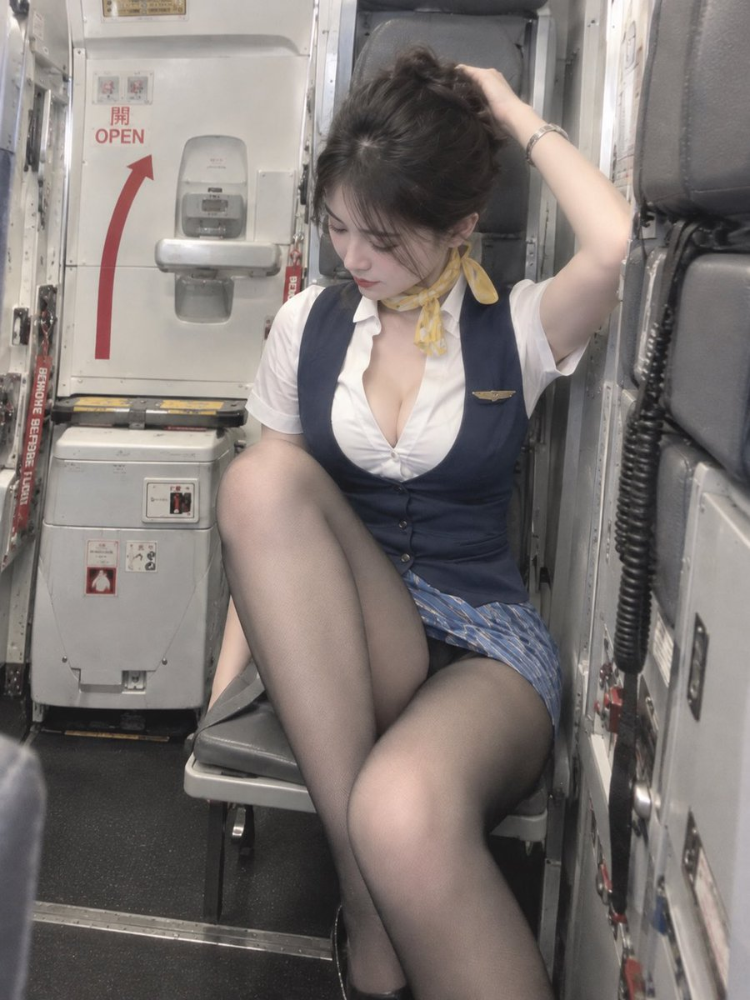

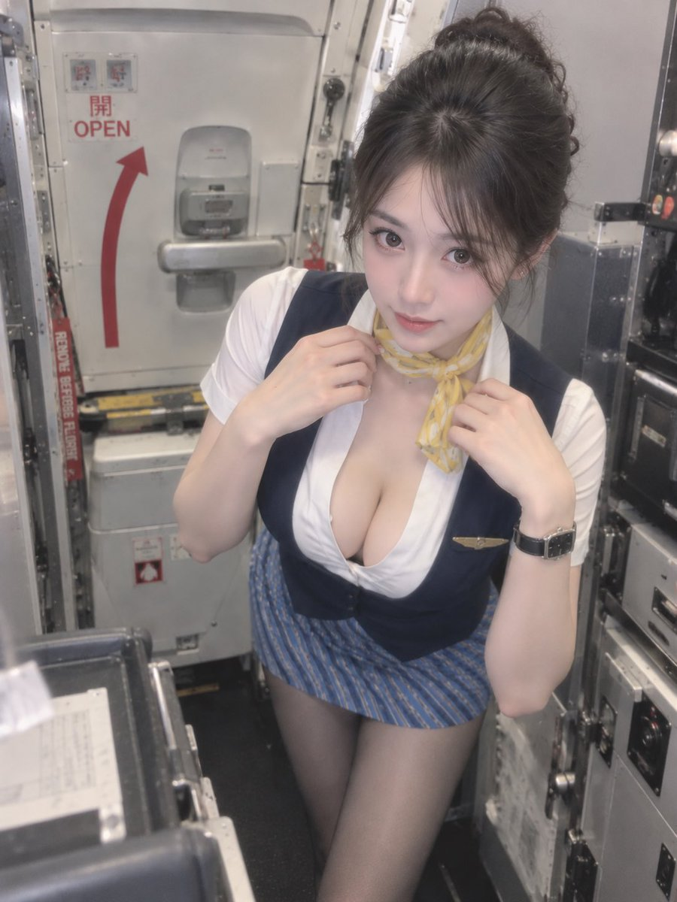

**プロンプト**

```text
📱 日本の航空スナップ写真、3:4。18〜22歳の明らかに成人の美しい東アジア人女性、身長約1.75メートル、洗練された甘い顔立ち、冷たい陶器のような白い肌、高身長でスリムなモデル体型、視覚的に自然なEカップ程度のバスト。洗練されたアップヘア、深めのVネック白シャツ×濃紺のCAベスト×青白ストライプのミニスカート、黄色いスカーフ、黒のミドルヒール、黒ストッキング。

✈️ 航空機のドア付近、ジャンプシート（折りたたみ椅子）、ドアハンドル、警告ステッカー、荷物棚が自然にフレームイン。低彩度のコールドグレー、スマホの手持ちによる斜め構図、天井照明の拡散光、わずかな露出オーバー、ノイズとエッジのピンボケ、透き通るような白桃風ナチュラルすっぴんメイク、リアルなアマチュアのスナップ感。

ランダムアクションプール：

💺 折りたたみ椅子に座り、片脚を曲げ、手を上げてまとめ髪を整える
✈️ ドアの横に横向きに座り、振り返って甘く微笑む
🧣 うつむいてスカーフを整え、ふとカメラを見上げる
👜 身をかがめてハンドバッグを探る、瞬間のスナップ
🙆🏻‍♀️ 背もたれにもたれて背伸びをし、自然でリラックスしたポーズ
🪞 立ち上がってベストとスカートの裾を整え、横向きでカメラを見る
💬 座って頬杖をつきぼんやりと物思いにふける、両脚は自然にクロス
🚪 ドアの縁をつかんで立ち上がり、振り返って微笑む

🎲 選ばれたアクションをもとに、アングル、機内ディテール、表情、手持ちの傾きやピンボケ効果を自由に表現し、CA制服×日本風日常グラビア×偶然のスマホスナップ感を追求。

さまざまなアクションを含む総合プレビュー画像を1枚作成し、その中から選択できるようにしてください。
```

[↑ カテゴリに戻る](#catalog)

---

<a name="prompt-2097249218507461093"></a>

### 日差しを浴びるアジア人女性の実写的な室内クローズアップポートレート

作者：[@Aqsahere\_](https://x.com/Aqsahere_) · [元の投稿](https://x.com/Aqsahere_/status/2097249218507461093)

写真撮影 · ポートレート / セルフィー · キャラクター · 配信済み

**概要:** 日差しを浴びるアジア人女性の実写的な室内クローズアップポートレート

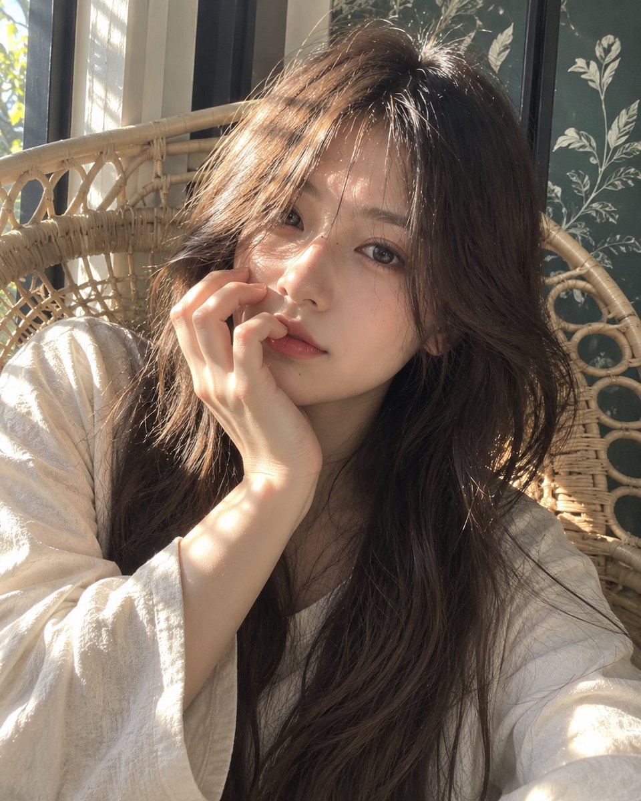

**プロンプト**

```text
明るい窓辺に置かれた編み込みのラタンチェアに心地よさそうに座る若い女性の、実写のようにリアルな室内クローズアップポートレート。彼女は暖かみのあるブラウンのハイライトが入った、自然に無造作なダークブラウンのロングヘアをしており、センター近くで分けられ、ほつれた髪が柔らかく顔を縁取り部分的に覆っている。落ち着いた少し夢見るような表情と、自然でほんのり色づいた唇でまっすぐカメラを見つめている。
片手を顔の前にそっと上げ、指先が唇と頬のあたりに繊細に添えられており、親密で自然なスナップ写真のようなポーズを作り出している。その指は細く自然な位置にある。彼女は柔らかい生地の質感を持つシンプルなオーバーサイズのオフホワイト／ライトベージュのトップスを着ている。
上方側面にある窓から強い暖かな日差しが差し込み、彼女の髪、額、頬、服の上に美しいストライプ状の光と影を作り出している。光は自然な黄金色で、所どころわずかに露出オーバー気味になっており、写真に暖かく居心地の良い雰囲気を与えている。
彼女の背後には、丸みを帯びた円形のディテールが施された大きな白い編み込み／ラタンチェアがある。背景にはエレガントな白い植物／葉の模様が施されたダークグリーンの壁または窓パネルと、シンプルな暗い垂直フレームが見える。居心地の良いモダンな自宅やカフェのような環境である。
構図：縦向きのクローズアップポートレート、アスペクト比約4:5、カメラは被写体に非常に近く、顔がフレームの中央から右側を占め、やや低めで親密感のあるカメラアングル、肩と上半身が見え、自然なフレーミング。
撮影スタイル：超リアルなスマートフォン自撮り写真スタイル、柔らかな韓国／アジア風ライフスタイル美学、自然な肌の質感、リアルな毛穴、一本一本の髪の毛、繊細な不完全さ、暖かな日差し、本物らしい陰影、穏やかなコントラスト、わずかなフィルムグレイン、浅い被写界深度、ポーズをとっていない自然なスナップ感、高精細、4K。
```

[↑ カテゴリに戻る](#catalog)

---

<a name="prompt-2096805553339342932"></a>

### クリーム色の織り地ジャケットとプリーツスカートを着て微笑む若い女性の夜のストリートポートレート。

作者：[@Aqsahere\_](https://x.com/Aqsahere_) · [元の投稿](https://x.com/Aqsahere_/status/2096805553339342932)

写真撮影 · ポートレート / セルフィー · キャラクター · 街並み / ストリート · 配信済み

**概要:** クリーム色の織り地ジャケットとプリーツスカートを着て微笑む若い女性の夜のストリートポートレート。

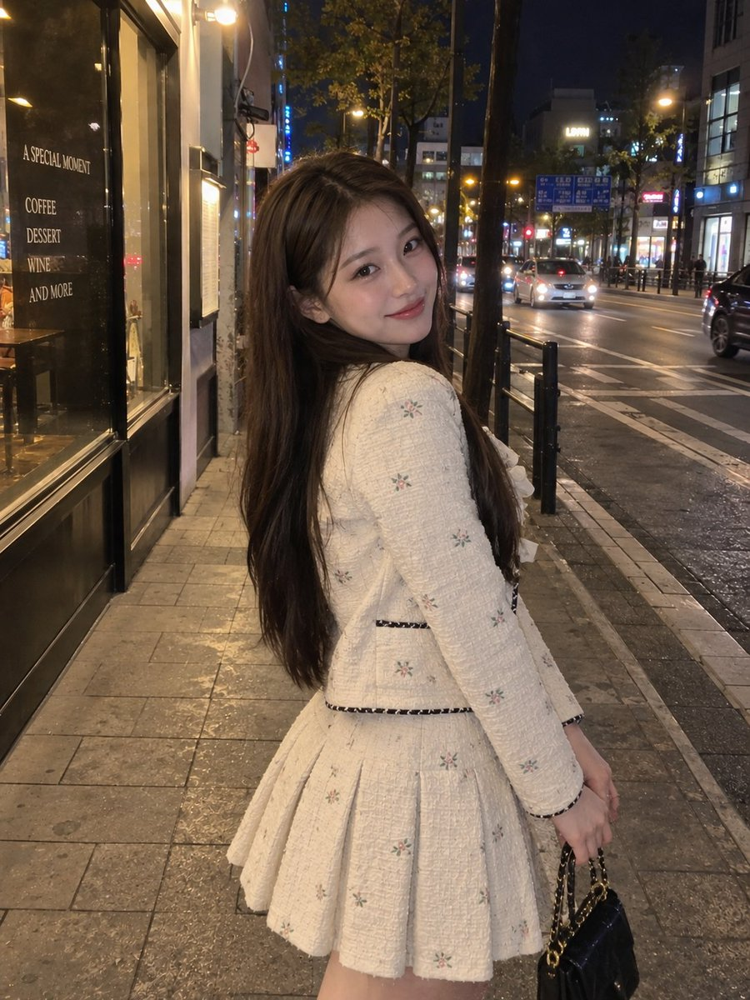

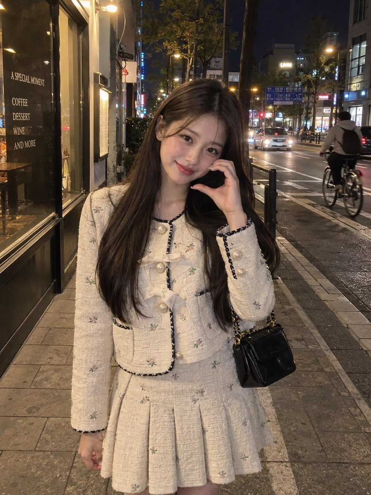

**プロンプト**

```text
賑やかな街の通りに立つ若い女性のリアルな夜のストリートポートレート。彼女は、繊細な花のディテール、装飾的なリボン、ダークカラーのトリム、パールのようなボタンがあしらわれた繊細なクリーム色の織り地ジャケットに、お揃いのプリーツスカートを着用している。長いストレートのダークブラウンの髪に自然で柔らかなメイクを施し、顔の近くでお茶目なハンドジェスチャーをしながらカメラに向かって優しく微笑んでいる。腕には小さな黒いハンドバッグが掛けられている。温かみのある街灯、光り輝く店舗、行き交う車、そして自転車に乗った人が、背景に活気ある都会の夜の雰囲気を醸し出している。背景のわずかなモーションブラー、柔らかな環境光、自然なスマートフォンのスナップ写真、自然な肌の質感、浅い被写界深度、居心地の良いエレガントな美学、リアルなディテール、縦構図、高解像度。
```

[↑ カテゴリに戻る](#catalog)

---

<a name="prompt-2096982628541100464"></a>

### ディープブルーの宇宙銀河ファンタジースタイルで男性と女性の調和したペアポートレートを作成するデュアルポートレートプロンプト。

作者：[@sha\_zdiii](https://x.com/sha_zdiii) · [元の投稿](https://x.com/sha_zdiii/status/2096982628541100464)

写真撮影 · ポートレート / セルフィー · キャラクター · 配信済み

**概要:** ディープブルーの宇宙銀河ファンタジースタイルで男性と女性の調和したペアポートレートを作成するデュアルポートレートプロンプト。

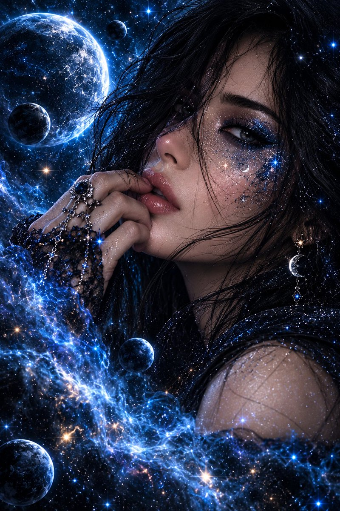

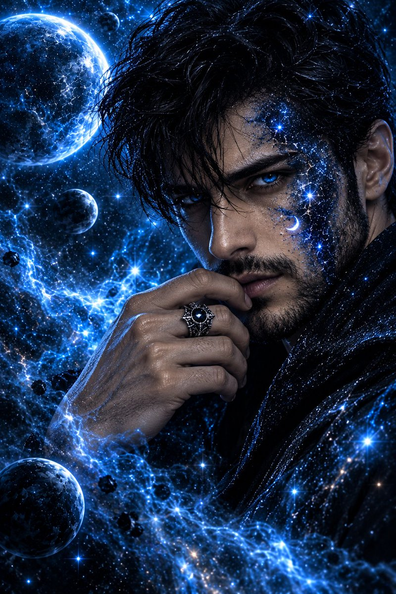

**プロンプト**

```text
1つのプロンプトから、まったく同じ深宇宙のディープブルー・ギャラクシーのテーマと視覚スタイルを用いた、超高精細で映画のようなファンタジーポートレートを別々に2枚作成してください。

画像 1 — 女性：
流れるような黒髪のロングヘア、輝く滑らかな肌、魅惑的なブルーとシルバーの天体アイメイク、つややかな唇、顔全体に散りばめられた星のようなきらめくディテールを持つ、美しく明らかに大人の女性を描いてください。エレガントな三日月と星のジュエリー、繊細なクリスタルのアクセント、周囲を漂う発光する宇宙粒子を加えてください。彼女の表情は自信に満ち、神秘的で魅力的です。深い青の星雲、輝く星々、巨大な惑星、月、宇宙の塵、そしてエレクトリックブルーの光が彼女を取り囲んでいます。銀河のエネルギーが彼女の顔、髪、肩、衣装の周りに自然に溶け込んでいます。

画像 2 — 男性：
まったく同じ青い宇宙のテーマで、明らかに大人のハンサムな男性を描いてください。豊かで無造作にセットされた黒髪、整えられた黒いあごひげ、力強い顔立ち、強烈に光る青い瞳、そして自信に満ちた神秘的な表情をしています。顔の片側に銀河のような繊細な発光パターンと小さな星屑を加えてください。手は顎の近くに置かれ、エレガントなダークメタリックのリングをはめたスタイリッシュなファッションポーズをとっています。同じ深い青の星雲、輝く惑星、月、星々、宇宙の塵、そしてエレクトリックブルーのエネルギーが彼を取り囲んでいます。

重要：
女性と男性は、1つのフレームに一緒にするのではなく、2枚の独立した画像として生成してください。同じ照明、同じブルーギャラクシーのカラーパレット、同じ高級感のあるファンタジーファッションスタイル、同じディテールレベル、調和のとれたビジュアルアイデンティティを保ち、両方の画像が連動したペアに見えるようにしてください。

超リアル、最高級の映画的照明、ハイコントラスト、光沢のあるラグジュアリーファンタジーの質感、シャープフォーカス、詳細な肌と髪の質感、魔法のような青い光、テキストなし、ウォーターマークなし。

両画像とも9:16の縦長ポートレート構図。
```

[↑ カテゴリに戻る](#catalog)

---

<a name="prompt-2097269715966230876"></a>

### 夕暮れの浅瀬に佇み、濡れた半透明の白布を身に纏った女性の写真風ポートレートプロンプト。

作者：[@CyberTotal2026](https://x.com/CyberTotal2026) · [元の投稿](https://x.com/CyberTotal2026/status/2097269715966230876)

写真撮影 · ポートレート / セルフィー · キャラクター · 配信済み

**概要:** 夕暮れの浅瀬に佇み、濡れた半透明の白布を身に纏った女性の写真風ポートレートプロンプト。

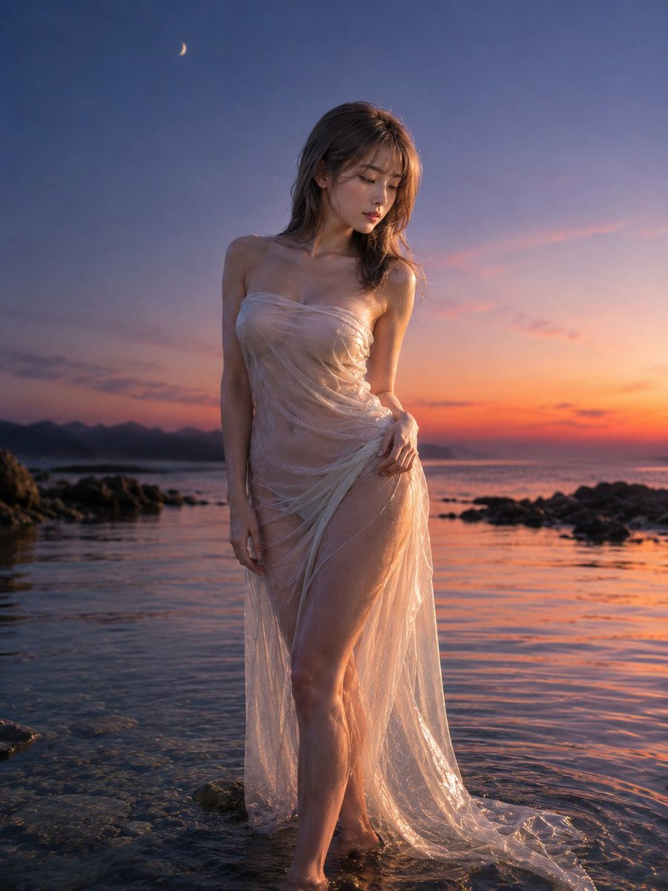

**プロンプト**

```text
主題：
夕月の透ける白

主体：
夕暮れの岩礁の浅瀬で、成人女性が画面中央に立ち、濡れた半透明の白い布を胸から足元まで巻いた全身の縦位置写真。

人物・表情：
顔を画面右下へ傾け、視線も布を持つ手へ落とした静かな横顔寄りの表情。細い卵形輪郭、伏せた横長の目、細い鼻筋、軽く開いた淡い唇。濡れた濃茶の肩下髪は横分けで、頬と首に細い毛束が貼り付く。

服装・ポーズ：
白い肩紐なしの長いドレス状の薄布を胸元から巻き、斜めのドレープが胴と脚に重なる。裸足で浅瀬に立ち、人物自身の右手を体側へ下げ、左手で腰前の布をつまみ、片脚を少し前へ出す。

背景・光：
画面左上の青紫の空に細い三日月、右の水平線に橙色の夕焼け、下半分に海面と黒い岩。画面右後方の低い夕日が濡れた布と体を金色に縁取り、正面は柔らかな青い薄明光。

構図・カメラ：
3:4の縦構図、カメラを腰より少し低く置いた正面斜めの全身写真。人物を中央に大きく、上半分に夕空と三日月、下端に濡れた裾と足を収める。人物と透ける布に焦点、遠景は軽くぼかす。

質感・スタイル：
フォトリアルな実写写真。濡れて肌に沿う薄布、細かな水滴、岩と水面の反射、橙と青紫の夕景階調を精細に写す。

ネガティブ：
白布を不透明にしない；三日月と夕焼けを省かない
```

[↑ カテゴリに戻る](#catalog)

---

<a name="prompt-2096809673378967588"></a>

### 黒のBMWの前でポーズをとるスタイリッシュな女性のフォトリアリスティックな9:16ポートレート。

作者：[@Lianaalane](https://x.com/Lianaalane) · [元の投稿](https://x.com/Lianaalane/status/2096809673378967588)

写真撮影 · ポートレート / セルフィー · キャラクター · 配信済み

**概要:** 黒のBMWの前でポーズをとるスタイリッシュな女性のフォトリアリスティックな9:16ポートレート。

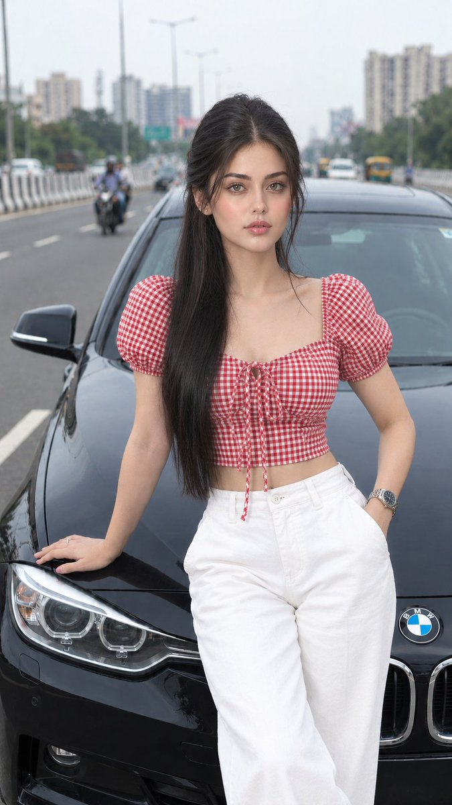

**プロンプト**

```text
現代の都市の道路で、高級な黒のBMWの前で自信に満ちたポーズをとるスタイリッシュな若い女性の、フォトリアリスティックな9:16の画像を作成してください。彼女は、韓国風のすっきりとしたセンターパートと顔周りを柔らかく縁取る毛束を持つ、艶やかでまっすぐな長い黒髪をしています。顔立ちは自然のまま変えず、みずみずしい肌、ソフトなチーク、控えめなアイライン、ツヤのあるヌードピンクの唇といった爽やかな韓国風メイクを施します。上品でモダンなスタイルとして、おしゃれな赤と白のギンガムチェックのパフスリーブトップスにハイウエストの白いトラウザーを着用しています。黒のバングルは上品で高級感のある腕時計に置き換え、洗練された印象を与えます。片手は車のボンネットに自然に添えられ、もう一方の手はズボンのポケットに入れられています。背景にはぼかした街の建物、緑、行き交う車、街路のバリケード、柔らかな自然光が広がっています。同じ自信にあふれるポーズ、リアルなプロポーション、映画のような被写界深度、高級ファッションエディトリアルスタイル、超リアルなディテール、そして自然な写真の質感を維持してください。
```

[↑ カテゴリに戻る](#catalog)

---

<a name="prompt-2096601368114937969"></a>

### 温かみのあるベージュのスタジオで、アイボリーのケープアウトフィットを着たブロンドモデルが純白の馬とともにポーズをとる超リアルな高級ファッションエディトリアル。

作者：[@sha\_zdiii](https://x.com/sha_zdiii) · [元の投稿](https://x.com/sha_zdiii/status/2096601368114937969)

写真撮影 · ファッションアイテム · 配信済み

**概要:** 温かみのあるベージュのスタジオで、アイボリーのケープアウトフィットを着たブロンドモデルが純白の馬とともにポーズをとる超リアルな高級ファッションエディトリアル。

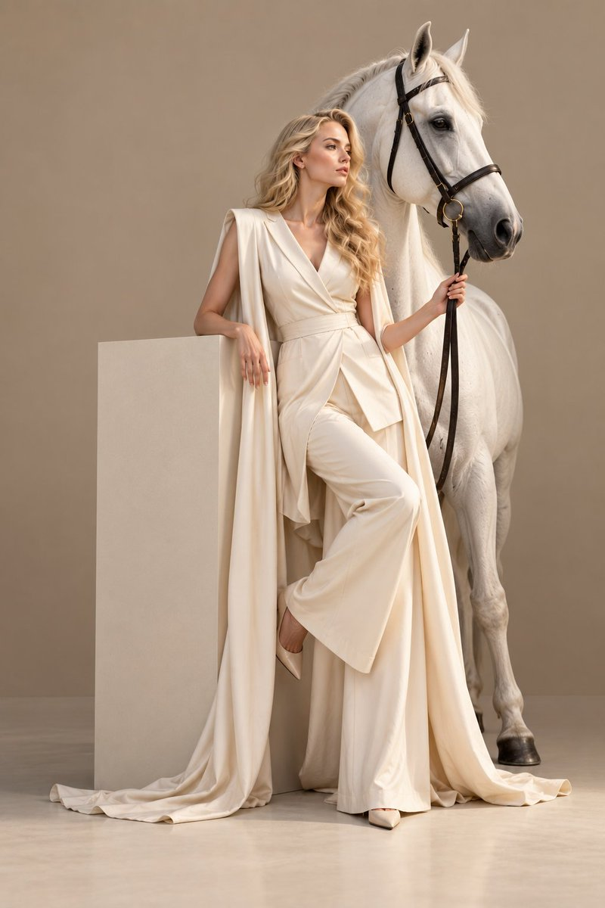

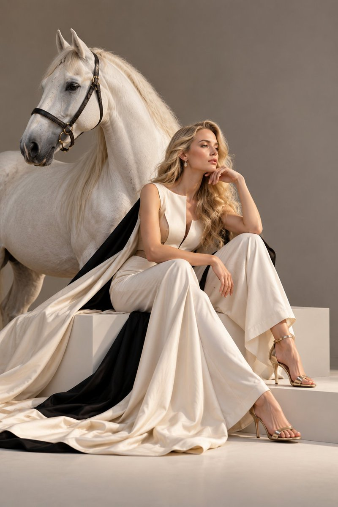

**プロンプト**

```text
ミニマリストな温かみのあるベージュのスタジオで撮影された、超リアルな高級ファッションエディトリアル。柔らかいウェーブのかかったブロンドのロングヘアを持つ魅力的な大人の女性モデルが、繊細なゴールドの金具が付いたリアルな黒革の頭絡を身につけた雄大な原寸大の純白の馬の傍らでエレガントにポーズをとっている。モデルは、流れるようなロングケープが付いた洗練されたアイボリーホワイトのノースリーブ仕立てのワイドレッグアウトフィット、エレガントなヒール、上品なジュエリーを身に着けている。エレガントなモデルのポーズでプレミアムなハイファッションキャンペーンの雰囲気を演出。手綱を持って馬の横に立つこともあれば、幾何学的なクリーム色のブロックの上に優雅に腰掛け、馬が彼女の背後や横で静かに佇んでいる姿も。温かみのあるベージュのシームレスな背景と床、柔らかな指向性スタジオライティング、リアルな肌の質感、リアルな馬の解剖学的構造と毛並み、自然な影、流れるようなファブリック、洗練されたニュートラルなカラーパレット、フォトリアリスティック、高級エディトリアル美学、全身構図、高ディテール、縦長 2:3。
```

[↑ カテゴリに戻る](#catalog)

---

<a name="prompt-2096631729410986083"></a>

### 以古风夜色暖阁为背景的东方贵女梳妆近景肖像，包含妆容、发饰及服饰细节描述。

作者：[@liyue\_ai](https://x.com/liyue_ai) · [元の投稿](https://x.com/liyue_ai/status/2096631729410986083)

写真撮影 · ポートレート / セルフィー · キャラクター · ファッションアイテム · 要旨 / 背景 · 配信済み

元の投稿：[@liyue\_ai](https://x.com/liyue_ai) · [元の投稿](https://x.com/liyue_ai/status/2096269909076623535)

**概要:** 以古风夜色暖阁为背景的东方贵女梳妆近景肖像，包含妆容、发饰及服饰细节描述。

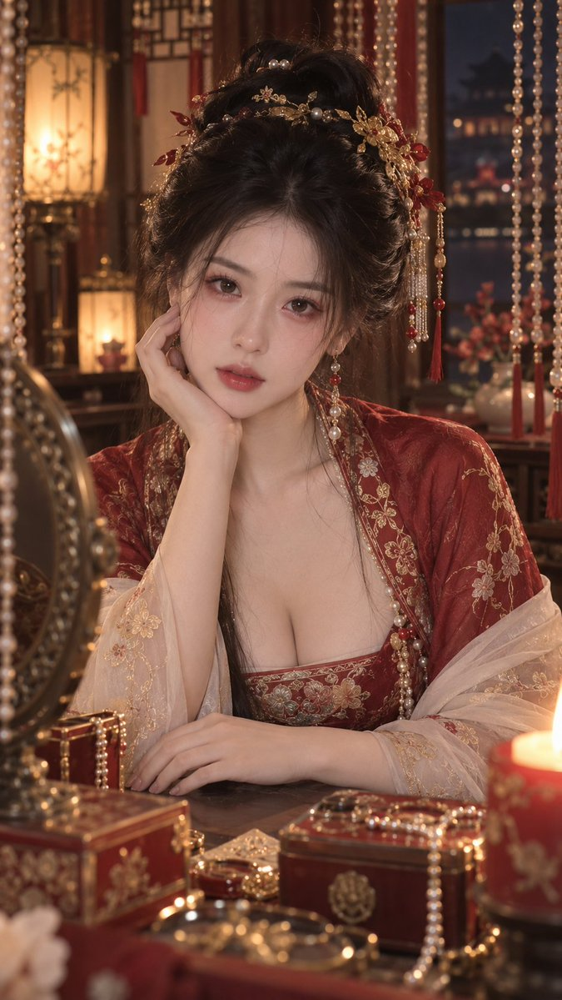

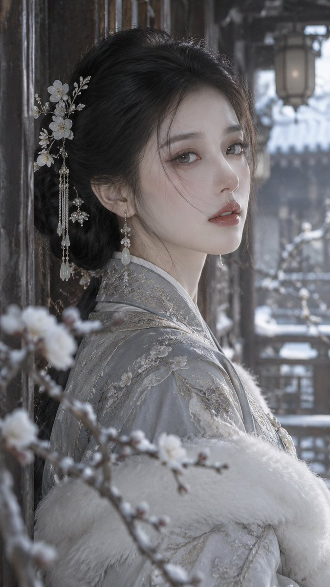

**プロンプト**

```text
9:16 縦構図、古風な夜のビューティーポートレート、東洋古典の貴婦人ポートレート、バストアップのクローズアップ、正面アングル、化粧台の前に端然と座る人物、体はカメラに正対し、頭部は自然に真っ直ぐ、優しく情愛を湛えた眼差しで静かにカメラを見つめる、奥ゆかしく柔らかで内省的な表情、何かを言いかけて躊躇うような夜の風情を帯びている。全体の気品は名門の令嬢のようで、優雅で華麗、繊細で控えめ、かつ趣があり、夜に化粧を整え終えたばかりの貴婦人のようである。

人物は視覚年齢20～28歳ほどの、明確に成人した若い東洋女性。澄んだ瞳とふっくらとした唇、柔らかな卵形の輪郭、自然でふっくらとした額、立体的で満たされた中顔面、滑らかで柔らかな下顎のラインを持つ。眉は細やかで伸びやか、瞳は澄んで輝きがあり、自然に切れ長の目元、目尻はわずかに上がっているが誇張されすぎず、潤いを帯びた優しい眼差し。鼻筋は上品で通り、鼻先は繊細で丸みを帯びている。唇は柔らかくふっくらとし、キューピッドボウが自然に際立っている。全体的に整った左右対称の目鼻立ちで、至近距離で見ても美しく、幼すぎず、ネットアイドル風にならない。

メイクは「灯影に映えるザクロの柔艶メイク」。ベースメイクは透明感がありキメ細やかで、肌色は白く透き通りしっとりとしており、自然で繊細な肌の質感を残している。アイメイクはザクロ色、赤茶、ウォームブラウンと少量の温かみのあるゴールドの繊細なラメのグラデーション、上まぶたの外側と目尻をわずかに深め、涙袋には微細なウォームゴールドのパールを施し、アイラインは細く繊細で、まつ毛は一本一本美しくカールしている。中顔面と頬には柔らかく自然なウォームローズのチークが入り、温かみのある血色感を演出。鼻筋、鼻先、顔の中央、唇の山には繊細でクリアなハイライトを入れるが、顔全体が脂っぽくテカることはない。リップはザクロ色の水光リップで、みずみずしく柔らかな艶を放ち、わずかにガラスのような光沢がある。全体として優しく、華麗で奥ゆかしく高貴な気品があり、夜の蝋燭の灯火の下での貴婦人の情緒を醸し出している。

ヘアスタイルは黒髪をふんわりと結い上げた高い髷（高髻）で、ふっくらと丸みがあり、頭頂部は自然なボリュームを持たせ、髪の毛は艶やかで滑らか。髪にはザクロ色のビーズの簪、淡いゴールドのヘアチェーン、金の花枝の装身具、赤い小粒の宝石、真珠のあしらい、多層のタッセル飾りが施され、ヘアアクセサリー全体が精巧で華麗、重層的でありながら顔の印象を邪魔しない。耳飾りは真珠のタッセルピアスで、赤い玉珠と淡い金の細いチェーンを合わせ、耳元に優しく揺れ、気品と華やかさを引き立てる。

衣装はザクロ色の対襟上襦（前開きの漢服上着）で、布地には金糸の花柄刺繍と細やかな地紋が贅沢に施され、烏金（暗黒金色）の地紋入りロングスカートとアイボリーホワイトの薄絹のショール（披帛）を合わせている。襟元と胸元には繊細な古風の胸当て（抹胸）のインナーを着用し、豊かで自然な胸元、ふくよかで調和の取れた上半身のプロポーションを持ち、柔らかな胸のラインと胸元の大部分のシルエットがはっきりと確認できるが、完全に衣服で覆われており、全体的に品位を保ち、下品にならず、現代のドレス風にもならない。衣装の配色はザクロ色、烏金、アイボリー、ウォームゴールドを基調とし、鮮やかで華美でありながら古典的な洗練を維持している。

シチュエーションは宮灯の温もりある部屋 / 珠の簾 / 銅鏡の化粧台 / 揺らめく蝋燭の影。人物は古風な化粧台の前に座り、左側には彫刻が施された円形の古銅鏡が見え、手前と両脇には幾重にも連なる真珠の簾が垂れ下がり、化粧台には赤と金の宝石箱、真珠のネックレス、小さな装飾品、燭台が置かれている。背景には温かみのある黄色い宮灯、深い木目の部屋、遠くの夜景に霞む楼閣の灯りが見え、空間全体は華やかでありながら背景は柔らかくボケており、主役の邪魔をしない。

ライティングは暖白からゴールドを帯びた蝋燭の光と宮灯の柔らかな光を組み合わせ、人物の顔には独立した柔らかい補助光を当て、両目、アイシャドウ、チーク、リップ、髪飾り、刺繍、肌のディテールが鮮明に見えるようにしている。画面全体は温かみがあり透明感に溢れ、夜の情緒を漂わせつつも、暗すぎず、黄ばまず、くすまない。背景は浅い被写界深度でボケており、人物の顔とメイクが常に第一の視覚的中心となっている。

85mmポートレートレンズ、リアルな写真の質感、高完成度の古風貴婦人ビューティーポートレート、人物の両目に精確にフォーカス、鮮明なメイク、繊細で精巧なパールの装飾と金糸の刺繍、華麗で妖艶、しっとりと温かみがあり、古典的な夜の映画のような情緒に満ちた画面。
```

[↑ カテゴリに戻る](#catalog)

---

<a name="prompt-2096555489073279173"></a>

### 明るくモダンなキッチンを舞台にした商業フードフォトグラフィーシーン。重ねられたピンクのベリースムージーの瓶、オーガニックピーナッツバターの瓶、木製サービングボードに乗ったローストピーナッツが特徴。

作者：[@DuaFatimaAi](https://x.com/DuaFatimaAi) · [元の投稿](https://x.com/DuaFatimaAi/status/2096555489073279173)

写真撮影 · 食品・飲料 · 配信済み

**概要:** 明るくモダンなキッチンを舞台にした商業フードフォトグラフィーシーン。重ねられたピンクのベリースムージーの瓶、オーガニックピーナッツバターの瓶、木製サービングボードに乗ったローストピーナッツが特徴。

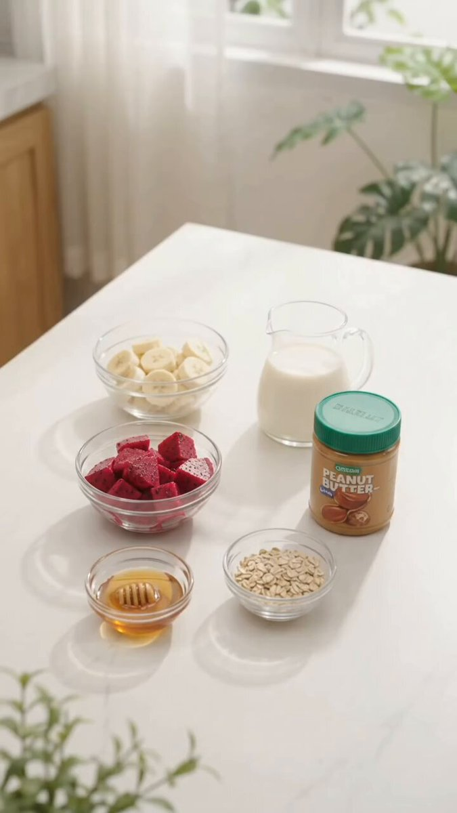

**プロンプト**

```text
明るく居心地の良いモダンなキッチンを舞台にした、超リアルで高級感のあるフードフォトグラフィーのシーンを作成してください。清潔な白い円形テーブルの左側に、3つの小さな透明なガラス瓶が縦に重ねて置かれ、中には鮮やかで濃厚なピンクのベリースムージーが入っています。スムージーはリッチでクリーミーな質感を持ち、繊細なベリーの粒々と艶やかなハイライトが見られます。

右側には、黄金色のクリーミーなピーナッツバターが入った、緑色の蓋が付いたオーガニックピーナッツバターの透明な瓶を配置してください。製品のパッケージ、ラベルの位置、色、比率を正確に再現してください。瓶の横にはいくつかの丸ごとの落花生を自然に散らします。

手前には、ミックスローストピーナッツが入った小さなセラミックボウルと、たっぷりとすくったクリーミーなピーナッツバターを乗せたスプーンを置いたベージュのセラミックプレートを配置します。スムージーの近くには繊細な緑のハーブの小枝をいくつか添えてください。

背景：清潔な白いサブウェイタイルのキッチンの壁、側面から差し込む柔らかな自然光、繊細な影、暖かく居心地の良い雰囲気。小さな木製サービングボードの上に食品を並べ、その下にはヴィンテージのプリントペーパーを敷きます。

左上のエリアに「Smoothies」と書かれたエレガントな手書き風の白いテキストを追加し、その下に小さめの筆記体で「Tingi Kalori」と添えてください。

縦型 9:16 の構図、プレミアムな商業フードフォトグラフィー、リアルなテクスチャ、自然光、浅い被写界深度、柔らかなボケと鮮明な製品のディテール、バランスの取れた構図、温かみのあるライフスタイル美学、フォトリアリスティック、高解像度、人物なし
```

[↑ カテゴリに戻る](#catalog)

---

<a name="prompt-2097159277937115208"></a>

### 片側に弾ける水しぶき、もう片側に輝く炎を配した、南アジア系男性のデュアルエレメント・ポートレート。

作者：[@Aiwithamirr1](https://x.com/Aiwithamirr1) · [元の投稿](https://x.com/Aiwithamirr1/status/2097159277937115208)

写真撮影 · ポートレート / セルフィー · キャラクター · 配信済み

**概要:** 片側に弾ける水しぶき、もう片側に輝く炎を配した、南アジア系男性のデュアルエレメント・ポートレート。

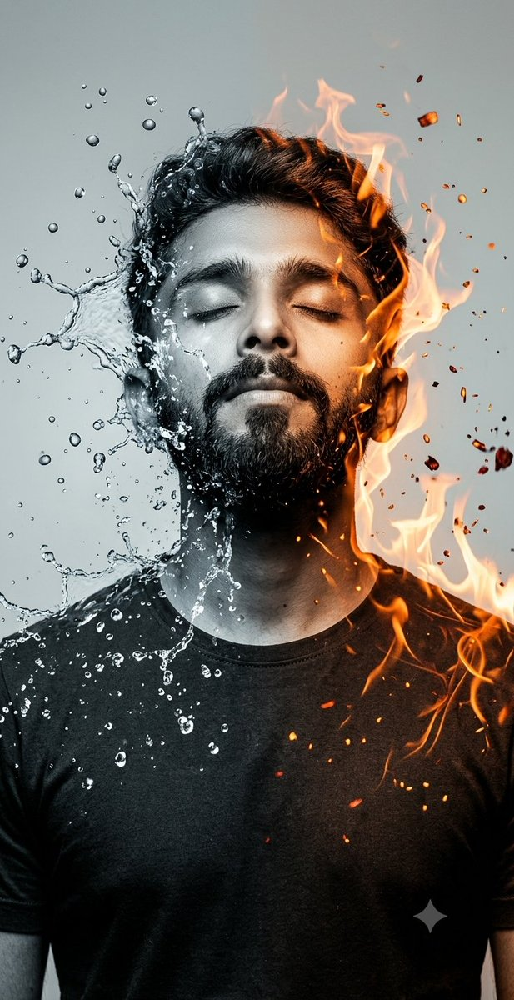

**プロンプト**

```text
アップロードされた顔を参照として使用。
穏やかな表情で目を閉じ、頭を少し後ろに傾けた23歳の南アジア系男性の高解像度ポートレート。無造作な黒髪、アップロードされた髭を参照。ドラマチックなエレメンタルの二分割エフェクト：顔と体の左側からはダイナミックな水しぶき、水流のスプレー、浮遊する水滴が弾け飛び、右側は輝くオレンジ色の炎、激しい火の筋、燃える燃え殻の粒子に包まれている。ダークカラーのフィットしたTシャツを着用。シュールなデュアルエレメントの美学、映画のようなライティング、ハイコントラストなモノクロと炎のカラーパレット、スタジオ照明、超リアルなディテール、落ち着いたライトグレーの背景、85mmポートレートレンズで撮影、8k解像度、フォトリアリスティックな傑作。
```

[↑ カテゴリに戻る](#catalog)

---

<a name="category-cinematic-film-still"></a>

## シネマティック / フィルムスチル

<a name="prompt-2097222942438649948"></a>

### ミニチュア3Dの目的地の風景を見せる、手持ちトラベルカードのプロンプトテンプレート。

作者：[@Goodmanprotocol](https://x.com/Goodmanprotocol) · [元の投稿](https://x.com/Goodmanprotocol/status/2097222942438649948)

シネマティック / フィルムスチル · 3D レンダリング · 風景 / 自然 · 配信済み

**概要:** ミニチュア3Dの目的地の風景を見せる、手持ちトラベルカードのプロンプトテンプレート。

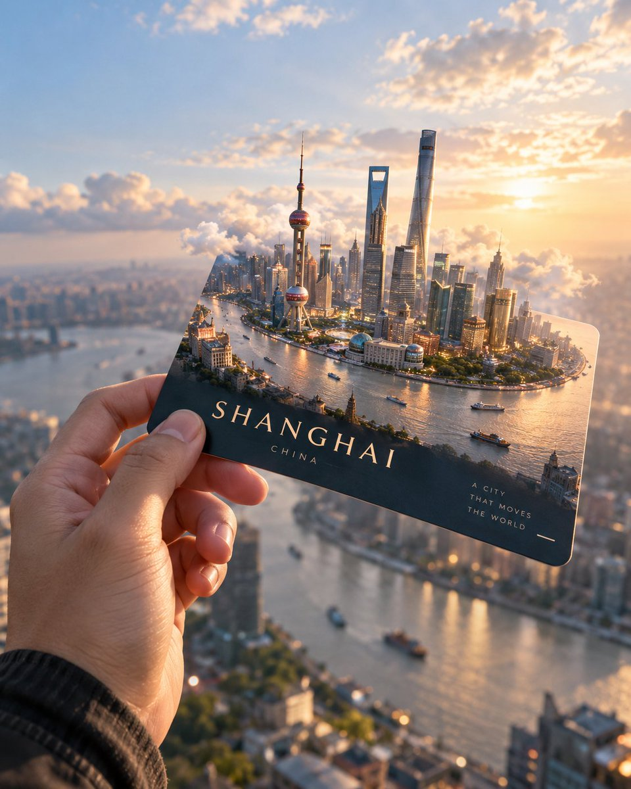

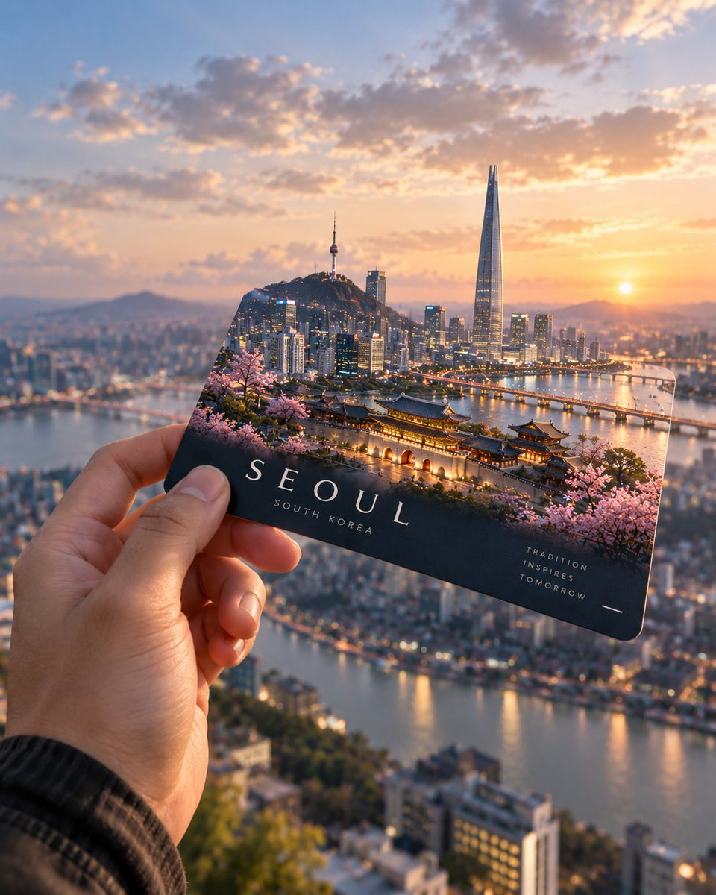

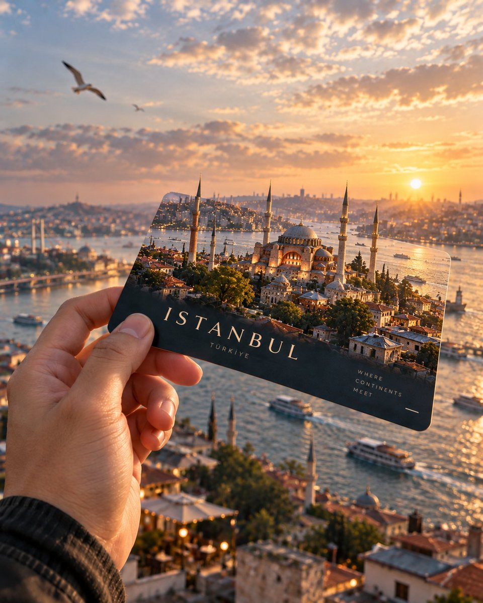

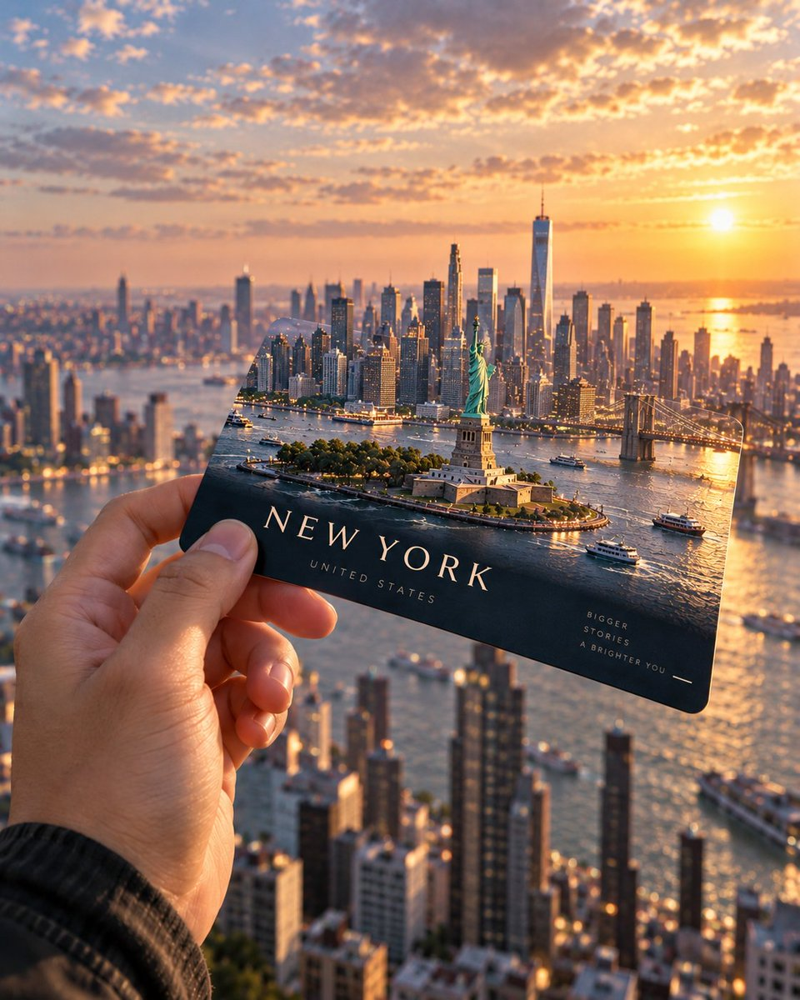

**プロンプト**

```text
広大な空を背景に、洗練されたミニマルなトラベルカードを片手で自然に持った、超リアルで映画的な4:5縦構図の旅行写真を生成してください。[COUNTRY NAME] をクリエイティブの主軸として使用します。カードを旅先へと通じる生きた窓に変え、その表面から息をのむようなミニチュアの空撮世界がシームレスに出現するようにしてください。目的地ならではの本格的な風景、建築、雰囲気、繊細なディテールに囲まれた、その国を最も象徴するランドマークを配置します。実物のカードとミニチュア世界との境界をシームレスかつ幻想的で、物理的に信憑性のあるものにし、まるで目的地全体がカードの中に実在しているかのように見せてください。エレガントで大胆な大文字のタイポグラフィで [COUNTRY NAME] をカードデザインの一部として組み込みます。映画的な自然光、リアルな質感、大気の奥行き、繊細な反射、ドラマチックなパースペクティブ、柔らかなレンズのボケ味、そして高級エディトリアル旅行写真の美学を取り入れてください。超写実的、8Kディテール、シネマティックなカラーグレーディング、リアルな肌や素材の質感、物理的に正確なライティング、ラグジュアリー、感情的、憧れを抱かせる、誰もが息をのむ美しさ。カートゥーン調、イラスト、不自然なCGI感は排除してください。
```

[↑ カテゴリに戻る](#catalog)

---

<a name="prompt-2096808538534514913"></a>

### ムーディーな背景をバックに温かみのある金色のリムライトが輝く、ベージュのセーターを着た男性のシネマティックなポートレート。

作者：[@iamsofiaijaz](https://x.com/iamsofiaijaz) · [元の投稿](https://x.com/iamsofiaijaz/status/2096808538534514913)

シネマティック / フィルムスチル · ポートレート / セルフィー · キャラクター · 要旨 / 背景 · 配信済み

**概要:** ムーディーな背景をバックに温かみのある金色のリムライトが輝く、ベージュのセーターを着た男性のシネマティックなポートレート。

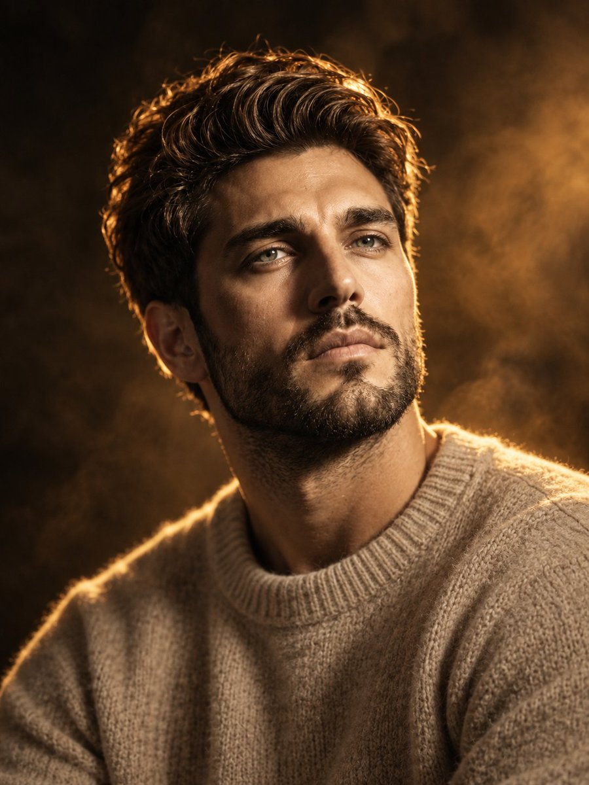

**プロンプト**

```text
無造作なミディアム丈の茶髪と綺麗に整えられた髭を持つハンサムな大人の男性の、フォトリアリスティックでシネマティックなポートレート。柔らかいベージュのニットクルーネックセーターを着用。穏やかで自信に満ち、わずかに物思いに沈んだ表情でカメラを見つめている。温かみのある金色のリムライトが髪と肩の周りに輝くハローを作り出し、強力で柔らかいキーライトが彼の顔を照らしている。かすかな琥珀色の霞と大気中のスモークが漂う暗くムーディーな背景、劇的な高コントラストのライティング、自然な肌の質感、鮮明な瞳、リアルな顔のディテール、浅い被写界深度、プロフェッショナルなスタジオ撮影、85mmポートレートレンズ、f/1.8、クリーミーなボケ味、温かみのあるシネマティックなカラーグレーディング、ラグジュアリーなエディトリアル美学、超高精細、写実的、8K。
```

[↑ カテゴリに戻る](#catalog)

---

<a name="category-illustration"></a>

## イラスト

<a name="prompt-2097521286436065680"></a>

### 公務員試験の問題を組み込んだ、図版付きの英語四級スタイルのレイアウト試験用紙を生成する。

作者：[@Tz\_2022](https://x.com/Tz_2022) · [元の投稿](https://x.com/Tz_2022/status/2097521286436065680)

イラスト · テキスト / タイポグラフィ · 配信済み

元の投稿：[@Lonely\_\_MH](https://x.com/Lonely__MH) · [元の投稿](https://x.com/Lonely__MH/status/2097494755752202574)

**概要:** 公務員試験の問題を組み込んだ、図版付きの英語四級スタイルのレイアウト試験用紙を生成する。

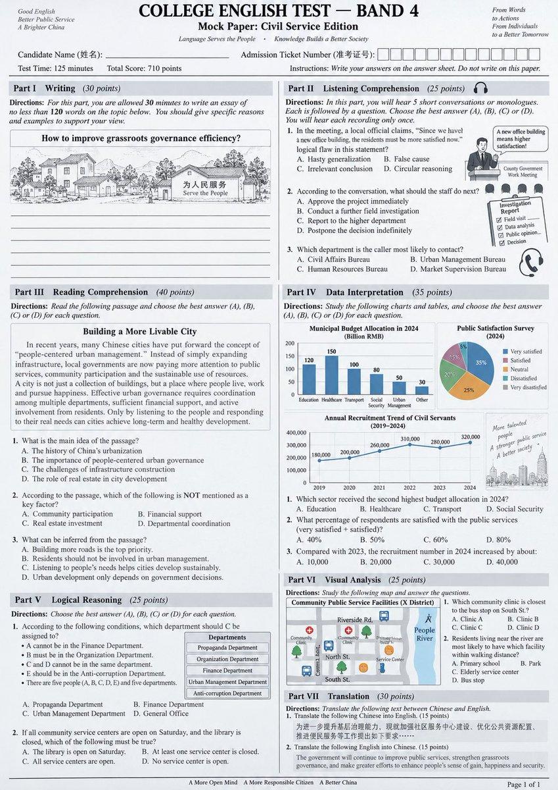

**プロンプト**

```text
大学英語四級試験（CET-4）スタイルの試験問題用紙を作成してください。ただし、問題内容はすべて公務員試験の問題とし、イラストや図版を取り入れたグラフィカルなデザインにしてください。
```

[↑ カテゴリに戻る](#catalog)

---

<a name="category-sketch-line-art"></a>

## スケッチ / 線画

<a name="prompt-2097284686448046135"></a>

### アイボリー紙の上に描くミニマルな手描きの建築トラベルジャーナルスケッチを生成するためのプロンプト。

作者：[@Naiknelofar788](https://x.com/Naiknelofar788) · [元の投稿](https://x.com/Naiknelofar788/status/2097284686448046135)

スケッチ / 線画 · 建築 / インテリア · 配信済み

**概要:** アイボリー紙の上に描くミニマルな手描きの建築トラベルジャーナルスケッチを生成するためのプロンプト。

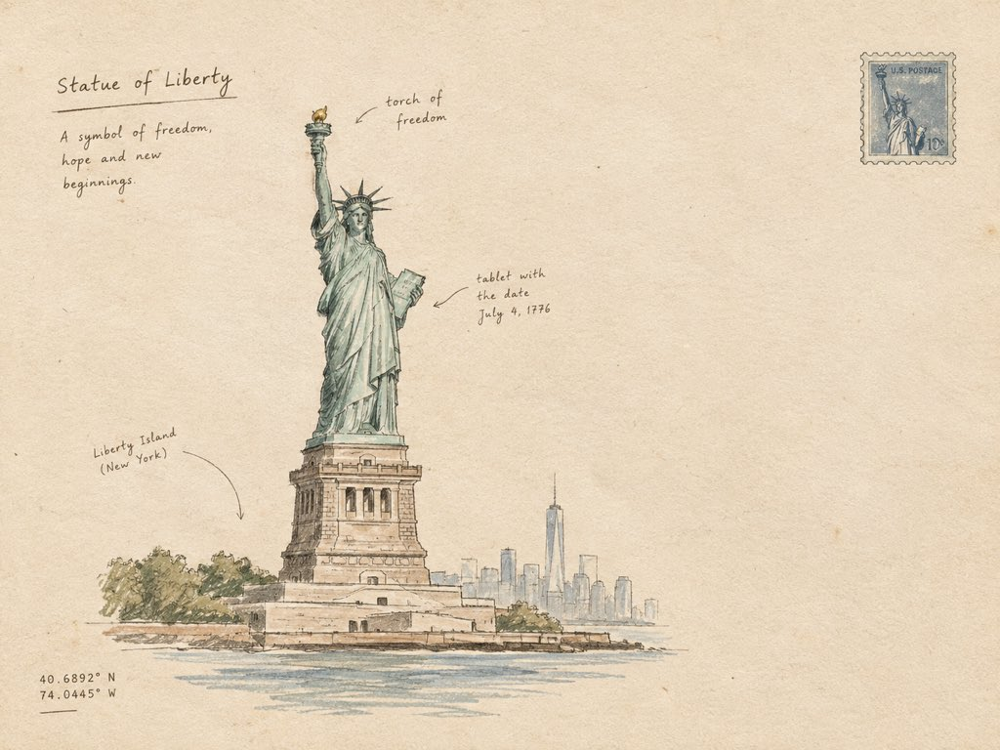

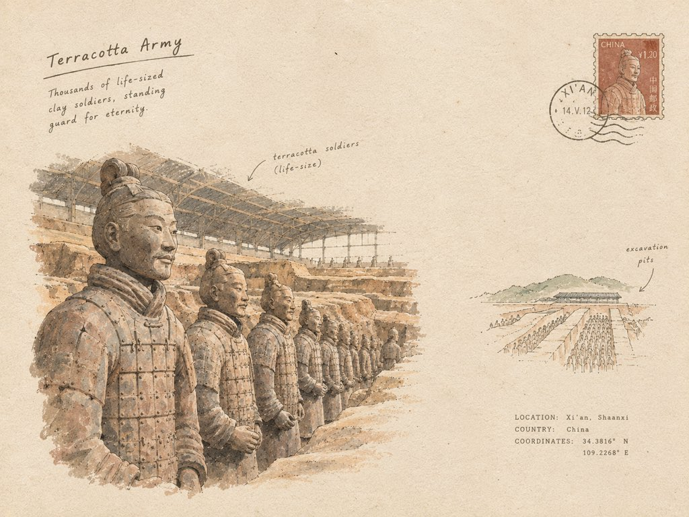

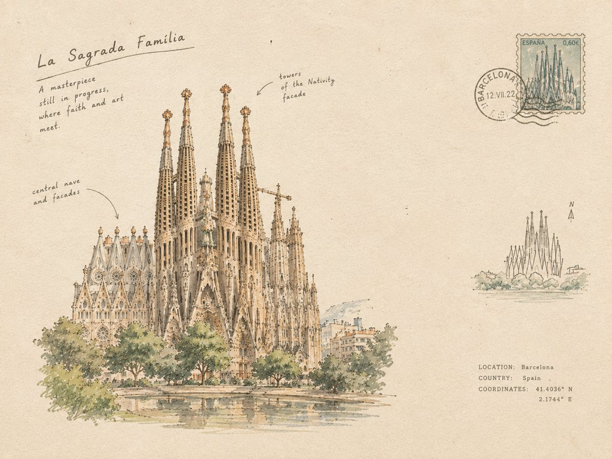

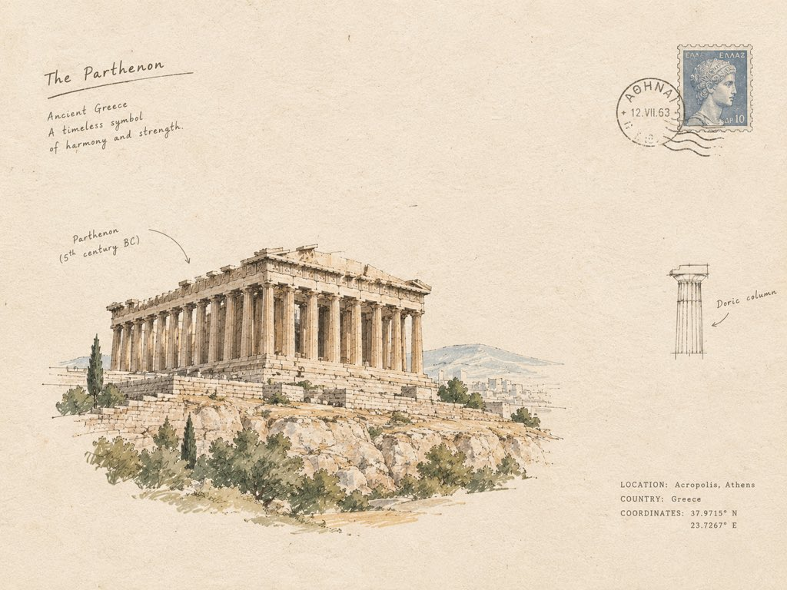

**プロンプト**

```text
温かみのあるアイボリーの紙の上に、[STRUCTURE] のミニマルな手描きの建築アートワークを作成してください。建築物を、すっきりとしながらも不完全さを残した線、繊細な鉛筆のシェーディング、小さな手書きの注記、そして控えめで繊細な建築ディテールを備えた、シンプルでエレガントなインクスケッチとして表現します。たっぷりの余白をとった開放感のある構図、控えめなアーストーン、柔らかな紙の質感、そして本物の手作りトラベルジャーナルのような雰囲気を保ってください。写実的なフォトリアリズムや重厚なディテール、雑然とした要素は排除し、シンプルで芸術的、洗練された仕上がりにしてください。
```

[↑ カテゴリに戻る](#catalog)

---

<a name="prompt-2096902953110299096"></a>

### 参照写真を50/50の縦型ポスターに変換し、上部に元の写真、下部に色鉛筆と水彩のスケッチを組み合わせるプロンプト。

作者：[@MissDelulu9](https://x.com/MissDelulu9) · [元の投稿](https://x.com/MissDelulu9/status/2096902953110299096)

ポスター / チラシ · スケッチ / 線画 · 水彩 · 配信済み

**概要:** 参照写真を50/50の縦型ポスターに変換し、上部に元の写真、下部に色鉛筆と水彩のスケッチを組み合わせるプロンプト。

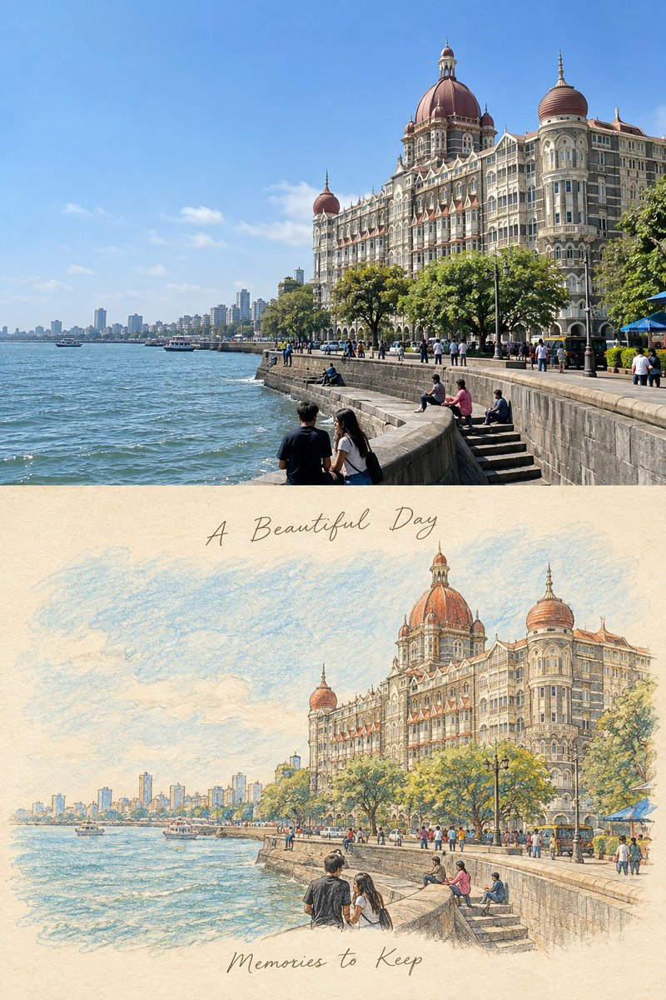

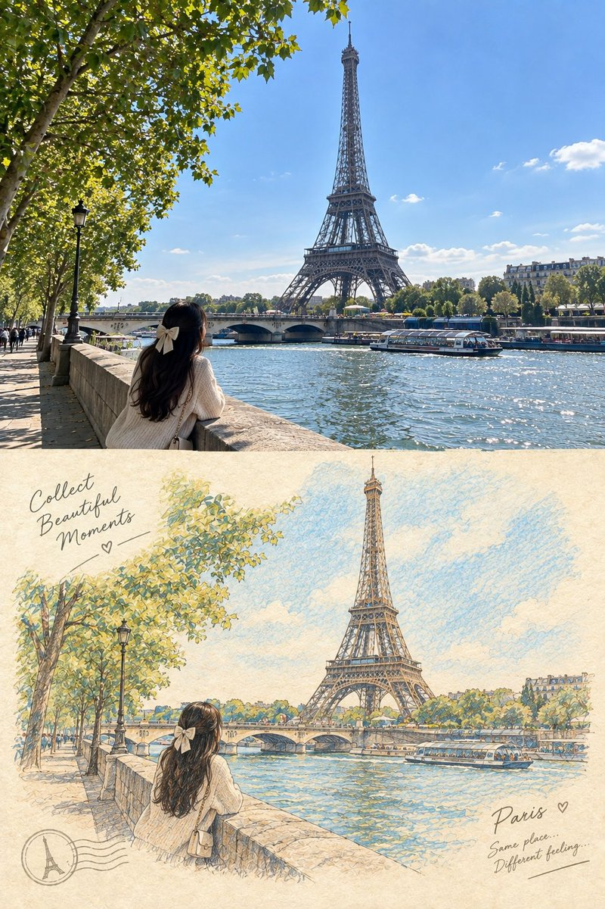

**プロンプト**

```text
正確に50/50で分割された、プレミアムな縦型トラベルジャーナルポスターを作成してください。

上部50%：オリジナルの参照写真を完全にリアルかつ変更なしのまま維持し、同じ構図、建築、人物、色、照明、遠近感、ディテールを保ちます。

下部50%：同じ写真を、温かみのあるクリーム色の紙に描かれた繊細な手描きの色鉛筆＋水彩スケッチに変換し、目に見える鉛筆のストローク、柔らかなウォッシュ、繊細な紙の質感、不完全な輪郭線、優しいクロスハッチングを加えます。すべての被写体が識別できるようにしてください。

エレガントな手書きテキストを追加：上部に「A Beautiful Day」、下部に「Memories to Keep」。ミニマルでノスタルジック、洗練された旅行雑誌の美学。余分なオブジェクトは配置せず、下半分にはフォトリアリズムを適用せず、正確な50/50レイアウトにしてください。
```

[↑ カテゴリに戻る](#catalog)

---

<a name="prompt-2097176979497791899"></a>

### 写真をミクストメディアのスケッチスタイルとミニマルなレイアウトを備えたエディトリアルアートポスターに変換するプロンプト。

作者：[@saniaspeaks\_](https://x.com/saniaspeaks_) · [元の投稿](https://x.com/saniaspeaks_/status/2097176979497791899)

ポスター / チラシ · スケッチ / 線画 · 配信済み

**概要:** 写真をミクストメディアのスケッチスタイルとミニマルなレイアウトを備えたエディトリアルアートポスターに変換するプロンプト。

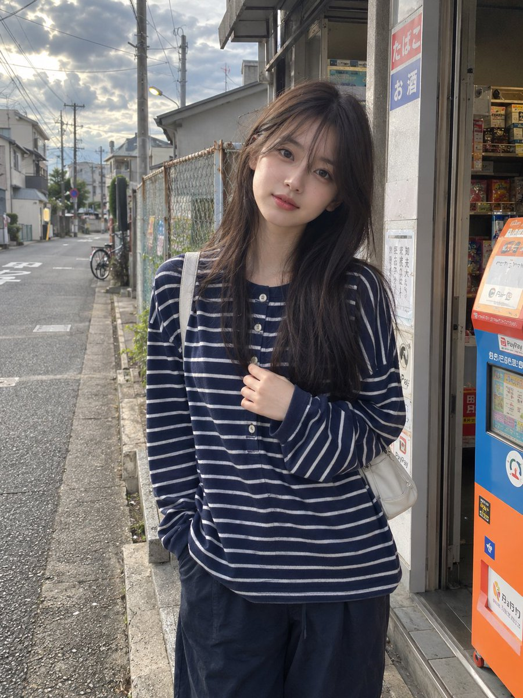

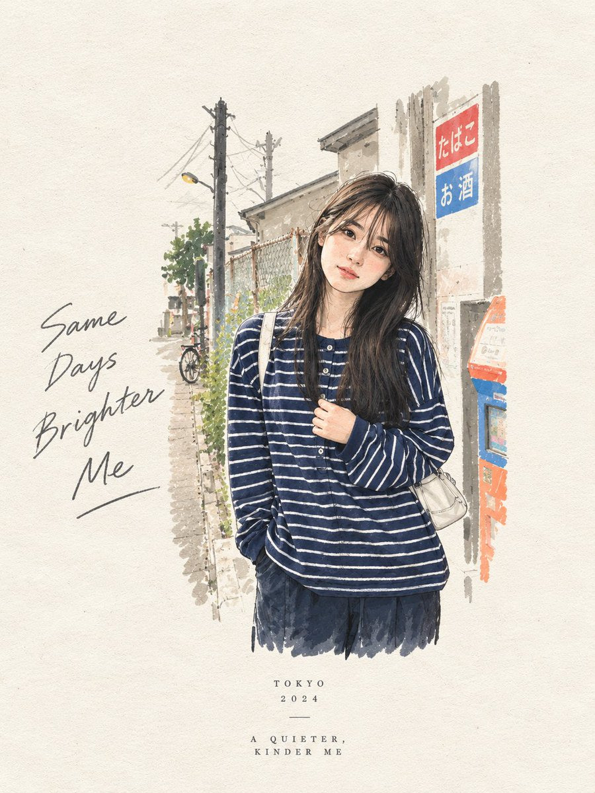

**プロンプト**

```text
アップロードされた写真ごとにプレミアムなエディトリアルアートポスターを作成し、各画像を独自の独立した構図として扱い、複数の写真を決して合成しないでください。厳密な3:4の縦長フォーマットを使用し、キャンバスを完全に均等な水平2分割にします。上半分は元の画像の忠実でフォトリアルな表現とし、被写体の正確な正体、顔の特徴、プロポーション、ポーズ、衣服、物体、構図、照明、影、ムード、自然な色を維持し、洗練されたエディトリアルカラーグレーディングと必要に応じたシームレスな環境拡張のみで補正します。下半分は視覚的なストーリーを全く異なる芸術的解釈へと変化させます。広大な温かみのあるアイボリーの余白の中央に、下半分セクションの10〜20%以下を占める小さく綿密に構成された手作りのミクストメディアアートワークを配置し、表現力豊かなインクスケッチ、重層的なガッシュ風の色面、繊細なコラージュの質感、ちぎり紙の縁、不完全な筆跡、目に見える繊維、柔らかな顔料の濃淡、そして魅力的な人間味のある不完全さを用いながら、元の写真から最も認識しやすいシルエット、ジェスチャー、物体、感情的な物語を保持します。各写真から最大4つの調和のとれた支配的な色を抽出し、控えめで洗練されたパレットで再解釈します。詩的なタイトル、場所、日付、単一の単語など、構図を真に引き立てる場合にのみ、控えめなエディトリアルタイポグラフィを時折追加します。全体的な仕上がりは、コレクションに値する現代アート出版物の表紙のように、ミニマルで詩的、触覚的、エレガント、感情的に静かで、視覚的に際立ち、元の写真と間違いなく結びついているように感じられるものにしてください。
```

[↑ カテゴリに戻る](#catalog)

---

<a name="category-3d-render"></a>

## 3D レンダリング

<a name="prompt-2097580884098764800"></a>

### お土産の飾り板テキストが付いた、ランドマークのプレミアムでかわいいミニチュア3Dジオラマを作成する。

作者：[@Naiknelofar788](https://x.com/Naiknelofar788) · [元の投稿](https://x.com/Naiknelofar788/status/2097580884098764800)

3D レンダリング · 建築 / インテリア · 配信済み

**概要:** お土産の飾り板テキストが付いた、ランドマークのプレミアムでかわいいミニチュア3Dジオラマを作成する。

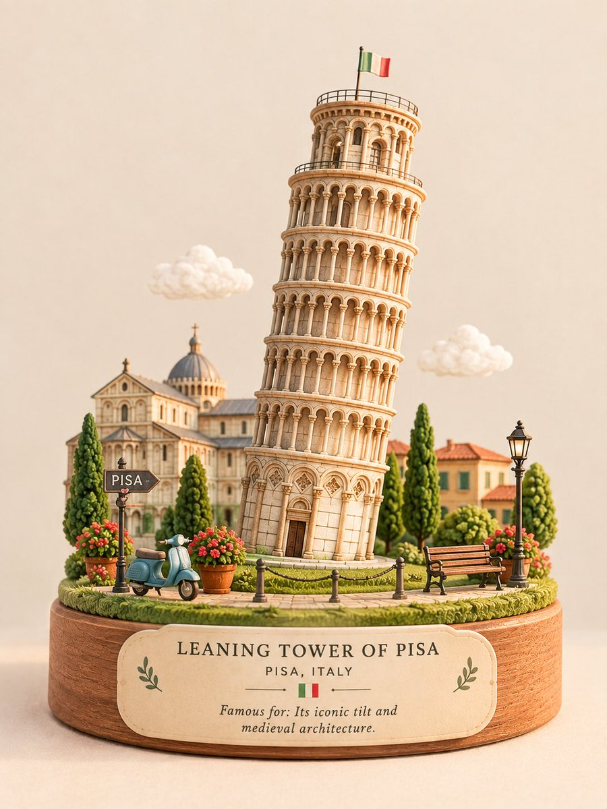

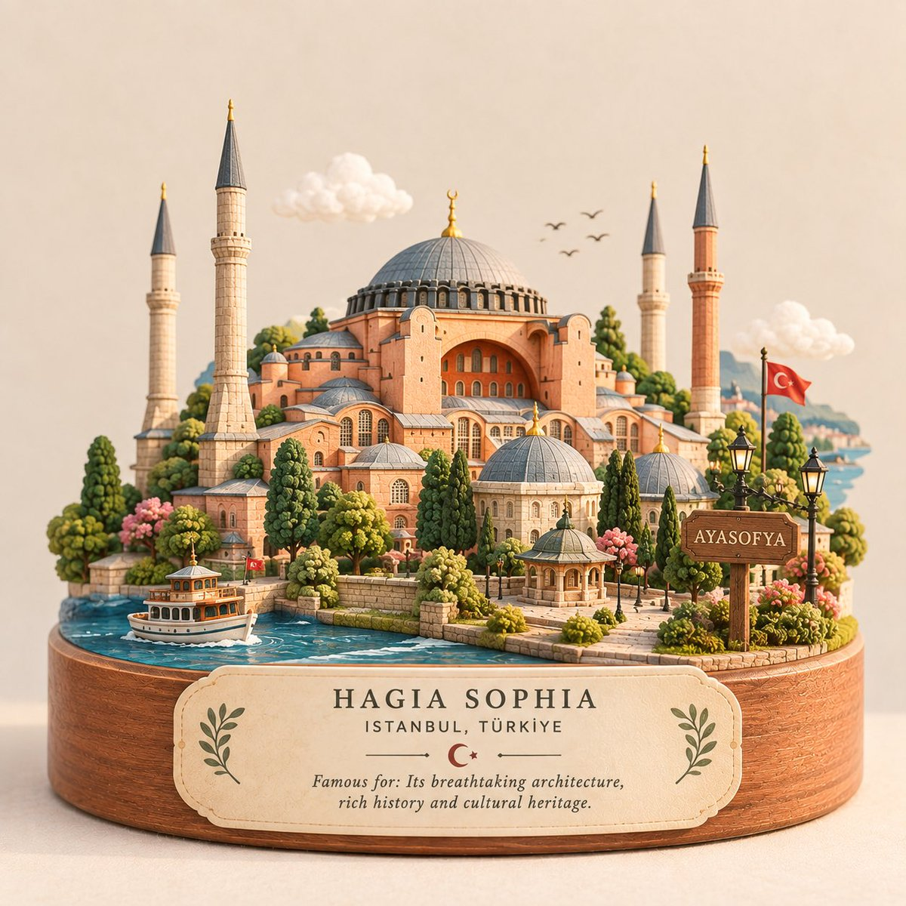

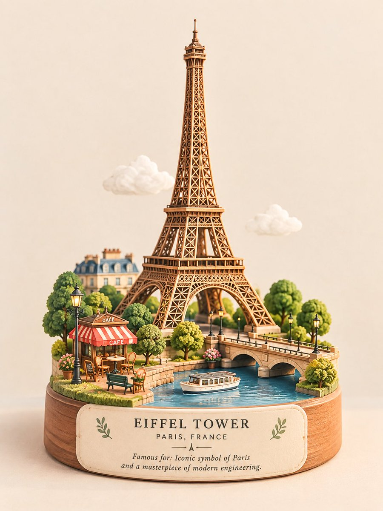

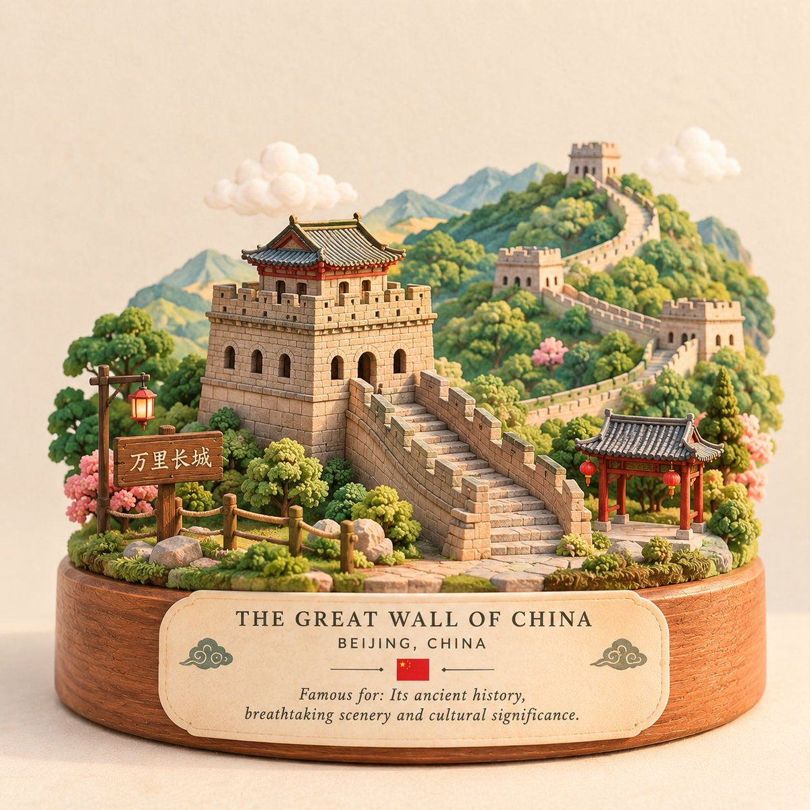

**プロンプト**

```text
[国, 都市] の [建造物名] の、プレミアムでかわいいミニチュア3Dジオラマを作成してください。ランドマークの特徴がはっきりとわかり、エレガントで魅力的な外観を保ち、すっきりとした構図、柔らかなパステルトーン、繊細な手作りのディテール、穏やかな自然光、洗練された旅行土産の美学を取り入れてください。

控えめで上品なテキストを含めてください：
[建造物名]
[国, 都市]
有名な理由：[短い説明]
```

[↑ カテゴリに戻る](#catalog)

---

<a name="prompt-2097587863139537262"></a>

### モリガン・アーンスランドと完全なゲームHUDインタラクティブUIを含む、架空の3D恋愛RPGビーチ一人称ゲームスクリーンショット。

作者：[@underwoodxie96](https://x.com/underwoodxie96) · [元の投稿](https://x.com/underwoodxie96/status/2097587863139537262)

アプリ / Web デザイン · 3D レンダリング · キャラクター · 配信済み

元の投稿：[@underwoodxie96](https://x.com/underwoodxie96) · [元の投稿](https://x.com/underwoodxie96/status/2097554154554314891)

**概要:** モリガン・アーンスランドと完全なゲームHUDインタラクティブUIを含む、架空の3D恋愛RPGビーチ一人称ゲームスクリーンショット。

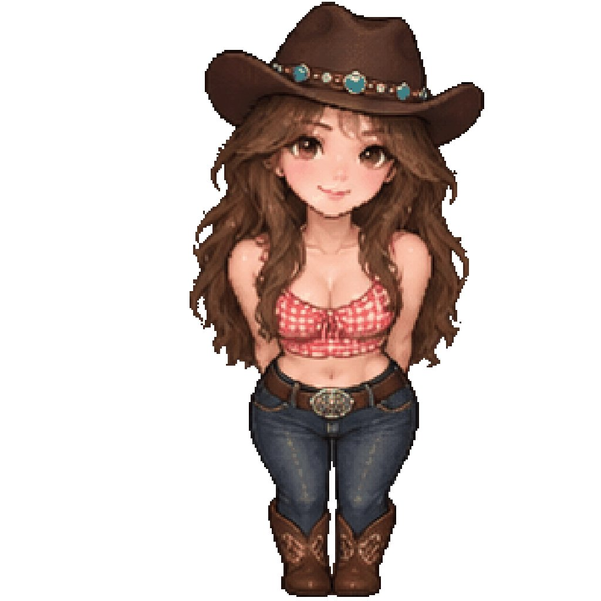

**プロンプト**

```text
架空の次世代3Dオープンワールド恋愛RPGから、男性主人公の一人称視点で描かれたリアルなゲームスクリーンショットをキャプチャしてください。ビーチで、『ヴァンパイア』シリーズのモリガン・アーンスランド（Morrigan Aensland）が主人公に日焼け止めを塗ってほしいと誘っています。全体的なビジュアルスタイルは、高品質なトゥーンレンダリングによる3Dキャラクターと、Unreal Engine 5レベルのグラフィックを融合させ、AAAタイトルの映像美を実現する必要があります。極めて精密なキャラクターモデリング、リアルな肌のシェーディング、シネマティックなライティング、PBRマテリアル、高精細な衣服のテクスチャ、精密にレンダリングされた環境を含めてください。最終的な画像は、ミニマップ、クエスト表示、キャラクターステータスバー、インタラクションプロンプト、会話字幕、HUD要素など、完全なゲームUIを備えた実際のプレイアブルゲームのスクリーンショットに見える必要があります。
```

[↑ カテゴリに戻る](#catalog)

---

<a name="category-pixel-art"></a>

## ピクセルアート

<a name="prompt-2097574111518375970"></a>

### 添付キャラクターに基づき、走る・跳ぶ・回転攻撃・倒れるの4動作（各4フレーム）を描いたドット絵スプライトシートを生成するプロンプト。

作者：[@npaka123](https://x.com/npaka123) · [元の投稿](https://x.com/npaka123/status/2097574111518375970)

ピクセルアート · キャラクター · 配信済み

**概要:** 添付キャラクターに基づき、走る・跳ぶ・回転攻撃・倒れるの4動作（各4フレーム）を描いたドット絵スプライトシートを生成するプロンプト。

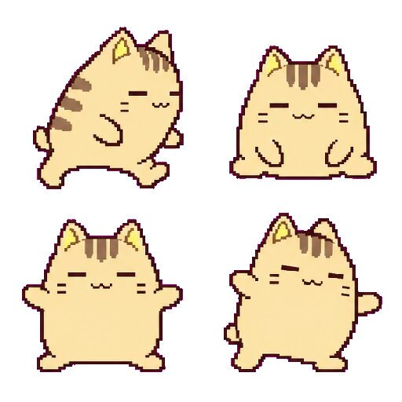

**プロンプト**

```text
添付キャラクターの顔・髪型・衣装・配色・体格を統一し、ゲームで映える4種類のドット絵モーションを、各最大4フレームで1枚のスプライトシート画像に生成して。1フレームのサイズは256x256px。
・走る：体を前傾させ、手足を大きく交互に動かす。
・ジャンプ：しゃがむ → 跳び上がる → 空中で手足を広げる → 着地。
・回転攻撃：正面 → 横向き → 後ろ向き → 反対の横向きと、全身を一回転。
・倒れる：よろめく → 横に傾く → 寝転ぶ → 目を閉じて動かなくなる。
1行に1動作を横一列で配置し、全セルの大きさ、足元、中心、縮尺を揃える。背景は完全な単色とし、影、文字、枠、番号、UI、ぼかし、半透明、グラデーション、アンチエイリアスは使用しない。ループ動作は最初と最後が自然につながるようにする。
```

[↑ カテゴリに戻る](#catalog)

---

<a name="prompt-2097573967955730524"></a>

### 参照画像に基づき、4種類のゲーム用ドット絵アクション（走行・跳躍・回転攻撃・転倒）を4フレームずつ並べたスプライトシートを生成する指示。

作者：[@npaka123](https://x.com/npaka123) · [元の投稿](https://x.com/npaka123/status/2097573967955730524)

ピクセルアート · キャラクター · 配信済み

**概要:** 参照画像に基づき、4種類のゲーム用ドット絵アクション（走行・跳躍・回転攻撃・転倒）を4フレームずつ並べたスプライトシートを生成する指示。

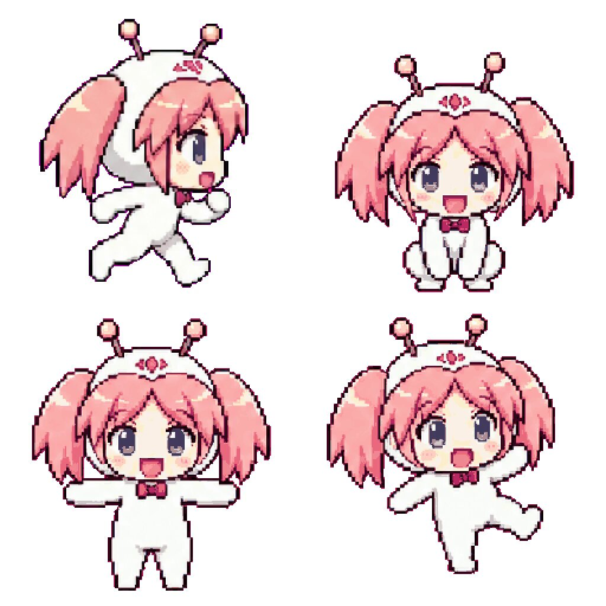

**プロンプト**

```text
添付キャラクターの顔・髪型・衣装・配色・体格を統一し、ゲームで映える4種類のドット絵モーションを、各最大4フレームで1枚のスプライトシート画像に生成して。1フレームのサイズは256x256px。
・走る：体を前傾させ、手足を大きく交互に動かす。
・ジャンプ：しゃがむ → 跳び上がる → 空中で手足を広げる → 着地。
・回転攻撃：正面 → 横向き → 後ろ向き → 反対の横向きと、全身を一回転。
・倒れる：よろめく → 横に傾く → 寝転ぶ → 目を閉じて動かなくなる。
1行に1動作を横一列で配置し、全セルの大きさ、足元、中心、縮尺を揃える。背景は完全な単色とし、影、文字、枠、番号、UI、ぼかし、半透明、グラデーション、アンチエイリアスは使用しない。ループ動作は最初と最後が自然につながるようにする。
```

[↑ カテゴリに戻る](#catalog)

---

<a name="prompt-2097559943075533257"></a>

### ピクセルアート風のオスのゴブリンが弓を引き矢を放つ16フレームのスプライトシートのアニメーションループ生成指示。

作者：[@Fomsky\_Wei](https://x.com/Fomsky_Wei) · [元の投稿](https://x.com/Fomsky_Wei/status/2097559943075533257)

ピクセルアート · 配信済み

**概要:** ピクセルアート風のオスのゴブリンが弓を引き矢を放つ16フレームのスプライトシートのアニメーションループ生成指示。

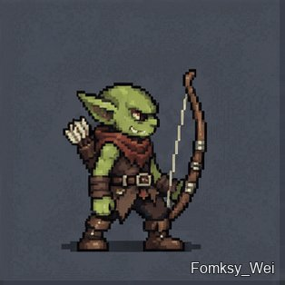

**プロンプト**

```text
スキルを使用せず、スプライトシートを1枚作成してください。\nこの画像には、ピクセルアート風のオスのゴブリンが弓を引き矢を放つ一連のプロセスが含まれます。\n合計16フレームです。\nその後、この画像をフレームごとにスライスし、無限ループGIFを作成してください。
```

[↑ カテゴリに戻る](#catalog)

---

<a name="category-watercolor"></a>

## 水彩

<a name="prompt-2097637962137895058"></a>

### 翻訳中

作者：[@tataemugc](https://x.com/tataemugc) · [元の投稿](https://x.com/tataemugc/status/2097637962137895058)

イラスト · 水彩 · レトロ / ヴィンテージ · 配信済み

元の投稿：[@Crypto\_QianXun](https://x.com/Crypto_QianXun) · [元の投稿](https://x.com/Crypto_QianXun/status/2097174853707284785)

**概要:** 翻訳中

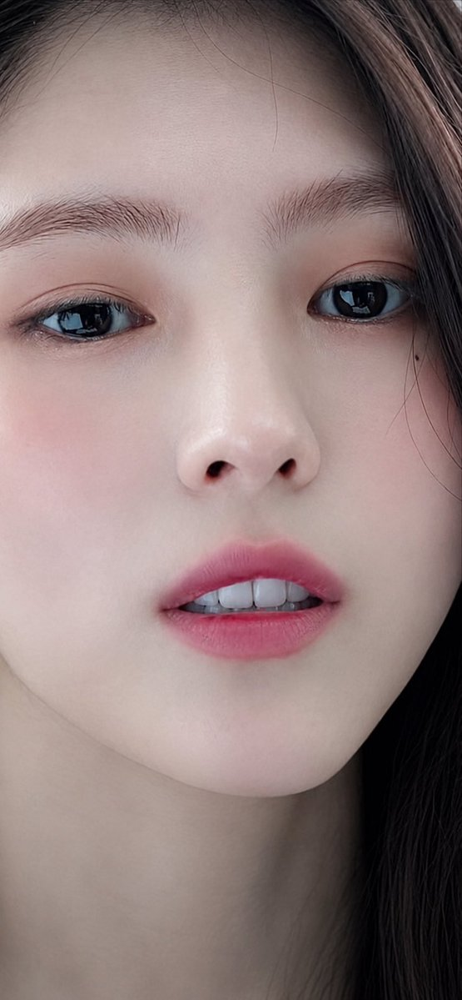

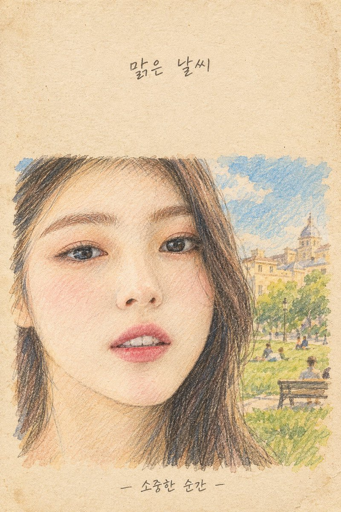

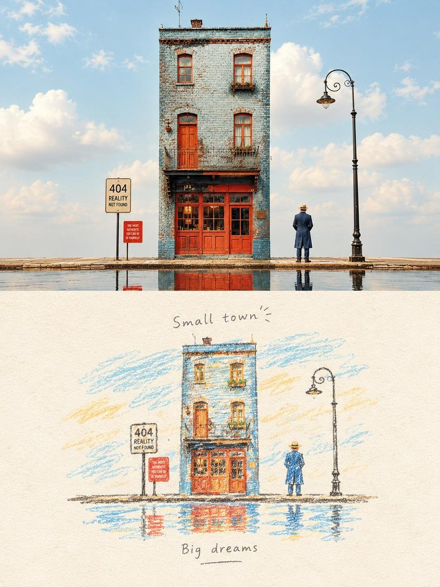

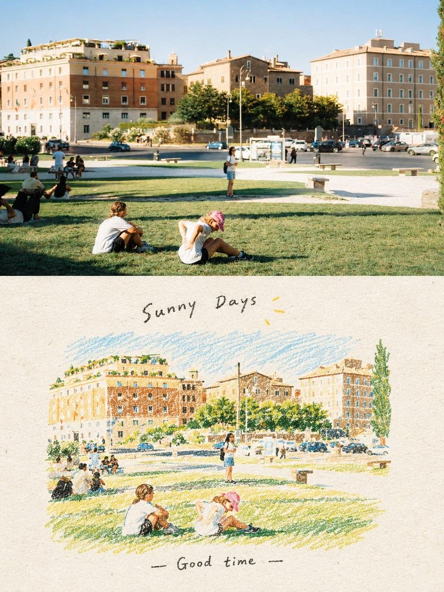

**プロンプト**

```text
翻訳中
```

[↑ カテゴリに戻る](#catalog)

---

<a name="category-retro-vintage"></a>

## レトロ / ヴィンテージ

<a name="prompt-2097185580224491672"></a>

### 90年代ヴィンテージストリートファッションのエディトリアルポートレート。アメリカンクラシックカーにもたれかかる男性と、背景のオークランドの風化した都会の壁。

作者：[@harboriis](https://x.com/harboriis) · [元の投稿](https://x.com/harboriis/status/2097185580224491672)

写真撮影 · レトロ / ヴィンテージ · ポートレート / セルフィー · キャラクター · ファッションアイテム · 車両 · 街並み / ストリート · 要旨 / 背景 · 配信済み

**概要:** 90年代ヴィンテージストリートファッションのエディトリアルポートレート。アメリカンクラシックカーにもたれかかる男性と、背景のオークランドの風化した都会の壁。

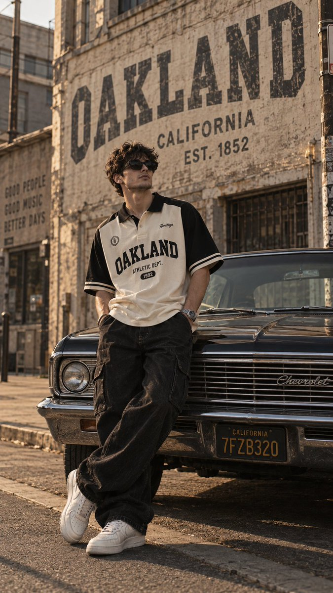

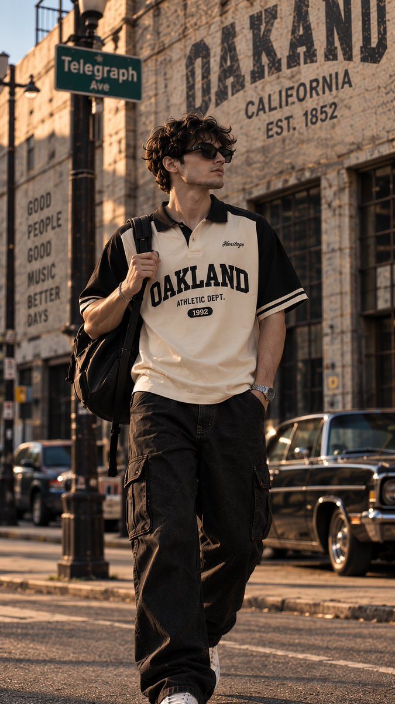

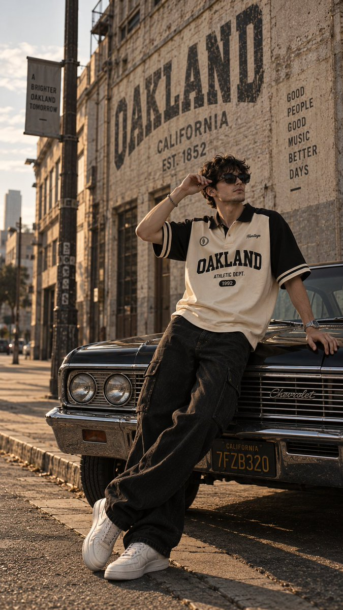

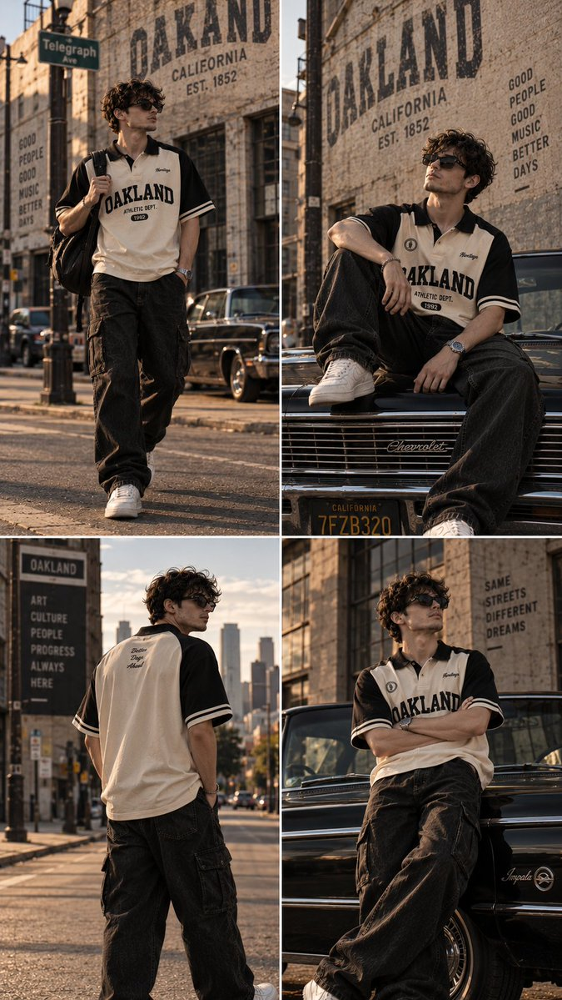

**プロンプト**

```text
濃い巻き毛の黒髪をした若い男性をフィーチャーした、超リアルな垂直 9:16 のエディトリアル・ストリートウェア写真を撮影してください。彼は黒のサングラスをかけ、大胆な「OAKLAND」のカレッジロゴとその下に小さなアスレチックテキストがプリントされたクリームと黒のオーバーサイズポロシャツ、ゆったりとした黒のカーゴパンツ、白いスニーカー、そしてクラシックなメタル製腕時計を身に着けています。ポケットに手を入れ、片脚をもう片方の脚の上にクロスさせて、アメリカンクラシックカーのフロントにさりげなくもたれかかっています。背景には古びた風化したビルが建つ、ざらついた都会の通りを設定してください。背後の壁には色あせた「OAKLAND」の大きなタイポグラフィ、そしてその下には「CALIFORNIA」と「EST. 1852」の文字を描いてください。暖かな午後の遅い日差し、落ち着いたブラウンとベージュのカラーパレット、ほのかなフィルムグレイン、柔らかい影、ノスタルジックな1990年代のストリートファッションの美学、リアルな肌の質感、自然なポーズ、映画のような被写界深度、細部まで作り込まれたヴィンテージカー、本物のエディトリアル写真。全身構図、ローアングルのアイレベルカメラ、35mmレンズ、暖かみのあるシネマティックライティング、フォトリアリスティック、ハイディテール、4K。
```

[↑ カテゴリに戻る](#catalog)

---

<a name="category-minimalism"></a>

## ミニマリズム

<a name="prompt-2097204639863287913"></a>

### 翡翠青、ローズピンク、暖白色のトーンを組み合わせた、東洋の禅と新中華スタイルの女性と格子窓を描くポスター・壁紙プロンプト。

作者：[@liyue\_ai](https://x.com/liyue_ai) · [元の投稿](https://x.com/liyue_ai/status/2097204639863287913)

ポスター / チラシ · ミニマリズム · キャラクター · 要旨 / 背景 · 配信済み

元の投稿：[@liyue\_ai](https://x.com/liyue_ai) · [元の投稿](https://x.com/liyue_ai/status/2096838519918596234)

**概要:** 翡翠青、ローズピンク、暖白色のトーンを組み合わせた、東洋の禅と新中華スタイルの女性と格子窓を描くポスター・壁紙プロンプト。

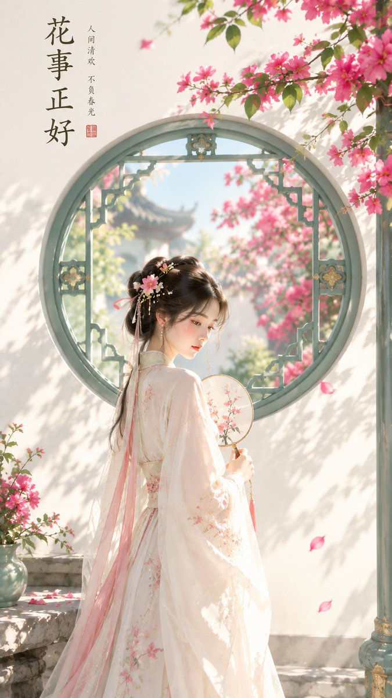

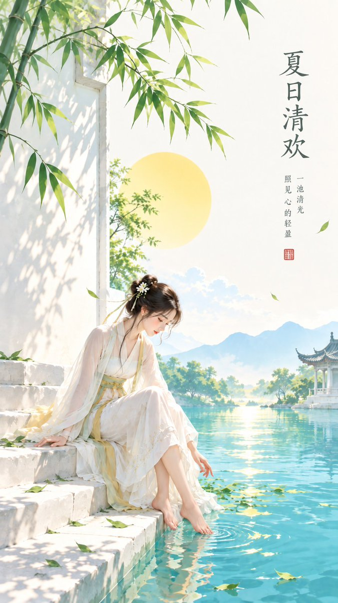

**プロンプト**

```text
テーマの方向性：東洋の禅の意匠を取り入れたミニマルな表紙ポスター
スタイルの系統：女性的審美に基づく新中華スタイル
主たる被写体：格子窓の前に立つ、静かで慎ましい佇まいの古典的な衣装を着た女性
感情のモチーフ：優雅、たおやか、軽やかなラグジュアリー感
シーンとイメージ：翡翠青の格子窓、ローズピンクの花の影、暖かみのある白い壁、女性、ごく少量の淡いゴールドのディテール
構図と空間：9:16の縦構図、格子窓は中上部、人物は中下部に配置、上部にはすっきりとしたタイトル用スペースを確保
色彩のコントロール：暖白色を明るいベースとし、翡翠青を格子窓とわずかな背景構造に使用、ローズピンクを花の影や部分的なアクセントに、淡いゴールドをごくわずかな装飾品のハイライトのみに使用、人物の衣装はパールホワイトまたは淡いピンクホワイト。画面全体が翡翠青やローズピンク一色になるのを避ける
光と質感：柔らかい自然光、鮮明で透明感のある色彩、清潔感のあるフラットなポスターの質感
アスペクト比：9:16
追加要求：全体として洗練された美しい新中華スタイルの表紙の雰囲気を持ち、精緻でありながら過剰な装飾を避けること
```

[↑ カテゴリに戻る](#catalog)

---

<a name="prompt-2096807576168169628"></a>

### アップロードされた写真をもとに3:4の2分割エディトリアルポスターを生成し、上半分は元の写真を忠実に再現、下半分は小さなミニマル手描きイラストへと変換します。

作者：[@Sairah\_0](https://x.com/Sairah_0) · [元の投稿](https://x.com/Sairah_0/status/2096807576168169628)

ポスター / チラシ · イラスト · ミニマリズム · 配信済み

**概要:** アップロードされた写真をもとに3:4の2分割エディトリアルポスターを生成し、上半分は元の写真を忠実に再現、下半分は小さなミニマル手描きイラストへと変換します。

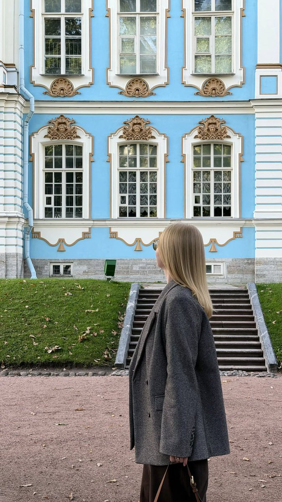

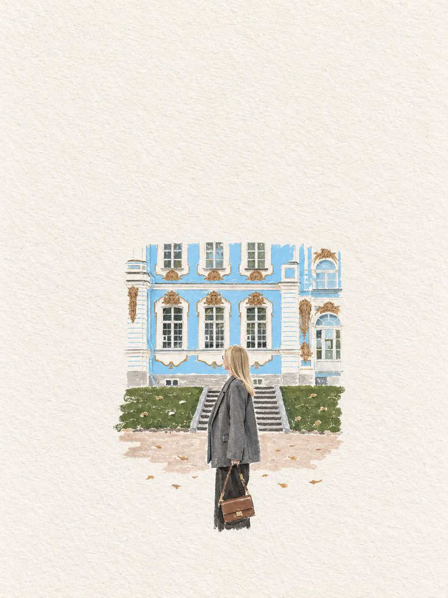

**プロンプト**

```text
アップロードされた写真ごとに、独立したハイエンドなエディトリアルポスターを1枚ずつ作成してください。写真を結合しないでください。各写真は必ず個別のポスターにする必要があります。\n\nフォーマット\n厳密な縦型3:4比率。キャンバスを水平方向にきっかり50%ずつの2つの均等なセクションに分割します。\n\n上部50% — 元の写真\n写真の特徴（同一性、顔、プロポーション、ポーズ、服装、オブジェクト、構図、照明、影、雰囲気、色彩）を忠実に再現します。上質なエディトリアルカラーグレーディングを施したフォトリアリスティックな質感を維持してください。必要に応じて背景をシームレスに拡張しますが、被写体を歪めたり変更したりしないでください。\n\n下部50% — ミニマルイラストレーション\n最も特徴的な要素を、下半分の中央にわずか10〜20%だけ配置する小さな手描き紙製イラストとして再解釈します。主要な被写体、シルエット、ポーズ、オブジェクト、物語性を保持してください。\n\n繊細で不完全な線、大胆でフラットなアクリル画風の形状、粗い紙のテクスチャ、手作業の筆跡、有機的なエッジを使用します。背景は温かみのあるオフホワイト/ウォームホワイトにし、たっぷりと余白を設けてください。\n\nカラー\n元の写真から主要な色を抽出し、控えめで調和のとれた最大4色に絞り込みます。\n\nタイポグラフィ\n短いタイトル、場所、年、キーワードなど、最小限のエディトリアルテキスト（任意）。不要な場合は無理にテキストを入れないでください。\n\nスタイル\n静謐、詩的、洗練、ミニマル、無垢、芸術的、思慮深い、プレミアム、そして高い識別性 — 現代のアートブックやインディペンデント誌の表紙のようなスタイル。
```

[↑ カテゴリに戻る](#catalog)

---

<a name="category-other"></a>

## その他

<a name="prompt-2097582500273115191"></a>

### 翻訳中

作者：[@ky6001481673691](https://x.com/ky6001481673691) · [元の投稿](https://x.com/ky6001481673691/status/2097582500273115191)

ポートレート / セルフィー · キャラクター · ファッションアイテム · 配信済み

**概要:** 翻訳中

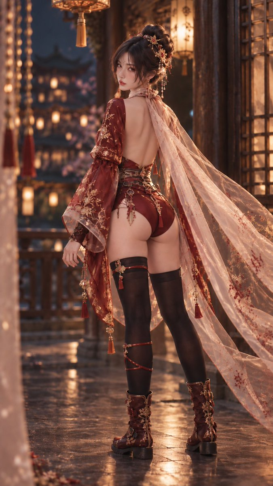

**プロンプト**

```text
翻訳中
```

[↑ カテゴリに戻る](#catalog)

---

<a name="prompt-2097558679956664521"></a>

### ひび割れた磁器マスク、頭部ケーブル、ハイコントラストなモノクロ照明が特徴の、やつれた人型フィギュアのサイバーパンクホラーポートレート。

作者：[@meng\_dagg695](https://x.com/meng_dagg695) · [元の投稿](https://x.com/meng_dagg695/status/2097558679956664521)

ポートレート / セルフィー · 配信済み

**概要:** ひび割れた磁器マスク、頭部ケーブル、ハイコントラストなモノクロ照明が特徴の、やつれた人型フィギュアのサイバーパンクホラーポートレート。


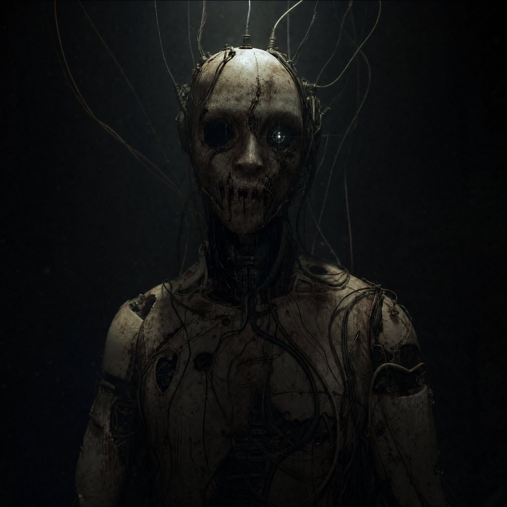

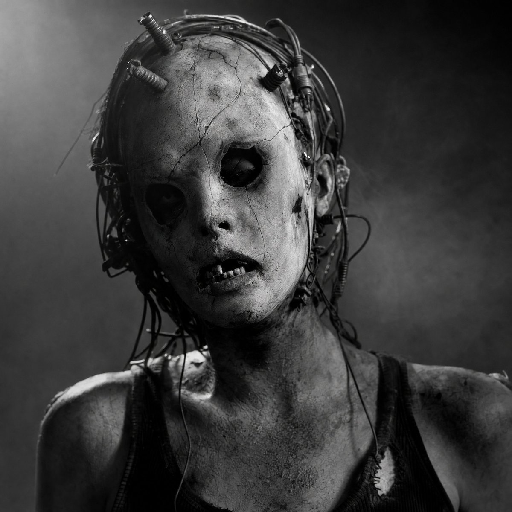

**プロンプト**

```text
サイバーパンクホラーのポートレート、ひび割れた磁器のように白い頭蓋骨風マスクをつけたやつれた人型フィギュア、不揃いな空洞の眼窩（片方は深く窪んだ虚無、もう片方は埋め込まれた金属リング）、ギザギザと露出した歯、頭部に配線された太い黒のケーブルと工業用ボビン/コイルアタッチメントの混沌とした絡み合いに囲まれている、擦り切れたダークカラーの布製の服、ドラマチックなローキーライティング、深い漆黒の背景、ハイコントラストなモノクローム、ホラー写真、シネマティック、超詳細なテクスチャ、85mmレンズ、浅い被写界深度。
```

[↑ カテゴリに戻る](#catalog)

---

<a name="prompt-2097519422407872858"></a>

### 彫刻された木製チェスのナイトが360度滑らかに回転するターンテーブルスタジオ動画。

作者：[@higgsfield](https://x.com/higgsfield) · [元の投稿](https://x.com/higgsfield/status/2097519422407872858)

製品 · 配信済み

**概要:** 彫刻された木製チェスのナイトが360度滑らかに回転するターンテーブルスタジオ動画。

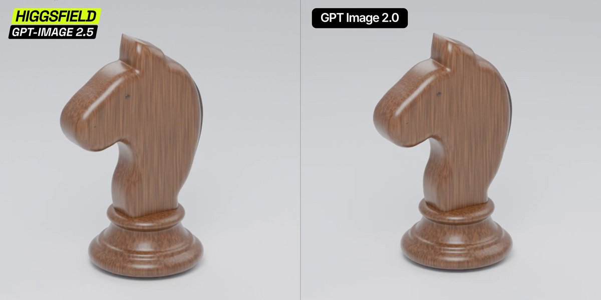

**プロンプト**

```text
磨き上げられた木製チェスのナイトの、フォトリアルなスタジオターンテーブル動画を作成してください。

ナイトはミニマリストな彫刻の馬のシルエットをしています：幅広で平らな側面、丸みを帯びた細長い鼻づら、小さな黒い目、角張った耳、緩やかにカーブした首。滑らかなダークブラウンのインサートが背中のたてがみに沿って施されています。駒は、複数の同心円状の段差リングが付いた幅広の円形木製ベースの上に立っています。

はっきりと見える垂直の木目、柔らかく丸みを帯びたエッジ、光沢のあるラッカー仕上げの温かみのある茶色の木材を使用してください。動画全体を通して、正確な形状、プロポーション、木目、ダークブラウンのたてがみのインサートを維持してください。

ベースを含むチェスの駒全体が、垂直軸を中心に一定の速度で滑らかに360度1回転します。完全に中央に位置し、床面にしっかりと置かれています。シームレスなループのために、最初と最後のフレームは完全に一致します。

カメラは完全に静止させ、駒を少し見下ろすアングルにします。上下に少し余白を持たせてオブジェクト全体を表示します。シームレスなライトグレーのスタジオ背景と床、柔らかく拡散した照明、ラッカーの優しいハイライト、ベースの下のかすかなコンタクトシャドウを使用してください。

再生時間：3秒。フレームレート：30 fps。正方形 1:1 の構図。

カメラの動き、ズーム、カット、ぐらつき、浮遊、変形、プロポーションの変化、木目テクスチャのズレ、ちらつき、追加のオブジェクト、テキスト、ロゴはなし。
```

[↑ カテゴリに戻る](#catalog)

---

<a name="prompt-2097513469172129825"></a>

### 花柄のチャイナドレスを着たスレンダーな女性のハイアングルポートレート、夢のような柔らかなライティングと繊細なメイク。

作者：[@BubbleBrain](https://x.com/BubbleBrain) · [元の投稿](https://x.com/BubbleBrain/status/2097513469172129825)

ポートレート / セルフィー · キャラクター · 配信済み

**概要:** 花柄のチャイナドレスを着たスレンダーな女性のハイアングルポートレート、夢のような柔らかなライティングと繊細なメイク。


**プロンプト**

```text
9:16、チャイナドレス（旗袍）を着用、柔らかな光のブルーム、ドリーミーなボケ感、見下ろすハイアングルショット、背が高くスレンダーなモデル体型、洗練されたメイク、狐顔の美女
```

[↑ カテゴリに戻る](#catalog)

---

<a name="prompt-2097486896750338125"></a>

### リファレンス画像に基づいて光と影、質感、構図を維持し、キャラクターとテーマを再デザインするImage-to-Image用プロンプトテンプレート。

作者：[@nanyuan0412](https://x.com/nanyuan0412) · [元の投稿](https://x.com/nanyuan0412/status/2097486896750338125)

キャラクター · 配信済み

**概要:** リファレンス画像に基づいて光と影、質感、構図を維持し、キャラクターとテーマを再デザインするImage-to-Image用プロンプトテンプレート。

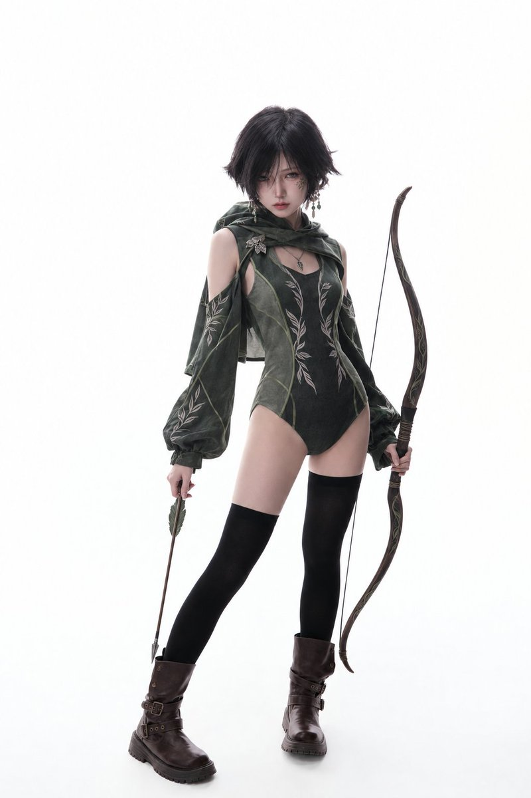

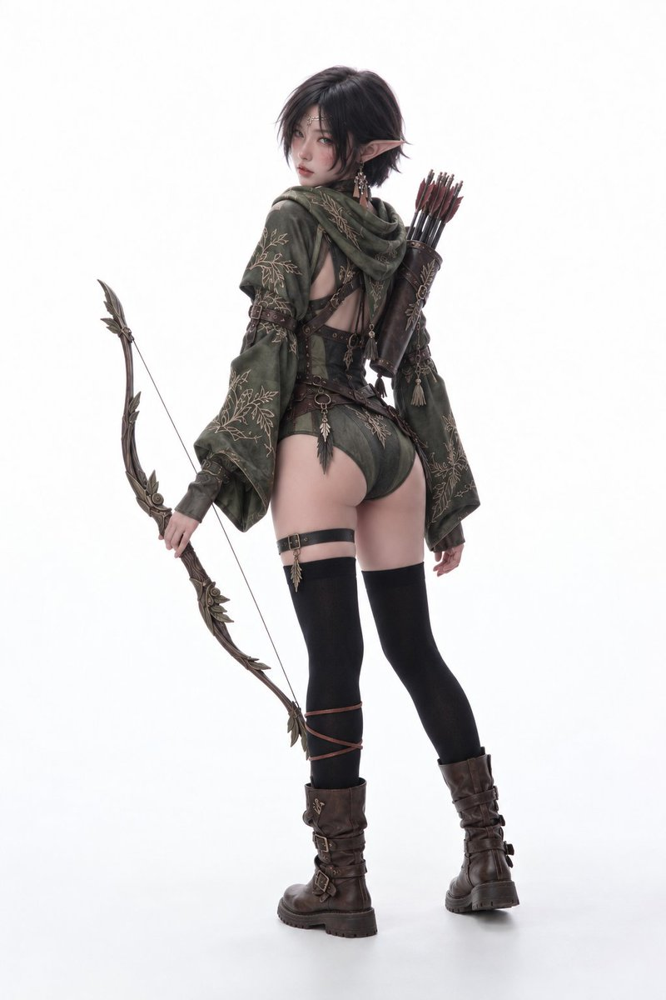

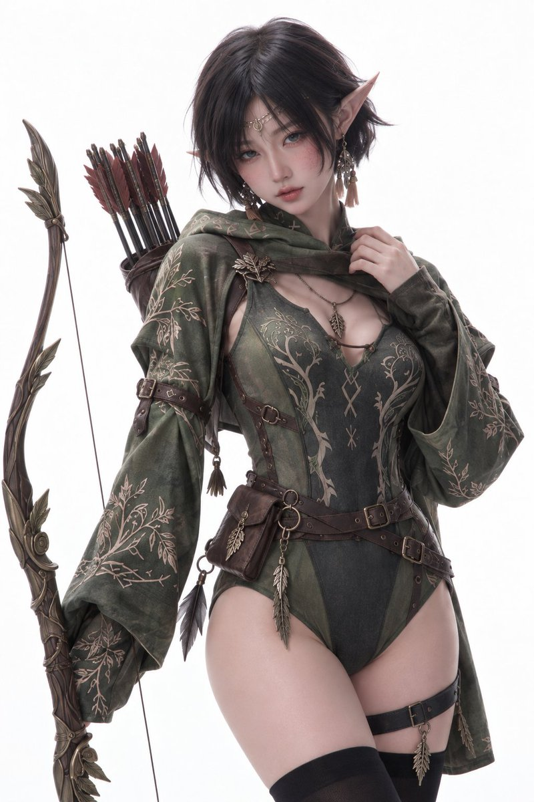

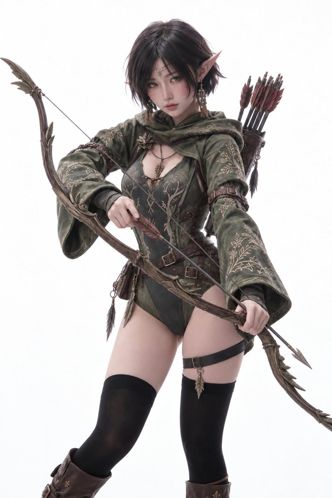

**プロンプト**

```text
添付の画像を撮影プランのリファレンスとして使用してください。露出関係、光の方向、衣服の質感、構図のリズムを維持し、キャラクターとテーマのカラーリングを再デザインしてください。人物は成人とし、リファレンスの顔を複製しないでください。生成後、元画像と照合して確認してください：無断で照明を変更したり、服を厚着にしたり、肌を過剰に滑らかにレタッチしたりしていませんか？
```

[↑ カテゴリに戻る](#catalog)

---

<a name="prompt-2097533103376081383"></a>

### グランジ感のある壁を背景に、サングラスとデニムジャケットを着たスタイリッシュな若い男性が「シー」のジェスチャーをするファッションポートレート。

作者：[@Aiwithamirr1](https://x.com/Aiwithamirr1) · [元の投稿](https://x.com/Aiwithamirr1/status/2097533103376081383)

ポートレート / セルフィー · キャラクター · ファッションアイテム · 配信済み

**概要:** グランジ感のある壁を背景に、サングラスとデニムジャケットを着たスタイリッシュな若い男性が「シー」のジェスチャーをするファッションポートレート。

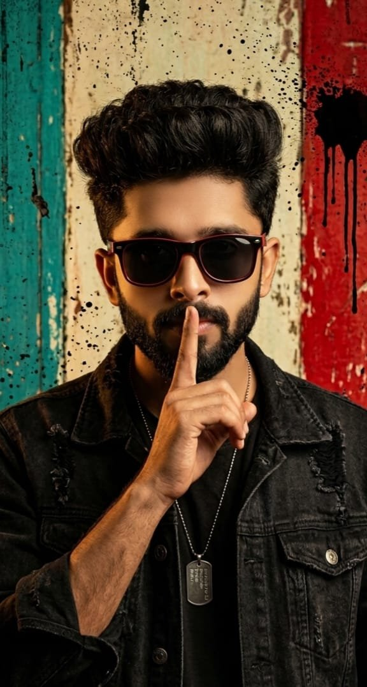

**プロンプト**

```text
ボリュームのある豊かなダークヘアと綺麗に整えられたあごひげを持つスタイリッシュな若い男性の、映画のような超リアルなファッションポートレートを作成してください。彼は赤フレームの黒いサングラス、黒のTシャツ、ダメージ加工のブラックデニムジャケット、金属製のドッグタグネックレスを身に着けています。唇に指を一本縦に当て、自信に満ちた「シー」のジェスチャーをしています。ドラマチックな温かみのあるスタジオ照明、シャープな顔のディテール、強いコントラスト、無骨なストリートウェアの美学。背景には、大胆なティール、クリーム、赤の縦方向のペイントセクション、重厚なグランジテクスチャ、ペンキスプラッター、黒い垂れ落ちるペンキが施されたダメージ感のあるヴィンテージの壁が特徴です。中央構図、ウエストアップのポートレート、エディトリアルファッション写真、高ディテール、リアルな肌の質感、浅い被写界深度、4K、ムーディーでスタイリッシュ、ポスタークオリティ。
```

[↑ カテゴリに戻る](#catalog)

---

<a name="prompt-2097543193651007508"></a>

### リファレンスポートレートを基に、顔のクローズアップ分析、カラースウォッチ、体系化されたメイクアップステップを備えた、プロ仕様の9:16韓国美容雑誌風「メイク分析ガイド」インフォグラフィックを作成するための詳細なプロンプト。

作者：[@ayzalnooor24521](https://x.com/ayzalnooor24521) · [元の投稿](https://x.com/ayzalnooor24521/status/2097543193651007508)

インフォグラフィック / 教育ビジュアル · ポートレート / セルフィー · 配信済み

**概要:** リファレンスポートレートを基に、顔のクローズアップ分析、カラースウォッチ、体系化されたメイクアップステップを備えた、プロ仕様の9:16韓国美容雑誌風「メイク分析ガイド」インフォグラフィックを作成するための詳細なプロンプト。

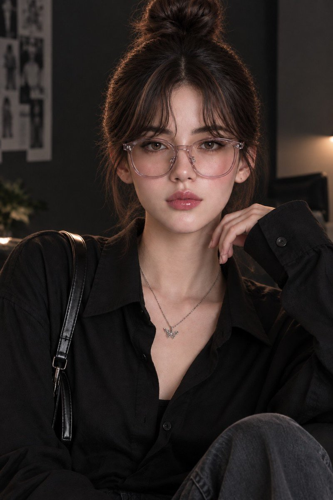

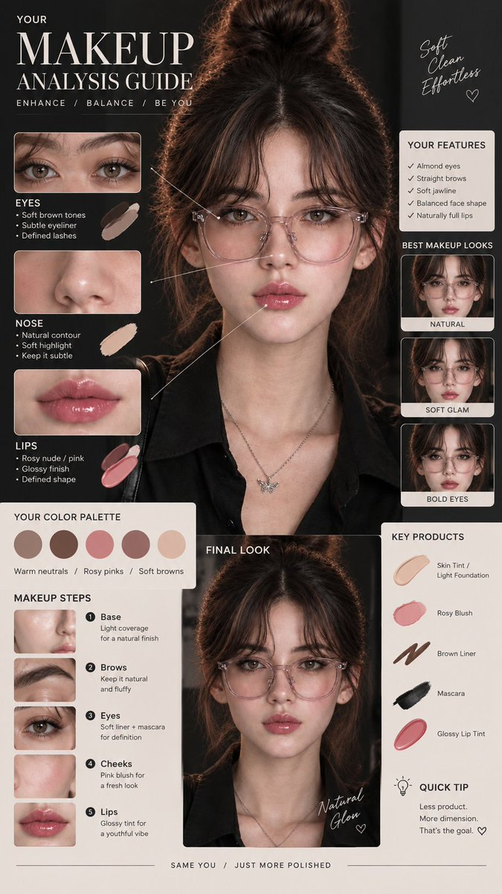

**プロンプト**

```text
柔らかく自然な顔立ちの美しい韓国人女性。黒の衣装に透明なメガネをかけ、クリーンでモダンなビューティーエディトリアルルックにスタイリングされている。アップロードされたポートレートをメインの視覚的リファレンスとして使用し、プロ仕様の「MAKEUP ANALYSIS GUIDE」インフォグラフィックを作成。過度なレタッチを避け、元の顔立ち、ヘアスタイル、肌のキメ、メガネ、自然な識別性を維持する。洗練されたクローズアップ詳細パネルと繊細な引き出し線で、目元、眉、鼻、頬、そしてツヤのあるピンクリップを強調する。小さなコスメスウォッチとともに、洗練されたウォームニュートラル、ロージーピンク、ソフトブラウンのメイクアップカラーパレットを追加する。「Makeup Steps」、「Best Makeup Looks」、「Key Products」、「Quick Tips」の簡潔なセクションを含め、最小限の読みやすいテキストを配置する。洗練されたタイポグラフィ、柔らかいベージュのアクセント、ダークなエディトリアル背景、バランスの取れた余白を持つ、プレミアムな韓国美容雑誌のエステティックを採用する。最終的な構図を洗練され、洗練度が高く、フォトリアリスティックで、9:16の垂直フォーマットとし、全体的に「Same You, Just More Polished」という印象を与えるように仕上げる。
```

[↑ カテゴリに戻る](#catalog)

---

<a name="prompt-2096914920915001598"></a>

### 日当たりの良いガーデンバルコニーのテラスで、グレーのスウェットとジーンズを着て座る若い東アジア人女性のスマートフォンのスナップ写真。

作者：[@Aqsahere\_](https://x.com/Aqsahere_) · [元の投稿](https://x.com/Aqsahere_/status/2096914920915001598)

キャラクター · 配信済み

**概要:** 日当たりの良いガーデンバルコニーのテラスで、グレーのスウェットとジーンズを着て座る若い東アジア人女性のスマートフォンのスナップ写真。

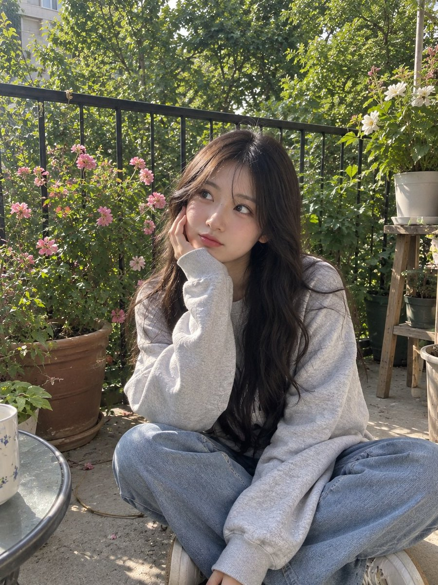

**プロンプト**

```text
バルコニーのガーデンテラスで心地よさそうにあぐらをかいて座る、若い東アジア人女性の完全に自然でフォトリアリスティックなスマートフォンのスナップ写真。肩や体の前に自然に垂れ下がる、ナチュラルウェーブのダークブラウンのロングヘア。柔らかな髪の毛一本一本が自然に揺れています。繊細でリアルな顔立ちに、ナチュラルな薄化粧と本物の肌の質感を備えています。
彼女はゆったりとした着心地の良いライトグレーのスウェットシャツに、リラックスフィットのライトブルーのジーンズを着用しています。気取らず自然に座り、片手を頬にそっと添えながら、少し斜め上を見上げています。どこか少し拗ねたようなキュートで物思いにふけるような表情で、まるで静かでポーズをとっていない瞬間を切り取ったかのようです。
彼女は青々とした植物、葉の茂った鉢植え、そして小さく咲くピンクの花に囲まれた、明るい色の屋外テラスの床に座っています。背後にはシンプルな黒の金属製バルコニー手すりがあり、背景には鬱蒼とした木々と自然の緑が広がっています。穏やかでプライベート感があり、日常のリアルなガーデンバルコニーのような雰囲気です。
柔らかく暖かい自然光が彼女の顔や衣服に優しく差し込み、リアルで繊細な影を作り出しています。自然な肌の毛穴、本物の髪の質感、リアルなスウェットシャツの生地、信憑性のあるデニムのディテールがはっきりと見て取れます。過度に洗練されたり、作為的にポーズをとったりしているようには見えません。
自然なアイレベルの視点を持つ、本物のカジュアルなスマートフォン写真として撮影。全身が収まる座り姿の構図、縦向きのフレーミングで、被写体はフレームの下寄り中央に配置されています。背景は自然な浅い被写界深度で、柔らかくぼやけつつも明確に認識できます。
超リアルな写真、自然なプロポーション、ありのままの日常の瞬間、韓国風のカジュアルファッションのエステティック、控えめで柔らかな色調、繊細なフィルム粒子、リアルな照明、わずかに不完全なスマホカメラのディテール、4Kリアリズム、美肌フィルター効果なし、過度なレタッチなし。
Negative prompt: cartoon, anime, illustration, CGI, artificial-looking skin, plastic skin, excessive makeup, distorted facial features, extra fingers, malformed hands, extra limbs, incorrect anatomy, unnatural body proportions, stiff pose, oversaturated colors, dramatic studio lighting, blurry face, low resolution, watermark, text, logo.
```

[↑ カテゴリに戻る](#catalog)

---

<a name="prompt-2097157373936935051"></a>

### ゴールデンアワーの屋外カフェで、韓国人女性とヒジャブを身に着けた幼い少女が手描きの落書きに囲まれながらコーヒーを楽しむ様子。

作者：[@Lianaalane](https://x.com/Lianaalane) · [元の投稿](https://x.com/Lianaalane/status/2097157373936935051)

ポートレート / セルフィー · キャラクター · 食品・飲料 · 配信済み

**概要:** ゴールデンアワーの屋外カフェで、韓国人女性とヒジャブを身に着けた幼い少女が手描きの落書きに囲まれながらコーヒーを楽しむ様子。

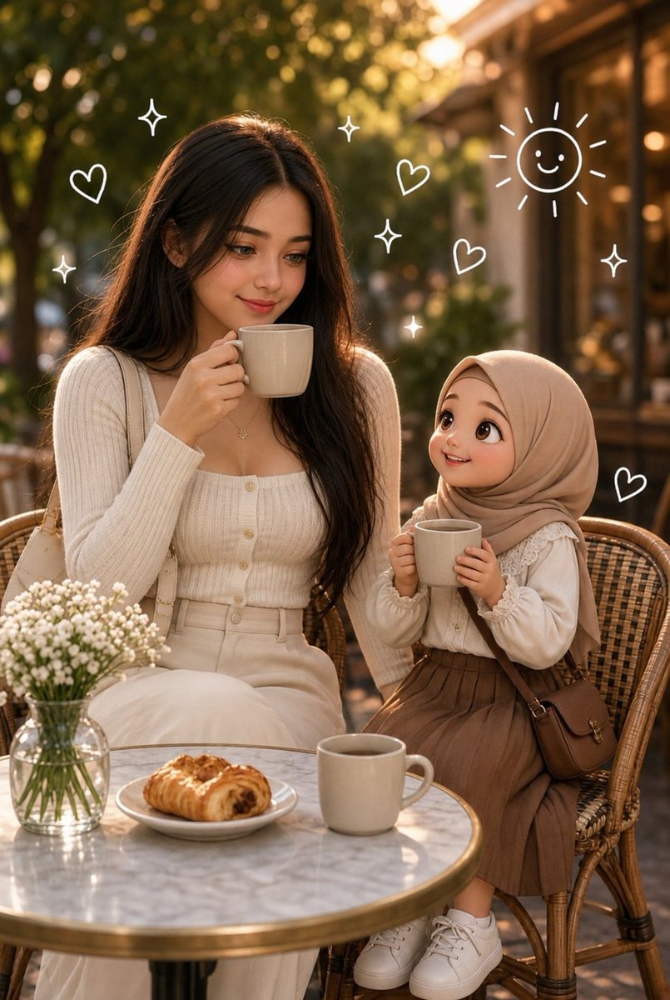

**プロンプト**

```text
柔らかく長いダークブラウンの髪をした韓国人女性が、暖かいゴールデンアワーの居心地の良いオープンカフェに座り、陶器のコーヒーカップを唇の近くにそっと持っています。彼女は体にフィットしたスクエアネックのエレガントなクリーム色のリブカーディガンと、それに合わせたハイウエストのクリーム色のパンツを身に着け、柔らかく上品な装いを演出しています。美しい籐編みの椅子に心地よく座る彼女の肩からは、小さなクリーム色のショルダーバッグが自然に掛けられています。彼女の隣には、ベージュのヒジャブ、繊細なレースがあしらわれた控えめなクリーム色のブラウス、揺れるブラウンのスカートを身にまとった可愛い幼い女の子が座っています。その少女も温かいカップを持ち、嬉しそうに韓国人女性を見つめています。彼女たちの前には大理石の丸いカフェテーブルがあり、コーヒーが1杯、焼き立てのペストリー、可憐な白い花が生けられた小さなガラスの一輪挿しが置かれています。背景には青々とした木々、魅力的なカフェの外観、暖かい陽光、そして美しいシネマティックなボケ味が広がっています。愛らしく夢幻的な雰囲気を演出するために、手描きの繊細な白いハート、輝き、笑顔の太陽を周囲にあしらい、細部まで描き込まれた顔立ち、自然な表情、柔らかな照明、フォトリアリスティックな品質、そして居心地の良い美学を備えています。
```

[↑ カテゴリに戻る](#catalog)

---

[Leadde.ai を見る →](https://leadde.ai/?utm_source=github&utm_medium=readme&utm_campaign=prompt-library&utm_content=image2.5)
