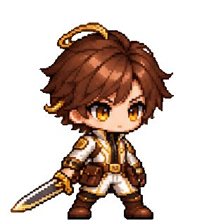

<a name="prompt-2097863751471157498"></a>

### 基于参考图生成正方形4×4排列、共16帧的2D连续动作像素精灵表（Sprite Sheet），保持角色比例、基线一致，包含待机、蓄力、释放和收势的无缝循环动作指令。

作者：[@derek\_wall90176](https://x.com/derek_wall90176) · [查看 X 原帖](https://x.com/derek_wall90176/status/2097863751471157498)

游戏素材 · 像素艺术 · 角色 · 已推流

**概括:** 基于参考图生成正方形4×4排列、共16帧的2D连续动作像素精灵表（Sprite Sheet），保持角色比例、基线一致，包含待机、蓄力、释放和收势的无缝循环动作指令。



**提示词**

```text
上传图1作为角色身份与服装的唯一参考。

将图1角色转化为高质量2D像素游戏角色，生成一张正方形、4×4等分排列、共16帧的连续动作Sprite Sheet。

每格尺寸完全一致。画面按从左到右、从上到下的顺序播放。

严格保留角色的脸型、发型、体型、服装配色、标志性配件与武器结构。16帧使用相同的像素比例、角色尺寸、朝向和色板。

角色完成一次【挥剑攻击／跳跃／翻滚／施法／扑击】动作。

第1至3帧为待机与蓄力；第4至7帧为重心移动和动作展开；第8至10帧完成主要攻击与力量释放；第11至13帧表现惯性和收势；第14至16帧回到待机状态。第16帧与第1帧能够自然衔接。

相邻帧只改变完成动作所需的关节、轮廓、衣摆、头发和武器位置。动作方向、受力关系和运动轨迹保持连续。

所有格子保持相同机位、角色缩放、脚底基线和画面中心。角色完整显示，不裁切头部、武器、尾巴或特效。

背景优先使用透明通道。透明背景不稳定时，改用统一纯色背景，方便后期抠图。不要生成场景、地面纹理、格线、编号和文字。

采用清晰硬边像素、有限色板和统一像素密度。禁止模糊边缘、抗锯齿、半写实渲染、重复帧、跳帧、角色变形、服装变化、武器增减、视角切换和每格重新构图。
```
