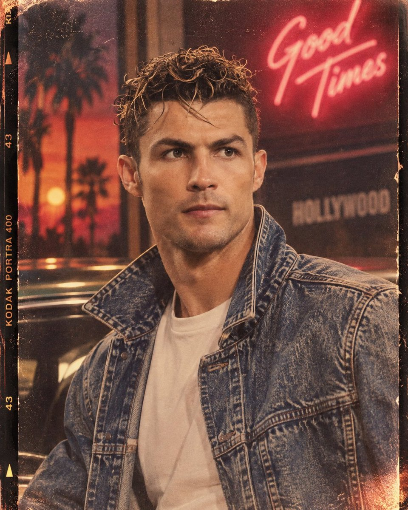
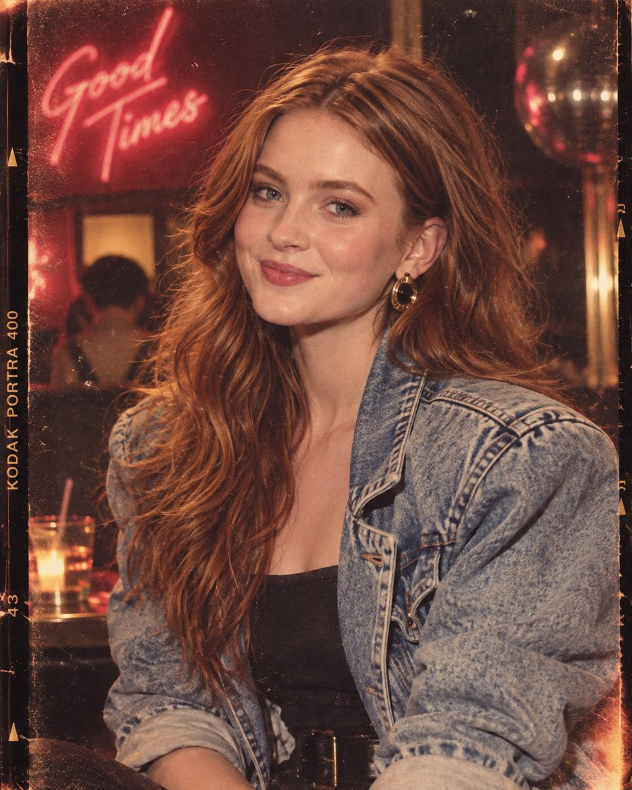
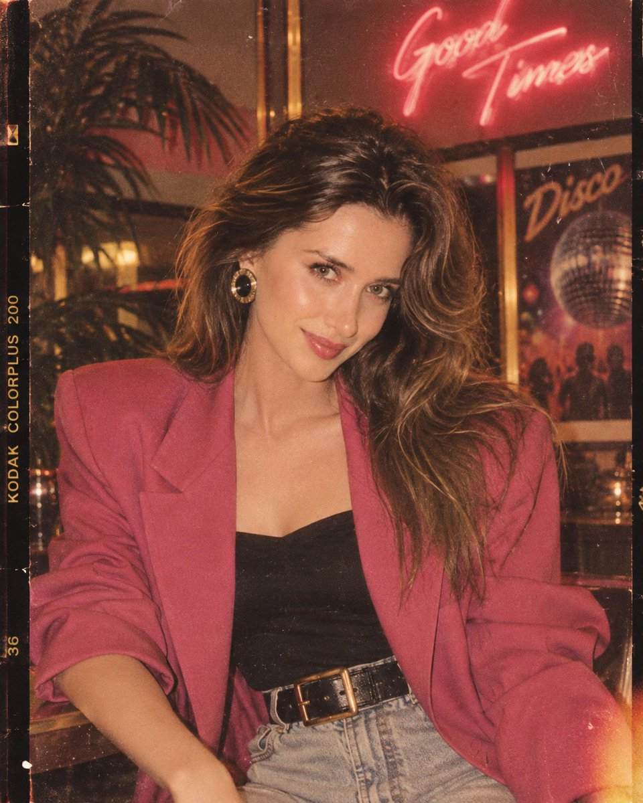
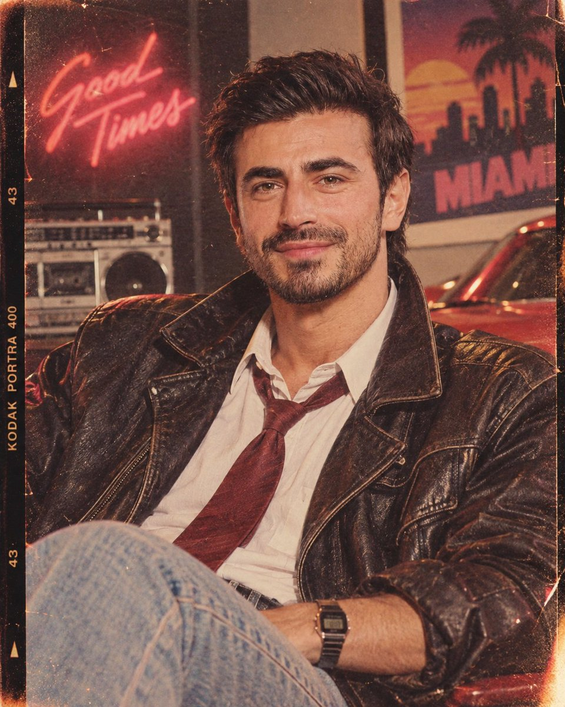

<a name="prompt-2097954772586557873"></a>

### 采用参考人物身份的1980年代复古肖像提示词，具有35毫米胶片美学、复古时尚与霓虹环境微光。

作者：[@Goodmanprotocol](https://x.com/Goodmanprotocol) · [查看 X 原帖](https://x.com/Goodmanprotocol/status/2097954772586557873)

摄影 · 复古 / 怀旧 · 人像 / 自拍 · 时尚单品 · 已推流

**概括:** 采用参考人物身份的1980年代复古肖像提示词，具有35毫米胶片美学、复古时尚与霓虹环境微光。









**提示词**

```text
创作一张地道的1980年代复古肖像，采用4:5垂直画幅比例，以提供的人物为精确的面部参考。高度准确地保留其身份、面部结构、可辨识特征、肤色以及自然表情——不要改变或美化面部。

为拍摄对象换上经典的1980年代发型和时尚且符合时代背景的服装，具有鲜明的轮廓剪裁、真实的质感以及随性自然的复古姿态。构图要自然并富有强烈的时尚大片感，始终将拍摄对象作为明确的视觉焦点。

如同使用35毫米胶片相机拍摄一般捕捉画面，带有逼真的胶片颗粒、细腻的尘埃与纹理、柔和的质感、自然的皮肤细节、轻微的色彩褪色以及真实的胶片瑕疵。运用温暖的怀旧调色、柔和的霓虹高光、微妙的环境微光以及机顶直闪，营造出具有标志性1980年代照片的独特风貌。

保持灯光具有电影感但又不失真实度，拥有柔和的阴影、逼真的高光、自然的对比度以及略带瑕疵的胶片曝光。最终成片应感觉像是真正在1980年代拍摄的——而非数字重制，洋溢着永恒、怀旧、时尚且毫不费力的酷炫氛围。
```
