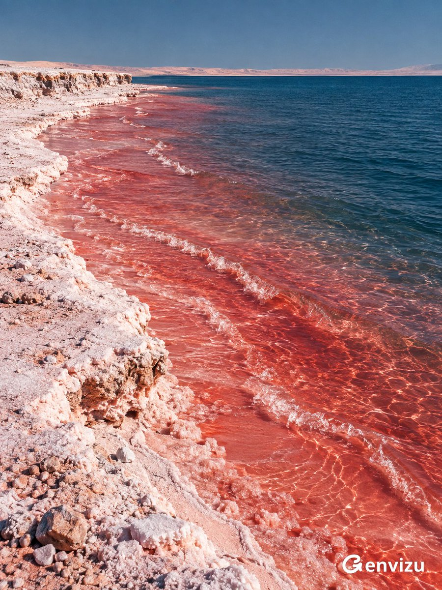

<a name="prompt-2098277612053561383"></a>

### 粉白盐岸与珊瑚红至深蓝渐变海水的超现实艺术摄影。

作者：[@listudio](https://x.com/listudio) · [查看 X 原帖](https://x.com/listudio/status/2098277612053561383)

摄影 · 风景 / 自然 · 已推流

**概括:** 粉白盐岸与珊瑚红至深蓝渐变海水的超现实艺术摄影。



**提示词**

```text
创作一张 3:4 竖屏超现实彩色艺术摄影。空旷海岸没有人物，上方四分之一是均匀灰钴蓝天空，一条极细浅粉远岸横贯高位地平线。粉白盐质岸壁从左侧延伸至下方前景，粗糙晶粒、松散砂砾与自然侵蚀边缘清晰可见，岸线形成舒缓不对称弧线。近岸浅水呈浓郁珊瑚红、朱红与粉红，几道纤细碎浪斜向右下方推进，逐渐过渡到右侧深普鲁士蓝海水；水具有真实透明度、细密波纹和反光，不像颜料或熔岩。晴日侧光，粉白高光保留细节，干净大色块与真实微观纹理对照，细腻胶片颗粒、哑光印刷观感，安静陌生、炽热而清冷。满版摄影，无文字、边框、logo或水印。
```
