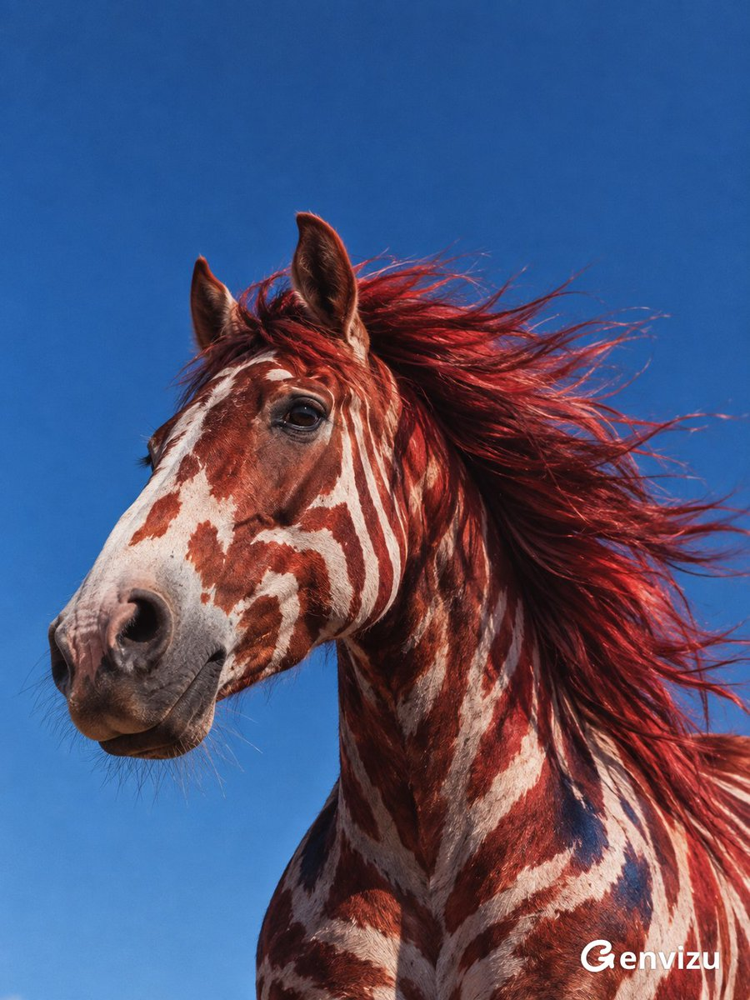

<a name="prompt-2098277688498880901"></a>

### 超现实红毛斑纹马匹肖像摄影，纯净蓝天背景。

作者：[@listudio](https://x.com/listudio) · [查看 X 原帖](https://x.com/listudio/status/2098277688498880901)

摄影 · 人像 / 自拍 · 摘要 / 背景 · 已推流

**概括:** 超现实红毛斑纹马匹肖像摄影，纯净蓝天背景。



**提示词**

```text
创作一张 3:4 竖屏超现实动物肖像艺术摄影。低机位拍摄健壮花斑马的头部、颈部与肩胸，身体在底部及右侧自然裁切，马头位于中下部向左转为四分之三侧面，双耳自然竖立，深黑湿润眼睛有微小反光。上方三分之一留无云纯净钴蓝天空。毛色精细超现实换色，主体浓郁砖红和珊瑚红，鼻梁至口鼻大块粉白不规则斑纹，肩胸红白斑间少量深蓝。长鬃毛被从右吹来的强风向左舒展，细长发丝交叠，亮红发丝与深酒红阴影交织，局部垂落颈部。短毛、鼻孔、胡须和肌肉细节真实。明亮自然侧光，浓密有层次暗部，凝固瞬间的清晰摄影，轻微胶片颗粒和哑光色调，野性自由鲜明的时尚编辑感。无马具、人物、文字、logo或水印。
```
