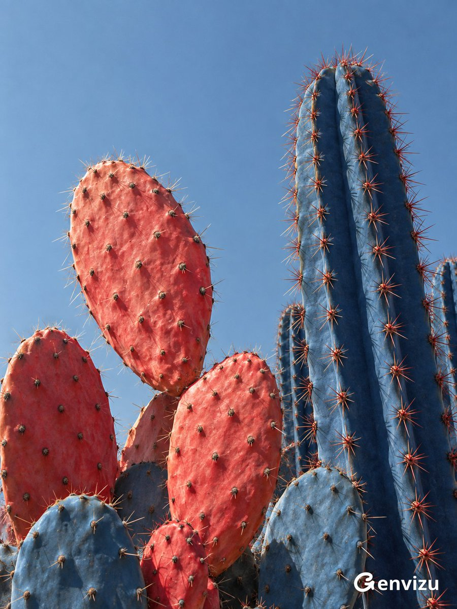

<a name="prompt-2098277762410942530"></a>

### 红蓝撞色超现实仙人掌植物摄影，包含扁平珊瑚红仙人掌与深钴蓝柱状仙人掌。

作者：[@listudio](https://x.com/listudio) · [查看 X 原帖](https://x.com/listudio/status/2098277762410942530)

摄影 · 已推流

**概括:** 红蓝撞色超现实仙人掌植物摄影，包含扁平珊瑚红仙人掌与深钴蓝柱状仙人掌。



**提示词**

```text
创作一张 3:4 竖屏超现实植物艺术摄影。略带灰调无云天蓝天空为背景，仰视真实仙人掌群从底边生长被裁切。左侧至中央三至五片错落椭圆扁平仙人掌，最高一片向左微倾，表皮换色为鲜艳珊瑚红与西瓜红，保留蜡质哑光、细小褶皱起伏、规律但不机械的刺座。右侧高大深钴蓝柱状仙人掌，竖向肋脊鲜明，沟槽深普鲁士蓝，沿肋缘排列朱红星状针刺。底部少量蓝色扁掌与红色小掌交叠，层次清楚，上方左侧留天空间隙。左上强烈自然日光照出植物体积针刺；鲜艳色彩附着于可信植物组织。几何雕塑般非对称构图，精细摄影纹理、轻微胶片颗粒、克制哑光，避免塑料与三维渲染感。无花盆花朵文字logo水印。
```
