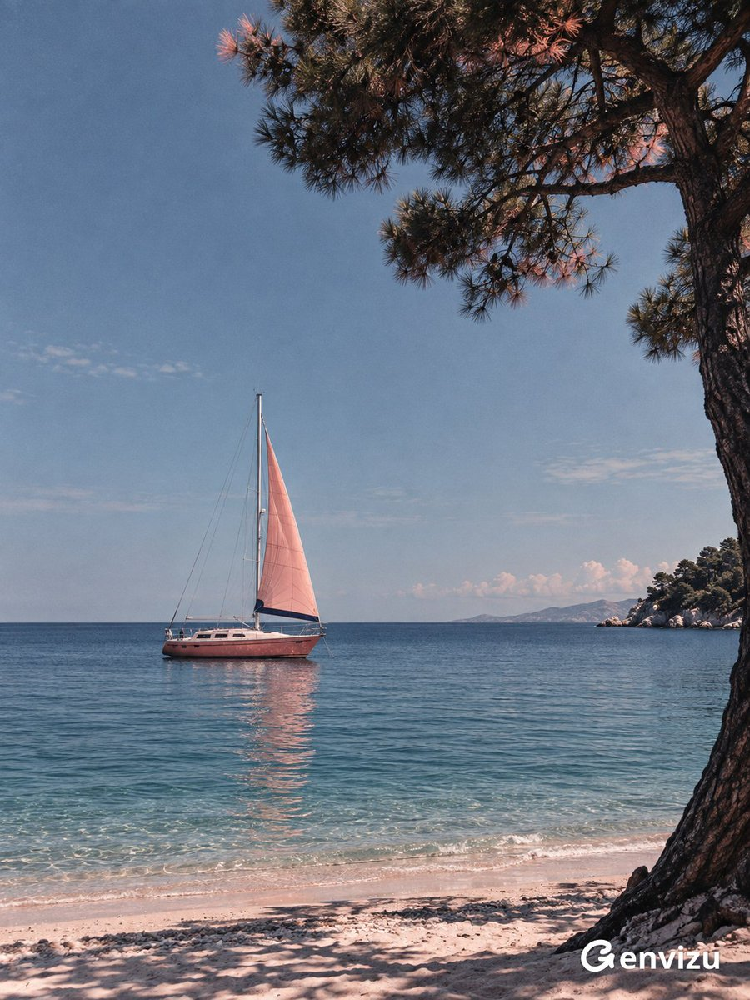

<a name="prompt-2098277829154951371"></a>

### 宁静无人海湾中停泊着珊瑚粉色帆船，右侧有松树掩映的不对称海滨艺术摄影。

作者：[@listudio](https://x.com/listudio) · [查看 X 原帖](https://x.com/listudio/status/2098277829154951371)

摄影 · 车辆 · 已推流

**概括:** 宁静无人海湾中停泊着珊瑚粉色帆船，右侧有松树掩映的不对称海滨艺术摄影。



**提示词**

```text
创作一张 3:4 竖屏海滨艺术摄影。宁静无人海湾，晴朗灰蓝天空占上方七成，笔直深蓝海平线位于下方。一艘真实小型单体帆船停在中下部略偏左，细长桅杆伸入天空，珊瑚粉三角帆轻微鼓起，帆布缝线张力可信，帆底深蓝窄条，船舱粉白、窗户深黑、下船壳珊瑚红，细索具合理。平静青蓝水面有细密水平波纹与柔碎粉色倒影。右侧深色松树不对称框景，树干从右下长起，树冠由右上伸入，针叶少量暗红粉色日光高光，保留大片天空。最底部一条粉白细沙海滩与淡淡树影。真实船体树皮针叶海水，清晰日光、深沉阴影、轻微胶片颗粒、低调哑光印刷质感，色彩超现实而空间可信，安静悠长，梦境疏离。无人物文字logo水印。
```
