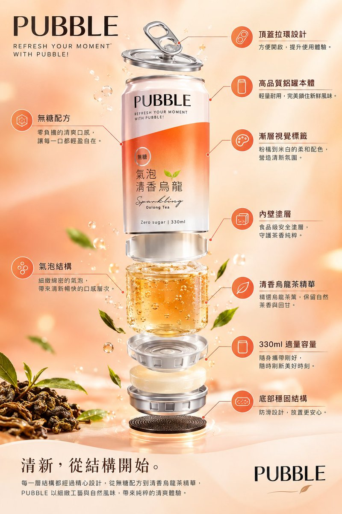
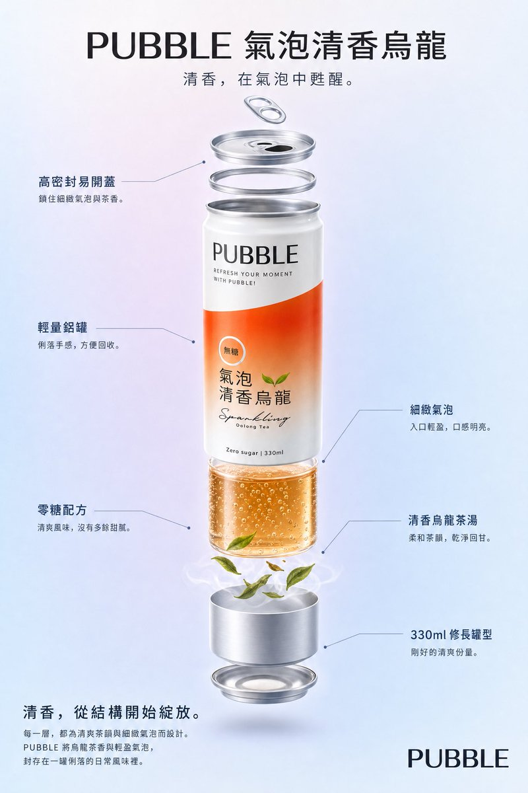

<a name="prompt-2098363788928143624"></a>

### 气泡乌龙茶饮料罐的爆炸图产品海报结构化提示词。

作者：[@luo24853969](https://x.com/luo24853969) · [查看 X 原帖](https://x.com/luo24853969/status/2098363788928143624)

产品营销 · 海报 / 传单 · 产品 · 已推流

**概括:** 气泡乌龙茶饮料罐的爆炸图产品海报结构化提示词。





**提示词**

```text
{
  "type": "爆炸图产品海报",
  "subject": "气泡茶饮料罐",
  "style": "干净高科技3D渲染、棚拍灯光、微发光细节",
  "background": "柔和粉橘与浅米色渐变",
  "header": {
    "logo": "PUBBLE",
    "subtitle": "REFRESH YOUR MOMENT WITH PUBBLE!"
  },
  "layout": {
    "centerpiece": "垂直堆叠爆炸图，完整展示气泡乌龙茶罐的9个结构层次：外层铝罐本体、顶盖拉环、印刷标签层、内壁涂层、气泡液体本体、底部凹槽结构、无糖配方核心、清香乌龙茶精华层、底部防滑设计。",
    "callout_labels": {
      "count": 8,
      "left_side": [
        "无糖配方\n零负担的清爽口感，让每一口都轻盈自在。",
        "气泡结构\n细致绵密的气泡，带来清新畅快的口感层次。",
        "清香乌龙茶精华\n精选乌龙茶叶，保留自然茶香与回甘。"
      ],
      "right_side": [
        "高质量铝罐本体\n轻量耐用，完美锁住新鲜风味。",
        "顶盖拉环设计\n方便开启，提升使用体验。",
        "渐变视觉标签\n粉橘到米白的柔和配色，营造清新氛围。",
        "330ml 适量容量\n随身携带刚好，随时刷新美好时刻。",
        "底部稳固结构\n防滑设计，放置更安心。"
      ]
    },
    "footer": {
      "left_text_block": {
        "headline": "清新，从结构开始。",
        "body": "每一层结构都经过精心设计，从无糖配方到清香乌龙茶精华，PUBBLE 以细致工艺与自然风味，带来纯粹的清爽体验。"
      },
      "right_logo": "PUBBLE"
    }
  }
}
```
