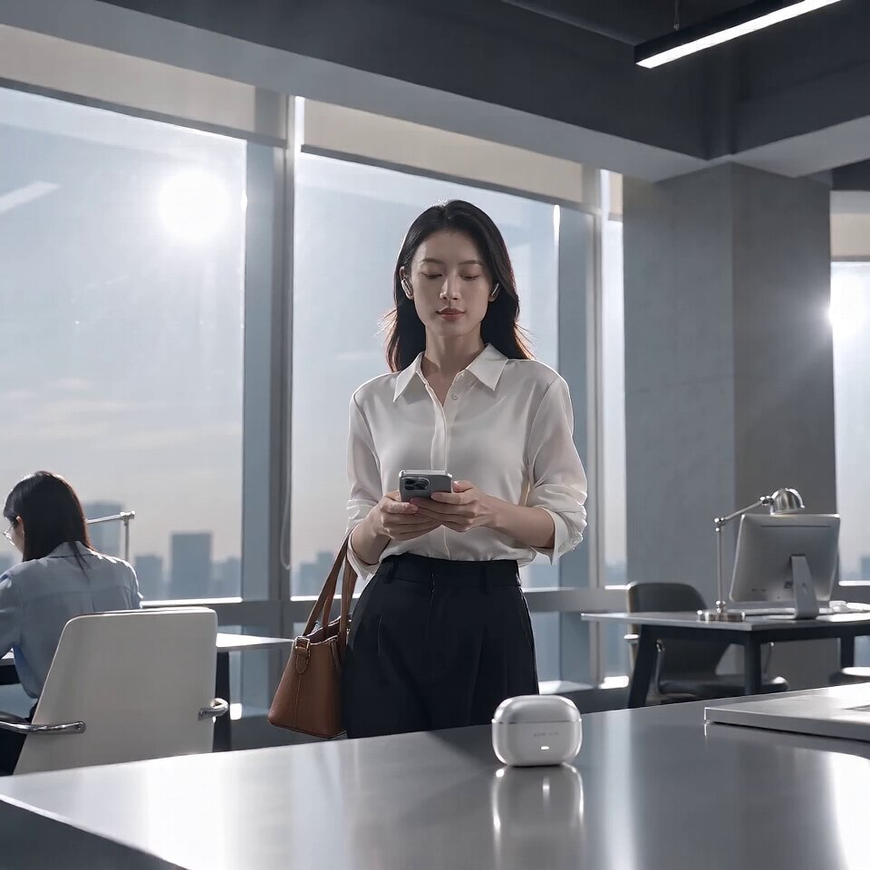

<a name="prompt-2098400287262470292"></a>

### 10秒高端无线耳机商业广告分镜提示词，展现现代都市职场女性在办公场景下的产品佩戴与使用过程。

作者：[@Adam38363368936](https://x.com/Adam38363368936) · [查看 X 原帖](https://x.com/Adam38363368936/status/2098400287262470292)

漫画 / 故事板 · 产品营销 · 角色 · 产品 · 城市风光 / 街道 · 已推流

查看 X 原帖：[@Adam38363368936](https://x.com/Adam38363368936) · [查看 X 原帖](https://x.com/Adam38363368936/status/2098318586859377102)

**概括:** 10秒高端无线耳机商业广告分镜提示词，展现现代都市职场女性在办公场景下的产品佩戴与使用过程。



**提示词**

```text
以参考图中的 AEROX ONE 无线蓝牙耳机和充电盒为唯一产品参考，严格保持耳机造型、比例、银灰色金属与磨砂白色材质、充电盒圆润轮廓、品牌字样、开孔位置、结构关系一致，不得重新设计，不得变形，不得出现多余产品。

制作一条 10 秒高端消费电子品牌广告片，加入一位年轻亚洲女性作为都市生活方式女主角。女主角气质干净、利落、克制，穿简洁白衬衫或浅灰色西装外套，自然妆感，真实皮肤质感，整体具有现代都市职业女性气质。人物只承担生活方式与氛围表达，产品始终是视觉核心。

0-2秒：
清晨现代办公空间，落地窗自然光进入室内。女主角走到桌边，将手机和皮质包放下。镜头快速切到桌面上的 AEROX ONE 充电盒，盒盖利落打开，两只耳机清晰出现。镜头节奏干净利落，第一秒就出现产品。

2-4秒：
女主角拿起一只耳机戴入耳中，动作自然、优雅，不夸张。镜头切耳机近景，金属边缘有冷白色高光，耳机与耳朵贴合自然，重点展示产品佩戴后的精致感。背景为虚化办公环境。

4-6秒：
女主角戴着耳机走过现代办公区或咖啡店通道，镜头做一次平滑侧移跟拍。她的状态专注、放松、有掌控感。画面中耳机必须保持清晰可见，不能被头发完全遮挡。整体强调都市通勤、效率感、生活方式感。

6-8秒：
切到她坐在窗边使用笔记本电脑的场景，一只手轻触耳机，像是在切换模式或接听电话。镜头轻微推进，背景城市虚化，产品与人物状态形成高级 lifestyle 广告感。

8-10秒：
快速切回纯产品 hero shot。AEROX ONE 耳机与充电盒放在极简银灰色桌面上，背景柔和虚化，女主角远景离焦作为环境氛围。镜头逐渐减速并停住，耳机与充电盒成为画面唯一清晰主体，形成高端消费电子品牌广告结尾。

整体风格：
高端、现代、科技、都市、克制、真实，像国际消费电子品牌 campaign。
画面必须有真实商业摄影质感，真实光学镜头，精确透视，产品边缘锐利，银灰色金属与磨砂白材质真实自然。
节奏要有明显变化，避免全程慢镜头。
人物动作自然，避免摆拍感，避免过度微笑，避免夸张表情。

重点要求：
产品外观保持一致。
耳机在人物耳中必须结构正常、比例真实。
女主角头发不能遮住耳机。
不要增加第二套耳机。
不要产品变形。
不要过度科幻特效。
不要霓虹赛博朋克。
不要大段字幕。
不要手部畸形。
不要人物抢产品主体。
不要水印。
```
