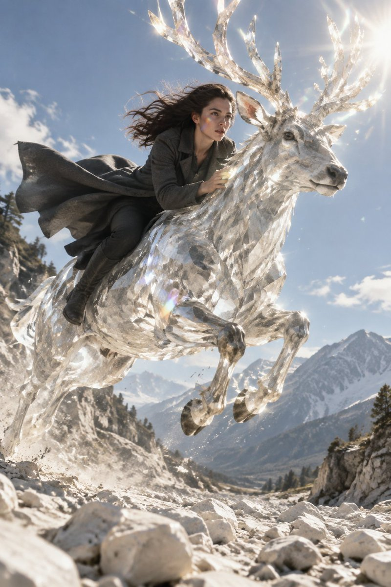
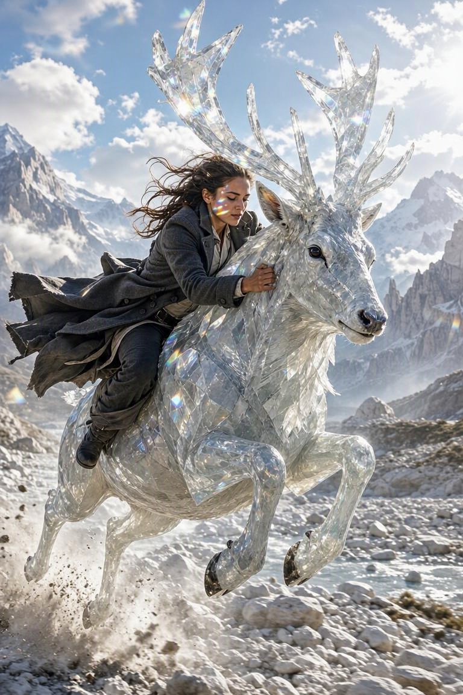

<a name="prompt-2098866288957551034"></a>

### 一张逼真写实的大片剧照，在强烈的烈日下，一名身穿炭灰色骑马大衣的女子骑在一只活体石英雄鹿背上跃过干涸的石河。

作者：[@TraffAlex](https://x.com/TraffAlex) · [查看 X 原帖](https://x.com/TraffAlex/status/2098866288957551034)

摄影 · 角色 · 已推流

**概括:** 一张逼真写实的大片剧照，在强烈的烈日下，一名身穿炭灰色骑马大衣的女子骑在一只活体石英雄鹿背上跃过干涸的石河。





**提示词**

```text
逼真写实的大片剧照。一名身穿炭灰色骑马大衣的女子紧抱一只雄鹿的脖颈，雄鹿的身躯由活体石英构成，鹿角如同一盏由分叉尖端构成的吊灯，折射出白昼的粼粼碎光。它们正凌空跃过一条由白色鹅卵石构成的干涸河流，蹄子尚未落地，她的大衣如旗帜般飞扬。强烈的烈日，棱镜般的彩虹光晕洒在她的脸颊上。调色板：石英色、炭灰色、天光漂白色，以及她温热如血的皮肤肌理。极具动感，无马鞍枪，没有暴力——唯有速度。35毫米，2:3宽高比。
```
